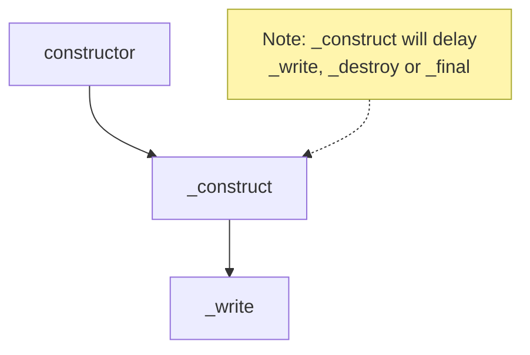
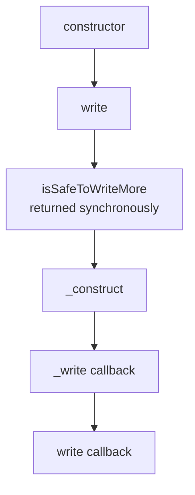
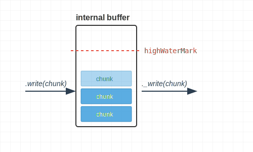
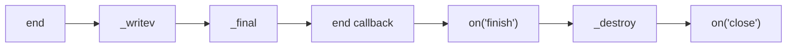
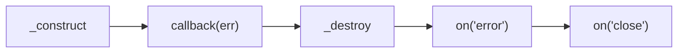
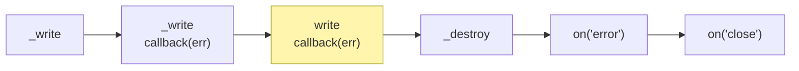

## 生命週期 1：constructor 與初始化

先來個範例，包含 `constructor`, `_construct` 跟 `_write`，各位覺得執行順序是什麼呢？

```ts
import { Writable, WritableOptions } from "stream";

class MyWritable extends Writable {
  constructor(opts?: WritableOptions) {
    super(opts);
    console.log(performance.now(), "constructor");
  }
  _construct(callback: (error?: Error | null) => void): void {
    console.log(performance.now(), "_construct");
    // 模擬 async 操作，例如：建立 TCP 連線
    setTimeout(callback, 1000);
  }
  _write(
    chunk: any,
    encoding: BufferEncoding,
    callback: (error?: Error | null) => void,
  ): void {
    // 模擬寫入延遲
    setTimeout(() => {
      console.log(performance.now(), chunk);
      callback();
    }, 100);
  }
}

const myWritable = new MyWritable();
myWritable.write("123");

// Prints
// 650.24275 constructor
// 650.622958 _construct
// 1754.264416 <Buffer 31 32 33>
```

執行順序如下：



## 生命週期 2：寫入資料

我曾經以為寫入資料就是一直 `write` 下去就好

```ts
const myWritable = getWritableStreamSomehow();
myWritable.write("123");
myWritable.write("456");
```

但如果仔細查看 [`write`](https://nodejs.org/api/stream.html#writablewritechunk-encoding-callback) 跟 [`_write`](https://nodejs.org/api/stream.html#writable_writechunk-encoding-callback) 的描述的話，會發現 backpressure 跟 highWaterMark 這兩個名詞一直被提到

我們先來看看 `write` 的 `callback` 何時會被觸發

```ts
import { Writable, WritableOptions } from "stream";

class MyWritable extends Writable {
  constructor(opts?: WritableOptions) {
    super(opts);
    console.log(performance.now(), "constructor");
  }
  _construct(callback: (error?: Error | null) => void): void {
    console.log(performance.now(), "_construct");
    // 模擬 async 操作，例如：建立 TCP 連線
    setTimeout(callback, 1000);
  }
  _write(
    chunk: any,
    encoding: BufferEncoding,
    callback: (error?: Error | null) => void,
  ): void {
    // 模擬寫入延遲
    setTimeout(() => {
      console.log(performance.now(), chunk);
      callback();
    }, 100);
  }
}

const myWritable = new MyWritable();
const isSafeToWriteMore = myWritable.write("123", () =>
  console.log(performance.now(), "data is flushed"),
);
console.log(performance.now(), { isSafeToWriteMore });

// Prints
// 750.2246 constructor
// 750.8683 { isSafeToWriteMore: true }
// 751.1718 _construct
// 1875.7623 <Buffer 31 32 33>
// 1876.2586 data is flushed
```

時間軸如下



1. 根據 [`readable._construct`](https://nodejs.org/api/stream.html#readable_constructcallback) 的描述，`constructor` 執行完後，`process.nextTick` 才會執行 `_construct`，所以 `write` 的回傳值 `isSafeToWriteMore` 會先印出來。雖然 `writable._construct` 的官方文件沒有描述到這個行為，但基本上兩者的概念是相通的
2. `_construct` 完成後（執行 `_construct` 的 `callback`），代表可以開始 `_write`
3. `_write` 完成後（執行 `_write` 的 `callback`），代表可以開始 `write` 的 `callback`

只能讚嘆 Node.js 的 Event-driven architecture 設計真的很精妙，大量的利用 `callback` 把各種 async 事件串連起來

但 Node.js 是怎麼判斷 `isSafeToWriteMore` 呢？這邊就會帶到 backpressure 跟 highWaterMark 這兩個名詞了

## 記憶體管理：backpressure 與 highWaterMark

在 create instance 的階段可以指定 highWaterMark，單位是 bytes

```ts
const myWritable = new MyWritable({ highWaterMark: 1024 });
```

從上面 [MyWritable](#生命週期-1constructor-與初始化) 的程式碼範例

- 我們在 `_write` 每 100ms 才能消化一個 chunk
- 但 `write` 本身是同步的 function，可以無限制地呼叫
- 為了避免記憶體耗盡，就必須實作一個 "高水位線"



回到 `isSafeToWriteMore`，Node.js 在 `write` 的當下，就可以判斷接下來要寫入的 chunk 是否會頂到 highWaterMark

- 若頂到 highWaterMark，回傳 false
- 反之，則回傳 true

我們試著寫個 PoC 來驗證

```ts
import { Writable, WritableOptions } from "stream";

class MyWritable extends Writable {
  constructor(opts?: WritableOptions) {
    super(opts);
    console.log(performance.now(), "constructor");
  }
  _construct(callback: (error?: Error | null) => void): void {
    console.log(performance.now(), "_construct");
    // 模擬 async 操作，例如：建立 TCP 連線
    setTimeout(callback, 1000);
  }
  _write(
    chunk: any,
    encoding: BufferEncoding,
    callback: (error?: Error | null) => void,
  ): void {
    // 模擬寫入延遲
    setTimeout(callback, 100);
  }
}

const myWritable = new MyWritable({ highWaterMark: 10 });
let isSafeToWriteMore;
isSafeToWriteMore = myWritable.write("12345", () =>
  console.log(performance.now(), "12345 is flushed"),
);
console.log(performance.now(), "12345", {
  writableLength: myWritable.writableLength,
  isSafeToWriteMore,
});
isSafeToWriteMore = myWritable.write("67890", () =>
  console.log(performance.now(), "67890 is flushed"),
);
console.log(performance.now(), "67890", {
  writableLength: myWritable.writableLength,
  isSafeToWriteMore,
});
isSafeToWriteMore = myWritable.write("abcde", () =>
  console.log(performance.now(), "abcde is flushed"),
);
console.log(performance.now(), "abcde", {
  writableLength: myWritable.writableLength,
  isSafeToWriteMore,
});

// Prints
// 645.202834 constructor
// 645.543209 12345 { writableLength: 5, isSafeToWriteMore: true }
// 645.690542 67890 { writableLength: 10, isSafeToWriteMore: false }
// 645.738042 abcde { writableLength: 15, isSafeToWriteMore: false }
// 645.910417 _construct
// 1748.1655 12345 is flushed
// 1850.025125 67890 is flushed
// 1951.147625 abcde is flushed
```

- 第二次 `write("67890")` 剛好頂到 10 bytes 的水位，所以印出 `{ isSafeToWriteMore: false }` 符合預期
- 從 1748 > 1850 > 1951 幾乎都是 100ms 的間隔，得知是依序處理，確保 `write` 跟 `_write` 的寫入順序一致
- 第三次 `write("abcde")` 雖然頂到水位，但還是有被處理，這點是符合預期的，參考 [writable.write](https://nodejs.org/api/stream.html#writablewritechunk-encoding-callback) 的描述

```
While calling write() on a stream that is not draining is allowed, Node.js will buffer all written chunks until maximum memory usage occurs, at which point it will abort unconditionally.
```

`isSafeToWriteMore` 並不是強制性的，為了避免記憶體耗盡，可使用 `on("drain")` 來監聽
:::info
drain 的中文是排水、排洩，在這邊代表 "internal buffer 被清空，可以繼續 write"
:::

```ts
const myWritable = new MyWritable({ highWaterMark: 10 });
myWritable.write("@12345");
myWritable.write("@67890");
console.log(myWritable.writableLength); // 12
console.log(myWritable.writableNeedDrain); // true
myWritable.on("drain", () => {
  console.log(myWritable.writableLength); // 0
  console.log(myWritable.writableNeedDrain); // false
  myWritable.write("@abcde");
});
```

而 backpressure 指的就是這整套機制

1. 當 `write` 生產的速度 > `_write` 消化的速度，導致頂到 highWaterMark
2. 回傳 `{ isSafeToWriteMore: false }`，提醒使用者 "請暫停 `write`"
3. 使用者需手動監聽 `on("drain")`，等到 `_write` 消化完再繼續 `write`

## 效能優化：`cork`, `uncork` 與 `_writev`

cork 的中文是軟木塞，它"塞住"了 `_write` 的執行，目的是為了優化多個 `write` 在短時間寫入造成的 [head-of-line blocking](../http/http-1.1-pipelining-and-hol-blocking.md#pipelining-限制-1-http11-hol-blocking)

❌ Bad Example

```ts
const httpRequestWritable = getWritableSomehow();
myWritable.write("GET / HTTP/1.1");
myWritable.write("\r\n");
myWritable.write("Host: example.com");
myWritable.write("\r\n\r\n");

// ❌ 傳送多個 TCP 封包，若有 HOL Blocking 則會拖慢傳輸時間
// ❗ p.s. 這邊先不探討 Nagle's Algorithm，假設 TCP_NODELAY = true，收到所有 chunk 都會直接傳送
```

✅ Good Example

```ts
const httpRequestWritable = getWritableSomehow();
httpRequestWritable.cork(); // ✅ 先把軟木塞塞起來
httpRequestWritable.write("GET / HTTP/1.1"); // 接著開始批次注水
httpRequestWritable.write("\r\n");
httpRequestWritable.write("Host: example.com");
httpRequestWritable.write("\r\n\r\n");
// https://nodejs.org/api/stream.html#writableuncork
// use process.nextTick allows batching of all writable.write() calls
// that occur within a given Node.js event loop phase.
process.nextTick(() => httpRequestWritable.uncork()); // ✅ 寫入完成後，再把軟木塞拔掉

// ✅ 最終只會傳送一個 TCP 封包，完美避免 HOL Blocking
// ❗ p.s. 這邊先不探討 TCP packet size，假設這些資料都會在同一個 packet 送出
```

而為了優化 Array of chunks 的寫入，Node.js 提供了 [`_writev`](https://nodejs.org/api/stream.html#writable_writevchunks-callback) 讓實作者可以實作，我們直接實作一個 PoC

```ts
import { Writable } from "stream";

class MyWritable extends Writable {
  _writev(
    chunks: Array<{ chunk: any; encoding: BufferEncoding }>,
    callback: (error?: Error | null) => void,
  ): void {
    const rawHttpRequest = chunks
      .map((chunk) => (chunk.chunk as Buffer).toString("utf8"))
      .join("");
    console.log(performance.now(), "_writev", { rawHttpRequest });
    // 模擬寫入延遲
    setTimeout(callback, 100);
  }
}

// 搭配上面的 ✅ Good Example
const myWritable = new MyWritable();
myWritable.cork();
myWritable.write("GET / HTTP/1.1");
myWritable.write("\r\n");
myWritable.write("Host: example.com");
myWritable.write("\r\n\r\n");
process.nextTick(() => myWritable.uncork());

// Prints
// 626.334916 _writev { rawHttpRequest: 'GET / HTTP/1.1\r\nHost: example.com\r\n\r\n' }
```

如果沒有實作 `_writev` 的話，就會 fallback 變成迴圈的呼叫 `_write`，對效能就會影響，參考 [writable.cork](https://nodejs.org/api/stream.html#writablecork) 的描述：

```
However, use of writable.cork() without implementing writable._writev() may have an adverse effect on throughput.
```

另外，`cork` 跟 `uncork` 並不是一個 boolean 狀態，而是 counter 計數器的概念

```ts
const httpRequestWritable = getWritableSomehow();
// 實務上，write 可能會分散在各個 middleware / util function / application logic
(function writeHTTPStartLine() {
  httpRequestWritable.cork();
  httpRequestWritable.write("GET / HTTP/1.1");
  httpRequestWritable.write("\r\n");
  console.log(httpRequestWritable.writableCorked); // 1
})();
// 這個 util function 自行管理了 cork 跟 uncork
(function writeHTTPHeader() {
  httpRequestWritable.cork();
  console.log(httpRequestWritable.writableCorked); // 2
  httpRequestWritable.write("Host: example.com");
  httpRequestWritable.write("\r\n\r\n");
  httpRequestWritable.uncork();
  console.log(httpRequestWritable.writableCorked); // 1
})();
// 最終 counter 計數器歸零，才會呼叫 `_writev`
process.nextTick(() => httpRequestWritable.uncork());
```

## 生命週期 3：結束、關閉

當使用者確定不會再寫入後，就可以使用 [writable.end](https://nodejs.org/api/stream.html#writableendchunk-encoding-callback)

```ts
const httpRequestWritable = getWritableSomehow();
httpRequestWritable.end("GET / HTTP/1.1\r\nHost: example.com\r\n\r\n");
```

也因此 `end` 之後不能再 `write`，否則就會報錯

```ts
const httpRequestWritable = getWritableSomehow();
httpRequestWritable.end("GET / HTTP/1.1\r\nHost: example.com\r\n\r\n");
httpRequestWritable.write("123"); // Error: write after end
```

寫個 PoC 來觀察 `end`, `_final` 跟 `_destroy` 的觸發順序

```ts
import { Writable } from "stream";
import assert from "assert";

class MyWritable extends Writable {
  _construct(callback: (error?: Error | null) => void): void {
    console.log(performance.now(), "_construct");
    // 模擬 async 操作，例如：建立 TCP 連線
    setTimeout(callback, 1000);
  }
  _final(callback: (error?: Error | null) => void): void {
    console.log(performance.now(), "_final");
    // 模擬 async 操作，例如：關閉 TCP 連線
    setTimeout(callback, 1000);
  }
  _destroy(
    error: Error | null,
    callback: (error?: Error | null) => void,
  ): void {
    console.log(performance.now(), "_destroy");
    // 模擬 async 操作，例如：關閉 TCP 連線
    setTimeout(callback, 1000);
  }
  _write(
    chunk: any,
    encoding: BufferEncoding,
    callback: (error?: Error | null) => void,
  ): void {
    console.log(performance.now(), "_write");
    // 模擬寫入延遲
    setTimeout(callback, 100);
  }
  _writev(
    chunks: Array<{ chunk: any; encoding: BufferEncoding }>,
    callback: (error?: Error | null) => void,
  ): void {
    console.log(performance.now(), "_writev");
    // 模擬寫入延遲
    setTimeout(callback, 100);
  }
}

const myWritable = new MyWritable();
myWritable.write("12345");
myWritable.write("67890");
myWritable.end("abcde", () => console.log(performance.now(), "end callback"));
assert(myWritable.writable === false);
assert(myWritable.writableEnded === true);
myWritable.on("finish", () => {
  assert(myWritable.writableFinished === true);
  console.log(performance.now(), "on('finish')");
});
myWritable.on("close", () => {
  assert(myWritable.destroyed === true);
  assert(myWritable.closed === true);
  console.log(performance.now(), "on('close')");
});

// Prints
// 708.142667 _construct
// 1709.220417 _writev
// 1810.945917 _final
// 2812.627 end callback
// 2813.00425 on('finish')
// 2813.522209 _destroy
// 3815.098334 on('close')
```

時間軸如下



- 由於我們的 `_construct` 延遲了 `_write`，加上我們有實作 `_writev`
- 所以 Node.js 會幫我們把 internal buffer 用 `_writev` 一次處理

若把 `_construct` 的實作註解，則會變成

```ts
// Prints
// 642.668042 _write
// 744.745125 _writev
// 846.356167 _final
// 1847.872209 end callback
// 1848.167542 on('finish')
// 1848.923875 _destroy
// 2850.768459 on('close')
```

這個現象蠻有趣的，Node.js 會先用 `write` 盡快地送出第一個 chunk，後續的 Array of chunks 則用 `_writev` 一次處理

## handle error

若仔細觀察每個 internal method 的參數，會發現 callback function 都有一個 optional error 參數：

```ts
_construct(callback: (error?: Error | null) => void): void
_write(chunk: any, encoding: BufferEncoding, callback: (error?: Error | null) => void): void
_writev(chunks: Array<{ chunk: any; encoding: BufferEncoding; }>, callback: (error?: Error | null) => void): void
_final(callback: (error?: Error | null) => void): void
```

而 `_destroy` 比較特殊，參數還有一個 error

```ts
_destroy(error: Error | null, callback: (error?: Error | null) => void): void
```

因為 `_destroy` 是最後一個階段，在 `_construct`, `_write`, `_writev` 或 `_final` 任一階段拋錯，都會接著觸發 `_destroy`

所以 `_destroy` 也需要正確拋錯，才可以被 `on("error")` 捕捉

```ts
import { Writable } from "stream";

class MyWritable extends Writable {
  _construct(callback: (error?: Error | null) => void): void {
    console.log(performance.now(), "_construct");
    callback(new Error("_construct error"));
  }
  _destroy(
    error: Error | null,
    callback: (error?: Error | null) => void,
  ): void {
    console.log(performance.now(), "_destroy");
    if (error) return callback(error);
  }
}

const myWritable = new MyWritable();
myWritable.on("error", (error) => {
  assert(myWritable.writable === false);
  assert(myWritable.errored === error);
  assert(myWritable.writableAborted === true);
  assert(myWritable.destroyed === true);
  console.error(performance.now(), "error", error.message);
});
myWritable.on("close", () => {
  assert(myWritable.closed === true);
  console.error(performance.now(), "close");
});

// Prints
// 859.5278 _construct
// 862.8454 _destroy
// 863.061 error _construct error
// 863.273 close
```

執行順序如下



### 特殊案例: `write` 跟 `_write` 的錯誤傳遞

`_write` 拋出的 `callback(err)` 會先傳遞給 `write` 的 `callback(err)`，再來才會進到 `_destroy`

從它們的介面設計可以看出對稱性，`write` 跟 `_write` 是 1:1 的關係

```ts
write(chunk: any, encoding: BufferEncoding, callback?: (error: Error | null | undefined) => void): boolean;
_write(chunk: any, encoding: BufferEncoding, callback: (error?: Error | null) => void): void
```

寫個 PoC 來測試

```ts
import { Writable } from "stream";

class MyWritable extends Writable {
  _write(
    chunk: any,
    encoding: BufferEncoding,
    callback: (error?: Error | null) => void,
  ): void {
    console.log(performance.now(), "_write");
    callback(new Error(`_write ${chunk}`));
  }
  _destroy(
    error: Error | null,
    callback: (error?: Error | null) => void,
  ): void {
    console.log(performance.now(), "_destroy");
    if (error) return callback(error);
  }
}

const myWritable = new MyWritable();
myWritable.write("123", (err) => {
  console.log(performance.now(), "write callback", err?.message);
});
myWritable.on("error", (error) => {
  assert(myWritable.writable === false);
  assert(myWritable.destroyed === true);
  assert(myWritable.errored === error);
  assert(myWritable.writableAborted === true);
  console.error(performance.now(), "error", error.message);
});
myWritable.on("close", () => {
  assert(myWritable.closed === true);
  console.error(performance.now(), "close");
});

// Prints
// 714.752667 _write
// 720.340417 write callback _write 123
// 720.524417 _destroy
// 720.735292 error _write 123
// 720.82075 close
```

執行順序如下：



## 小結

我們在這篇文章學到了 stream.Writable 的生命週期 & 基本操作方法，希望對大家有幫助～

## 參考資料

- https://nodejs.org/api/stream.html
