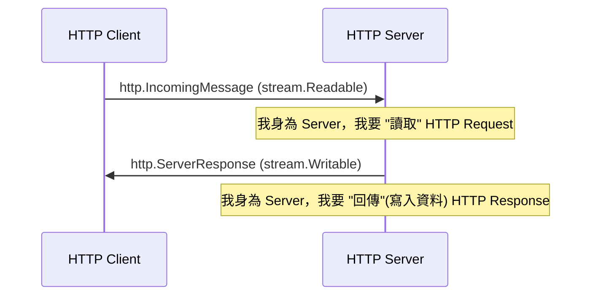
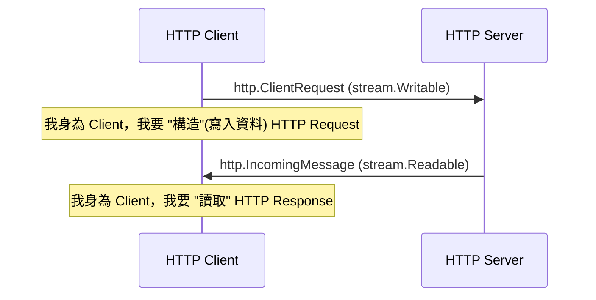
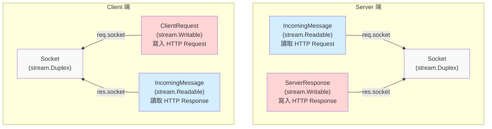

## 前言

承接 [Node.js events module](./events.md)，接著來看看 stream

## Types of streams

stream 有分四種

- [Writable](https://nodejs.org/api/stream.html#class-streamwritable)：可寫
- [Readable](https://nodejs.org/api/stream.html#class-streamreadable)：可讀
- [Duplex](https://nodejs.org/api/stream.html#class-streamduplex)：可讀寫
- [Transform](https://nodejs.org/api/stream.html#class-streamtransform)：這次不會介紹到它

### HTTP Server 視角：Readable 與 Writable

### HTTP Client 視角：Readable 與 Writable

:::info
從上述的例子，我們可以得知，所謂的 "Readable" 跟 "Writable"，是根據 "你目前的角色" 來看
:::

### Client 與 Server 的對稱結構：各自的 Socket (stream.Duplex)

## 參考資料

- https://nodejs.org/api/stream.html
