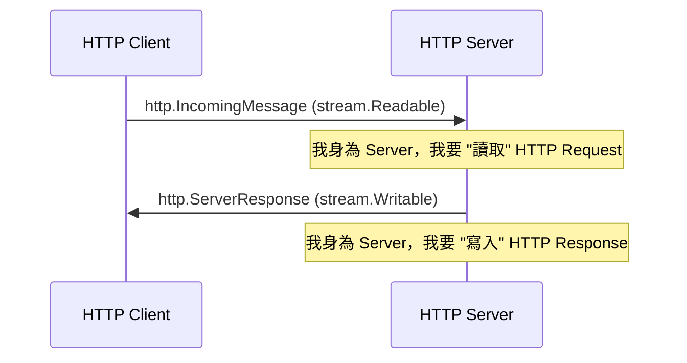
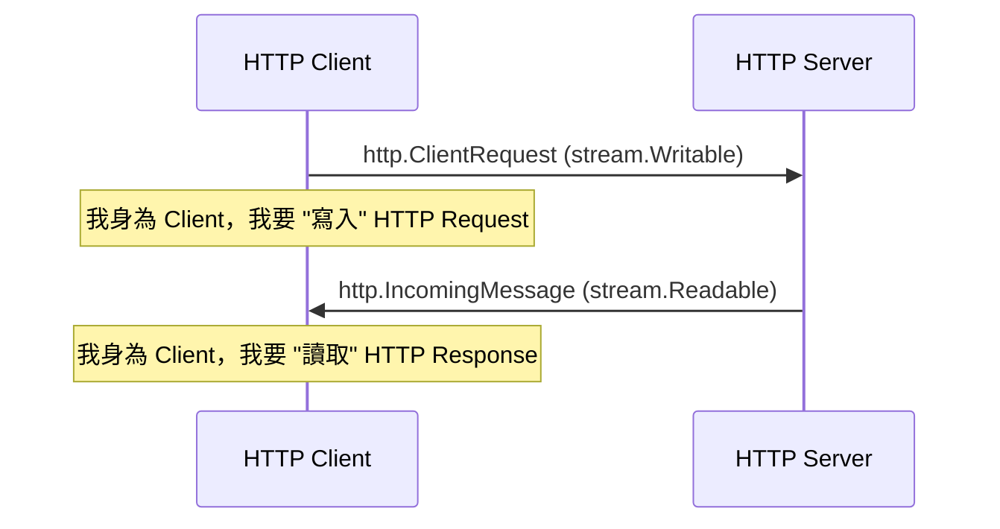
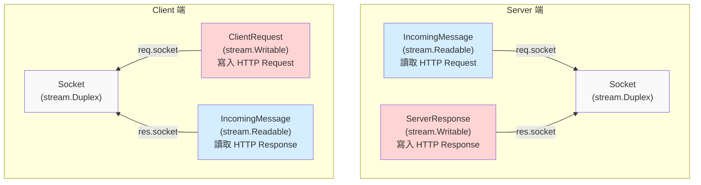

## 前言

承接 [Node.js events module](./events.md)，接著來看看 stream

## Types of streams

stream 有分四種

- [Writable](https://nodejs.org/api/stream.html#class-streamwritable)：可寫
- [Readable](https://nodejs.org/api/stream.html#class-streamreadable)：可讀
- [Duplex](https://nodejs.org/api/stream.html#class-streamduplex)：可讀寫
- [Transform](https://nodejs.org/api/stream.html#class-streamtransform)：這次不會介紹到它

### HTTP Server 視角：Readable 與 Writable

### HTTP Client 視角：Readable 與 Writable

:::info
從上述的例子，我們可以得知，所謂的 "Readable" 跟 "Writable"，是根據 "你目前的角色" 來看
:::

### Client 與 Server 的對稱結構：各自的 Socket (stream.Duplex)

### Types of streams 小結

從 HTTP 的視角來看，就會發現 Node.js 模組的底層就是 stream 跟 Socket
- stream 負責資料的讀寫
- Socket 則是管理 TCP 連線的抽象層，繼承了 stream.Duplex，可讀寫資料

## stream.Readable

## stream.Writable

https://nodejs.org/api/stream.html#class-streamwritable

### events

- [writable.on('close')](https://nodejs.org/api/stream.html#event-close)
- [writable.on('drain')](https://nodejs.org/api/stream.html#event-drain)
- [writable.on('error')](https://nodejs.org/api/stream.html#event-error)
- [writable.on('finish')](https://nodejs.org/api/stream.html#event-finish)
- [writable.on('pipe')](https://nodejs.org/api/stream.html#event-pipe)
- [writable.on('unpipe')](https://nodejs.org/api/stream.html#event-unpipe)

### methods

- [writable.cork](https://nodejs.org/api/stream.html#writablecork)
- [writable.uncork](https://nodejs.org/api/stream.html#writableuncork)
- [writable.destroy](https://nodejs.org/api/stream.html#writabledestroyerror)
- [writable.write](https://nodejs.org/api/stream.html#writablewritechunk-encoding-callback)
- [writable.end](https://nodejs.org/api/stream.html#writableendchunk-encoding-callback)
- [writable.setDefaultEncoding](https://nodejs.org/api/stream.html#writablesetdefaultencodingencoding)

### properties

- [writable.closed](https://nodejs.org/api/stream.html#writableclosed)
- [writable.destroyed](https://nodejs.org/api/stream.html#writabledestroyed)
- [writable.writable](https://nodejs.org/api/stream.html#writablewritable)
- [writable.writableAborted](https://nodejs.org/api/stream.html#writablewritableaborted)
- [writable.writableEnded](https://nodejs.org/api/stream.html#writablewritableended)
- [writable.writableFinished](https://nodejs.org/api/stream.html#writablewritablefinished)
- [writable.writableCorked](https://nodejs.org/api/stream.html#writablewritablecorked)
- [writable.errored](https://nodejs.org/api/stream.html#writableerrored)
- [writable.writableHighWaterMark](https://nodejs.org/api/stream.html#writablewritablehighwatermark)
- [writable.writableLength](https://nodejs.org/api/stream.html#writablewritablelength)
- [writable.writableNeedDrain](https://nodejs.org/api/stream.html#writablewritableneeddrain)
- [writable.writableObjectMode](https://nodejs.org/api/stream.html#writablewritableobjectmode)

### internal methods

- [writable._destroy](https://nodejs.org/api/stream.html#writable_destroyerr-callback)

## 參考資料

- https://nodejs.org/api/stream.html
