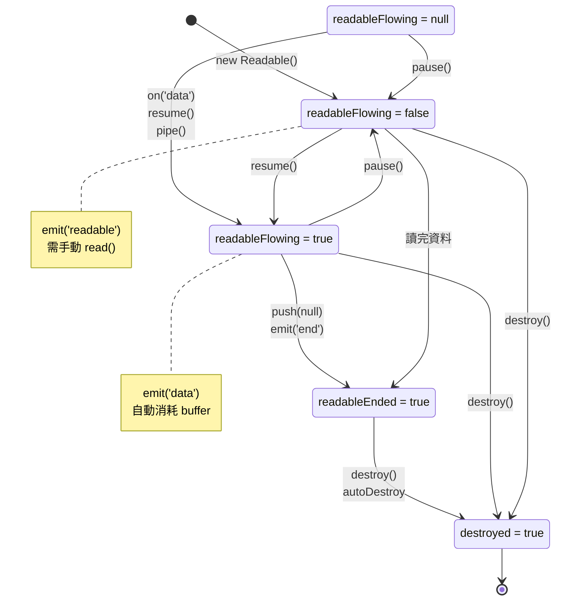

## 前言

承接 [Node.js events module](./events.md)，接著來看看 stream

## Types of streams

stream 有分四種

- [Writable](https://nodejs.org/api/stream.html#class-streamwritable)：可寫
- [Readable](https://nodejs.org/api/stream.html#class-streamreadable)：可讀
- [Duplex](https://nodejs.org/api/stream.html#class-streamduplex)：可讀寫
- [Transform](https://nodejs.org/api/stream.html#class-streamtransform)：這次不會介紹到它

### HTTP Server 視角：Readable 與 Writable


### HTTP Client 視角：Readable 與 Writable


:::info
從上述的例子，我們可以得知，所謂的 "Readable" 跟 "Writable"，是根據 "你目前的角色" 來看
:::

### Client 與 Server 的對稱結構：各自的 Socket (stream.Duplex)


### Types of streams 小結

從 HTTP 的視角來看，就會發現 Node.js 模組的底層就是 stream 跟 Socket

- stream 負責資料的讀寫
- Socket 則是管理 TCP 連線的抽象層，繼承了 stream.Duplex，可讀寫資料

## stream.Writable

https://nodejs.org/api/stream.html#class-streamwritable

stream.Writable 是一個 Base Class + Template Class，它處理所有的 stream 邏輯（buffering、backpressure、events...），但把「實際寫入」的部分留給開發者實作；換句話說，若沒有實作 `_write` method 就直接呼叫 `write` 的話，會直接報錯

❌錯誤作法

```ts
import { Writable } from "stream";

const myStream = new Writable();
myStream.write("123"); // Error: The _write() method is not implemented
```

✅正確做法（實作　`_write` method）

```ts
class MyWritable extends Writable {
  _write(
    chunk: any,
    encoding: BufferEncoding,
    callback: (error?: Error | null) => void,
  ): void {
    console.log(chunk);
    callback();
  }
}
const myWritable = new MyWritable();
myWritable.write("123"); // <Buffer 31 32 33>
```

### backpressure

### highWaterMark

### events

- [writable.on('close')](https://nodejs.org/api/stream.html#event-close)
- [writable.on('drain')](https://nodejs.org/api/stream.html#event-drain)
- [writable.on('error')](https://nodejs.org/api/stream.html#event-error)
- [writable.on('finish')](https://nodejs.org/api/stream.html#event-finish)
- [writable.on('pipe')](https://nodejs.org/api/stream.html#event-pipe)
- [writable.on('unpipe')](https://nodejs.org/api/stream.html#event-unpipe)

### methods

- [writable.cork](https://nodejs.org/api/stream.html#writablecork)
- [writable.uncork](https://nodejs.org/api/stream.html#writableuncork)
- [writable.destroy](https://nodejs.org/api/stream.html#writabledestroyerror)
- [writable.write](https://nodejs.org/api/stream.html#writablewritechunk-encoding-callback)
- [writable.end](https://nodejs.org/api/stream.html#writableendchunk-encoding-callback)
- [writable.setDefaultEncoding](https://nodejs.org/api/stream.html#writablesetdefaultencodingencoding)

### properties

- [writable.closed](https://nodejs.org/api/stream.html#writableclosed)
- [writable.destroyed](https://nodejs.org/api/stream.html#writabledestroyed)
- [writable.writable](https://nodejs.org/api/stream.html#writablewritable)
- [writable.writableAborted](https://nodejs.org/api/stream.html#writablewritableaborted)
- [writable.writableEnded](https://nodejs.org/api/stream.html#writablewritableended)
- [writable.writableFinished](https://nodejs.org/api/stream.html#writablewritablefinished)
- [writable.writableCorked](https://nodejs.org/api/stream.html#writablewritablecorked)
- [writable.errored](https://nodejs.org/api/stream.html#writableerrored)
- [writable.writableHighWaterMark](https://nodejs.org/api/stream.html#writablewritablehighwatermark)
- [writable.writableLength](https://nodejs.org/api/stream.html#writablewritablelength)
- [writable.writableNeedDrain](https://nodejs.org/api/stream.html#writablewritableneeddrain)
- [writable.writableObjectMode](https://nodejs.org/api/stream.html#writablewritableobjectmode)

### internal methods

https://nodejs.org/api/stream.html#implementing-a-writable-stream

- [writable.\_write](https://nodejs.org/api/stream.html#writable_writechunk-encoding-callback)
- [writable.\_writev](https://nodejs.org/api/stream.html#writable_writevchunks-callback)
- [writable.\_destroy](https://nodejs.org/api/stream.html#writable_destroyerr-callback)
- [writable.\_final](https://nodejs.org/api/stream.html#writable_finalcallback)
- [writable.\_construct](https://nodejs.org/api/stream.html#writable_constructcallback)

<!-- https://nodejs.org/api/stream.html#errors-while-writing -->

## stream.Readable

https://nodejs.org/api/stream.html#class-streamreadable

同理 [stream.Writable](#streamwritable)，stream.Writable 是一個 Base Class + Template Class，它處理所有的 stream 邏輯（buffering、backpressure、events...），但把「實際讀取」的部分留給開發者實作；換句話說，若沒有實作 `_read` method 就直接呼叫 `read` 的話，會直接報錯

❌錯誤作法

```ts
import { Readable } from "stream";

const myStream = new Readable();
myStream.read("123"); // Error: The _read() method is not implemented
```

✅正確做法（實作　`_read` method）

```ts
class MyReadable extends Readable {
  _read(size: number): void {
    this.push("123");
    // https://nodejs.org/api/stream.html#readablepushchunk-encoding
    // Passing chunk as null signals the end of the stream (EOF), after which no more data can be written.
    this.push(null);
  }
}

const myReadable = new MyReadable();
myReadable.on("data", console.log); // <Buffer 31 32 33>
```

### 小插曲：null as EOF

在 C 語言也有 "用 null 當作 EOF" 的概念，叫做 [Null-terminated byte strings](https://en.cppreference.com/w/c/string/byte.html)，用 JavaScript 當作 Code Example 的話：

```ts
const str = "hello";
// const str = "hello\0";
```

這個概念在 exploit path traversal 的時候，可以當作一個技巧，可參考 [portSwigger - path traversal](https://portswigger.net/web-security/file-path-traversal#common-obstacles-to-exploiting-path-traversal-vulnerabilities) 的教學

因為 Node.js 底層也是 C，所以我猜測 `this.push(null)` 這個設計模式也是借鑑 C

### Readable 生命週期 1：誕生 - constructor 與初始化

- constructor
- \_construct

### Readable 生命週期 2: 運作 - 兩種讀取模式的切換

- readableFlowing = null
- on('readable'), read, \_read, push
- on('data')
- pause, on('pause'), isPaused
- resume, on('resume')
- highWaterMark, backpressure

### Readable 生命週期 3: 終結 - 結束、銷毀與錯誤處理

- on('end'), readableEnded
- autoDestroy, destroy, on('destory'), destroyed
- on('close'), closed
- on('error'), errored

### 狀態機



### events

- [readable.on('close')](https://nodejs.org/api/stream.html#event-close_1)
- [readable.on('data')](https://nodejs.org/api/stream.html#event-data)
- [readable.on('end')](https://nodejs.org/api/stream.html#event-end)
- [readable.on('error')](https://nodejs.org/api/stream.html#event-error_1)
- [readable.on('pause')](https://nodejs.org/api/stream.html#event-pause)
- [readable.on('readable')](https://nodejs.org/api/stream.html#event-readable)
- [readable.on('resume')](https://nodejs.org/api/stream.html#event-resume)

### methods

- [readable.destroy](https://nodejs.org/api/stream.html#readabledestroyerror)
- [readable.isPaused](https://nodejs.org/api/stream.html#readableispaused)
- [readable.pause](https://nodejs.org/api/stream.html#readablepause)
- [readable.pipe](https://nodejs.org/api/stream.html#readablepipedestination-options)
- [readable.unpipe](https://nodejs.org/api/stream.html#readableunpipedestination)
- [readable.read](https://nodejs.org/api/stream.html#readablereadsize)
- [readable.resume](https://nodejs.org/api/stream.html#readableresume)
- [readable.setEncoding](https://nodejs.org/api/stream.html#readablesetencodingencoding)
- [readable.unshift](https://nodejs.org/api/stream.html#readableunshiftchunk-encoding)
- [readable.wrap](https://nodejs.org/api/stream.html#readablewrapstream)
- [readable.compose](https://nodejs.org/api/stream.html#readablecomposestream-options)
- [readable.iterator](https://nodejs.org/api/stream.html#readableiteratoroptions)

### properties

- [readable.closed](https://nodejs.org/api/stream.html#readableclosed)
- [readable.destroyed](https://nodejs.org/api/stream.html#readabledestroyed)
- [readable.readable](https://nodejs.org/api/stream.html#readablereadable)
- [readable.readableAborted](https://nodejs.org/api/stream.html#readablereadableaborted)
- [readable.readableDidRead](https://nodejs.org/api/stream.html#readablereadabledidread)
- [readable.readableEncoding](https://nodejs.org/api/stream.html#readablereadableencoding)
- [readable.readableEnded](https://nodejs.org/api/stream.html#readablereadableended)
- [readable.errored](https://nodejs.org/api/stream.html#readableerrored)
- [readable.readableFlowing](https://nodejs.org/api/stream.html#readablereadableflowing)
- [readable.readableHighWaterMark](https://nodejs.org/api/stream.html#readablereadablehighwatermark)
- [readable.readableLength](https://nodejs.org/api/stream.html#readablereadablelength)
- [readable.readableObjectMode](https://nodejs.org/api/stream.html#readablereadableobjectmode)

### internal methods

- [readable.\_construct](https://nodejs.org/api/stream.html#readable_constructcallback)
- [readable.\_destroy](https://nodejs.org/api/stream.html#readable_destroyerr-callback)
- [readable.\_read](https://nodejs.org/api/stream.html#readable_readsize)
- [readable.push](https://nodejs.org/api/stream.html#readablepushchunk-encoding)

### Experimental methods

截止 Node.js v25.2.1，目前這些 methods 都還在 [Stability: 1 - Experimental.](https://nodejs.org/api/documentation.html#stability-index)，故不會在本篇深入解說，就當作參考看看

不過，這些 Array-Like methods，在 Node.js MongoDB Driver 也能看到類似的設計模式，我推測是為了提供更好的 DX 吧！

- [readable.map](https://nodejs.org/api/stream.html#readablemapfn-options)
- [readable.filter](https://nodejs.org/api/stream.html#readablefilterfn-options)
- [readable.forEach](https://nodejs.org/api/stream.html#readableforeachfn-options)
- [readable.toArray](https://nodejs.org/api/stream.html#readabletoarrayoptions)
- [readable.some](https://nodejs.org/api/stream.html#readablesomefn-options)
- [readable.find](https://nodejs.org/api/stream.html#readablefindfn-options)
- [readable.every](https://nodejs.org/api/stream.html#readableeveryfn-options)
- [readable.flatMap](https://nodejs.org/api/stream.html#readableflatmapfn-options)
- [readable.drop](https://nodejs.org/api/stream.html#readabledroplimit-options)
- [readable.take](https://nodejs.org/api/stream.html#readabletakelimit-options)
- [readable.reduce](https://nodejs.org/api/stream.html#readablereducefn-initial-options)

## stream.Duplex

實作了 [stream.Readable](#streamreadable) 跟 [stream.Writable](#streamwritable)，另外多了 [duplex.allowHalfOpen](https://nodejs.org/api/stream.html#duplexallowhalfopen) 這個參數，它的意思是 "如果 readable end，那 writable 是否要繼續開著"。聽起來很繞口，我實際舉兩個例子，讓各位了解：

1. http Server 的 Socket 就是 allowHalfOpen = true，因為通常 Server 收到完整的 HTTP Request (Readable.end) 之後，才
   能決定 HTTP Response 是什麼，並且回傳給 Client，此時 Writable Side 就必須保持開啟。我們可以寫一個 PoC 來驗證

```ts
import httpServer from "../httpServer";

createServer()
  .listen(5000)
  .on("request", function httpRequestListener(req, res) {
    console.log(req.socket === res.socket); // true
    console.log(req.socket.allowHalfOpen); // true
    console.log(res.socket.allowHalfOpen); // true
    res.end();
  });
```

2.

### duplex.allowHalfOpen

這是 stream.Duplex

## 參考資料

- https://nodejs.org/api/stream.html
