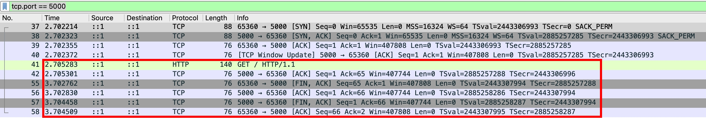
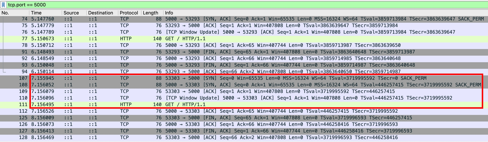
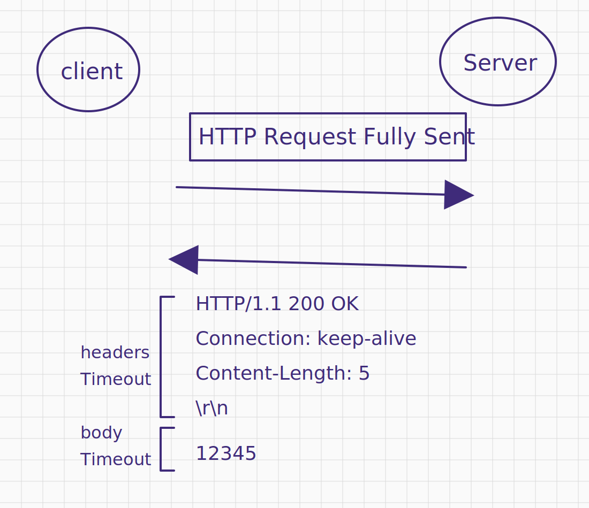
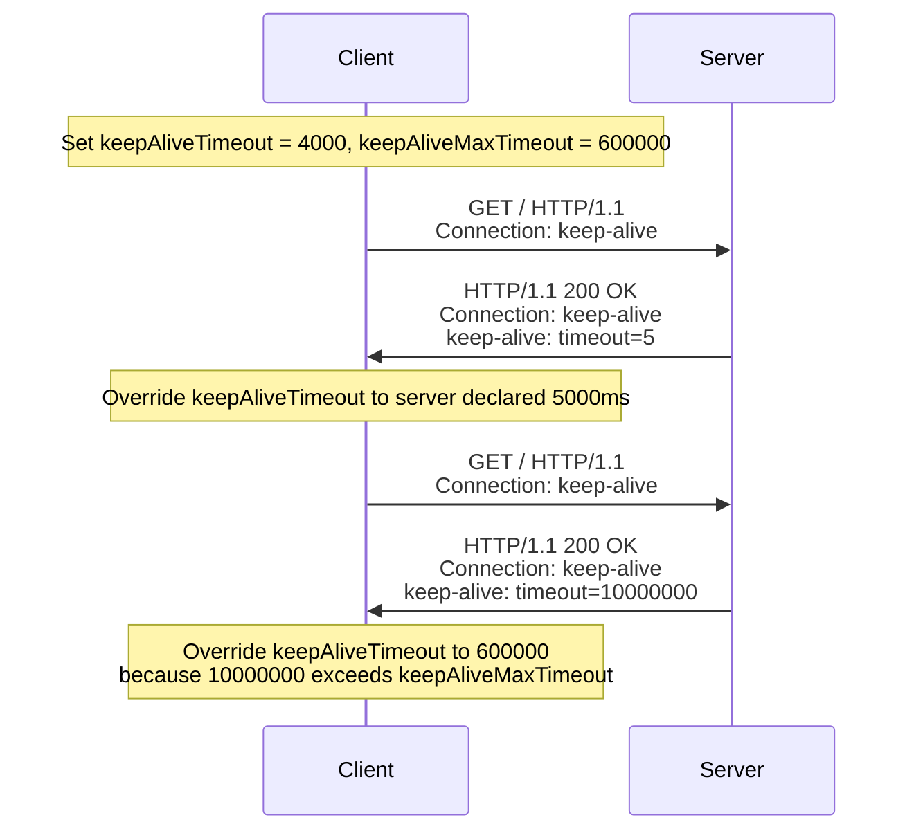

Client 代表的是一個 TCP/TLS 連線的封裝

## ClientOptions overview

語法如下

```js
const client = new Client(url[, ClientOptions]);
```

我必須吐槽 [ClientOptions](https://undici.nodejs.org/#/docs/api/Client?id=new-clienturl-options) 的設計，雖然支援 HTTP/1.1 跟 HTTP/2，但所有設定都攤平，對一般開發者來說，增加了許多理解成本

因此，我在這邊會整理成

1. HTTP/1.1 only options
2. HTTP/2 only options
3. General options

HTTP/1.1 only options：

| Option     | Description |
| ---------- | ----------- |
| pipelining |             |

HTTP/2 only options：

| Option               | Description |
| -------------------- | ----------- |
| allowH2              |             |
| useH2c               |             |
| maxConcurrentStreams |             |
| initialWindowSize    |             |
| connectionWindowSize |             |
| pingInterval         |             |

General options：

| Option                                                   | Description |
| -------------------------------------------------------- | ----------- |
| [bodyTimeout](#clientoptionsbodytimeout)                 |             |
| [headersTimeout](#clientoptionsheaderstimeout)           |             |
| [keepAliveMaxTimeout](#keepalive-related-settings)       |             |
| [keepAliveTimeout](#keepalive-related-settings)          |             |
| [keepAliveTimeoutThreshold](#keepalive-related-settings) |             |
| [maxHeaderSize](#maxheadersize)                          |             |
| [maxResponseSize](#maxresponsesize)                      |             |
| connect                                                  |             |
| [strictContentLength](#clientoptionsstrictcontentlength) |             |
| autoSelectFamily                                         |             |
| autoSelectFamilyAttemptTimeout                           |             |

## ClientOptions.headersTimeout

概念同 `node:http` 的 [server.headersTimeout](./http-server-security.md)，實測看看

```js
const server = http.createServer((req, res) => {
  console.log(performance.now(), "receive request");
});
server.listen(5000);

const client = new Client("http://localhost:5000", { headersTimeout: 3000 });
client
  .request({ path: "/", method: "GET" })
  .catch((err) => console.log(performance.now(), err));

// Prints
// 180.133917 receive request
// 3685.560209 HeadersTimeoutError: Headers Timeout Error
//     at FastTimer.onParserTimeout [as _onTimeout] (/undici@7.22.0/node_modules/undici/lib/dispatcher/client-h1.js:749:28)
//     at Timeout.onTick [as _onTimeout] (/undici@7.22.0/node_modules/undici/lib/util/timers.js:162:13)
//     at listOnTimeout (node:internal/timers:605:17)
//     at process.processTimers (node:internal/timers:541:7) {
//   code: 'UND_ERR_HEADERS_TIMEOUT'
// }
```

實測多次，從 "server 收到 HTTP Request" 到 "client 觸發 `headersTimeout`" 平均是 3500ms，跟我們設定的 3000ms 不一樣...

實際翻了 [FastTimer](https://github.com/nodejs/undici/blob/main/lib/util/timers.js) 的實作，發現多的 500ms 就定義在這裡

```js
/**
 * This module offers an optimized timer implementation designed for scenarios
 * where high precision is not critical.
 *
 * The timer achieves faster performance by using a low-resolution approach,
 * with an accuracy target of within 500ms. This makes it particularly useful
 * for timers with delays of 1 second or more, where exact timing is less
 * crucial.
 */

/**
 * TICK_MS defines the desired interval in milliseconds between each tick.
 * The target value is set to half the resolution time, minus 1 ms, to account
 * for potential event loop overhead.
 *
 * @type {number}
 * @default 499
 */
const TICK_MS = (RESOLUTION_MS >> 1) - 1;
```

對於 `headersTimeout` 這種對時間精度要求不高的場景，如果每個 HTTP Request 都註冊一個 `NodeJS.Timeout` 的話，高併發場景就會同時存在很多 `NodeJS.Timeout`。像 undici 這種 "對效能極致要求的底層工具"，一定會盡可能把每一個操作都節省時間/空間成本。

不過，如果你想要維持精度的話，那就是把 `headersTimeout` 設成 499 的整數倍就好XD

```js
const server = http.createServer((req, res) => {
  console.log(performance.now(), "receive request");
});
server.listen(5000);

const client = new Client("http://localhost:5000", { headersTimeout: 998 });
client
  .request({ path: "/", method: "GET" })
  .catch((err) => console.log(performance.now(), "headersTimeout"));

// Prints
// 117.662291 receive request
// 1119.400458 headersTimeout
```

當然～這個 `headersTimeout` 不是只有單純噴錯，背後會把 TCP 連線關閉（client 主動發了 FIN 封包）


但是，由於我們還沒呼叫 `client.close()` 或是 `client.destroy()`，下次 client 發起 HTTP Request 的時候，還是會創建一個 TCP/TLS 連線。我們寫個 PoC 來測試看看：

```js
const server = http.createServer();
server.listen(5000);

const client = new Client("http://localhost:5000", { headersTimeout: 998 });
client.request({ path: "/", method: "GET" }).catch(() => {
  setTimeout(
    () => client.request({ path: "/", method: "GET" }).catch(() => {}),
    1000,
  );
});
```

實測結果，第一個連線關閉後，會等到有第二個請求，才建立第二個連線，有種 [Lazy loading](https://developer.mozilla.org/en-US/docs/Web/Performance/Guides/Lazy_loading) 的異曲同工之妙


另外還有一個想測試，如果 server 慢速發送 header，不知道 `headersTimeout` 是否會一直重置？

```ts
const sleep = (ms: number) => new Promise((resolve) => setTimeout(resolve, ms));
const server = http.createServer(async (req, res) => {
  assert(res.socket);

  const response = ["HTTP/1.1 200 OK\r\n", "Test: 1\r\n", "\r\n"];
  // 預計 1200ms 送完
  for (let i = 0; i < response.length; i++) {
    await sleep(400);
    res.socket.write(response[i]);
  }
});
server.listen(5000);

const client = new Client("http://localhost:5000", { headersTimeout: 998 });
const response = await client
  .request({ path: "/", method: "GET" })
  .catch((err) => err);
console.log(response); // HeadersTimeoutError: Headers Timeout Error
```

✅ 結論：即便 client 持續收到一行一行的 headers，`headersTimeout` 還是不會重置～

## ClientOptions.bodyTimeout

我發現一個很有趣的現象（同時也蠻合理的），如果 user program 沒有去讀取 body，那即便 `bodyTimeout` 也不會噴錯

```ts
const sleep = (ms: number) => new Promise((resolve) => setTimeout(resolve, ms));
const server = http.createServer(async (req, res) => {
  // 立即先送 headers
  res.flushHeaders();

  // 每 1s 寫入 1 byte，總共花費 5s 寫完
  for (let i = 0; i < 5; i++) {
    await sleep(1000);
    res.write(String(i));
  }
  res.end();
});
server.listen(5000);

// 將 bodyTimeout 設超低，但 user program 沒有去讀取 body，所以不會噴錯
const client = new Client("http://localhost:5000", { bodyTimeout: 1 });
const response = await client.request({ path: "/", method: "GET" });
console.log(response);
```

另外

- `bodyTimeout` 也是受到 [FastTimer](https://github.com/nodejs/undici/blob/main/lib/util/timers.js) 的 499ms 影響
- 設定小於 499ms 的 `bodyTimeout`，實際上還是 "每 499ms" 才會觸發檢查
- 寫個 PoC 驗證，server 每 499ms 寫入 1 byte，理論上不會觸發 `bodyTimeout`

```ts
const sleep = (ms: number) => new Promise((resolve) => setTimeout(resolve, ms));
const server = http.createServer(async (req, res) => {
  console.log(performance.now(), "receive request");
  // 立即先送 headers
  res.flushHeaders();

  // 每 499ms 寫入 1 byte，總共花費 2495ms 寫完
  for (let i = 0; i < 5; i++) {
    await sleep(499);
    res.write(String(i));
  }
  res.end();
});
server.listen(5000);

// 將 bodyTimeout 設超低，但實際上還是 "每 499ms" 才會觸發檢查
const client = new Client("http://localhost:5000", { bodyTimeout: 1 });
const response = await client.request({ path: "/", method: "GET" });
const body = await response.body.text();
console.log(performance.now(), "receive response body", body);

// Prints
// 133.329792 receive request
// 2636.961792 receive response body 01234
```

server 刻意只送 headers 而不送 body，觀察 `bodyTimeout` 的觸發時間，結果發現要 499ms x 2 才會觸發 `bodyTimeout`

```ts
const server = http.createServer(async (req, res) => {
  console.log(performance.now(), "receive request");
  // 立即先送 headers
  res.flushHeaders();
});
server.listen(5000);

// 將 bodyTimeout 設超低，但實際上還是 "每 499ms" 才會觸發檢查
const client = new Client("http://localhost:5000", { bodyTimeout: 1 });
const response = await client.request({ path: "/", method: "GET" });
response.body.text().catch((err) => console.log(performance.now(), err));

// Prints
// 138.398208 receive request
// 1137.023708 BodyTimeoutError: Body Timeout Error
//     at FastTimer.onParserTimeout [as _onTimeout] (/undici@7.22.0/node_modules/undici/lib/dispatcher/client-h1.js:753:28)
//     at Timeout.onTick [as _onTimeout] (/undici@7.22.0/node_modules/undici/lib/util/timers.js:162:13)
//     at listOnTimeout (node:internal/timers:605:17)
//     at process.processTimers (node:internal/timers:541:7) {
//   code: 'UND_ERR_BODY_TIMEOUT'
// }
```

原因是 [FastTimer](https://github.com/nodejs/undici/blob/main/lib/util/timers.js) 需要兩輪 tick，才能從 `NOT_IN_LIST` -> `PENDING` -> `ACTIVE`

```js
class FastTimer {
  /**
   * The state of the timer, which can be one of the following:
   * - NOT_IN_LIST (-2)
   * - TO_BE_CLEARED (-1)
   * - PENDING (0)
   * - ACTIVE (1)
   *
   * @type {-2|-1|0|1}
   * @private
   */
  _state = NOT_IN_LIST;

  // ...省略
}
```

✅ 結論：設定 998ms 以內的 `bodyTimeout`，都會等到 998ms 才觸發

## headersTimeout & bodyTimeout 圖解



## ClientOptions.maxHeaderSize

概念同 `node:http` 的 [http.maxHeaderSize](./http-server-security.md)

追了一下 [原始碼](https://github.com/nodejs/undici/blob/main/lib/dispatcher/client-h1.js)，計算的是 "header field + header value 的長度"，超過就直接關閉連線

```js
class Parser {
  onHeaderField(buf) {
    // ...省略
    this.trackHeader(buf.length);
  }
  onHeaderValue(buf) {
    // ...省略
    this.trackHeader(buf.length);
  }

  trackHeader(len) {
    this.headersSize += len;
    if (this.headersSize >= this.headersMaxSize) {
      util.destroy(this.socket, new HeadersOverflowError());
    }
  }
}
```

用 `net.Socket` 寫入 raw HTTP Response 測試看看

```js
const server = net.createServer();
server.listen(5000);
server.on("connection", (socket) => {
  socket.on("data", () => {
    socket.write(
      "HTTP/1.1 200 OK\r\n" +
        `ninebytes: ${Array(http.maxHeaderSize - 9 - 1)
          .fill(0)
          .join("")}\r\n` +
        "\r\n",
    );
  });
});

const client = new Client("http://localhost:5000");
const response = await client.request({ path: "/", method: "GET" });
console.log(Buffer.byteLength(String(response.headers["ninebytes"]))); // 16384 (16KB) - 9 - 1 = 16374
```

剛好頂到 `http.maxHeaderSize` 就會噴錯

```js
const server = net.createServer();
server.listen(5000);
server.on("connection", (socket) => {
  socket.on("data", () => {
    socket.write(
      "HTTP/1.1 200 OK\r\n" +
        `ninebytes: ${Array(http.maxHeaderSize - 9)
          .fill(0)
          .join("")}\r\n` +
        "\r\n",
    );
  });
});

const client = new Client("http://localhost:5000");
client.request({ path: "/", method: "GET" }).catch(console.error);

// Prints
// HeadersOverflowError: Headers Overflow Error
//     at Parser.trackHeader (\undici@7.22.0\node_modules\undici\lib\dispatcher\client-h1.js:466:33)
//     at Parser.onHeaderValue (\undici@7.22.0\node_modules\undici\lib\dispatcher\client-h1.js:455:10)
//     at wasm_on_header_value (\undici@7.22.0\node_modules\undici\lib\dispatcher\client-h1.js:142:30)
//     at wasm://wasm/00034eea:wasm-function[49]:0x994b
//     at wasm://wasm/00034eea:wasm-function[20]:0x7edc
//     at Parser.execute (\undici@7.22.0\node_modules\undici\lib\dispatcher\client-h1.js:337:22)
//     at Parser.readMore (\undici@7.22.0\node_modules\undici\lib\dispatcher\client-h1.js:301:12)
//     at Socket.onHttpSocketReadable (\undici@7.22.0\node_modules\undici\lib\dispatcher\client-h1.js:883:18)
//     at Socket.emit (node:events:508:28)
//     at emitReadable_ (node:internal/streams/readable:836:12) {
//   code: 'UND_ERR_HEADERS_OVERFLOW'
// }
```

## ClientOptions.maxResponseSize

Client 設定 `maxResponseSize: 100` 之後，我把我測過的交乘情境都整理在這張表上

| Server declare      | Server actual send | Client Behavior                                                      |
| ------------------- | ------------------ | -------------------------------------------------------------------- |
| Content-Length: 100 | 101 bytes          | Receive 100 bytes as body and close the TCP Connection               |
| Content-Length: 100 | 100 bytes          | Receive 100 bytes as body                                            |
| Content-Length: 100 | 0 ~ 99 bytes       | Wait for 100 bytes until someone close the TCP Connection            |
| Content-Length: 101 | 101 bytes          | Throws [ResponseExceededMaxSizeError](#responseexceededmaxsizeerror) |

| Server declare             | Server actual send                 | Client Behavior                                                      |
| -------------------------- | ---------------------------------- | -------------------------------------------------------------------- |
| Transfer-Encoding: chunked | 101 bytes                          | Throws [ResponseExceededMaxSizeError](#responseexceededmaxsizeerror) |
| Transfer-Encoding: chunked | 100 bytes                          | Receive 100 bytes as body                                            |
| Transfer-Encoding: chunked | 0 ~ 99 bytes                       | Receive 0 ~ 99 bytes as body                                         |
| Transfer-Encoding: chunked | 0 ~ 99 bytes (without `0\r\n\r\n`) | Wait for 100 bytes until someone close the TCP Connection            |

:::info
`0\r\n\r\n` 是 `Transfer-Encoding: chunked` 的 end signal，其語意是 "body 到這邊結束"
:::

### ResponseExceededMaxSizeError

```js
ResponseExceededMaxSizeError: Response content exceeded max size
    at Parser.onBody (\undici@7.22.0\node_modules\undici\lib\dispatcher\client-h1.js:653:28)
    at wasm_on_body (\undici@7.22.0\node_modules\undici\lib\dispatcher\client-h1.js:164:30)
    at wasm://wasm/00034eea:wasm-function[50]:0x998a
    at wasm://wasm/00034eea:wasm-function[20]:0x87ae
    at Parser.execute (\undici@7.22.0\node_modules\undici\lib\dispatcher\client-h1.js:337:22)
    at Parser.readMore (\undici@7.22.0\node_modules\undici\lib\dispatcher\client-h1.js:301:12)
    at Socket.onHttpSocketReadable (\undici@7.22.0\node_modules\undici\lib\dispatcher\client-h1.js:883:18)
    at Socket.emit (node:events:508:28)
    at emitReadable_ (node:internal/streams/readable:836:12)
    at process.processTicksAndRejections (node:internal/process/task_queues:89:21) {
  code: 'UND_ERR_RES_EXCEEDED_MAX_SIZE'
}
```

Trace 原始碼的實作

```js
class Parser {
  onBody(buf) {
    // ...省略

    if (maxResponseSize > -1 && this.bytesRead + buf.length > maxResponseSize) {
      util.destroy(socket, new ResponseExceededMaxSizeError());
      return -1;
    }

    this.bytesRead += buf.length;

    // ...省略
  }
}
```

## ClientOptions.strictContentLength

概念同 `node:http` 的 [ServerResponse.strictContentLength](./http-strictContentLength.md)

- `ClientOptions.strictContentLength`：檢查 request header 的 `Content-Length` 跟 request body 實際送出的 bytes 一樣，否則拋錯
- `ServerResponse.strictContentLength`：檢查 response header 的 `Content-Length` 跟 response body 實際送出的 bytes 一樣，否則拋錯

用 `Readable.from` 來製造一個 Content-Length mismatch 的情境：

```js
const server = net.createServer();
server.listen(5000);

const client = new Client("http://localhost:5000");

await client
  .request({
    path: "/",
    method: "GET",
    headers: { "content-length": "1" },
    body: Readable.from(["12"]),
  })
  .catch(console.log);
// RequestContentLengthMismatchError: Request body length does not match content-length header
//     at AsyncWriter.write (\undici@7.22.0\node_modules\undici\lib\dispatcher\client-h1.js:1497:15)
//     at Readable.onData (\undici@7.22.0\node_modules\undici\lib\dispatcher\client-h1.js:1199:19)
//     at Readable.emit (node:events:508:28)
//     at Readable.read (node:internal/streams/readable:784:10)
//     at flow (node:internal/streams/readable:1290:53)
//     at emitReadable_ (node:internal/streams/readable:849:3)
//     at process.processTicksAndRejections (node:internal/process/task_queues:89:21) {
//   code: 'UND_ERR_REQ_CONTENT_LENGTH_MISMATCH'
// }
```

## keepAlive related settings

- `keepAliveTimeoutThreshold`: 概念同 http.Agent 的 [agentKeepAliveTimeoutBuffer](./http-agent.md#new-httpagentoptions)
- `keepAliveTimeout`
- `keepAliveMaxTimeout`

概念如下



<!-- 設定以下
- `keepAliveTimeout = 4000`
- `keepAliveMaxTimeout = 5000`
- `keepAliveTimeoutThreshold = 2000` -->

PoC 如下

```js
const server = http.createServer((req, res) => {
  res.end();
});
server.keepAliveTimeout = 1000; // ✅ 動態調整這行
server.listen(5000);
const client = new Client("http://localhost:5000", {
  keepAliveTimeout: 4000,
  keepAliveMaxTimeout: 5000,
  keepAliveTimeoutThreshold: 2000,
});
const response = await client.request({ path: "/", method: "GET" });
console.log(response.headers);
```

測試方式：用 [Wireshark](https://www.wireshark.org/download.html) 抓 Loopback: lo0，加上篩選 tcp.port == 5000，觀察 Client 發送 FIN 封包的時間點

測過的交乘情境都整理在這張表：

| Server declared keep-alive | Actual behavior                                                     |
| -------------------------- | ------------------------------------------------------------------- |
| timeout=10                 | Client close the TCP Connection after 5000 ms (keepAliveMaxTimeout) |
| timeout=7                  | Client close the TCP Connection after 5000 ms (7000 - 2000)         |
| timeout=5                  | Client close the TCP Connection after 3000 ms (5000 - 2000)         |
| timeout=4                  | Client close the TCP Connection after 2000 ms (4000 - 2000)         |
| timeout=2                  | Client close the TCP Connection immediately (2000 - 2000)           |
| timeout=1                  | Client close the TCP Connection immediately                         |

看看原始碼的實作，測試出的行為確實符合預期

```js
// lib/dispatcher/client-h1.js

const timeout = Math.min(
  keepAliveTimeout - client[kKeepAliveTimeoutThreshold],
  client[kKeepAliveMaxTimeout],
);
```
