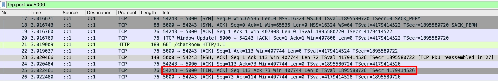

- Dispatcher 是 undici 最底層、最核心的 Class，用來 "發起各式各樣的 HTTP Request"
- Dispatcher 繼承 [EventEmiiter](./events.md#eventemitter)
- [Client](./undici-client.md) 就是繼承 Dispatcher
- Dispatcher 不是直接給 user program 使用的，它是一個抽象的 Class

```js
import { Dispatcher } from "undici";
const dispatcher = new Dispatcher();
dispatcher.request({ method: "GET", path: "/" }); // Error: not implemented
```

在進入 undici 的其他 Class 之前，若要先把基礎打好，就得先從 Dispatcher 開始！

## Dispatcher.close([callback]): Promise

## Dispatcher.destroy([error, callback]): Promise

## Dispatcher.connect(options[, callback])

### 正常使用情境

- client (企業內網) => forward proxy (企業內網出口) => 外網
- client 無法直接連到外網
- client 會跟 forward proxy 發起 CONNECT 請求，forward proxy 會根據防火牆/ACL規則，決定是否連到外網

詳細請參考 [Round Trip 時序圖](../http/http-request-methods-1.md#round-trip-時序圖)

### node:http 發起 CONNECT 請求

forward proxy 我們使用 `node:http` 寫一個極簡的 `http.Server`，先回傳 400 Bad Request 即可

```js
const server = http.createServer();
server.listen(5000);
server.on("connect", (req, socket, head) => {
  console.log("server receives", {
    url: req.url,
    method: req.method,
    headers: req.headers,
    head: head.toString(),
  });
  socket.write("HTTP/1.1 400 Bad Request\r\nContent-Length: 0\r\n\r\n");
  socket.write("tunnel payload from server"); // 刻意在 HTTP Response 結束後多塞一些 payload
});
```

client 我們使用 `node:http` 的 `http.request` 發起 CONNECT 請求

```js
const clientReqeust = http.request({
  host: "localhost",
  port: 5000,
  method: "CONNECT",
  path: "exmaple.com:80",
});
// 刻意在 HTTP Request 結束後多塞一些 payload
clientReqeust.end(() =>
  clientReqeust.socket?.write("tunnel payload from client"),
);
clientReqeust.on("connect", (res, socket, head) => {
  console.log("client receives", {
    headers: res.headers,
    statusCode: res.statusCode,
    isInstanceofSocket: socket instanceof net.Socket,
    head: head.toString(),
  });
});
```

最終會印出

```js
server receives {
  url: 'exmaple.com:80',
  method: 'CONNECT',
  headers: { host: 'localhost:5000', connection: 'keep-alive' },
  head: 'tunnel payload from client'
  // head 是 TCP raw bytes 解析完 HTTP Request 之後，殘存的資料
  // 有可能是下一包 tunnel 的 payload，故 Node.js 將這些資料交給 user program 來處理
  // 正常情況都會是空字串
}
client receives {
  headers: { 'content-length': '0' },
  statusCode: 400,
  isInstanceofSocket: true,
  head: 'tunnel payload from server'
  // head 是 TCP raw bytes 解析完 HTTP Response 之後，殘存的資料
  // 有可能是下一包 tunnel 的 payload，故 Node.js 將這些資料交給 user program 來處理
  // 正常情況都會是空字串
}
```

### undici 發起 CONNECT 請求

forward proxy 的程式碼不變，client 改成用 undici，感受一下 API 設計的差異

```js
const client = new Client("http://localhost:5000/");
const connectData = await client.connect({
  path: "example.com:80",
  headers: { "x-custom-header": "hello-world" },
});
console.log("client receives", {
  headers: connectData.headers,
  statusCode: connectData.statusCode,
  isInstanceofSocket: connectData.socket instanceof net.Socket,
});
connectData.socket.setEncoding("latin1");
connectData.socket.on("data", console.log);
```

最終會印出

```js
server receives {
  url: 'example.com:80',
  method: 'CONNECT',
  headers: {
    host: 'localhost:5000',
    connection: 'close',
    'x-custom-header': 'hello-world'
  },
  head: ''
}
client receives {
  headers: { 'content-length': '0' },
  statusCode: 400,
  isInstanceofSocket: true
}
tunnel payload from server
```

undici 的 `connectData` 沒有 "head" 這個欄位，代表解析完 HTTP Message boundary 之後，殘存的資料都還在 TCP Socket，user program 可自行讀取（我覺得這個設計比較好，HTTP Message boundary 切的比較乾淨）

### 實作面的小眉角

CONNECT 請求結束後，下一個 HTTP Request 會開一條新的 TCP Connection，因為第一條已經拿去 tunnel 了

```js
const client = new Client("http://localhost:5000/");
await client.connect({ path: "example.com:80" });
await client.request({ method: "GET", path: "/" }); // ✅ 會開一條新的 TCP Connection，因為第一條已經拿去 tunnel 了
```

## Dispatcher.dispatch(options, handler)

引用 [官方原文](https://undici.nodejs.org/#/docs/api/Dispatcher?id=dispatcherdispatchoptions-handler)

- This is the low level API which all the preceding APIs are implemented on top of.
- It is primarily intended for library developers who implement higher level APIs on top of this.

## Dispatcher.pipeline(options, handler)

要先搞懂 Node.js 的 [stream.pipeline](https://nodejs.org/api/stream.html#streampipelinesource-transforms-destination-options)，暫不研究

## Dispatcher.stream(options, factory[, callback])

比 [Dispatcher.request](#dispatcherrequestoptions-callback) 還要快一點，因為可以節省一個 [stream.Readable](./stream-readable.md) 的創建成本，直接把 response body pipe 到 [stream.Writable](./stream-writable.md)

## Dispatcher.upgrade(options[, callback])

熟悉 [Dispatcher.connect(options[, callback])](#dispatcherconnectoptions-callback) 之後，再來看這個 method，就會覺得很類似～

http server 先按照規範正常回應

```js
const server = http.createServer();
server.listen(5000);
server.on("upgrade", (req, socket, head) => {
  const { method, headers } = req;
  console.log("server receives", { method, headers });
  socket.write(
    "HTTP/1.1 101 Switching Protocols\r\n" +
      "Connection: Upgrade\r\n" +
      "Upgrade: websocket\r\n" +
      "\r\n",
  );
});
```

http client

```js
const client = new Client("http://localhost:5000/");
const upggradeData = await client.upgrade({
  method: "GET",
  path: "/chatRoom",
  protocol: "Websocket, HelloWorld",
  headers: { Auth: "123" },
});
const { headers, socket } = upggradeData;
console.log("client receives", {
  headers,
  isInstanceOfSocket: socket instanceof net.Socket,
});
```

最終會印出

```js
server receives {
  method: 'GET',
  headers: {
    host: 'localhost:5000',
    connection: 'upgrade',
    upgrade: 'Websocket, HelloWorld',
    auth: '123'
  }
}
client receives {
  headers: { connection: 'keep-alive, upgrade', upgrade: 'websocket' },
  isInstanceOfSocket: true
}
```

client 通常會檢查三件套，通過才放行

1. status code = 101
2. Connection: Upgrade
3. Upgrade: xxx

如果三件套少了其中一個，則可能會噴錯。調整 http server，改成 200 OK 驗證看看

```js
const server = http.createServer();
server.listen(5000);
server.on("upgrade", (req, socket, head) => {
  const { method, headers } = req;
  console.log("server receives", { method, headers });
  socket.write(
    "HTTP/1.1 200 OK\r\n" +
      "Connection: Upgrade\r\n" +
      "Upgrade: websocket\r\n" +
      "\r\n",
  );
});
```

最終會噴錯

```js
/undici@7.24.5/node_modules/undici/lib/api/api-upgrade.js:50
    throw new SocketError('bad upgrade', null)
          ^

SocketError: bad upgrade
    at UpgradeHandler.onHeaders (/undici@7.24.5/node_modules/undici/lib/api/api-upgrade.js:50:11)
    at Request.onHeaders (/undici@7.24.5/node_modules/undici/lib/core/request.js:269:29)
    at Parser.onHeadersComplete (/undici@7.24.5/node_modules/undici/lib/dispatcher/client-h1.js:608:27)
    at wasm_on_headers_complete (/undici@7.24.5/node_modules/undici/lib/dispatcher/client-h1.js:153:30)
    at wasm://wasm/00034eea:wasm-function[10]:0x571
    at wasm://wasm/00034eea:wasm-function[20]:0x845f
    at Parser.execute (/undici@7.24.5/node_modules/undici/lib/dispatcher/client-h1.js:337:22)
    at Parser.readMore (/undici@7.24.5/node_modules/undici/lib/dispatcher/client-h1.js:301:12)
    at Socket.onHttpSocketReadable (/undici@7.24.5/node_modules/undici/lib/dispatcher/client-h1.js:884:18)
    at Socket.emit (node:events:508:28) {
  code: 'UND_ERR_SOCKET',
  socket: null
}
```

並且 undici 會幫你把 TCP 連線關閉


結論：http client 記得要 try catch，避免惡意 http server 把你的服務打爆

```js
const upggradeData = await client
  .upgrade({
    method: "GET",
    path: "/chatRoom",
    protocol: "Websocket, HelloWorld",
    headers: { Auth: "123" },
  })
  .catch(console.error);
```

## Dispatcher.request(options[, callback])

## Dispatcher.compose(interceptors[, interceptor])

- 通常會搭配 [Pre-built interceptors](#pre-built-interceptors) 一起使用
- 概念類似 axios 的 [Interceptors](https://www.npmjs.com/package/axios#interceptors)
- 不過 axios 的 interceptors 有明確區分 request 跟 response，且理解成本較低
- undici 的 interceptor 實作比較偏向 library 開發者，設計模式很複雜

## Pre-built interceptors

### redirect

https://undici.nodejs.org/#/docs/api/Dispatcher?id=redirect

語法很簡單，如下

```js
import { Client, interceptors } from "undici";

const client = new Client("http://localhost:5000").compose(
  interceptors.redirect({ maxRedirections: 3 }),
);
const response = await client.request({ method: "GET", path: "/" });
```

我把一些觀察到的重點列出來：

1. `Client` 只能用在 same-origin redirects
2. `Client` 若遇到 cross-origin redirects，會把 cross-origin 轉成 same-origin，並且保留 pathname 跟 query

```js
// lib/dispatcher/client.js
class Client extends DispatcherBase {
  constructor (url, {
    ...
  }) {
    this[kUrl] = util.parseOrigin(url)
  }
  [kDispatch] (opts, handler) {
    // Client 發送請求時，會強制把 origin 覆寫
    const request = new Request(this[kUrl].origin, opts, handler)
  }
}
```

3. `Agent` 可以用在 cross-origin redirects
4. `Agent` 若用在 cross-origin redirects，會把 `authorization`, `cookie`, `proxy-authorization` 移除（資安考量）

```js
// lib/handler/redirect-handler.js

function shouldRemoveHeader(header, removeContent, unknownOrigin) {
  if (
    unknownOrigin &&
    (header.length === 13 || header.length === 6 || header.length === 19)
  ) {
    const name = util.headerNameToString(header);
    return (
      name === "authorization" ||
      name === "cookie" ||
      name === "proxy-authorization"
    );
  }
  return false;
}
```

5. 支援 redirect 的 status codes = 300, 301, 302, 303, 307, 308

```js
// lib/handler/redirect-handler.js

const redirectableStatusCodes = [300, 301, 302, 303, 307, 308];
```

6. 有 follow [fetch.spec](https://fetch.spec.whatwg.org/#http-redirect-fetch)，301 or 302 with POST 會轉成 GET

```js
// lib/handler/redirect-handler.js

class RedirectHandler {
  onResponseStart(controller, statusCode, headers, statusMessage) {
    if (
      (statusCode === 301 || statusCode === 302) &&
      this.opts.method === "POST"
    ) {
      this.opts.method = "GET";
      if (util.isStream(this.opts.body)) {
        util.destroy(this.opts.body.on("error", noop));
      }
      this.opts.body = null;
    }
  }
}
```

7. 承上，303 且 HEAD 以外，會轉成 GET，並且把 `Content-*` headers 移除

```js
// lib/handler/redirect-handler.js

class RedirectHandler {
  onResponseStart(controller, statusCode, headers, statusMessage) {
    if (statusCode === 303 && this.opts.method !== "HEAD") {
      this.opts.method = "GET";
      if (util.isStream(this.opts.body)) {
        util.destroy(this.opts.body.on("error", noop));
      }
      this.opts.body = null;
    }

    // Remove headers referring to the original URL.
    // By default it is Host only, unless it's a 303 (see below), which removes also all Content-* headers.
    // https://tools.ietf.org/html/rfc7231#section-6.4
    this.opts.headers = cleanRequestHeaders(
      this.opts.headers,
      statusCode === 303,
      this.opts.origin !== origin,
    );
  }
}

function shouldRemoveHeader(header, removeContent, unknownOrigin) {
  if (removeContent && util.headerNameToString(header).startsWith("content-")) {
    return true;
  }
}
```

8. 會把每一跳都記錄下來，如果偵測到 Redirect loop 就會拋錯，避免迴圈

```js
class RedirectHandler {
  onResponseStart(controller, statusCode, headers, statusMessage) {
    const { origin, pathname, search } = util.parseURL(
      new URL(
        this.location,
        this.opts.origin && new URL(this.opts.path, this.opts.origin),
      ),
    );
    const path = search ? `${pathname}${search}` : pathname;

    // Check for redirect loops by seeing if we've already visited this URL in our history
    // This catches the case where Client/Pool try to handle cross-origin redirects but fail
    // and keep redirecting to the same URL in an infinite loop
    const redirectUrlString = `${origin}${path}`;
    for (const historyUrl of this.history) {
      if (historyUrl.toString() === redirectUrlString) {
        throw new InvalidArgumentError(
          `Redirect loop detected. Cannot redirect to ${origin}. This typically happens when using a Client or Pool with cross-origin redirects. Use an Agent for cross-origin redirects.`,
        );
      }
    }
  }
}
```

9. `throwOnMaxRedirect` 在[官方文件](https://undici.nodejs.org/#/docs/api/Dispatcher?id=redirect)有出現，但實際上沒有傳入 `RedirectHandler`，算是一個 undici 的技術債，到目前都還沒修正

- [feat: implement throwOnMaxRedirect option for RedirectHandler](https://github.com/nodejs/undici/pull/2563)
- [fix: update redirect handler options handling, docs, tests](https://github.com/nodejs/undici/pull/4377)

10. 除了以上 "轉成 GET" 的情況會把 body 捨棄，其餘情況，皆會維持原本的 Method 跟 body
11. 承上，但如果是 `Transfer-Encoding: chunked` 則會直接跳出 redirect，並且回傳

```js
// http server
const server = http.createServer();
server.listen(5000);
server.on("request", (req, res) => {
  console.log("server receives", req.method, req.url, req.headers);
  req.setEncoding("latin1");
  req.on("data", console.log);
  if (req.url === "/301") {
    res.statusCode = 301;
    res.setHeader("Location", "http://localhost:5000/302");
    res.end("301");
    return;
  }
});

// http client
const client = new Agent().compose(
  interceptors.redirect({ maxRedirections: 3 }),
);
const response = await client.request({
  // PUT + body + 301 => 理論上要維持原本的 Method 跟 body
  method: "PUT",
  path: "/301",
  origin: "http://localhost:5000",
  // 但因為我們使用 `Readable.from`，所以會使用 transfer-encoding: chunked 來傳輸
  body: Readable.from(["12"]),
  headers: { authorization: "123", test: "456" },
});
console.log(
  "client receives",
  response.statusCode,
  response.headers,
  await response.body.text(),
);
```

最終沒有轉導，而是直接把 301 response 回給使用者

```js
server receives PUT /301 {
  host: 'localhost:5000',
  connection: 'keep-alive',
  authorization: '123',
  test: '456',
  'transfer-encoding': 'chunked'
}
12
client receives 301 {
  location: 'http://localhost:5000/302',
  date: 'Sat, 28 Mar 2026 00:34:31 GMT',
  connection: 'keep-alive',
  'keep-alive': 'timeout=5',
  'content-length': '3'
} 301
```

### follow-redirects vs redirect

[axios](https://github.com/axios/axios) 在 Node.js 環境預設啟用 [follow-redirects](https://github.com/follow-redirects/follow-redirects)

|                                        | follow-redirects | undici.interceptors.redirect |
| -------------------------------------- | ---------------- | ---------------------------- |
| version                                | 1.15.11          | 7.24.6                       |
| redirect status codes                  | 3xx              | 300, 301, 302, 303, 307, 308 |
| connection reuse                       | No               | Yes                          |
| keep `Transfer-Encoding: chunked` body | Yes              | No                           |
| maxBodyLength setting                  | Yes              | No                           |

## retry

https://undici.nodejs.org/#/docs/api/Dispatcher?id=retry

## 參考資料

- https://undici.nodejs.org/#/docs/api/Dispatcher.md
