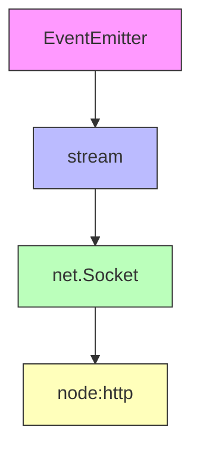
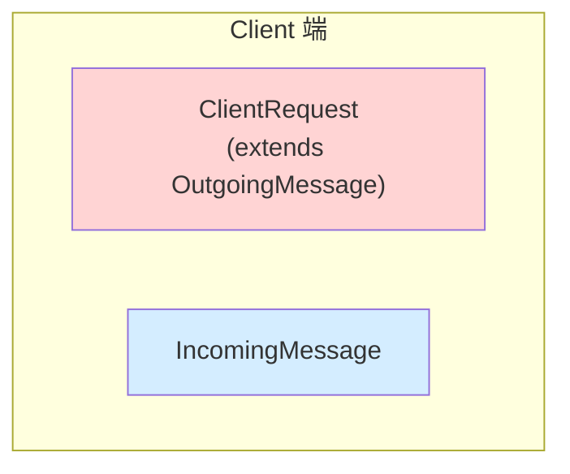
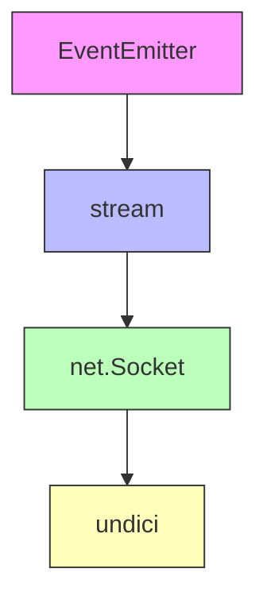
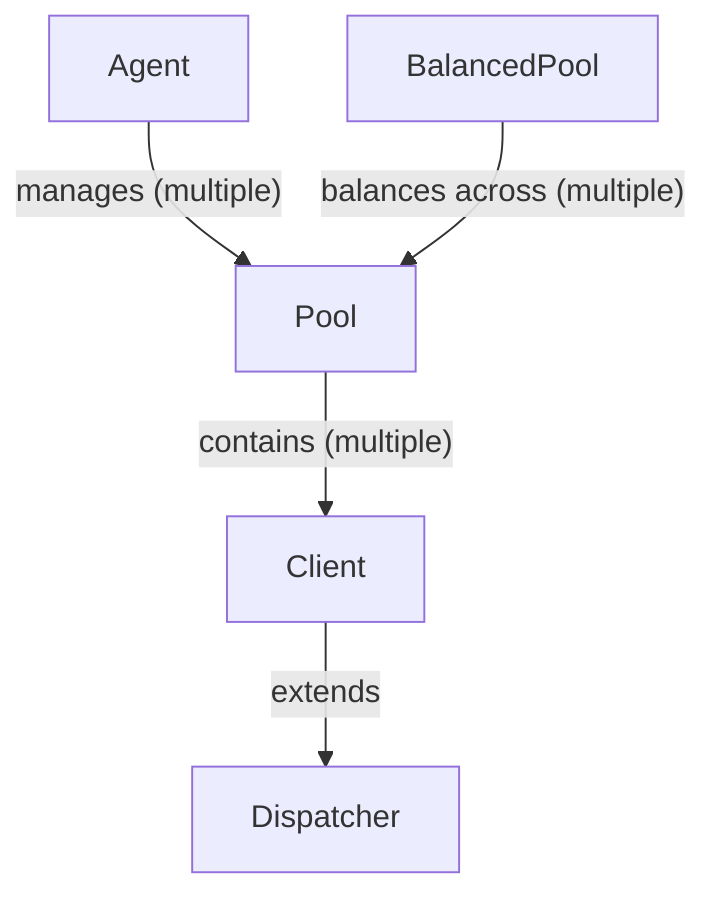

## 簡介

- undici 在義大利文是 "11" 的意思，在這邊用來代表 "HTTP/1.1"
- Node.js 原生的 fetch API 就是 undici 實作的
- undici 是 "HTTP Client"，也就是說 "HTTP Server" 還是得用 Node.js 原生的
- undici 也有支援 HTTP/2，不過底層是用 Node.js 的 http2 模組

## 為何 Node.js 生態系要有兩套 HTTP/1.1 client

我把 Node.js 原生的 http 模組跟 undici 都用過一遍之後，得出以下結論：

- `node:http` 的設計年代較早，心智模型是 callback / event emitter / request object 那一套
- 如果用 `node:http` 硬包一層，滿足 [WHATWG Fetch Standard](https://fetch.spec.whatwg.org/)，維護上比較複雜（綁死在 Node.js release cycle）
- 將 Node.js 與 undici 分成兩個 repo，可以讓 undici 快速迭代，Node.js 再把 undici 的穩定版 bundle 進來就好

## 所謂的 "written from scratch" 是什麼概念？

回憶一下 Node.js http 模組的繼承鏈



再回憶一下 Node.js http 模組 Request / Response 的設計



所謂的 "written from scratch"，就是把 `node:http` 這層拿掉重寫



HTTP/1.1 是 text-based protocol，加上 `node:http` 跟 undici 底層的 http parser 其實都是 [llhttp](https://github.com/nodejs/llhttp)，所以重寫一個 HTTP/1.1 Client 的成本不算高（比起 HTTP/2 這種 binary protocol）

## 不支援 Expect Header

https://undici.nodejs.org/#/?id=expect

```
Undici does not support the Expect request header field. The request body is always immediately sent and the 100 Continue response will be ignored.
```

實際測試，發現只要有 `Expect` header 就無法送出 HTTP Reqeust

```js
const response = await request("http://localhost:5000", {
  headers: { expect: "100-continue" },
});
// NotSupportedError: expect header not supported
//     at processHeader (node:internal/deps/undici/undici:3095:15)
//     at new Request (node:internal/deps/undici/undici:2912:15)
//     at [dispatch] (node:internal/deps/undici/undici:9139:25)
//     at Client.dispatch (node:internal/deps/undici/undici:2234:33)
//     at [dispatch] (node:internal/deps/undici/undici:2505:32)
//     at Pool.dispatch (node:internal/deps/undici/undici:2234:33)
//     at [dispatch] (node:internal/deps/undici/undici:9605:27)
//     at Agent.dispatch (node:internal/deps/undici/undici:2234:33)
//     at Agent.request (/undici@7.22.0/node_modules/undici/lib/api/api-request.js:203:10)
//     at /undici@7.22.0/node_modules/undici/lib/api/api-request.js:194:15 {
//   code: 'UND_ERR_NOT_SUPPORTED'
// }
```

在 undici 的原始碼 lib/core/request.js，確實是直接拋出錯誤

```js
function processHeader (request, key, val) {
  // ...省略
  else if (headerName === 'expect') {
    throw new NotSupportedError('expect header not supported')
  }
  // ...省略
}
```

若 Server 回傳 100 Continue，undici 竟然是直接拋出錯誤（文件說 100 Continue response will be ignored）

```js
const httpServer = http.createServer((req, res) => {
  res.writeContinue(() => res.end());
});
httpServer.listen(5000);
const response = await request("http://localhost:5000");
// SocketError: bad response
//     at Parser.onHeadersComplete (node:internal/deps/undici/undici:7376:32)
//     at wasm_on_headers_complete (node:internal/deps/undici/undici:7078:34)
//     at wasm://wasm/00034eea:wasm-function[10]:0x571
//     at wasm://wasm/00034eea:wasm-function[20]:0x845f
//     at Parser.execute (node:internal/deps/undici/undici:7214:26)
//     at Parser.readMore (node:internal/deps/undici/undici:7190:16)
//     at Socket.onHttpSocketReadable (node:internal/deps/undici/undici:7626:22)
//     at Socket.emit (node:events:508:28)
//     at emitReadable_ (node:internal/streams/readable:836:12)
//     at process.processTicksAndRejections (node:internal/process/task_queues:89:21) {
//   code: 'UND_ERR_SOCKET',
//   socket: {
//     localAddress: '::1',
//     localPort: 62734,
//     remoteAddress: '::1',
//     remotePort: 5000,
//     remoteFamily: 'IPv6',
//     timeout: undefined,
//     bytesWritten: 64,
//     bytesRead: 147
//   }
// }
```

在 undici 的原始碼 lib/dispatcher/client-h1.js，確實是直接拋出錯誤，另外還 destroy socket

```js
class Parser {
  onHeadersComplete(statusCode, upgrade, shouldKeepAlive) {
    // ...省略
    if (statusCode === 100) {
      util.destroy(
        socket,
        new SocketError("bad response", util.getSocketInfo(socket)),
      );
      return -1;
    }
    // ...省略
  }
}
```

## 支援 HTTP/1.1 pipelining

`node:http` 不支援 HTTP/1.1 pipelining，其設計哲學是：

```
盡量開越多條 TCP Socket 越好，直到 maxSockets 上限，http.Agent 會幫忙管理連線池
```

undici "預設" 不支援 HTTP/1.1 pipelining，但可以手動調整 `pipelining` 參數

```js
const server = http.createServer((req, res) => {
  console.log(performance.now(), "receive request", req.url);
  res.setHeader("Url", String(req.url));
  res.end();
});
server.listen(5000);

const client = new Client("http://localhost:5000", { pipelining: 2 });
const promise1 = client.request({
  path: "/user1",
  method: "GET",
  blocking: false,
});
const promise2 = client.request({
  path: "/user2",
  method: "GET",
  blocking: false,
});
promise1.then(async (response1) =>
  console.log("response1", response1.headers.url),
);
promise2.then(async (response2) =>
  console.log("response2", response2.headers.url),
);

// Prints
// 258.460792 receive request /user1
// 265.739417 receive request /user2
// response1 /user1
// response2 /user2
```

超過 `pipelining` 上限的請求則會被 pending，直到前面的請求完成

```js
const server = http.createServer((req, res) => {
  console.log(performance.now(), "receive request", req.url);
  res.setHeader("Url", String(req.url));

  // 給每個請求加上延遲
  const ms = { "/user1": 1000, "/user2": 2000, "/user3": 3000 }[
    String(req.url)
  ];
  setTimeout(() => res.end(), ms);
});
server.listen(5000);

const client = new Client("http://localhost:5000", { pipelining: 2 });
const promise1 = client.request({
  path: "/user1",
  method: "GET",
  blocking: false,
});
const promise2 = client.request({
  path: "/user2",
  method: "GET",
  blocking: false,
});
const promise3 = client.request({
  path: "/user3",
  method: "GET",
  blocking: false,
});
promise1.then((response1) => console.log("response1", response1.headers.url));
promise2.then((response2) => console.log("response2", response2.headers.url));
promise3.then((response3) => console.log("response3", response3.headers.url));

// Prints
// 118.131375 receive request /user1
// 120.003792 receive request /user2
// response1 /user1
// 1130.176709 receive request /user3
// response2 /user2
// response3 /user3
```

背後的管理機制其實也不複雜，就是陣列 + pointer，直接看原始碼 lib/dispatcher/client.js

```js
class Client extends DispatcherBase {
  constructor() {
    // ...省略
    // kQueue is built up of 3 sections separated by
    // the kRunningIdx and kPendingIdx indices.
    // |   complete   |   running   |   pending   |
    //                ^ kRunningIdx ^ kPendingIdx ^ kQueue.length
    // kRunningIdx points to the first running element.
    // kPendingIdx points to the first pending element.
    // This implements a fast queue with an amortized
    // time of O(1).

    this[kQueue] = [];
    this[kRunningIdx] = 0;
    this[kPendingIdx] = 0;

    // ...省略
  }
}
```

在最後一個 response 印出 client

```js
promise3.then((response3) => console.log(client));
```

觀察到

- `kQueue` 裡面的 [Request](https://github.com/nodejs/undici/blob/main/lib/core/request.js) 都空了（Request 已完成，且沒有地方引用該 Request，故釋放這塊記憶體）
- `kRunningIdx` 跟 `kPendingIdx` 都指向下一個要處理的 index

```js
Client {
  // ...省略

  Symbol(queue): [ null, null, null ],
  Symbol(running index): 3,
  Symbol(pending index): 3,

  // ...省略
}
```

## Dispatcher, Client, Pool, BalancedPool, Agent



## Cache Interceptor

## undici.stream

## undici.pipeline

## Dispatcher

## Client

## H2CClient

## Pool

## BalancedPool

## RoundRobinPool

## Agent

## ProxyAgent

## Socks5Agent

## RetryAgent

## Connector

## Errors

## EventSource

## Fetch

## Global Installation

## Cookies

## MockClient

## MockPool

## MockAgent

## MockCallHistory

## MockCallHistoryLog

## MockErrors

## SnapshotAgent

## API Lifecycle

## Diagnostics Channel Support

## Debug

## WebSocket

## MIME Type Parsing

## CacheStorage

## Util

## RedirectHandler

## RetryHandler

## DiagnosticsChannel

## EnvHttpProxyAgent

## PoolStats

## 最終比較

僅列出差異：

| Feature                    | node:http                  | undici                            |
| -------------------------- | -------------------------- | --------------------------------- |
| Expect                     | Y                          | N                                 |
| HTTP/1.1 pipelining        | N                          | Y                                 |
| HTTP/2 support             | N (use node:http2 instead) | Y (but not full support)          |
| maxHeaderSize              | 431 and destroy the socket | destroy the socket                |
| maxResponseSize            | N                          | Y                                 |
| requestTimeout             | Y (http.Server)            | N                                 |
| Connection pool management | http.Agent                 | Client, Pool, BalancedPool, Agent |
| API Design                 | Lower                      | Higher                            |
