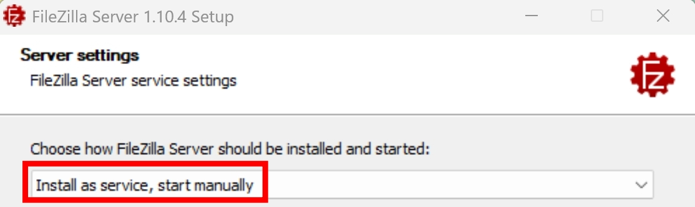
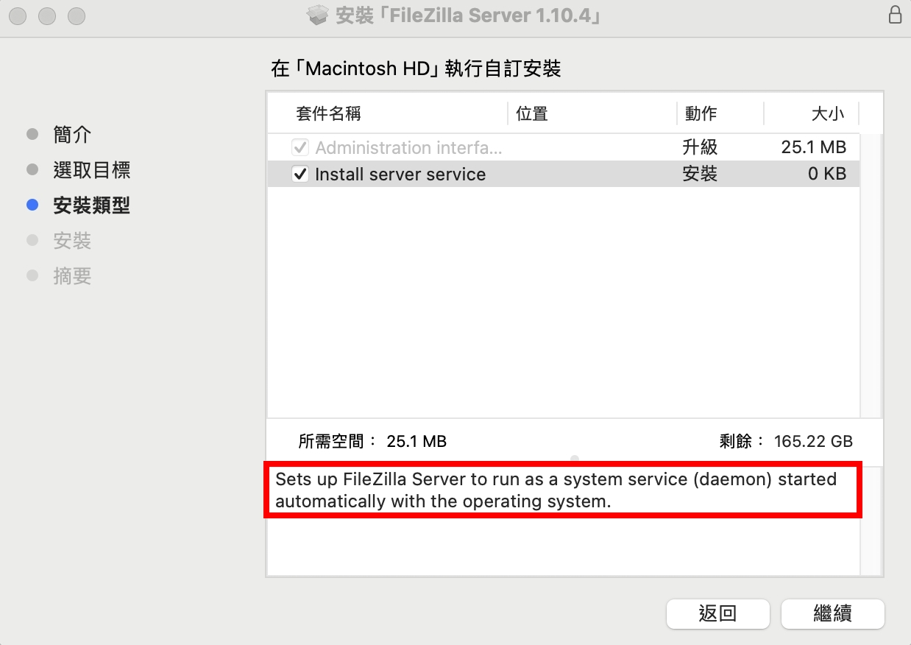
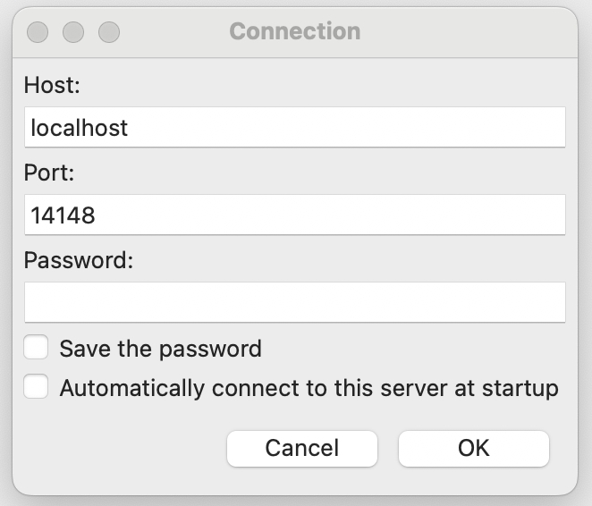
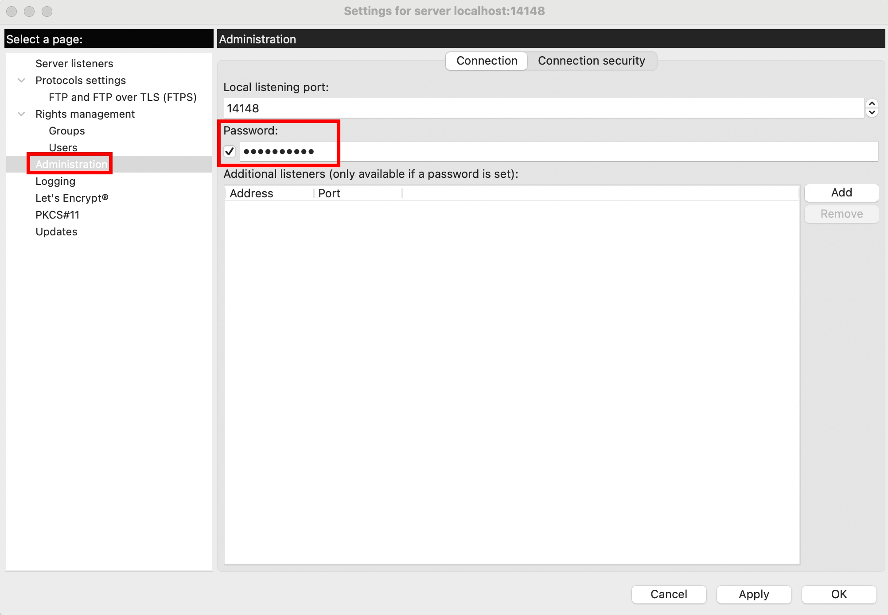
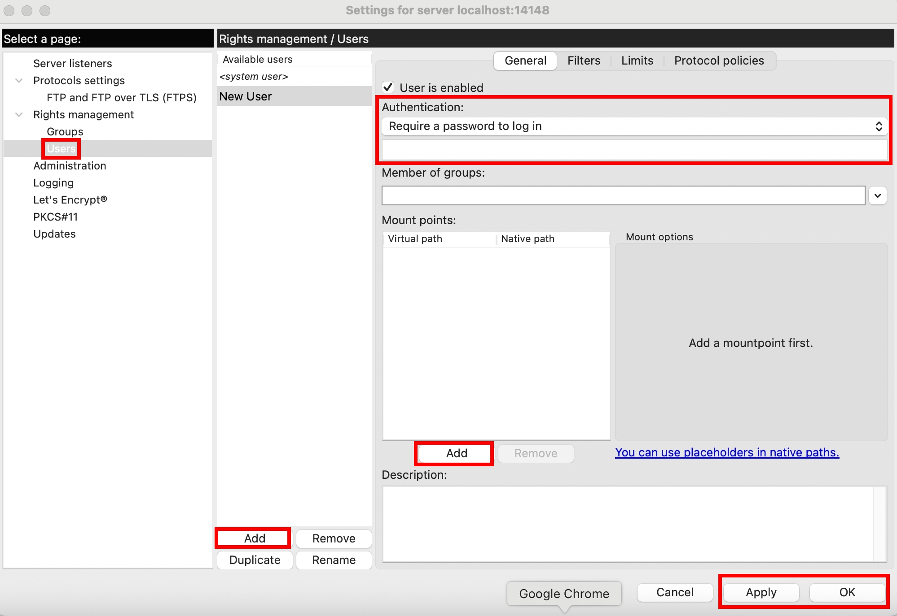
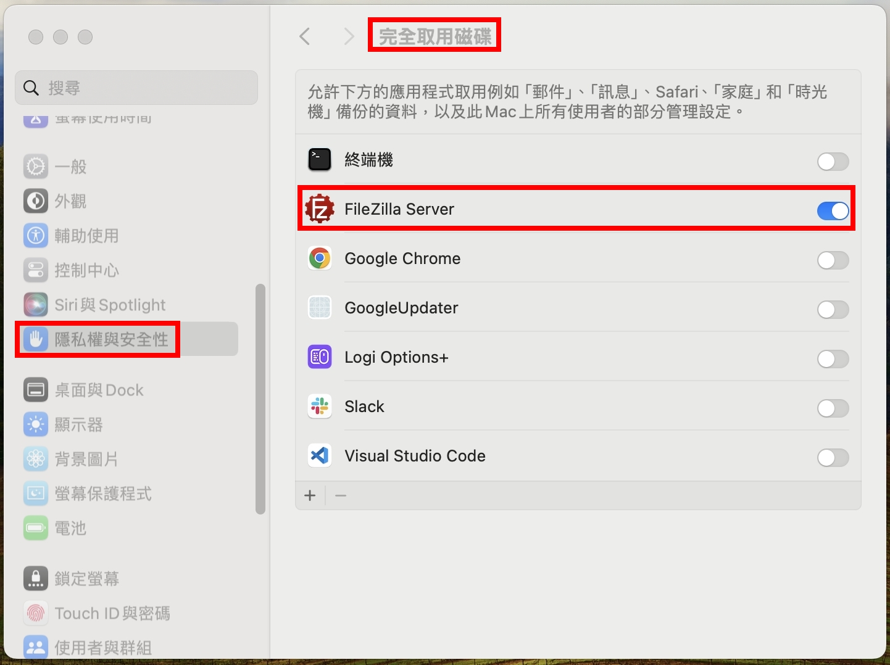
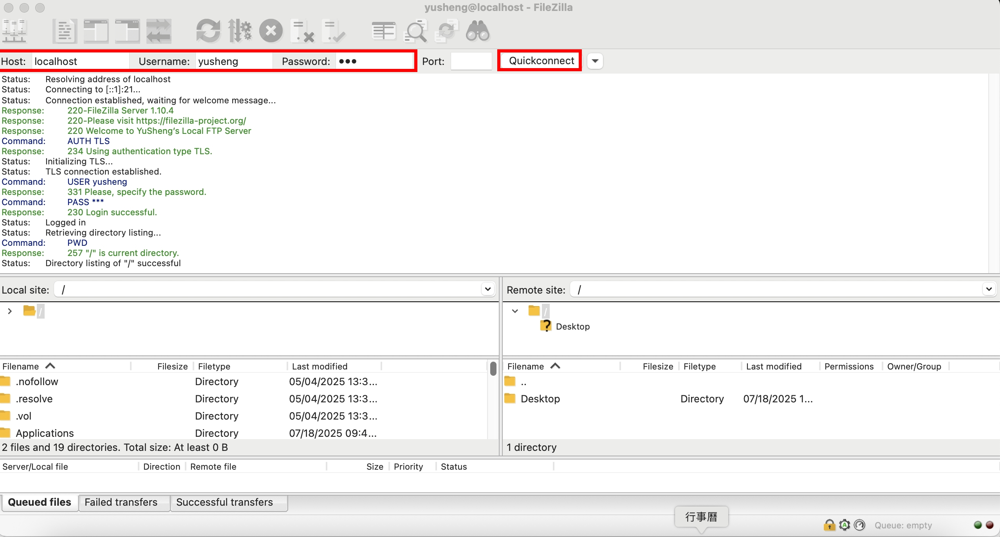
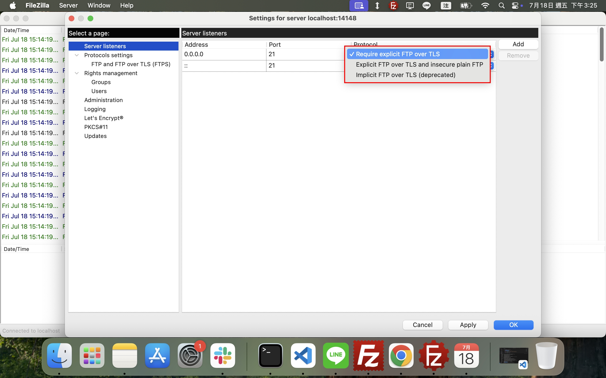
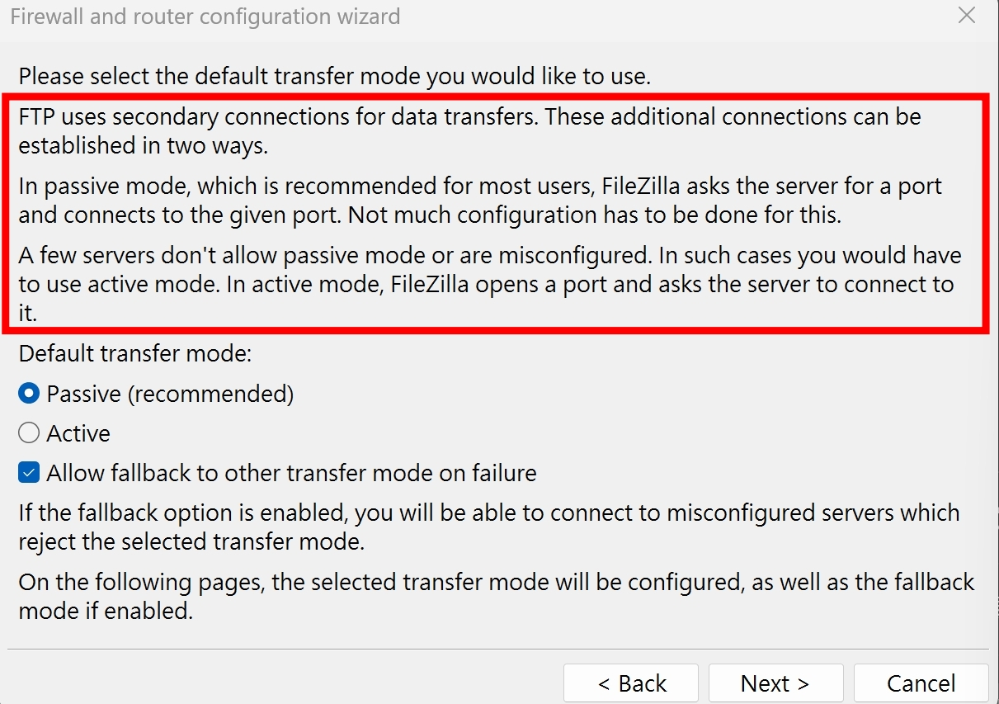

## FileZilla Client + Server

學習 FTP 最快的路徑，不是去啃 RFC 文件，而是先透過圖形化介面了解運作原理之後，再來學習自己下指令。建立熟悉度之後，有不懂的地方再查詢 RFC 文件，這樣的學習方式，會比一開始直接啃生硬的 RFC 文件還要有效率

有一說一，我們先來下載免費開源的 FileZilla

- [FileZilla Client](https://filezilla-project.org/download.php?type=client)
- [FileZilla Server](https://filezilla-project.org/download.php?type=server)

### Windows 安裝過程

要注意，FileZilla Server 在安裝的時候，建議選擇 "Install as service"，這樣就不會在電腦開機的時候就啟動，畢竟多一個 port 就有可能多一個電腦被入侵的風險（？


以上都下載完後，應該會有四個應用程式的 Icon


| 應用程式                    | 作用                               |
| --------------------------- | ---------------------------------- |
| Stop FileZilla Server       | 關閉 21 port 的 FileZilla Server   |
| Start FileZilla Server      | 開啟 21 port 的 FileZilla Server   |
| Administer FileZilla Server | 14148 port 的 Admin 管理介面       |
| FileZilla Client            | 用來連線到 FTP Server 的 Client 端 |

### Mac 安裝過程

Mac 在安裝的時候，沒辦法像 Windows 那樣選擇 "Install as service"，也就是說會隨著開機就啟動 FTP Server，並且 14148 port 的 Admin 管理介面，預設是空密碼，第一次連線進去後，請記得儘速修改密碼


### Admin 密碼設定

✅ Windows 在安裝 FileZilla Server 的時候，就會引導設定 Administer FileZilla Server 的密碼

Mac 則需要先進入 Administer FileZilla Server


登入以後，左上角 "Server > Configure... > Administration"，設定密碼


❗ 不幸的是，Mac 在設定 Admin 密碼似乎有 Bug，點選 "Apply" 以後沒有反應，會導致整個 Administer FileZilla Server 無法操作。我研究了一陣子後，終於找到 Report Bug 的管道，但感覺社群活躍度不高，石沉大海的機率偏高。總之我還是先發了 [Bug Report](https://trac.filezilla-project.org/ticket/13267)，後續再看看有沒有回應。

### Client 帳密 & 權限設定

在同一個 "Server > Configure... > Administration" 的選單，點擊設定 "Users"


:::warning
Windows 系統的路徑會稍微不一樣
:::

假設我想要讓 Client 連線成功後，可以看到 `/Users/yusheng/desktop`，但我又想要隱藏 Server 的真實路徑，我可以設定

- Virtual path: `/desktop`
- Native path: `/Users/yusheng/desktop`

要注意，Mac 在設定 Native path 的時候，部分路徑會因為權限不夠，無法 List Directory，為了測試方便，可先讓 FileZilla Server 完全取用磁碟


設定完以後，打開 FileZilla Client，就可以成功輸入帳密連線了～


## FTP vs SFTP vs FTPS

|      | FTP                    | SFTP         | FTPS         |
| ---- | ---------------------- | ------------ | ------------ |
| 全名 | File Transfer Protocol | SSH FTP      | FTP Over TLS |
| 介紹 | 明文傳輸               | 本質上是 SSH | FTP + TLS    |

FileZilla Server 預設就是使用 FTPS，並且 FTPS 還有兩種模式

- Implicit FTPS => 好像是比較舊的規範，目前已棄用，本篇不討論
- Explicit FTPS => FileZilla Server 的預設值



## 登入流程的 Command 跟 Reply

登入成功

```
Status:      	Resolving address of localhost
Status:      	Connecting to [::1]:21...
Status:      	Connection established, waiting for welcome message...
Response: 	220-FileZilla Server 1.10.4
Response: 	220-Please visit https://filezilla-project.org/
Response: 	220 Welcome to YuSheng’s Local FTP Server
Command: 	AUTH TLS
Response: 	234 Using authentication type TLS.
Status:      	Initializing TLS...
Status:      	TLS connection established.
Command: 	USER yusheng
Response: 	331 Please, specify the password.
Command: 	PASS ***
Response: 	230 Login successful.
Status:      	Logged in
Status:      	Retrieving directory listing...
Command: 	PWD
Response: 	257 "/" is current directory.
Status:      	Directory listing of "/" successful
```

登入失敗

```
Status: 	Disconnected from server
Status: 	Resolving address of localhost
Status: 	Connecting to [::1]:21...
Status: 	Connection established, waiting for welcome message...
Response: 	220-FileZilla Server 1.10.4
Response: 	220 Please visit https://filezilla-project.org/
Command:	AUTH TLS
Response:	234 Using authentication type TLS.
Status: 	Initializing TLS...
Status: 	TLS connection established.
Command:	USER yusheng
Response:	331 Please, specify the password.
Command:	PASS ****
Response: 	530 Login incorrect.
Error:      	Critical error: Could not connect to server
```

| Command      | Description             |
| ------------ | ----------------------- |
| AUTH TLS     | -                       |
| USER yusheng | -                       |
| PASS \*\*\*  | -                       |
| PWD          | Print Working Directory |

| Reply Code | Description                     |
| ---------- | ------------------------------- |
| 220        | Service ready for new user      |
| 234        | Security data exchange complete |
| 331        | User name okay, need password   |
| 230        | User logged in, proceed         |
| 257        | "PATHNAME" created              |
| 530        | Not logged in                   |

## 訪問目錄的 Command 跟 Reply

```
Status:      	Retrieving directory listing of "/daily"...
Command:	CWD daily
Response:	250 CWD command successful
Command:	PWD
Response:	257 "/daily" is current directory.
Command:	TYPE I
Response:	200 Type set to I
Command:	EPSV
Response:	229 Entering Extended Passive Mode (|||51430|)
Command:	MLSD
Response:	150 Starting data transfer.
Response:	226 Operation successful
Status:      	Directory listing of "/daily" successful
```

從這邊可以看到，FTP Commands 的傳輸跟 Data 的傳輸是分兩個 Port 的，Server 會提供一個 Port 給 Client 連，使用的是 [Passive Mode](#active-mode-vs-passive-mode)

| Command   | Description                       |
| --------- | --------------------------------- |
| CWD daily | Change Working Directory to daily |
| TYPE I    | Type Binary/Image                 |
| EPSV      | Extended Passive Mode             |
| MLSD      | Machine Listing Directory         |

| Reply Code | Description                                     |
| ---------- | ----------------------------------------------- |
| 250        | Requested file action okay, completed           |
| 200        | Command okay                                    |
| 229        | Entering passive mode                           |
| 150        | File status okay; about to open data connection |
| 226        | Closing data connection                         |

## FTP 架構圖

參考 [RFC 959](https://www.rfc-editor.org/rfc/rfc959.html) 的架構圖

```
                                            -------------
                                            |/---------\|
                                            ||   User  ||    --------
                                            ||Interface|<--->| User |
                                            |\----^----/|    --------
                  ----------                |     |     |
                  |/------\|  FTP Commands  |/----V----\|
                  ||Server|<---------------->|   User  ||
                  ||  PI  ||   FTP Replies  ||    PI   ||
                  |\--^---/|                |\----^----/|
                  |   |    |                |     |     |
      --------    |/--V---\|      Data      |/----V----\|    --------
      | File |<--->|Server|<---------------->|  User   |<--->| File |
      |System|    || DTP  ||   Connection   ||   DTP   ||    |System|
      --------    |\------/|                |\---------/|    --------
                  ----------                -------------

                  Server-FTP                   USER-FTP
```

| Terminology | Description                                                                                                                   |
| ----------- | ----------------------------------------------------------------------------------------------------------------------------- |
| PI          | Protocol Interpreter，可以想像成 FTP 的大腦，<br/>負責收發 FTP Commands 跟 FTP Replies，<br/>並且將這些 Commands 傳遞給 DTP。 |
| DTP         | Data Transfer Protocol，實際檔案傳輸的通道。                                                                                  |
| USER-FTP    | FTP Client（FileZilla Client）                                                                                                |
| Server-FTP  | FTP Server（FileZilla Server）                                                                                                |

## 上傳檔案的 Command 跟 Reply

```
Status:      	Starting upload of C:\Users\xxx\Desktop\yyy\zzz\file.md
Command:	EPSV
Response:	229 Entering Extended Passive Mode (|||54803|)
Command:	STOR file.md
Response:	150 Starting data transfer.
Response:	226 Operation successful
Status:      	File transfer successful, transferred 0 B in 1 second
Status:      	Retrieving directory listing of "/daily"...
Command:	EPSV
Response:	229 Entering Extended Passive Mode (|||54805|)
Command:	MLSD
Response:	150 Starting data transfer.
Response:	226 Operation successful
Status:      	Directory listing of "/daily" successful
```

| Command      | Description    |
| ------------ | -------------- |
| STOR file.md | STORE 上傳檔案 |

## 新增檔案的 Command 跟 Reply

同 [上傳檔案](#上傳檔案的-command-跟-reply)，使用 `STOR` 來新增檔案

## 刪除檔案的 Command 跟 Reply

```
Status:      	Deleting "/xxx/file.md"
Command:	DELE file.md
Response:      	250 File deleted successfully.
```

| Command      | Description     |
| ------------ | --------------- |
| DELE file.md | DELETE 刪除檔案 |

## 下載檔案的 Command 跟 Reply

```
Status:      	Starting download of /xxx/yyy/zzz/tsconfig.json
Command:	EPSV
Response:      	229 Entering Extended Passive Mode (|||55623|)
Command:	RETR tsconfig.json
Response:      	150 About to start data transfer.
Response:      	226 Operation successful
Status:      	File transfer successful, transferred 440 B in 1 second
```

| Command            | Description            |
| ------------------ | ---------------------- |
| RETR tsconfig.json | Retrieve tsconfig.json |

## 查看檔案內容的 Command 跟 Reply

同 [下載檔案](#下載檔案的-command-跟-reply)，使用 `RETR` 來取得檔案內容

## 新增資料夾的 Command 跟 Reply

```
Status:      	Creating directory '/xxx/0719test'...
Command:	CWD /xxx
Response:      	250 CWD command successful
Command:	MKD 0719test
Response:      	257 "/xxx/0719test" created successfully.
```

| Command      | Description             |
| ------------ | ----------------------- |
| MKD 0719test | Make Directory 0719test |

## 刪除資料夾的 Command 跟 Reply

其實就是用迴圈去 [刪除檔案](#刪除檔案的-command-跟-reply)，最後再搭配 `RMD` 刪除資料夾本身

```
Status:      	Retrieving directory listing of "/xxx/0719test"...
Command:	CWD /xxx/0719test
Response:      	250 CWD command successful
Command:	EPSV
Response:	229 Entering Extended Passive Mode (|||57528|)
Command:	MLSD
Response:      	150 Starting data transfer.
Response:      	226 Operation successful
Status:      	Directory listing of "/xxx/0719test" successful
Status:      	Deleting 3 files from "/xxx/0719test"
Command:	DELE 1
Response:      	250 File deleted successfully.
Command:	DELE 2
Response:      	250 File deleted successfully.
Command:	DELE 3
Response:      	250 File deleted successfully.
Command:	CWD /xxx
Response:	250 CWD command successful
Command:	RMD 0719test
Response:      	250 Directory deleted successfully.
Status:      	Retrieving directory listing of "/xxx"...
Command:	EPSV
Response:	229 Entering Extended Passive Mode (|||57530|)
Command:	MLSD
Response:      	150 About to start data transfer.
Response:      	226 Operation successful
Status:      	Directory listing of "/xxx" successful
```

| Command | Description      |
| ------- | ---------------- |
| RMD     | Remove Directory |

## 移動檔案到不同資料夾的 Command 跟 Reply

```
Status:      	Renaming '/xxx/0719test.md' to '/xxx/0719test/0719test.md'
Command:	RNFR 0719test.md
Response:      	350 File exists, ready for destination name.
Command:	RNTO /xxx/0719test/0719test.md
Response:      	250 File or directory renamed successfully.
Status:      	Retrieving directory listing of "/xxx"...
Command:	EPSV
Response:      	229 Entering Extended Passive Mode (|||56059|)
Command:	MLSD
Response:      	150 Starting data transfer.
Response:      	226 Operation successful
Status:      	Directory listing of "/xxx" successful
```

| Command                        | Description                         |
| ------------------------------ | ----------------------------------- |
| RNFR 0719test.md               | RENAME FROM 0719test.md             |
| RNTO /xxx/0719test/0719test.md | RENAME TO /xxx/0719test/0719test.md |

| Reply Code | Description                                       |
| ---------- | ------------------------------------------------- |
| 350        | Requested file action pending further information |

## 重新命名檔案的 Command 跟 Reply

同 [移動檔案](#移動檔案到不同資料夾的-command-跟-reply)，使用 `RNFR` 跟 `RNTO`

## Active Mode vs Passive Mode

| Mode         | Description                                                         |
| ------------ | ------------------------------------------------------------------- |
| Active Mode  | Client 開一個 port，讓 Server 用 20 port 去連，建立 Data Connection |
| Passive Mode | Server 開一個 port，讓 Client 去連，建立 Data Connection            |

現在基本上預設都是 Passive Mode，因為 Active Mode 會需要 Server 主動連線到 Client，可能會被 Client 的防火牆擋住。FileZilla Client 也有提供 Active Mode，從左上角的 "Edit > Network configuration wizard..." 進入，就可以設定


在 Passive Mode 的情境，如果 Server 的防火牆有擋，會看到以下 log

```
Command: PWD
Response: 257 "/" is current directory.
Command: TYPE I
Response: 200 Type set to I
Command: PASV
Response: 227 Entering Passive Mode (xxx,yy,zzz,40,233,198)
Command: MLSD
Response: 425 Can't open data connection.
Error:         Failed to retrieve directory listing
```

這時候可以改成 Active Mode，讓 Server 主動連線到 Client，這樣就可以避開 Server 的防火牆

## Other Commands

### FEAT

列出 Server 支援的 extended features

```
Command:      FEAT
Response:     211-Features:
Response:     MDTM
Response:     REST STREAM
Response:     SIZE
Response:     MLST type;size;modify;perm;
Response:     MLSD
Response:     AUTH SSL
Response:     AUTH TLS
Response:     PROT
Response:     PBSZ
Response:     UTF8
Response:     TVFS
Response:     EPSV
Response:     EPRT
Response:     MFMT
Response:     211 End
```

<!-- todo-yus -->
<!-- | Command | Description | -->
<!-- | ------- | ----------- | -->

| Reply Code | Description                         |
| ---------- | ----------------------------------- |
| 211        | System status, or system help reply |

### HELP

很多命令列都會有的標配（？

```
Command:	 HELP
Response:	 214-The following commands are recognized.
Response:	 NOP  RNTO RNFR XPWD MDTM REST APPE MKD  RMD  DELE
Response:	 ALLO STOR SIZE CDUP CWD  TYPE SYST MFMT MODE XRMD
Response:	 ADAT PROT PBSZ MLSD LIST XCWD NOOP AUTH OPTS EPRT
Response:	 PASS QUIT PWD  RETR USER NLST CLNT FEAT ABOR HELP
Response:	 XMKD MLST STRU PASV EPSV PORT STAT
Response:	 214 Help ok.
```

<!-- todo-yus -->
<!-- | Command | Description | -->
<!-- | ------- | ----------- | -->

| Reply Code | Description  |
| ---------- | ------------ |
| 214        | Help message |

## FileZilla Server.xml

如果是透過 `xampp` 安裝的話，目錄會在 `C:\xampp\FileZillaFTP\FileZilla Server.xml`

```xml
<FileZillaServer>
    <Settings>
        <Item name="Admin port" type="numeric">14147</Item>
        <Item name="Service name" type="string">FileZillaServer</Item>
        <Item name="Service display name" type="string">FileZillaServer</Item>
    </Settings>
    <Groups />
    <Users>
        <User Name="username">
            <Option Name="Pass">md5HashedPassword</Option>
            <Option Name="Group"></Option>
            <Option Name="Bypass server userlimit">0</Option>
            <Option Name="User Limit">0</Option>
            <Option Name="IP Limit">0</Option>
            <Option Name="Enabled">1</Option>
            <Option Name="Comments"></Option>
            <Option Name="ForceSsl">0</Option>
            <IpFilter>
                <Disallowed />
                <Allowed />
            </IpFilter>
            <Permissions>
                <Permission Dir="D:">
                    <Option Name="FileRead">1</Option>
                    <Option Name="FileWrite">1</Option>
                    <Option Name="FileDelete">1</Option>
                    <Option Name="FileAppend">1</Option>
                    <Option Name="DirCreate">1</Option>
                    <Option Name="DirDelete">1</Option>
                    <Option Name="DirList">1</Option>
                    <Option Name="DirSubdirs">1</Option>
                    <Option Name="IsHome">1</Option>
                    <Option Name="AutoCreate">0</Option>
                </Permission>
            </Permissions>
            <SpeedLimits DlType="0" DlLimit="10" ServerDlLimitBypass="0" UlType="0" UlLimit="10" ServerUlLimitBypass="0">
                <Download />
                <Upload />
            </SpeedLimits>
        </User>
    </Users>
</FileZillaServer>
```

## 小結

FTP 的 Commands 跟 Reply Code 很多，並且散落在各個 RFC，這在 RFC 的世界是很常見的。通常會有一個主要的文件（[RFC 959](https://datatracker.ietf.org/doc/html/rfc959)）定義基本，後續再用其他的 RFC 去擴展。並且，FTP 算是一個蠻古早就存在的技術，以 [RFC 959](https://datatracker.ietf.org/doc/html/rfc959) 為例，這是 1985 年發佈的，並且前面還有被棄用的 FTP RFC，代表這個技術已經存在好幾十年了

本篇文章，帶大家認識基本的 FTP Commands 跟 Replies，並且使用 FileZilla 作為 Client 跟 Server，觀察一些基本操作。如果有興趣深入 FTP Security 的話，可以參考我寫的 [nmap FTP scripts](../web-security/nmap-ftp-scripts.md)

## 參考資料

- https://nmap.org/nsedoc/scripts/
- https://datatracker.ietf.org/doc/html/rfc959
- https://datatracker.ietf.org/doc/html/rfc1635
- https://datatracker.ietf.org/doc/html/rfc2228
- https://datatracker.ietf.org/doc/html/rfc2389
- https://datatracker.ietf.org/doc/html/rfc2428
- https://datatracker.ietf.org/doc/html/rfc3659
- https://www.npmjs.com/package/basic-ftp
- https://nmap.org/nsedoc/scripts/
