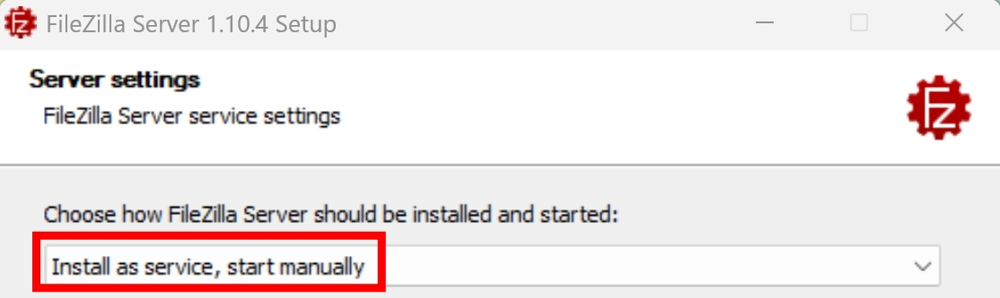
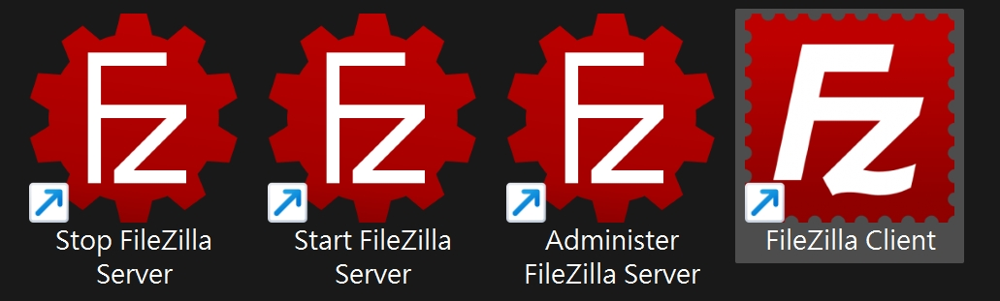

## FileZilla Client + Server

學習 FTP 最快的路徑，不是去啃 RFC 文件，而是先透過圖形化介面了解運作原理之後，再來學習自己下指令。建立熟悉度之後，有不懂的地方再查詢 RFC 文件，這樣的學習方式，會比一開始直接啃生硬的 RFC 文件還要有效率

有一說一，我們先來下載免費開源的 FileZilla

- [FileZilla Client](https://filezilla-project.org/download.php?type=client)
- [FileZilla Server](https://filezilla-project.org/download.php?type=server)

要注意，FileZilla Server 在安裝的時候，建議選擇 "Install as service"，這樣就不會在電腦開機的時候就啟動，而且多一個 port 就有可能多一個電腦被入侵的風險（？

以上都下載完後，以 Windows 系統為例，應該會有四個應用程式的 Icon

| 應用程式                    | 作用                               |
| --------------------------- | ---------------------------------- |
| Stop FileZilla Server       | 關閉 21 port 的 FileZilla Server   |
| Start FileZilla Server      | 開啟 21 port 的 FileZilla Server   |
| Administer FileZilla Server | 14148 port 的 Admin 管理介面       |
| FileZilla Client            | 用來連線到 FTP Server 的 Client 端 |

## Commands

## Reply Code

概念如同 HTTP 的 Status Code，我們不需要把所有的狀態碼都背起來，只需要先記得常用的，剩下的就查文件即可！

<!-- FTP傳輸的資料 -->
<!-- - ftp-anon -->
<!-- - ftp-bounce -->
<!-- - ftp-brute -->
<!-- - ftp-libopie -->
<!-- - ftp-proftpd-backdoor -->
<!-- - ftp-syst -->
<!-- - ftp-vsftpd-backdoor -->
<!-- - ftp-vuln-cve2010-4221 -->

### 參考資料

- https://nmap.org/nsedoc/scripts/
  <!-- - https://www.w3.org/Protocols/rfc959/ -->
  <!-- - https://datatracker.ietf.org/doc/html/rfc959 -->
  <!-- RFC 2228（1997）：新增 FTP 的安全擴展（FTP Security Extensions）。 -->
  <!-- RFC 2389（1998）：定義了 FEAT 命令，允許伺服器回報其支援的擴展功能。 -->
  <!-- RFC 2428（1998）：引入了 IPv6 支援和擴展的被動模式（EPSV, EPRT）。 -->
  <!-- https://chatgpt.com/c/6878e496-f3e4-8012-9a18-0326d7376e5d -->
