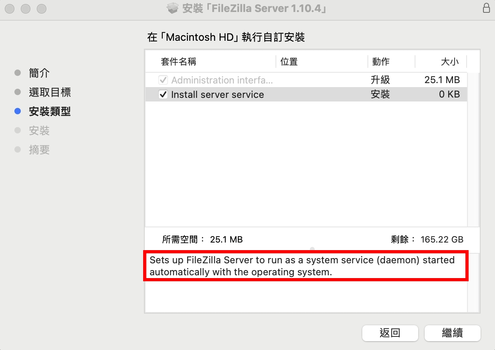
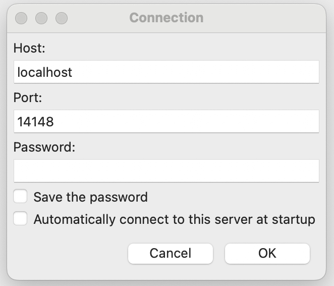
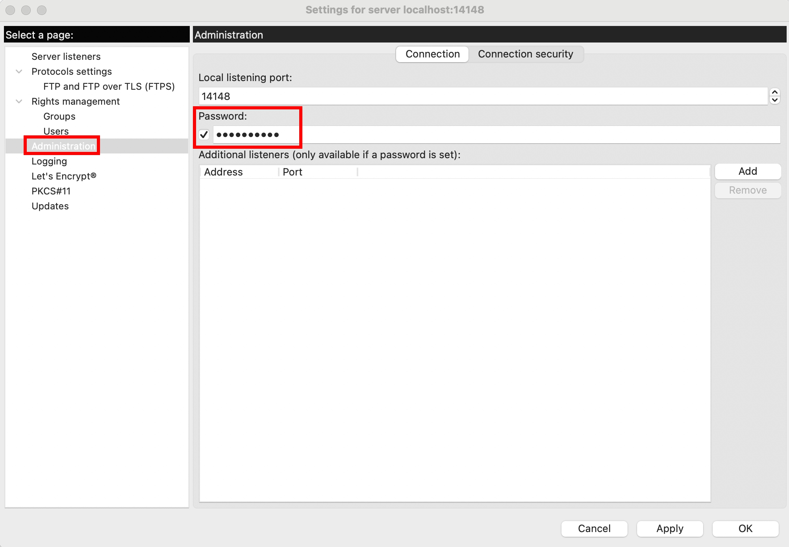
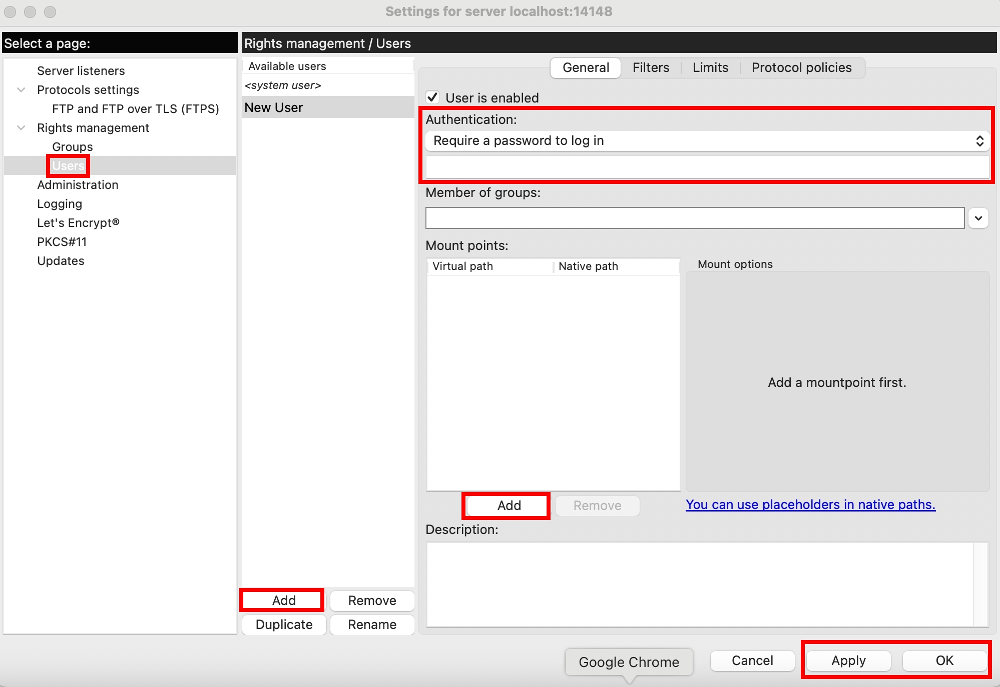
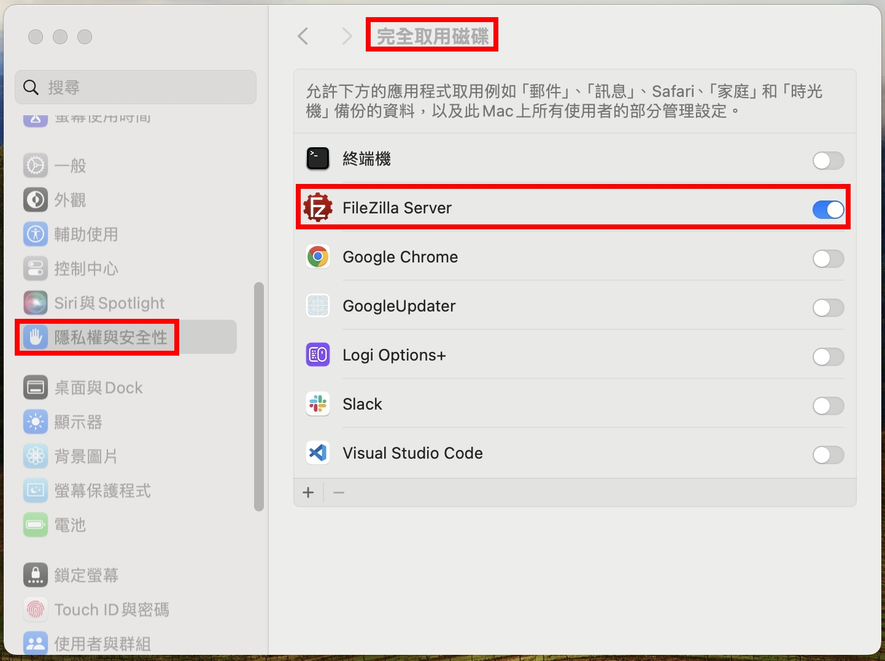
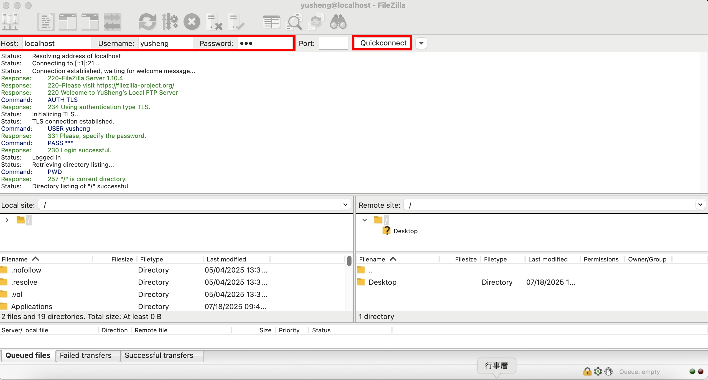
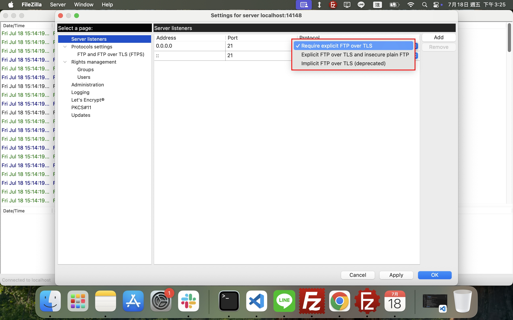

## FileZilla Client + Server

學習 FTP 最快的路徑，不是去啃 RFC 文件，而是先透過圖形化介面了解運作原理之後，再來學習自己下指令。建立熟悉度之後，有不懂的地方再查詢 RFC 文件，這樣的學習方式，會比一開始直接啃生硬的 RFC 文件還要有效率

有一說一，我們先來下載免費開源的 FileZilla

- [FileZilla Client](https://filezilla-project.org/download.php?type=client)
- [FileZilla Server](https://filezilla-project.org/download.php?type=server)

### Windows 安裝過程

要注意，FileZilla Server 在安裝的時候，建議選擇 "Install as service"，這樣就不會在電腦開機的時候就啟動，畢竟多一個 port 就有可能多一個電腦被入侵的風險（？


以上都下載完後，應該會有四個應用程式的 Icon


| 應用程式                    | 作用                               |
| --------------------------- | ---------------------------------- |
| Stop FileZilla Server       | 關閉 21 port 的 FileZilla Server   |
| Start FileZilla Server      | 開啟 21 port 的 FileZilla Server   |
| Administer FileZilla Server | 14148 port 的 Admin 管理介面       |
| FileZilla Client            | 用來連線到 FTP Server 的 Client 端 |

### Mac 安裝過程

Mac 在安裝的時候，沒辦法像 Windows 那樣選擇 "Install as service"，也就是說會隨著開機就啟動 FTP Server，並且 14148 port 的 Admin 管理介面，預設是空密碼，第一次連線進去後，請記得儘速修改密碼


### Admin 密碼設定

✅ Windows 在安裝 FileZilla Server 的時候，就會引導設定 Administer FileZilla Server 的密碼

Mac 則需要先進入 Administer FileZilla Server


登入以後，左上角 "Server > Configure... > Administration"，設定密碼


❗ 不幸的是，Mac 在設定 Admin 密碼似乎有 Bug，點選 "Apply" 以後沒有反應，會導致整個 Administer FileZilla Server 無法操作。我研究了一陣子後，終於找到 Report Bug 的管道，但感覺社群活躍度不高，石沈大海的機率偏高。總之我還是先發了 [Bug Report](https://trac.filezilla-project.org/ticket/13267)，後續再看看有沒有回應。

### Client 帳密 & 權限設定

在同一個 "Server > Configure... > Administration" 的選單，點擊設定 "Users"


:::warning
Windows 系統的路徑會稍微不一樣
:::

假設我想要讓 Client 連線成功後，可以看到 `/Users/yusheng/desktop`，但我又想要隱藏 Server 的真實路徑，我可以設定

- Virtual path: `/desktop`
- Native path: `/Users/yusheng/desktop`

要注意，Mac 在設定 Native path 的時候，部分路徑會因為權限不夠，無法 List Directory，為了測試方便，可先讓 FileZilla Server 完全取用磁碟


設定完以後，打開 FileZilla Client，就可以成功輸入帳密連線了～


## FTP vs SFTP vs FTPS

|      | FTP                    | SFTP         | FTPS         |
| ---- | ---------------------- | ------------ | ------------ |
| 全名 | File Transfer Protocol | SSH FTP      | FTP Over TLS |
| 介紹 | 明文傳輸               | 本質上是 SSH | FTP + TLS    |

FileZilla Server 預設就是使用 FTPS，並且 FTPS 還有兩種模式

- Implicit FTPS => 好像是比較舊的規範，目前已棄用，本篇不討論
- Explicit FTPS => FileZilla Server 的預設值



## 登入流程的 Command 跟 Reply

從 FileZilla Client 連線登入後，會看到以下 log（右鍵勾選 "Show detailed log" 的情況）

```
Status:      	Resolving address of localhost
Status:      	Connecting to [::1]:21...
Status:      	Connection established, waiting for welcome message...
Response: 	220-FileZilla Server 1.10.4
Response: 	220-Please visit https://filezilla-project.org/
Response: 	220 Welcome to YuSheng’s Local FTP Server
Command: 	AUTH TLS
Response: 	234 Using authentication type TLS.
Status:      	Initializing TLS...
Status:      	TLS connection established.
Command: 	USER yusheng
Response: 	331 Please, specify the password.
Command: 	PASS ***
Response: 	230 Login successful.
Status:      	Logged in
Status:      	Retrieving directory listing...
Command: 	PWD
Response: 	257 "/" is current directory.
Status:      	Directory listing of "/" successful
```

| Command | Description            |
| ------- | ---------------------- |
| 全名    | File Transfer Protocol |
| 介紹    | 明文傳輸               |

AUTH TLS
USER yusheng
PASS \*\*\*
PWD

220
234
331
230
257

## 訪問目錄的 Command 跟 Reply

## 上傳檔案的 Command 跟 Reply

## 下載檔案的 Command 跟 Reply

## Active Mode vs Passive Mode

## Commands

## Reply Code

概念如同 HTTP 的 Status Code，我們不需要把所有的狀態碼都背起來，只需要先記得常用的，剩下的就查文件即可！

<!-- FTP傳輸的資料 -->
<!-- - ftp-anon -->
<!-- - ftp-bounce -->
<!-- - ftp-brute -->
<!-- - ftp-libopie -->
<!-- - ftp-proftpd-backdoor -->
<!-- - ftp-syst -->
<!-- - ftp-vsftpd-backdoor -->
<!-- - ftp-vuln-cve2010-4221 -->

### 參考資料

- https://nmap.org/nsedoc/scripts/
  <!-- - https://www.w3.org/Protocols/rfc959/ -->
  <!-- - https://datatracker.ietf.org/doc/html/rfc959 -->
  <!-- RFC 2228（1997）：新增 FTP 的安全擴展（FTP Security Extensions）。 -->
  <!-- RFC 2389（1998）：定義了 FEAT 命令，允許伺服器回報其支援的擴展功能。 -->
  <!-- RFC 2428（1998）：引入了 IPv6 支援和擴展的被動模式（EPSV, EPRT）。 -->
  <!-- https://chatgpt.com/c/6878e496-f3e4-8012-9a18-0326d7376e5d -->
