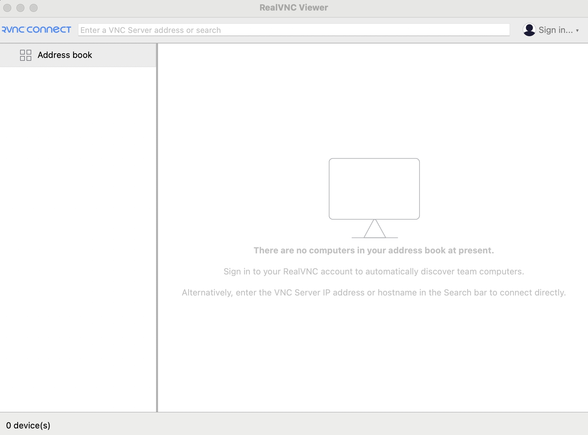

## 前言

時不時會看一些已經公開的資安漏洞，這次剛好看到新的名詞 VNC，就上網查了一下

## 簡介

|      | VNC                       |
| ---- | ------------------------- |
| Port | 5900 ~ 59xx               |
| 全名 | Virtual Network Computing |

|      | RFB                                           |
| ---- | --------------------------------------------- |
| RFC  | https://datatracker.ietf.org/doc/html/rfc6143 |
| 全名 | Remote Framebuffer Protocol                   |

簡單來說，VNC 是實作 RFB 協議的軟體

## 安裝

[RealVNC Viewer](https://www.realvnc.com/en/connect/download/) 是一個 VNC Client

下載安裝後，會看到首頁如下，輸入 host 或 IP 就可以連線，根據 VNC Server 的配置，可能會需要密碼


## 資安漏洞

主要是參考 [RFC 6143](https://datatracker.ietf.org/doc/html/rfc6143#section-7.2.1)

```
7.2.  Security Types

   Two security types are defined here.

7.2.1.  None

   No authentication is needed.  The protocol continues with the
   SecurityResult message.
```

類似 [FTP anonymous login](../web-security/nmap-ftp-scripts.md#nmap-ftp-anon)，簡單講就是不需要帳密

## 參考資料

- https://datatracker.ietf.org/doc/html/rfc6143
