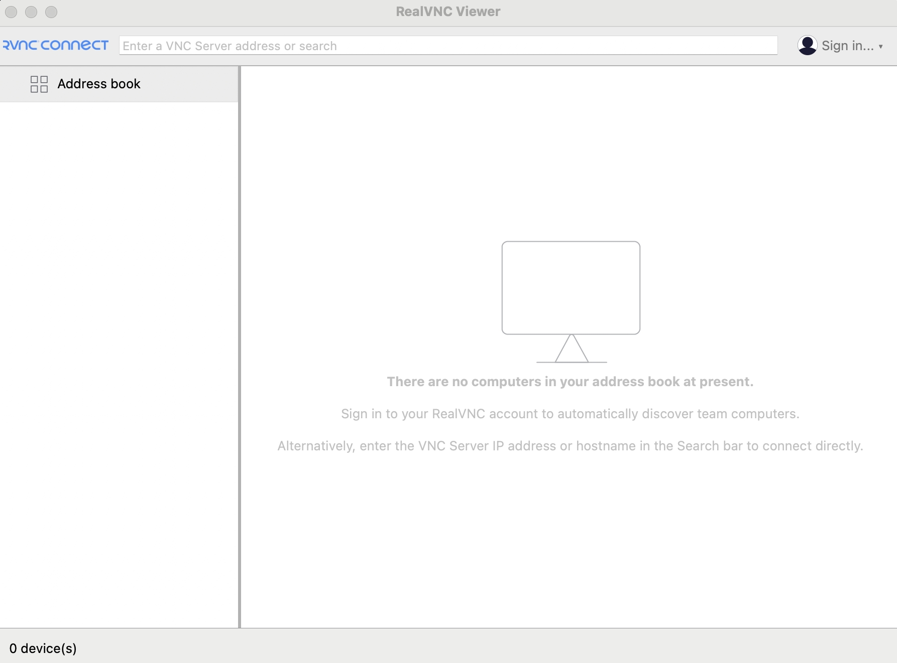

## 前言

時不時會看一些已經公開的資安漏洞，這次剛好看到新的名詞 VNC，就上網查了一下

## 簡介

|      | VNC                       |
| ---- | ------------------------- |
| Port | 5900 ~ 59xx               |
| 全名 | Virtual Network Computing |

## 安裝

[Real VNC 的下載網址](https://www.realvnc.com/en/connect/download/)

下載安裝後，會看到首頁如下，輸入 host 或 IP 就可以連線，根據 VNC Server 的配置，可能會需要密碼

## 參考資料
