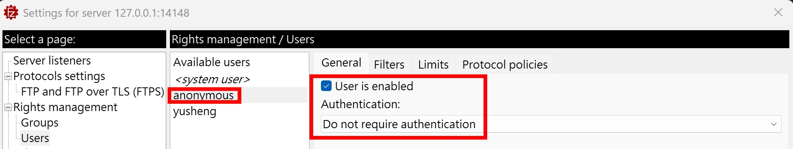
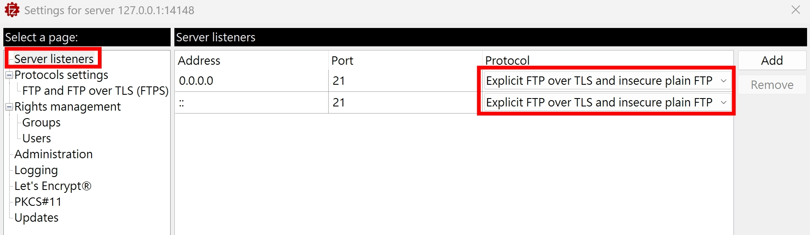

建議先閱讀過我之前寫過的 [FTP](../protocols/ftp.md)，了解 FTP 的基礎，再來閱讀這篇文章呦～

## nmap ftp-anon

|        | ftp-anon                                                      |
| ------ | ------------------------------------------------------------- |
| 全名   | FTP anonymous                                                 |
| 描述   | Checks if an FTP server allows anonymous logins               |
| 原始碼 | https://github.com/nmap/nmap/blob/master/scripts/ftp-anon.nse |

核心概念就是這行，用 "anonymous" + 任意密碼，嘗試可否登入

```lua
ftp.auth(socket, buffer, "anonymous", "IEUser@")
```

可參考 [RFC 1635](https://datatracker.ietf.org/doc/html/rfc1635) 針對 FTP "anonymous" user 的描述

```
Traditionally, this special anonymous user account accepts any string
as a password, although it is common to use either the password
"guest" or one's electronic mail (e-mail) address.  Some archive
sites now explicitly ask for the user's e-mail address and will not
allow login with the "guest" password.  Providing an e-mail address
is a courtesy that allows archive site operators to get some idea of
who is using their services.
```

我們建立一個 anonymous user，來試試看 `ftp-anon` 的效果：


nmap 的下載，可參考 [nmap 環境設定](../web-security/nmap-basic.md#nmap-環境設定)。設定完後，終端輸入

```
nmap --script ftp-anon -p 21 localhost
```

結果是

```
PORT   STATE SERVICE
21/tcp open  ftp
|_ftp-anon: got code 503 "Use AUTH first.".
```

看一下 FileZilla Server Log，Server 表示要先建立 `AUTH TLS` 連線

```
[Response] 220-FileZilla Server 1.10.4
[Response] 220 Please visit https://filezilla-project.org/
[Command] USER anonymous
[Response] 503 Use AUTH first.
[Status] Session 25 ended gracefully.
```

再深挖 nmap [ftp.should_try_ssl](https://github.com/nmap/nmap/blob/master/nselib/ftp.lua) 的實作

```lua
-- Should we try STARTTLS based on this error?
local function should_try_ssl(code, message)
  return code and code >= 400 and (
        message:match('[Ss][Ss][Ll]') or
        message:match('[Tt][Ll][Ss]') or
        message:match('[Ss][Ee][Cc][Uu][Rr]')
        )
end
```

感覺應該是 FileZilla Server 回傳的 `Use AUTH first` 沒有 match 正則表達式，所以 `should_try_ssl = false`，就不會嘗試 `AUTH TLS`。nmap 有些 scripts 畢竟都是 10 幾年前寫的，沒有常常迭代更新，沒辦法滿足現代的應用場景也不算意外。所以說，學習 FTP 的 Commands 跟挖掘 nmap 的原始碼，絕對是有幫助的，這個情況，其實只要先送 `AUTH TLS`，後續匿名登入就會成功了QQ

為了測試 `ftp-anon` 的完整流程，我們修改 FileZilla Server 的設定，允許純 FTP 的連線


再次執行

```
nmap --script ftp-anon -p 21 localhost
```

結果有成功把根目錄的檔案都列出來～

```
PORT   STATE SERVICE
21/tcp open  ftp
| ftp-anon: Anonymous FTP login allowed (FTP code 230)
| -rw-rw-rw- 1 ftp ftp             969 Jul 17 11:24 Administer FileZilla Server.lnk [NSE: writeable]
| -rw-rw-rw- 1 ftp ftp            1927 Jun 13 10:25 FileZilla Client.lnk [NSE: writeable]
| -rw-rw-rw- 1 ftp ftp            1668 Jul 17 11:24 Start FileZilla Server.lnk [NSE: writeable]
|_-rw-rw-rw- 1 ftp ftp            1666 Jul 17 11:24 Stop FileZilla Server.lnk [NSE: writeable]
```

看一下 FileZilla Server Log

```
[Response] 220-FileZilla Server 1.10.4
[Response] 220 Please visit https://filezilla-project.org/
[Command] USER anonymous
[Status] Realm ftp is enabled for user anonymous. Continuing authentication.
[Response] 331 Please, specify the password.
[Command] PASS ****
[Status] Realm ftp is enabled for user anonymous. Continuing authentication.
[Response] 230 Login successful.
[Command] PASV
[Response] 227 Entering Passive Mode (127,0,0,1,7,178)
[Command] LIST
[Response] 150 Starting data transfer.
[Response] 226 Operation successful
[Command] QUIT
[Response] 221 Goodbye.
[Status] Session 31 ended gracefully.
```

這邊列出先前 [FTP](../protocols/ftp.md) 文章沒有介紹到的 Commands 跟 Reply Codes。畢竟 nmap 比較古老，可以學到比較老舊的語法～

| Command | Description                                                                                                                    |
| ------- | ------------------------------------------------------------------------------------------------------------------------------ |
| PASV    | 在現代被 EPSV 取代<br/>為了支援 IPv6 以及各種問題<br/>細節請參考 [RFC 2428](https://datatracker.ietf.org/doc/html/rfc2428)     |
| LIST    | 在現代被 MLSD 取代<br/>為了解決 LIST 的輸出格式不統一<br/>細節請參考 [RFC 3659](https://datatracker.ietf.org/doc/html/rfc3659) |
| QUIT    | -                                                                                                                              |

| Reply Code | Description                                                                              |
| ---------- | ---------------------------------------------------------------------------------------- |
| 227        | Entering Passive Mode (h1,h2,h3,h4,p1,p2)<br/>(127,0,0,1,7,178) = 127.0.0.1:256\*7 + 178 |
| 221        | Service closing control connection                                                       |

## nmap ftp-bounce

概念是從 FTP Active Mode 衍伸出來的資安漏洞，Active Mode 的 Command 跟 Reply 如下：

```
[Command] PORT 127,0,0,1,80,80
[Response] 200 PORT command successful.
```

接著 FTP Server 就會嘗試跟 127.0.0.1:20560 建立 Data Connection。如果 Client 送出去的 PORT Command 不是 Client 自己的 IP，然後 FTP Server 有嘗試去建立 Data Connection 的話，就可以把 FTP Server 當做一個跳板，連線到其他服務

實際來測試

```
nmap --script ftp-bounce --script-args ftp-bounce.checkhost="localhost" -p 21 localhost
```

結果是

```
PORT   STATE SERVICE
21/tcp open  ftp
```

FileZilla Server 的 Log 是

```
<Date/Time> Info [Type] Message
[Response] 220-FileZilla Server 1.10.4
[Response] 220 Please visit https://filezilla-project.org/
[Command] USER anonymous
[Status] Realm ftp is enabled for user anonymous. Continuing authentication.
[Response] 331 Please, specify the password.
[Command] PASS ****
[Status] Realm ftp is enabled for user anonymous. Continuing authentication.
[Response] 230 Login successful.
[Command] PORT 127,0,0,1,80,80
[Response] 200 PORT command successful.
[Error] Control channel closed with error from source 1. Reason: ECONNABORTED - Connection aborted.
```

不知道為啥 `Control channel closed with error` 就沒有後續了，暫時找不到原因，就當作一個資安漏洞的學習，無法重現

| Command                | Description                                           |
| ---------------------- | ----------------------------------------------------- |
| PORT h1,h2,h3,h4,p1,p2 | Active Mode，Client 提供一個 host:port 給 Server 來連 |

## nmap ftp-brute

暴力猜帳密的 script

- username dictionary: https://github.com/nmap/nmap/blob/master/nselib/data/usernames.lst
- password dictionary: https://github.com/nmap/nmap/blob/master/nselib/data/passwords.lst

10 \* 4999 = 大約 5 萬個組合，但由於 `ftp-brute.timeout` 預設是 5s，大量請求衝到 FileZilla Server 會導致大量 timeout，最後我實測的結果，只有 254 個組合有在 5s 內回應

```
PORT   STATE SERVICE
21/tcp open  ftp
| ftp-brute:
|   Accounts: No valid accounts found
|_  Statistics: Performed 254 guesses in 609 seconds, average tps: 1.4
```

## nmap ftp-libopie

一個蠻古老的 CVE-2010-1938 漏洞，看看 FileZilla Server Log

```
[Response] 220-FileZilla Server 1.10.4
[Response] 220 Please visit https://filezilla-project.org/
[Command] USER opie
[Response] 331 Please, specify the password.
[Command] USER AAAAAAAAAAAAAAAAAAAAAAAAAAAAAAAAAAAAAAA
[Response] 331 Please, specify the password.
[Status] Session 300 ended gracefully.
```

重點就是這組很長的 `USER AAAAAAAAAAAAAAAAAAAAAAAAAAAAAAAAAAAAAAA`，細節我也不太清楚，好像會導致 stack overflow

## nmap ftp-proftpd-backdoor

測試 ProFTPD 1.3.3c 的後門漏洞，差不多也是 2010 年的版本

## ftp-syst

終端機執行

```
nmap --script ftp-syst -p 21 localhost
```

終端機結果

```
PORT   STATE SERVICE
21/tcp open  ftp
| ftp-syst:
|_  SYST: UNIX emulated by FileZilla.
```

FileZilla Server Log

```
[Response] 220-FileZilla Server 1.10.4
[Response] 220 Please visit https://filezilla-project.org/
[Command] SYST
[Response] 215 UNIX emulated by FileZilla.
[Command] STAT
[Response] 530 Please log in with USER and PASS first.
[Command] QUIT
[Response] 221 Goodbye.
[Status] Session 301 ended gracefully.
```

`STAT` 需要登入才能看到，我們透過 FileZilla Client 登入後，左上角 "Server > Enter Custom Command..."

```
Command:      	STAT
Response:      	211-FTP Server status:
Response:      	Up and running, yay!
Response:      	211 End of status
```

結果好像沒看到啥有用的資訊...

| Command | Description |
| ------- | ----------- |
| SYST    | SYSTEM      |
| STAT    | STATUS      |

| Reply Code | Description      |
| ---------- | ---------------- |
| 215        | NAME system type |

## nmap ftp-vsftpd-backdoor

測試 vsFTPd 2.3.4 後門的 script，CVE-2011-2523，也是蠻老舊的系統才有機會

## nmap ftp-vuln-cve2010-4221

測試 ProFTPD server v1.3.2rc3 ~ 1.3.3b 的漏洞

## 小結

感覺 FTP 能研究的資安漏洞偏少，基本上就匿名登入跟古老的 2010 年 ~ 2011 年漏洞，實際應用場景偏少QQ

## 參考資料

- https://nmap.org/nsedoc/scripts/
