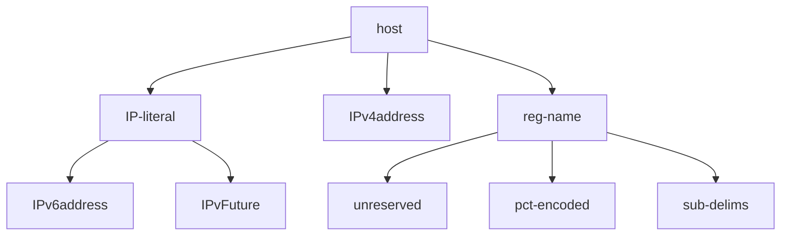

## 前言

這是 [RFC 9110](https://datatracker.ietf.org/doc/html/rfc9110#name-expect) 對 `Expect` Request Header 的語法介紹

```
Expect =      #expectation
expectation = token [ "=" ( token / quoted-string ) parameters ]
```

每次看到這個就覺得是天書，有看沒有懂XD 但如果想要當 Layer 7 協議的資安研究員，這是一個必須跨過的坎！

## Terminal Values

[Terminal Values](https://datatracker.ietf.org/doc/html/rfc5234#section-2.3) = 不可再被拆解、直接對應到實際字元或數值

| Base | Description |
| ---- | ----------- |
| b    | binary      |
| d    | decimal     |
| x    | hexadecimal |

| Rule | Terminal Value | Description |
| ---- | -------------- | ----------- |
| CR   | %d13           | \r          |
| CR   | %x0D           | \r          |
| CRLF | %d13.10        | \r\n        |

:::info
`.` 在這邊是拼接多個數字
:::

## Core Rules

[Core Rules](https://datatracker.ietf.org/doc/html/rfc5234#appendix-B.1) = 定義基礎字符集

| Core Rule | ABNF Definition                                            |
| --------- | ---------------------------------------------------------- |
| ALPHA     | A-Z / a-z                                                  |
| OCTET     | %x00-FF<br/>8 bits of data                                 |
| CHAR      | %x01-7F<br/>any 7-bit US-ASCII character<br/>excluding NUL |
| SP        | %x20 (SPace)                                               |
| HTAB      | %x09 (Horizontal TAB)                                      |
| WSP       | SP / HTAB<br/>(White SPace)                                |
| DIGIT     | %x30-39<br/>0-9                                            |
| HEXDIG    | DIGIT / "A" / "B" / "C" / "D" / "E" / "F"                  |
| DQUOTE    | %x22 (Double QUOTE)                                        |
| VCHAR     | %x21-7E<br/>visible (printing) characters                  |

## Concatenation: Rule1 Rule2

[Concatenation](https://datatracker.ietf.org/doc/html/rfc5234#section-3.1) = 把多個 Rule 拼接

| Rule    | Definition  | Actual Value |
| ------- | ----------- | ------------ |
| Foo     | %x61        | a            |
| Bar     | %x62        | b            |
| Combine | Foo Bar Foo | aba          |

## Incremental Alternatives: Rule1 =/ Rule2

[Incremental Alternatives](https://datatracker.ietf.org/doc/html/rfc5234#section-3.3) 可以理解為

```ts
interface Rule1 extends Rule2
```

假設在 RFC xxxx 定義了 Authorization 的基本 scheme

- Foo = %x61
- Bar = %x62
- Combine = Foo / Bar

到了 RFC yyyy 需要繼承基本 scheme，然後添加一個新的

- Hel = %x63
- Combine =/ %x63

最終 Combine 這個 Rule 就等於 Foo / Bar / Hel

## `Variable Repetition: *Rule`

[`Variable Repetition: *Rule`](https://datatracker.ietf.org/doc/html/rfc5234#section-3.6)

| Rule         | a (min)     | b (max)     | Meaning      |
| ------------ | ----------- | ----------- | ------------ |
| `*element`   | 0 (default) | ∞ (default) | zero or more |
| `1*element`  | 1           | ∞ (default) | one or more  |
| `3*3element` | 3           | 3           | exactly 3    |
| `1*2element` | 1           | 2           | one or two   |

## RFC 9110

| Rule                      | ABNF Definition                    |
| ------------------------- | ---------------------------------- |
| OWS (Optional WhiteSpace) | `*( SP / HTAB )`                   |
| RWS (Required WhiteSpace) | `1*( SP / HTAB )`                  |
| 1#element                 | `element *( OWS "," OWS element )` |

### Range

https://datatracker.ietf.org/doc/html/rfc9110#name-range

範例：

- The first 500 bytes: `bytes=0-499`
- The second 500 bytes: `bytes=500-999`
- The final 500 bytes: `bytes=-500` or `bytes=9500-`
- The first, middle, and last 1000 bytes: ` bytes= 0-999, 4500-5499, -1000`

| Rule             | ABNF Definition                        |
| ---------------- | -------------------------------------- |
| Range            | ranges-specifier                       |
| ranges-specifier | range-unit "=" range-set               |
| range-unit       | token                                  |
| range-set        | 1#range-spec                           |
| range-spec       | int-range / suffix-range / other-range |
| int-range        | `first-pos "-" [ last-pos ]`           |
| first-pos        | `1*DIGIT`                              |
| last-pos         | `1*DIGIT`                              |
| suffix-range     | `"-" suffix-length`                    |
| suffix-length    | `1*DIGIT`                              |
| other-range      | `1*(VCHAR excluding comma)`            |

### Content-Range

https://datatracker.ietf.org/doc/html/rfc9110#name-content-range

範例：

- Normal case: `bytes 42-1233/1234`
- The complete length is unknown: `bytes 42-1233/*`
- unsatisfied-range (use in 416 response): `bytes */1234`

| Rule              | ABNF Definition                                  |
| ----------------- | ------------------------------------------------ |
| Content-Range     | range-unit SP ( range-resp / unsatisfied-range ) |
| range-resp        | `incl-range "/" ( complete-length / "*" )`       |
| incl-range        | first-pos "-" last-pos                           |
| unsatisfied-range | `"*/" complete-length`                           |
| complete-length   | `1*DIGIT`                                        |

### Tokens

[token](https://datatracker.ietf.org/doc/html/rfc9110#name-tokens) 是組成 HTTP Header Field & Value 最重要的基本單位

### Quoted Strings

[quoted-string](https://datatracker.ietf.org/doc/html/rfc9110#name-quoted-strings) 用雙引號包裹的字串
[qdtext](https://datatracker.ietf.org/doc/html/rfc9110#name-quoted-strings)
[quoted-pair](https://datatracker.ietf.org/doc/html/rfc9110#name-quoted-strings)

## RFC 3986 host

[host](https://datatracker.ietf.org/doc/html/rfc3986#section-3.2.2) 是 URI 其中一個非常重要的 Component

<!-- ```
host          = IP-literal / IPv4address / reg-name
IP-literal    = "[" ( IPv6address / IPvFuture  ) "]"
IPv4address   = dec-octet "." dec-octet "." dec-octet "." dec-octet
dec-octet     = DIGIT                 ; 0-9
              / %x31-39 DIGIT         ; 10-99
              / "1" 2DIGIT            ; 100-199
              / "2" %x30-34 DIGIT     ; 200-249
              / "25" %x30-35          ; 250-255
``` -->



| Rule        | ABNF Definition                                                   |
| ----------- | ----------------------------------------------------------------- |
| unreserved  | `ALPHA / DIGIT / "-" / "." / "_" / "~"`                           |
| pct-encoded | `"%" HEXDIG HEXDIG`                                               |
| sub-delims  | `"!" / "$" / "&" / "'" / "(" / ")" / "*" / "+" / "," / ";" / "="` |
