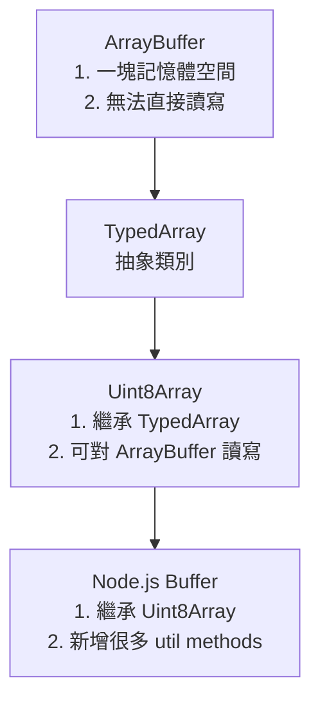

## 架構圖



## ArrayBuffer

- 這是一個偏底層的資料結構
- 用陣列的方式去理解的話，就是 `Array<byte>`，1 byte = 8 bits，每個 byte 總共可以有 256 種組合
- 創建的 `ArrayBuffer` 實例，其實就是宣告一塊記憶體空間，但無法直接對這塊記憶體空間進行讀寫
- 創建一個固定長度 (byte length) 的 `ArrayBuffer`

  ```ts
  const arrayBuffer = new ArrayBuffer(8);
  console.log(arrayBuffer.resizable); // false
  arrayBuffer.resize(0); // TypeError: Method ArrayBuffer.prototype.resize called on incompatible receiver #<ArrayBuffer>
  ```

- 創建一個可變長度的 `ArrayBuffer`

  ```ts
  const resizableArrayBuffer = new ArrayBuffer(8, { maxByteLength: 12 });
  console.log(resizableArrayBuffer.resizable); // true
  resizableArrayBuffer.resize(12);
  console.log(resizableArrayBuffer.byteLength); // 12
  resizableArrayBuffer.resize(13); // Uncaught RangeError: ArrayBuffer.prototype.resize: Invalid length parameter
  ```

- `ArrayBuffer` 是 `Transferable objects`，概念如以下幾點:
  - 確保這個 `ArrayBuffer`，只能同時給一個執行緒 (thread) 去讀寫
  - 承上，當其他執行緒 (例如:Web Workers, Service Workers) 需要讀取這個 `ArrayBuffer`，就可以使用移轉的方式
  - 移轉本身是 `pass-by-reference` 的操作，不涉及資料的複製，所以效能非常好，可參考 [chrome developer blog 這篇文章](https://developer.chrome.com/blog/transferable-objects-lightning-fast)
    ```
    It is zero-copy, which vastly improves the performance of sending data to a Worker. Think of it as pass-by-reference if you're from the C/C++ world.
    ```
  - `ArrayBuffer` 移轉過後，舊的就會被清空

    ```ts
    const resizableArrayBuffer = new ArrayBuffer(8, { maxByteLength: 12 });
    const transferredResizableArrayBuffer = resizableArrayBuffer.transfer();
    console.log(transferredResizableArrayBuffer.resizable); // true
    console.log(resizableArrayBuffer.detached); // true
    console.log(resizableArrayBuffer.byteLength); // 0
    resizableArrayBuffer.resize(8); // TypeError: Cannot perform ArrayBuffer.prototype.resize on a detached ArrayBuffer
    ```

  - `ArrayBuffer` 同時也有提供 `transferToFixedLength` 方法

    ```ts
    const resizableArrayBuffer = new ArrayBuffer(8, { maxByteLength: 12 });
    const transferredArrayBuffer = resizableArrayBuffer.transferToFixedLength();
    console.log(transferredArrayBuffer.resizable); // false
    ```

## TypedArray

- 上面說到，無法直接針對 `ArrayBuffer` 進行讀寫，這時候我們就需要 `TypedArray` 了
- `TypedArray` 是一個 `abstract class` 的概念
- `TypedArray` 有 [這些種類](https://developer.mozilla.org/en-US/docs/Web/JavaScript/Reference/Global_Objects/TypedArray#typedarray_objects) 的實作

### Uint8Array

- Uint8 區間 = 0 ~ 255
- 創建一個 `Uint8Array`，指定 `byteLength`

  ```ts
  const uint8View = new Uint8Array(2);
  // 預設每個 byte 都是 0
  console.log(uint8View[0]); // 0
  console.log(uint8View[1]); // 0
  // 針對每個 byte 的資料寫入
  uint8View[0] = 255;
  console.log(uint8View[0]); // 255
  uint8View[0] = 1;
  console.log(uint8View[0]); // 1
  // 1 個 byte 剛好存放 1 個 element
  console.log(uint8.BYTES_PER_ELEMENT); // 1
  ```

- 創建一個 `Uint8Array` ( 透過 `ArrayBuffer` )

  ```ts
  const arrayBuffer = new ArrayBuffer(8);
  const uint8View = new Uint8Array(arrayBuffer);
  ```

- 創建一個 `Uint8Array` ( 透過 `Array` )

  ```ts
  const uint8View = new Uint8Array([10, 20, 30]);
  console.log(uint8View[0]); // 10
  console.log(uint8View[1]); // 20
  console.log(uint8View[2]); // 30
  console.log(uint8View.byteLength); // 3
  ```

- 創建一個 `Uint8Array` ( 透過其他 `Uint8Array` )

  ```ts
  const uint8View = new Uint8Array([10, 20, 30]);
  const clonedUint8View = new Uint8Array(uint8View);
  clonedUint8View[0] = 100;
  console.log(uint8View[0]); // 10
  console.log(clonedUint8View[0]); // 100
  ```

<!-- ## Node.js Buffer -->

<!-- ### DataView -->

<!-- ### Transferable objects -->

<!-- ### Stream

- ReadableStream
- WritableStream
- TransformStream
- Request.body
- Response.body
- DecompressionStream
- CompressionStream -->

<!-- ### Encoding

- TextEncoder
- TextDecoder -->

<!-- ### Blob & File

- Blob
- File
- FileReader
- URL.createObjectURL -->

## 參考資料

- https://developer.mozilla.org/en-US/docs/Web/JavaScript/Reference/Global_Objects/ArrayBuffer
- https://developer.mozilla.org/en-US/docs/Web/JavaScript/Reference/Global_Objects/ArrayBuffer/ArrayBuffer
- https://developer.mozilla.org/en-US/docs/Web/JavaScript/Reference/Global_Objects/TypedArray
- https://developer.mozilla.org/en-US/docs/Web/JavaScript/Reference/Global_Objects/Int8Array
- https://developer.mozilla.org/en-US/docs/Web/JavaScript/Reference/Global_Objects/Int8Array/Int8Array
- https://developer.mozilla.org/en-US/docs/Web/JavaScript/Reference/Global_Objects/Uint8Array
- https://developer.mozilla.org/en-US/docs/Web/JavaScript/Reference/Global_Objects/Uint8Array/Uint8Array
- https://developer.mozilla.org/en-US/docs/Web/API/Web_Workers_API/Transferable_objects
- https://developer.chrome.com/blog/transferable-objects-lightning-fast
<!-- 還沒讀完 -->
- https://developer.mozilla.org/en-US/docs/Glossary/Endianness
- https://developer.mozilla.org/en-US/docs/Web/JavaScript/Reference/Global_Objects/DataView
